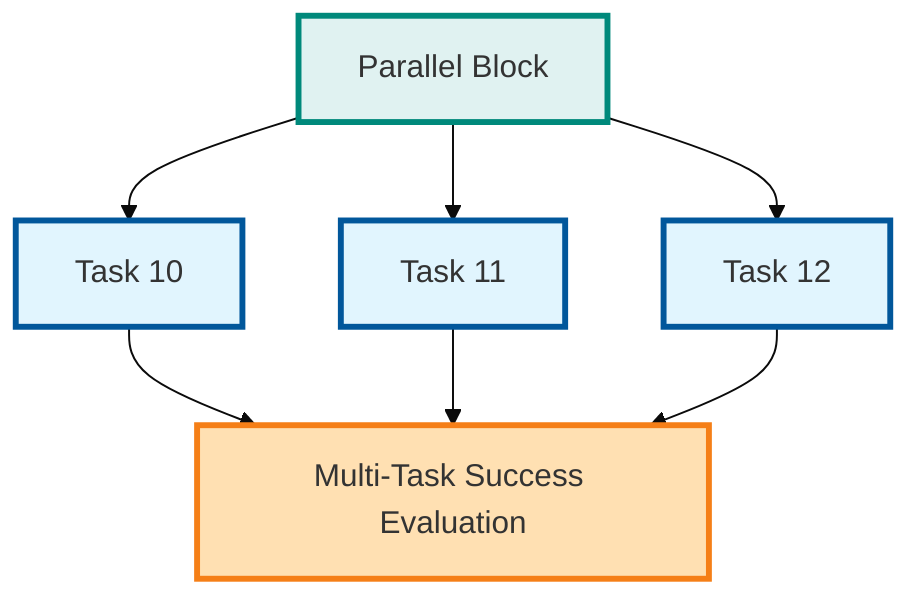
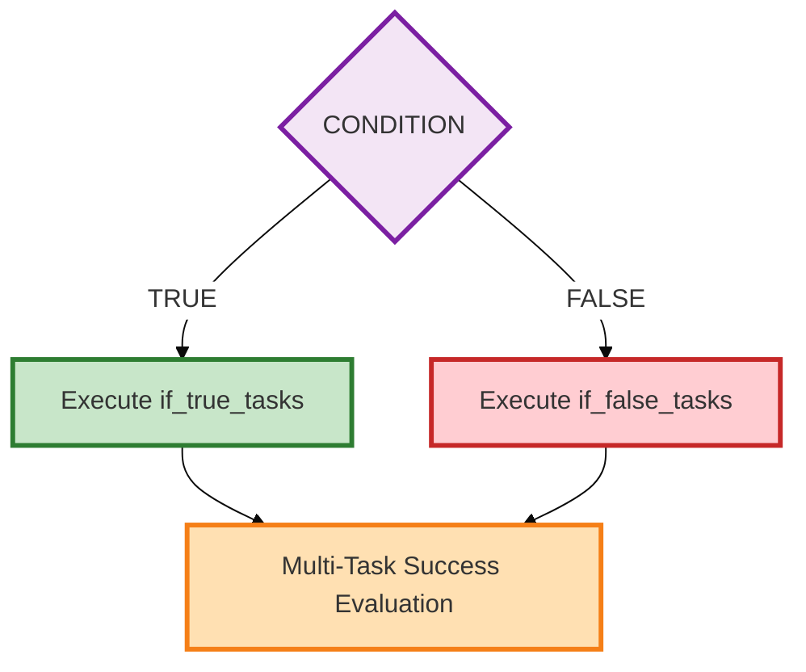

# TASKER Advanced Features Guide

This guide covers advanced TASKER features for power users. For basic usage, see [README.md](README.md). For complete parameter reference, see [TaskER_FlowChart.md](TaskER_FlowChart.md).

---

## Table of Contents

- [File-Defined Arguments](#file-defined-arguments)
- [Global Variables](#global-variables)
- [Memory-Efficient Output Streaming](#memory-efficient-output-streaming)
- [Alert-on-Failure: Workflow Monitoring](#alert-on-failure-workflow-monitoring)
- [Remote Execution Configuration](#remote-execution-configuration)
- [Execution Models](#execution-models)
- [Advanced Flow Control](#advanced-flow-control)
- [Task Result Storage and Data Flow](#task-result-storage-and-data-flow)
- [Resume and Recovery](#resume-and-recovery)
- [Machine-Readable Output (JSON)](#machine-readable-output-json)

---

## File-Defined Arguments

**Self-documenting workflows** - Define TASKER command-line arguments directly in your task files, making workflows self-contained and reducing operator error.

### What Are File-Defined Arguments?

File-defined arguments allow you to embed TASKER command-line options directly in task files. Instead of remembering which flags to use when running a workflow, the task file itself declares its requirements.

**Benefits:**

- ✅ **Self-documenting**: Requirements visible directly in task files
- ✅ **Automation-friendly**: No need to remember or manage flags externally
- ✅ **Reduces errors**: Operators can't forget required flags
- ✅ **Version controlled**: Arguments tracked alongside workflow logic
- ✅ **CLI override**: Command-line arguments can still override file settings

### Basic Example

**Task file (`workflow.txt`):**

```bash
# File-defined arguments (must be at the very top)
--auto-recovery
--skip-host-validation
--log-level=DEBUG

# Global variables come after file-defined arguments
ENVIRONMENT=production
TARGET_HOST=localhost

# Tasks come last
task=0
hostname=@TARGET_HOST@
command=echo
arguments=Deploying to @ENVIRONMENT@ environment on @TARGET_HOST@
exec=local
```

**Execution:**

```bash
# File-defined arguments are automatically applied - no need to specify them!
python3 tasker.py workflow.txt -r

# CLI args can override file args if needed
python3 tasker.py workflow.txt -r --log-level=INFO  # Overrides DEBUG
```

### How File-Defined Arguments Work

#### 1. Argument Placement Rules

File-defined arguments **MUST** appear at the **very beginning** of the task file:

```bash
# ✅ CORRECT ORDER
# File-defined arguments (first!)
--auto-recovery
--skip-host-validation

# Global variables (second)
ENVIRONMENT=production

# Tasks (last)
task=0
...
```

```bash
# ❌ WRONG ORDER - Arguments will be IGNORED
# Global variables appear first
ENVIRONMENT=production

# File-defined arguments (TOO LATE - will be ignored!)
--auto-recovery
--skip-host-validation

# Tasks
task=0
...
```

**Parser stopping rule**: The parser stops reading file-defined arguments at the **first line containing `=` that doesn't start with `-` or `--`**.

#### 2. Valid Argument Syntax

File-defined arguments use **identical syntax** to command-line arguments:

```bash
# ✅ CORRECT - Boolean flags
--auto-recovery
--skip-host-validation
--run
-r
-d

# ✅ CORRECT - Value options
--log-level=DEBUG
--timeout=60
--start-from=5

# ❌ WRONG - Single dash with long names (invalid argparse syntax)
-auto-recovery      # Must be --auto-recovery
-skip-validation    # Must be --skip-validation

# ❌ WRONG - Spaces around equals
--log-level = DEBUG  # Must be --log-level=DEBUG
```

#### 3. Argument Precedence

When both file and CLI arguments are present:

| Argument Type | Behavior | Example |
|--------------|----------|---------|
| **Boolean flags** | File OR CLI (additive) | File: `--skip-host-validation` + CLI: `-r` → Both active |
| **Value options** | CLI overrides file | File: `--log-level=DEBUG` + CLI: `--log-level=INFO` → INFO wins |
| **task_file** | Always from CLI | File args cannot override task file path |

```bash
# workflow.txt contains:
# --auto-recovery
# --log-level=DEBUG
# --timeout=30

# Command line overrides
python3 tasker.py workflow.txt -r --log-level=INFO --timeout=60

# Effective arguments:
# --auto-recovery    (from file)
# --run              (from CLI)
# --log-level=INFO   (CLI overrides file)
# --timeout=60       (CLI overrides file)
```

### Where Arguments Are Ignored

**Parser stops at first non-argument line:**

#### Case 1: Arguments after global variables

```bash
# Global variables appear first - parser stops here
ENVIRONMENT=production

# ❌ IGNORED - These arguments come too late
--auto-recovery
--skip-host-validation

task=0
...
```

#### Case 2: Arguments mid-file

```bash
# Proper file-defined arguments
--auto-recovery

# Global variables
ENVIRONMENT=production

# Tasks start
task=0
...

# ❌ IGNORED - Parser already stopped at task=0
--skip-host-validation

task=1
...
```

#### Case 3: Arguments after task definitions

```bash
# Tasks come first
task=0
hostname=server1
command=deploy

# ❌ IGNORED - Parser stopped at task=0
--auto-recovery
--skip-host-validation
```

**Why?** The parser stops reading file-defined arguments as soon as it encounters a line with `=` that doesn't start with `-` or `--`. This prevents task parameters from being misinterpreted as arguments.

### Security Controls

#### CLI-Only Flags (Hard Blocked)

These flags are **forbidden** in file-defined arguments and will cause immediate failure:

```bash
# ❌ BLOCKED - Exit code 20
--help
--version
-h

# Error message:
# ERROR: File-defined argument '--help' is not allowed (CLI-only flag)
```

#### Security-Sensitive Flags (Warning)

These flags generate warnings but are allowed:

```bash
# ⚠️ WARNING - Allowed but warned
--skip-security-validation
--skip-validation
--fire-and-forget

# Warning message:
# WARNING: File defines security-sensitive flag: --skip-security-validation
#          This flag reduces security checks - ensure this is intentional
```

### Complete Syntax Reference

**Supported in File-Defined Arguments:**

| Argument | Type | Example |
|----------|------|---------|
| `--run` / `-r` | Boolean | `--run` or `-r` |
| `--debug` / `-d` | Boolean | `--debug` or `-d` |
| `--log-level=LEVEL` | Value | `--log-level=DEBUG` |
| `--timeout=N` | Value | `--timeout=60` |
| `--start-from=N` | Value | `--start-from=5` |
| `--auto-recovery` | Boolean | `--auto-recovery` |
| `--skip-host-validation` | Boolean | `--skip-host-validation` |
| `--skip-task-validation` | Boolean | `--skip-task-validation` |
| `--skip-command-validation` | Boolean | `--skip-command-validation` |
| `--skip-security-validation` | Boolean | `--skip-security-validation` (warns) |
| `--strict-env-validation` | Boolean | `--strict-env-validation` |
| `--skip-validation` | Boolean | `--skip-validation` (warns) |
| `--fire-and-forget` | Boolean | `--fire-and-forget` (warns) |
| `--show-plan` | Boolean | `--show-plan` |
| `--validate-only` | Boolean | `--validate-only` |
| `--no-task-backup` | Boolean | `--no-task-backup` |

**NOT Supported (CLI Only):**

| Argument | Reason |
|----------|--------|
| `--help` / `-h` | Must be interactive |
| `--version` | Must be interactive |
| `task_file` | Always from CLI |

### Debugging File-Defined Arguments

Use `--show-effective-args` to see which arguments are active:

```bash
python3 tasker.py workflow.txt --show-effective-args
```

**Output:**

```bash
Effective TASKER arguments (file + CLI merged):
============================================================
File-defined arguments from workflow.txt:
  --auto-recovery
  --skip-host-validation
  --log-level=DEBUG

Final effective arguments:
  --auto-recovery: True
  --log-level: DEBUG
  --run: False
  --skip-host-validation: True
```

### Common Patterns

#### Pattern 1: Recovery Workflows

```bash
# Workflow with automatic recovery enabled
--auto-recovery
--skip-host-validation

# Tasks
task=0
...
```

#### Pattern 2: Development Testing

```bash
# Development workflow with debug logging
--log-level=DEBUG
--skip-host-validation
--no-task-backup

# Tasks for testing
task=0
...
```

#### Pattern 3: Production Deployment

```bash
# Production deployment with resume capability
--auto-recovery
--log-level=INFO
--show-plan

# Global variables
ENVIRONMENT=production

# Deployment tasks
task=0
...
```

#### Pattern 4: Validation-Only Workflows

```bash
# Workflow that only validates syntax
--validate-only
--log-level=DEBUG

# Tasks to validate
task=0
...
```

### Best Practices

**1. Keep arguments at the top:**

```bash
# ✅ GOOD
# File-defined arguments (line 1)
--auto-recovery
--skip-host-validation

# Global variables (after arguments)
ENVIRONMENT=production

# Tasks (last)
task=0
...
```

**2. Comment your argument choices:**

```bash
# ✅ GOOD - Explain why flags are needed
# File-defined arguments

# Auto-recovery: Long-running deployment workflow
--auto-recovery

# Skip host validation: For remote hosts without validation config
--skip-host-validation

# Debug logging: Detailed output for troubleshooting
--log-level=DEBUG
```

**3. Don't duplicate CLI and file args:**

```bash
# ❌ BAD - Redundant
# workflow.txt contains --auto-recovery
python3 tasker.py workflow.txt -r --auto-recovery  # Redundant

# ✅ GOOD - File defines baseline, CLI runs it
# workflow.txt contains --auto-recovery
python3 tasker.py workflow.txt -r  # Simpler
```

**4. Use file args for workflow requirements:**

```bash
# ✅ GOOD - Workflow needs these to function correctly
--auto-recovery        # Required for recovery workflows
```

**5. Use CLI args for runtime decisions:**

```bash
# ✅ GOOD - Override at runtime
python3 tasker.py workflow.txt -r --log-level=DEBUG  # Debug run
python3 tasker.py workflow.txt -r --log-level=INFO   # Normal run
```

## Global Variables

Define reusable variables at the top of your task file for configuration management and environment abstraction.

**Important:** TASKER automatically treats ANY key=value pair that is not a recognized task parameter as a global variable. This means you can define custom variables anywhere in the file, though it's best practice to place them at the top for clarity.

### How Global Variables Work

1. **Automatic Creation**: Any `KEY=VALUE` line that doesn't match a known task parameter becomes a global variable
2. **Case Sensitive**: Variable names are case-sensitive (`Environment` ≠ `ENVIRONMENT`)
3. **No Declaration Needed**: Simply write `MYVAR=value` and it's available as `@MYVAR@`
4. **Scope**: Global variables are read-only and available throughout the entire task file

### ✅ Environment Variable Support

**TASKER automatically expands environment variables** like `$HOME`, `$USER`, `$PWD`, etc. in:

- ✅ **Task arguments field** - Expanded at execution time
- ✅ **Global variable definitions** - Expanded at parse time (NEW!)

**✅ Environment variables in task arguments:**

```bash
task=0
hostname=localhost
command=rm
arguments=-f $HOME/.my_file  # $HOME automatically expands to /home/username
exec=local

task=1
hostname=localhost
command=echo
arguments=Current user is $USER in directory $PWD
exec=local
```

**✅ NEW: Environment variables in global variable definitions:**

```bash
# Global variables can now expand environment variables
MY_USER=$USER
MY_HOME=$HOME
DEPLOYMENT_PATH=/var/deployments/$USER
LOG_FILE=$HOME/logs/tasker.log

task=0
hostname=localhost
command=echo
arguments=Running as @MY_USER@ from @MY_HOME@
exec=local
```

**Supported syntax:**

- **Simple**: `$USER`, `$HOME`, `$PWD`
- **Braces**: `${USER}`, `${HOME}` (useful for disambiguation)
- **Example**: `PATH_WITH_USER=/home/${USER}/bin` (braces prevent interpreting `/bin` as part of variable name)

**Supported environment variables:**

- `$HOME` - User's home directory
- `$USER` - Current username
- `$PWD` - Current working directory
- `$PATH` - System PATH variable
- `$HOSTNAME` - System hostname
- Any other environment variables available in the system

**Expansion timing:**

- **Global variables**: Expanded **once** at parse time (start of execution)
- **Arguments field**: Expanded at **task execution** time (allows dynamic values like `$PWD` after `cd` commands)

### Basic Global Variables

```bash
# Global variable definitions (at top of task file)
ENVIRONMENT=production
SERVICE_NAME=web-api
VERSION=v2.1.0
# Any name works - automatically becomes a global variable
CUSTOM_PATH=/opt/myapp

# Tasks using both global variables and environment variables
task=0
hostname=@ENVIRONMENT@-server
command=deploy
arguments=@SERVICE_NAME@ @VERSION@ --user=$USER --home=$HOME
```

### When to Use Global Variables

**Primary Rule: Use a global variable when the same value appears in multiple tasks.**

This makes your task files work like templates - update one variable, all tasks using it are updated automatically.

**Common Use Cases:**

**1. Template-Based Task Files:**

```bash
# Define once, use many times
TARGET_HOST=prod-db-01
PACKAGE_NAME=nginx
SERVICE_NAME=nginx

# All these tasks now use the same values
task=0
hostname=@TARGET_HOST@
command=check_package
arguments=@PACKAGE_NAME@

task=1
hostname=@TARGET_HOST@
command=stop_service
arguments=@SERVICE_NAME@

task=2
hostname=@TARGET_HOST@
command=update_package
arguments=@PACKAGE_NAME@

task=3
hostname=@TARGET_HOST@
command=start_service
arguments=@SERVICE_NAME@

# To run on different host/package: just change the global variables!
```

**2. Environment-Specific Deployments:**

```bash
# Switch entire workflow by changing one variable
# Change to 'production' for prod deployment
ENVIRONMENT=staging
APP_VERSION=v2.3.1

task=0
hostname=@ENVIRONMENT@-web-01
command=deploy
arguments=--version=@APP_VERSION@

task=1
hostname=@ENVIRONMENT@-web-02
command=deploy
arguments=--version=@APP_VERSION@

task=2
hostname=@ENVIRONMENT@-db-01
command=migrate_database
arguments=--version=@APP_VERSION@
```

**3. Repeated Command Arguments:**

```bash
# Same options used across multiple tasks
BACKUP_OPTIONS=--compress --encrypt --verify
BACKUP_PATH=/backup/2024

task=0
hostname=server1
command=backup_database
arguments=@BACKUP_OPTIONS@ --dest=@BACKUP_PATH@/db

task=1
hostname=server2
command=backup_files
arguments=@BACKUP_OPTIONS@ --dest=@BACKUP_PATH@/files

task=2
hostname=server3
command=backup_configs
arguments=@BACKUP_OPTIONS@ --dest=@BACKUP_PATH@/config
```

### Global Variable Limitations

**Read-Only During Execution**: Global variables cannot be modified by tasks during runtime.

**Alternative for Dynamic Data**: Use task output variables (`@TASK_ID_stdout@`) for values that change during execution:

```bash
# Get dynamic value from task
task=0
hostname=config-server
command=get_database_host
exec=local

# Use task output in subsequent tasks
task=1
# Use dynamic hostname from task 0
hostname=@0_stdout@
command=connect_database
```

### Global Variable Validation Rules

TASKER validates global variable names to prevent conflicts with internal keywords and task fields. Understanding these rules helps you choose safe, descriptive variable names.

#### ❌ Reserved Keywords (Cannot Be Used)

**1. The `task` Keyword**

```bash
# ❌ BLOCKED - Causes parser crash
task=my_custom_value

# ✅ USE INSTEAD
TASK_NAME=my_custom_value
MY_TASK=my_custom_value
```

**Why blocked:** `task` is reserved for task ID definitions and must be followed by an integer. Using it as a global variable causes parser crashes with `ValueError: invalid literal for int()`.

#### 2. Task Field Names

Common task field names that cannot be used as global variables:

```bash
# ❌ BLOCKED - Silently ignored, causes confusion
hostname=myvalue
command=myvalue
arguments=myvalue
success=myvalue
condition=myvalue
exec=myvalue
timeout=myvalue
next=myvalue
on_success=myvalue
on_failure=myvalue
loop=myvalue
sleep=myvalue
return=myvalue
type=myvalue
tasks=myvalue
max_parallel=myvalue
retry_count=myvalue

# ✅ USE INSTEAD - Add prefix or make uppercase
MY_HOSTNAME=myvalue
TARGET_HOSTNAME=myvalue
HOSTNAME=myvalue
COMMAND=myvalue
```

**Why blocked:** These names are filtered out during parsing because they're task field names. Variables appear to be defined but report "undefined variable" errors when referenced - confusing behavior.

**Note:** This list includes the most common task parameters. For a complete task parameter reference, see [TaskER_FlowChart.md](TaskER_FlowChart.md).

**Validation Error Example:**

```bash
# This triggers validation error
hostname=web-server.com

# Error message:
Line 5: Cannot use task field name 'hostname' as a global variable name.
Task field names are reserved. Use a different name like 'HOSTNAME' or 'MY_HOSTNAME'.
```

#### ✅ Safe Names (Can Be Used!)

**Important Discovery:** Names like `stdout`, `stderr`, `exit`, `exit_0`, `exit_1` are **100% SAFE** to use as global variable names!

```bash
# ✅ PERFECTLY SAFE - No conflicts!
stdout=my_custom_stdout_value
stderr=my_custom_stderr_value
exit=my_custom_exit_value
exit_0=success_value
exit_1=failure_value

# Task 0: Generate real task output
task=0
hostname=localhost
command=echo
arguments=Task output here
exec=local

# Task 1: Use BOTH global variable AND task result variable
task=1
hostname=localhost
command=echo
# @stdout@ = global variable (my_custom_stdout_value)
# @0_stdout@ = task 0 result (Task output here)
arguments=Global: @stdout@, Task Result: @0_stdout@
exec=local
```

**Why these are safe:** TASKER uses different regex patterns for each:

- **Global variables**: `@([a-zA-Z_][a-zA-Z0-9_]*)@` matches `@stdout@`, `@exit@`, etc.
- **Task results**: `@(\d+)_(stdout|stderr|success|exit)@` matches `@0_stdout@`, `@1_exit@`, etc.

The patterns are mutually exclusive - no conflict possible!

#### Variable Expansion Depth

TASKER supports **nested variable expansion** (variable chaining) with a maximum depth of **10 iterations** to prevent infinite loops in circular references.

**How Variable Chaining Works:**

```bash
# Variables can reference other variables
BASE_PATH=/opt/myapp
CONFIG_PATH=@BASE_PATH@/config
LOG_PATH=@BASE_PATH@/logs
FULL_CONFIG=@CONFIG_PATH@/app.conf

# Resolves to:
# CONFIG_PATH = /opt/myapp/config
# LOG_PATH = /opt/myapp/logs
# FULL_CONFIG = /opt/myapp/config/app.conf
```

**Circular Reference Handling:**

```bash
# Self-referencing variable (intentional or accidental)
VAR_A=prefix_@VAR_A@_suffix

# After 10 expansions, stops automatically:
# Result: prefix_prefix_prefix_prefix_prefix_prefix_prefix_prefix_prefix_prefix_prefix_@VAR_A@_suffix_suffix_suffix_suffix_suffix_suffix_suffix_suffix_suffix_suffix_suffix
# (11 copies of prefix/suffix = original + 10 expansions)
```

**Technical Details:**

- **Constant**: `MAX_VARIABLE_EXPANSION_DEPTH = 10`
- **Location**: `tasker/core/constants.py`
- **Usage**: Used consistently in both validation phase (`task_validator.py`) and runtime execution (`condition_evaluator.py`)
- **Benefit**: Prevents infinite loops while allowing reasonable chaining depth

**Best Practices:**

- Keep variable chains under 3-4 levels deep for maintainability
- Avoid circular references (TASKER handles them safely, but they indicate a design issue)
- Use descriptive names to make variable relationships clear

#### Variable Naming Best Practices

**✅ Recommended Naming Patterns:**

```bash
# 1. ALL_CAPS for true constants
ENVIRONMENT=production
VERSION=v2.1.0
MAX_RETRIES=3

# 2. PascalCase for configuration values
DatabaseHost=prod-db-01
ServiceName=web-api
BackupPath=/backup/data

# 3. Prefixed names for clarity
TARGET_HOST=app-server
SOURCE_DIR=/src/app
DEST_DIR=/opt/app

# 4. Descriptive names that indicate purpose
DEPLOYMENT_ENV=staging
API_ENDPOINT=https://api.example.com
RETRY_DELAY=5
```

**❌ Names to Avoid:**

```bash
# Too generic - unclear what they represent
VALUE=something
DATA=mydata
TEMP=tmpvalue

# Looks like task field - confusing
next=5
success=true
command=mycommand

# Single letter - not descriptive
X=value
Y=value
```

## Memory-Efficient Output Streaming

TASKER 2.1 includes an advanced memory-efficient output streaming system that prevents Out-of-Memory (OOM) errors when processing commands that generate large amounts of output (1GB+). This system automatically manages memory usage and seamlessly handles outputs of any size.

### The Problem with Large Outputs

Before the streaming system, TASKER would load entire command outputs into memory, causing system crashes with large outputs:

```bash
# This would crash TASKER 1.x with OOM errors
task=0
hostname=server1
command=find /data -type f -exec ls -la {} \;
# Could generate 1GB+ of output

task=1
hostname=server2
command=mysqldump --all-databases --single-transaction
# Database dumps can be several GB

task=2
hostname=log-server
command=cat /var/log/application.log
# Log files can grow to hundreds of MB
```

### How Memory-Efficient Streaming Works

The streaming system implements a sophisticated three-tier approach:

#### Tier 1: In-Memory Buffering (Up to 1MB)

For small outputs, everything stays in memory for maximum performance:

```text
└── Memory Buffer
    ├── Fast access for small outputs
    ├── Zero disk I/O overhead
    └── Complete data available via @N_stdout@ / @N_stderr@
```

#### Tier 2: Temporary File Streaming (1MB+)

When outputs exceed 1MB, TASKER automatically streams to temporary files:

```text
└── System Temp Directory (/tmp)
    ├── tasker_stdout_abc123 (stdout content)
    ├── tasker_stderr_def456 (stderr content)
    └── Automatic cleanup at workflow completion
```

#### Tier 3: Memory Protection (100MB+ per task)

Absolute limits prevent system overload:

```text
└── Hard Memory Limits
    ├── 100MB maximum per individual task
    ├── Automatic temp file fallback
    └── System resource protection
```

### Automatic Operation

The streaming system operates completely transparently - no configuration required:

```bash
# These all work identically regardless of output size
task=0
hostname=web-server
command=generate_small_report
# Output: 50KB - stays in memory

task=1
hostname=database-server
command=generate_large_export
# Output: 50MB - automatically streams to temp files

task=2
hostname=log-server
command=analyze_massive_dataset
# Output: 500MB - streams with memory protection
```

### Technical Implementation Details

#### Memory Thresholds

- **In-Memory Buffer**: Up to 1MB (complete data retained)
- **Temp File Threshold**: 1MB (switches to temp files for outputs ≥1MB)
- **Buffer Size**: 8KB read chunks for streaming
- **Maximum Memory**: 100MB absolute limit per task
- **Command-Line Limit**: 100KB for @N_stdout@ / @N_stderr@ substitution
- **Temp File Location**: System temp directory (`/tmp` on Linux)

#### Streaming Process

1. **Real-time Processing**: Output is processed as it's generated
2. **Threshold Detection**: Automatically switches to temp files at 1MB
3. **Memory Management**: Constant memory usage regardless of output size
4. **Resource Cleanup**: Temporary files persist until workflow completion for cross-task access

#### File Naming Convention

```text
/tmp/tasker_stdout_XXXXXX  # Standard output temp file
/tmp/tasker_stderr_XXXXXX  # Standard error temp file
```

Where `XXXXXX` is a random 6-character suffix for uniqueness.

### Performance Characteristics

#### Small Outputs (< 1MB)

- **Memory Usage**: Actual output size
- **Processing Time**: Near-instant
- **Disk I/O**: None
- **Cross-Task**: Complete data available via @N_stdout@/@N_stderr@
- **Best for**: Configuration commands, status checks, small reports

#### Large Outputs (1MB - 100MB)

- **Memory Usage**: ~1MB constant
- **Processing Time**: <1 second processing overhead
- **Disk I/O**: Sequential write to temp files
- **Cross-Task**: Truncated data (100KB) via @N_stdout@, full data via @N_stdout_file@
- **Best for**: Database exports, large file operations, comprehensive logs

#### Massive Outputs (100MB+)

- **Memory Usage**: ~1MB constant (protected)
- **Processing Time**: Minimal streaming overhead
- **Disk I/O**: Efficient streaming with deferred cleanup
- **Cross-Task**: Same as large outputs
- **Best for**: Full system backups, massive dataset processing, extensive logging

### Real-World Examples

#### Database Operations

```bash
# Large database export - streams automatically
task=0
hostname=db-server
command=pg_dump
arguments=--verbose --format=plain --no-owner production_db
timeout=1800
exec=pbrun
```

#### Log Analysis

```bash
# Process massive log files without memory issues
task=1
hostname=log-server
command=grep "ERROR" /var/log/application.log
# Processes multi-GB log files efficiently
exec=pbrun

task=2
hostname=analysis-server
command=analyze_errors
arguments=@1_stdout@
# Uses extracted error data
exec=local
```

#### System Monitoring

```bash
# Generate comprehensive system reports
task=0
hostname=monitoring-server
command=sar -A
arguments=-f /var/log/sa/sa01
# Processes complete system activity reports
exec=pbrun

task=1
hostname=report-server
command=generate_performance_report
arguments=--data=@0_stdout@
# Creates reports from large monitoring data
exec=local
```

### Monitoring and Debugging

#### Debug Information

Enable debug logging to see streaming behavior:

```bash
tasker -r --log-level=DEBUG large_output_workflow.txt
```

Debug output shows:

```text
[02Oct25 15:47:21] DEBUG: Task 0: Used temp files for large output (stdout: 20840000 bytes, stderr: 0 bytes)
```

#### Memory Usage Awareness

Tasks that trigger streaming are automatically logged:

```text
[02Oct25 15:47:20] Task 0: Executing [local]: python3 -c large_data_generation.py
[02Oct25 15:47:21] Task 0: Exit code: 0
[02Oct25 15:47:21] Task 0: STDOUT: Large dataset line 000000 with data: XXX... (20839999 chars total)
```

### System Compatibility

#### Python Version Support

- **Python 3.6.8+**: Full compatibility with legacy systems
- **Platform**: Built for Linux, can be updated for Windows (SSH-only remote execution)
- **Memory Management**: Uses standard Python tempfile module

#### Troubleshooting Memory Issues

**Symptom**: Out of memory errors for large task outputs

**Solution**: TASKER automatically uses streaming - no configuration needed. If you still encounter memory issues, check:

1. Concurrent task count - reduce `max_parallel` in parallel blocks
2. System available memory
3. Task output size - verify streaming threshold is working correctly

### Cross-Task Data Sharing with Large Outputs

TASKER provides intelligent handling for sharing large outputs between tasks:

#### For Outputs < 1MB (In Memory)

Complete data is available via standard cross-task variables:

```bash
task=0
hostname=server1
command=generate_report
# Generates 500KB output

task=1
hostname=server2
command=process_data
arguments=@0_stdout@  # Gets complete 500KB data
```

#### For Outputs ≥ 1MB (Temp Files)

Large outputs are automatically managed to prevent command-line argument overflow:

```bash
task=0
hostname=database
command=mysqldump production_db
# Generates 50MB output → stored in temp file

task=1
hostname=backup-server
command=python3
arguments=-c "data='@0_stdout@'; print(f'Received {len(data)} bytes')"
# @0_stdout@ provides truncated data (100KB) to avoid "Argument list too long" error

task=2
hostname=backup-server
command=python3
arguments=-c "import shutil; shutil.copy('@0_stdout_file@', '/backup/db.sql')"
# @0_stdout_file@ provides the temp file path for full data access
```

#### Available Cross-Task Variables

- **@N_stdout@**: Task N's standard output
  - For outputs < 1MB: Complete data
  - For outputs ≥ 1MB: Truncated to 100KB for command-line safety
- **@N_stderr@**: Task N's standard error (same rules as stdout)
- **@N_stdout_file@**: Path to temp file containing full stdout (only for outputs ≥ 1MB)
- **@N_stderr_file@**: Path to temp file containing full stderr (only for outputs ≥ 1MB)
- **@N_exit@**: Task N's exit code
- **@N_success@**: Task N's success status (true/false)

#### Best Practices

1. **For small outputs (<1MB)**: Use @N_stdout@ directly
2. **For large outputs (≥1MB)**: Use @N_stdout_file@ to access the full data
3. **For command-line arguments**: Be aware of the 100KB truncation for large outputs
4. **For file operations**: Read from temp files using @N_stdout_file@ when available

---

## Alert-on-Failure: Workflow Monitoring

Get instant notifications when workflows fail or are interrupted with custom alert scripts.

### Basic Alert Script

Create a simple alert script that receives failure context via environment variables:

```bash
#!/bin/bash
# alert.sh - Basic failure notification

echo "========================================="
echo "TASKER WORKFLOW FAILURE ALERT"
echo "========================================="
echo "Timestamp:    $TASKER_TIMESTAMP"
echo "Task File:    $TASKER_TASK_FILE"
echo "Failed Task:  $TASKER_FAILED_TASK"
echo "Exit Code:    $TASKER_EXIT_CODE"
echo "Error:        $TASKER_ERROR"
echo "Log File:     $TASKER_LOG_FILE"
echo "State File:   $TASKER_STATE_FILE"
echo "========================================="

# Show recent log entries
if [ -f "$TASKER_LOG_FILE" ]; then
    echo "Recent Log (last 10 lines):"
    tail -10 "$TASKER_LOG_FILE"
fi

exit 0
```

#### Usage Examples

**Command-line execution:**

```bash
# Execute with alert on failure
tasker -r --alert-on-failure ./alert.sh workflow.txt

# Alert triggers ONLY on failures (task failures, validation errors, interrupts)
# Does NOT trigger on successful workflow completion
```

**File-based configuration:**

```bash
# workflow.txt - Alert defined in file header
--alert-on-failure=./alert.sh
--auto-recovery

# Tasks follow...
task=0
hostname=localhost
...
```

#### Environment Variables

Alert scripts receive comprehensive failure context:

| Variable | Description | Example |
|----------|-------------|---------|
| `TASKER_LOG_FILE` | Full path to workflow log file | `/home/user/TASKER/log/workflow_20251025_123456.log` |
| `TASKER_STATE_FILE` | Recovery/state file path (if --auto-recovery enabled) | `/home/user/TASKER/recovery/workflow.state` |
| `TASKER_TASK_FILE` | Task definition file path | `workflow.txt` |
| `TASKER_FAILED_TASK` | Task ID that failed | `5` |
| `TASKER_EXIT_CODE` | Exit code that triggered alert | `1` |
| `TASKER_ERROR` | Error message | `Last task failed` |
| `TASKER_TIMESTAMP` | Failure timestamp | `2025-10-25 12:34:56` |

#### Advanced Alert Examples

**Email notification:**

```bash
#!/bin/bash
# email_alert.sh - Send failure notification via email

mail -s "TASKER Alert: Workflow Failed" admin@example.com << EOF
TASKER Workflow Failure

Task File:     $TASKER_TASK_FILE
Failed Task:   $TASKER_FAILED_TASK
Exit Code:     $TASKER_EXIT_CODE
Error:         $TASKER_ERROR
Timestamp:     $TASKER_TIMESTAMP

Log file: $TASKER_LOG_FILE
EOF
```

**Slack webhook integration:**

```bash
#!/bin/bash
# slack_alert.sh - Post to Slack channel

WEBHOOK_URL="https://hooks.slack.com/services/YOUR/WEBHOOK/URL"

curl -X POST "$WEBHOOK_URL" \
  -H 'Content-Type: application/json' \
  -d "{
    \"text\": \"🚨 TASKER Workflow Failed\",
    \"attachments\": [{
      \"color\": \"danger\",
      \"fields\": [
        {\"title\": \"Task File\", \"value\": \"$TASKER_TASK_FILE\", \"short\": true},
        {\"title\": \"Failed Task\", \"value\": \"$TASKER_FAILED_TASK\", \"short\": true},
        {\"title\": \"Exit Code\", \"value\": \"$TASKER_EXIT_CODE\", \"short\": true},
        {\"title\": \"Timestamp\", \"value\": \"$TASKER_TIMESTAMP\", \"short\": true},
        {\"title\": \"Error\", \"value\": \"$TASKER_ERROR\", \"short\": false}
      ]
    }]
  }"
```

**Log archiving:**

```bash
#!/bin/bash
# archive_alert.sh - Archive failed workflow logs

ARCHIVE_DIR="/var/log/tasker/failures"
mkdir -p "$ARCHIVE_DIR"

# Create failure report with timestamp
REPORT_FILE="$ARCHIVE_DIR/failure_$(date +%Y%m%d_%H%M%S).txt"

{
  echo "TASKER WORKFLOW FAILURE REPORT"
  echo "=============================="
  echo "Task File:    $TASKER_TASK_FILE"
  echo "Failed Task:  $TASKER_FAILED_TASK"
  echo "Exit Code:    $TASKER_EXIT_CODE"
  echo "Error:        $TASKER_ERROR"
  echo "Timestamp:    $TASKER_TIMESTAMP"
  echo ""
  echo "FULL LOG:"
  echo "=============================="
  cat "$TASKER_LOG_FILE"
} > "$REPORT_FILE"

echo "Failure archived to: $REPORT_FILE"
```

#### Alert Triggering Scenarios

Alerts are executed in these failure scenarios:

1. **Task Execution Failure**: When a task fails based on success criteria
2. **Validation Failure**: Invalid task file, missing hosts, security issues
3. **Signal Interrupts**: Ctrl-C (SIGINT) or SIGTERM received
4. **Timeout Errors**: Task exceeds timeout limits
5. **Dependency Failures**: Missing commands or connection failures

**Alert is NOT triggered on:**

- Successful workflow completion (all tasks succeed)
- Dry-run mode (no actual execution)
- Validation-only mode (--validate-only flag)

#### Alert Safety Features

- **30-second timeout**: Prevents hanging alert scripts
- **Failure isolation**: Alert script failures don't prevent workflow exit
- **Auto-executable**: Scripts automatically made executable with secure permissions (chmod 700, owner-only)
- **Path validation**: Warns if alert script not found, rejects symlinks and directories
- **TOCTOU protection**: Validates file type immediately before chmod to prevent race conditions
- **Execution order**: Cleanup → Alert → Exit (cleanup is a direct method call, not task-based workflow)

#### Use Cases

- **DevOps Monitoring**: Slack/Teams notifications for failed deployments
- **Email Alerts**: Send detailed failure reports to administrators
- **Log Aggregation**: Forward failures to Splunk/ELK/DataDog
- **Ticket Creation**: Auto-create JIRA/ServiceNow tickets for failures
- **Custom Recovery**: Trigger remediation workflows or rollback scripts

**Example: Production deployment with alerts:**

```bash
# production_deploy.txt
--alert-on-failure=./ops/deployment_alert.sh
--auto-recovery

# Deployment tasks...
task=0
hostname=prod-server-01
command=deploy_application
...
```

See `examples/alerts/simple_alert.sh` for a working example alert script.

### System Compatibility

#### Python Version Support

- **Python 3.6.8+**: Full compatibility with legacy systems
- **Platform**: Built for Linux, can be updated for Windows (SSH-only remote execution)
- **Memory Management**: Uses standard Python tempfile module

#### Resource Requirements

- **Minimum Memory**: 50MB free RAM for streaming operations
- **Temp Space**: Sufficient disk space in `/tmp` for largest expected output
- **File Descriptors**: Standard subprocess file descriptor usage

### Benefits for Enterprise Operations

#### Reliability

- **No OOM Crashes**: System remains stable with any output size
- **Predictable Memory Usage**: Constant memory footprint prevents resource exhaustion
- **Automatic Recovery**: Graceful handling of unexpected large outputs

#### Performance

- **Efficient Processing**: Minimal overhead for small outputs
- **Scalable Architecture**: Handles outputs from KB to GB range
- **Resource Optimization**: Uses memory efficiently across all scenarios

#### Operational Excellence

- **Transparent Operation**: No configuration changes required
- **Backward Compatibility**: All existing workflows continue working
- **Diagnostic Support**: Clear logging of memory-efficient operations

### Migration and Adoption

#### Zero Configuration Required

Existing workflows automatically benefit from streaming:

```bash
# No changes needed - automatically enhanced
task=0
hostname=backup-server
command=tar -czf - /data | split -b 100M
# Now handles multi-GB backup operations safely
```

#### Gradual Enhancement

Teams can gradually adopt larger-scale operations:

```bash
# Phase 1: Test with medium outputs (10-50MB)
task=0
hostname=test-server
command=generate_medium_dataset

# Phase 2: Scale to large outputs (50-200MB)
task=1
hostname=test-server
command=generate_large_dataset

# Phase 3: Production massive outputs (200MB+)
task=2
hostname=prod-server
command=full_system_backup
```

### Troubleshooting Large Output Issues

#### Insufficient Temp Space

```bash
# Check available temp space
df -h /tmp

# Clean temp directory if needed
sudo find /tmp -name "tasker_*" -mtime +1 -delete
```

#### Memory Warnings

```bash
# Monitor memory usage during execution
tasker -r --log-level=DEBUG memory_intensive_workflow.txt

# Look for temp file usage messages:
# "Task X: Used temp files for large output (stdout: N bytes, stderr: M bytes)"
```

#### Performance Optimization

```bash
# For very large outputs, consider pre-processing
task=0
hostname=server1
command=large_data_command | head -1000
# Limit output size at source when possible

task=1
hostname=server2
command=large_data_command | tail -1
# Extract only needed data
```

## Remote Execution Configuration

**Config-based execution type system** - Define remote execution commands in external configuration files for flexibility and maintainability.

### Overview

TASKER 2.1 introduces a config-based architecture for defining execution types (pbrun, p7s, wwrs, shell). Instead of hardcoding remote execution commands, you can now configure them in `cfg/execution_types.yaml`.

**Key Features:**
- ✅ **Only exec=local is hardcoded** - All other exec types come from configuration
- ✅ **Platform-specific** - Different configs for Linux/Windows
- ✅ **Extensible** - Add custom execution types without code changes
- ✅ **Automatic validation** - Connectivity tests ensure remote access works
- ✅ **Graceful fallback** - Missing config falls back to local-only mode

### Configuration File Location

TASKER searches for `execution_types.yaml` in this priority order:

1. **Same directory as tasker.py** (symlink-aware): `<real_script_dir>/cfg/execution_types.yaml`
2. **Current working directory**: `./cfg/execution_types.yaml`

**Example setup:**

```bash
/home/user/tasker/
├── tasker.py              # Main script
├── cfg/
│   └── execution_types.yaml  # Config file
└── tasker/               # Module directory
    └── ...
```

**Symlink resolution:** TASKER automatically resolves symlinks to find the real script location, ensuring config is found even when running via symlink:

```bash
# Symlink in PATH
/usr/local/bin/tasker -> /home/user/tasker/tasker.py

# Config still found at
/home/user/tasker/cfg/execution_types.yaml
```

### Configuration File Structure

**Basic structure:**

```yaml
platforms:
  linux:
    shell:
      description: "Local shell execution with Bash"
      binary: /bin/bash
      command_template:
        - "{binary}"
        - "-c"
        - "{command} {arguments}"
      validation_test:
        command: "echo"
        arguments: "OK"
        expected_exit: 0
        expected_output: "OK"

    pbrun:
      description: "PowerBroker remote execution"
      binary: pbrun
      command_template:
        - "{binary}"
        - "-n"
        - "-h"
        - "{hostname}"
        - "{command}"
        - "{arguments_split}"
      validation_test:
        command: pbtest
        expected_exit: 0
        expected_output: "OK"

aliases:
  bash: shell
  sh: shell
```

### Template Variables

Command templates support these variables:

| Variable | Description | Example |
|----------|-------------|---------|
| `{binary}` | Executable binary name | `/bin/bash`, `pbrun` |
| `{hostname}` | Target hostname from task | `server1.example.com` |
| `{command}` | Command from task definition | `deploy_app` |
| `{arguments}` | Arguments as single string | `--flag value` |
| `{arguments_split}` | Arguments split into array | `["--flag", "value"]` |

**Example transformations:**

```yaml
# shell template
command_template:
  - "{binary}"      # /bin/bash
  - "-c"
  - "{command} {arguments}"  # "deploy --version 2.0"

# Produces: ['/bin/bash', '-c', 'deploy --version 2.0']

# pbrun template
command_template:
  - "{binary}"      # pbrun
  - "-n"
  - "-h"
  - "{hostname}"    # server1
  - "{command}"     # deploy
  - "{arguments_split}"  # ['--version', '2.0']

# Produces: ['pbrun', '-n', '-h', 'server1', 'deploy', '--version', '2.0']
```

### Validation Tests

Each execution type can define validation tests to verify connectivity before task execution.

**Validation test format:**

```yaml
validation_test:
  command: test_command       # Mandatory
  arguments: "--flag value"   # Optional (NEW in 2.1)
  expected_exit: 0            # At least one required
  expected_output: "OK"       # At least one required
```

**Validation rules:**
- ✅ **At least one criterion required** - Must have `expected_exit` OR `expected_output` (or both)
- ✅ **Automatic execution** - Runs during host validation phase
- ✅ **Per-host testing** - Each unique (hostname, exec_type) combination tested
- ✅ **Optional arguments** - New in 2.1, allows parameterized validation commands

**Examples:**

```yaml
# Validation with only exit code
validation_test:
  command: pbtest
  expected_exit: 0

# Validation with only output check
validation_test:
  command: connectivity_check
  expected_output: "CONNECTED"

# Validation with both criteria
validation_test:
  command: pbtest
  expected_exit: 0
  expected_output: "OK"

# Validation with arguments (NEW in 2.1)
validation_test:
  command: test_validator
  arguments: "--mode verify --timeout 5"
  expected_exit: 0
  expected_output: "PASS"

# No validation (skip connectivity test)
validation_test: null
```

### Execution Type Behavior

**exec=local** (Hardcoded):

```bash
task=0
hostname=localhost
command=echo
arguments=Hello World
exec=local

# Direct execution: ['echo', 'Hello', 'World']
```

**exec=shell** (Config-based):

```bash
task=0
hostname=localhost
command=echo
arguments=Hello World
exec=shell

# Executes: ['/bin/bash', '-c', 'echo Hello World']
# Validation: /bin/bash -c echo OK
```

**exec=pbrun** (Config-based):

```bash
task=0
hostname=server1
command=deploy
arguments=--version 2.0
exec=pbrun

# Executes: ['pbrun', '-n', '-h', 'server1', 'deploy', '--version', '2.0']
# Validation: pbrun -n -h server1 pbtest
```

### Validation Test Execution

Validation tests run **automatically** during host validation (unless `--skip-host-validation`):

**Multi-host validation:**

```bash
# Task file with multiple hosts
task=0
hostname=server1
command=deploy
exec=pbrun

task=1
hostname=server2
command=deploy
exec=pbrun

task=2
hostname=server3
command=deploy
exec=p7s

# Validation output:
# Testing pbrun connection to 'server1': pbrun -n -h server1 pbtest
# Testing pbrun connection to 'server2': pbrun -n -h server2 pbtest
# Testing p7s connection to 'server3': p7s server3 pbtest
# All 3 host connectivity tests passed successfully.
```

**Multi-exec validation:**

```bash
# Same host with different exec types
task=0
hostname=localhost
command=test
exec=pbrun

task=1
hostname=localhost
command=test
exec=p7s

task=2
hostname=localhost
command=test
exec=shell

# Validation output:
# Testing pbrun connection to 'localhost': pbrun -n -h localhost pbtest
# Testing p7s connection to 'localhost': p7s localhost pbtest
# Testing shell connection to 'localhost': /bin/bash -c echo OK
# Validating 1 unique hosts with 3 connection tests...
# All 3 host connectivity tests passed successfully.
```

**Why validation matters:**
- ✅ **Early detection** - Finds connectivity issues before task execution
- ✅ **Per-host verification** - Each hostname tested separately
- ✅ **Per-exec verification** - Each execution type tested separately
- ✅ **Prevents failures** - Catches missing binaries, permission issues, network problems

### Available Execution Types

Get available exec types dynamically:

```bash
# List available types (shown in help)
./tasker.py --help

# Shows execution types from config:
# -t {local,p7s,pbrun,shell,wwrs}, --type {local,p7s,pbrun,shell,wwrs}

# If config missing/invalid:
# -t {local}, --type {local}
```

### Error Handling

**Undefined exec type:**

```bash
task=0
hostname=server1
command=test
exec=undefined_type

# Error output:
# ERROR: Execution types not found in configuration: undefined_type
#        Config file location: cfg/execution_types.yaml
#        Available exec types: local, p7s, pbrun, shell, wwrs
# ERROR: Host validation failed. Exiting.
```

**Missing config file:**

```bash
# If cfg/execution_types.yaml missing:
Warning: Configuration loading issues detected:
         WARNING: No execution_types.yaml config found. Only exec=local will be supported.
         Only 'local' execution type will be available.

# Help shows: -t {local}, --type {local}
```

**Corrupt config file:**

```bash
# If cfg/execution_types.yaml has YAML syntax errors:
Warning: Configuration loading issues detected:
         ERROR: Failed to load config file 'cfg/execution_types.yaml':
         while parsing a flow node expected the node content...
         WARNING: Only exec=local will be supported.
         Only 'local' execution type will be available.
```

### Adding Custom Execution Types

Add custom remote execution commands by editing `cfg/execution_types.yaml`:

**Example: Adding custom SSH-based execution:**

```yaml
platforms:
  linux:
    # ... existing exec types ...

    custom_ssh:
      description: "Custom SSH execution"
      binary: ssh
      command_template:
        - "{binary}"
        - "-o"
        - "StrictHostKeyChecking=no"
        - "{hostname}"
        - "{command}"
        - "{arguments}"
      validation_test:
        command: "echo"
        arguments: "SSH_OK"
        expected_exit: 0
        expected_output: "SSH_OK"
```

**Use in tasks:**

```bash
task=0
hostname=remote-server
command=deploy_application
arguments=--env production
exec=custom_ssh

# Executes: ['ssh', '-o', 'StrictHostKeyChecking=no',
#            'remote-server', 'deploy_application', '--env production']
```

### Execution Type Aliases

Define aliases for exec types in config:

```yaml
aliases:
  bash: shell
  sh: shell
  "/bin/bash": shell
  "/bin/sh": shell
```

**Usage:**

```bash
# These all map to 'shell'
exec=bash
exec=sh
exec=/bin/bash
exec=shell
```

### Platform Support

Different configurations for different platforms:

```yaml
platforms:
  linux:
    shell:
      binary: /bin/bash
      # ... Linux shell config ...

  windows:
    shell:
      binary: cmd.exe
      command_template:
        - "{binary}"
        - "/c"
        - "{command} {arguments}"
      validation_test: null
```

TASKER automatically detects platform and uses appropriate configuration.

### Migration from Hardcoded to Config

**Before TASKER 2.1** (Hardcoded):
- All execution types hardcoded in source
- Adding new exec types required code changes
- No flexibility for custom remote execution

**After TASKER 2.1** (Config-based):
- Only `exec=local` hardcoded
- Add exec types by editing YAML config
- Extend TASKER without code changes

**Backward compatibility:** Existing task files work unchanged - just add `cfg/execution_types.yaml` for remote execution support.

### Best Practices

**1. Always define validation tests:**

```yaml
# ✅ GOOD - Catches issues early
validation_test:
  command: connectivity_check
  expected_exit: 0
  expected_output: "OK"

# ❌ RISKY - No pre-flight checks
validation_test: null
```

**2. Use specific validation commands:**

```yaml
# ✅ GOOD - Tests actual execution path
validation_test:
  command: pbtest  # PowerBroker connectivity test

# ❌ GENERIC - May not catch pbrun-specific issues
validation_test:
  command: echo
  arguments: "OK"
```

**3. Test both exit code and output:**

```yaml
# ✅ GOOD - Comprehensive validation
validation_test:
  command: pbtest
  expected_exit: 0
  expected_output: "OK"

# ⚠️ WEAK - Exit code alone may miss issues
validation_test:
  command: pbtest
  expected_exit: 0
```

**4. Use {arguments_split} for remote execution:**

```yaml
# ✅ GOOD - Proper argument splitting for remote exec
command_template:
  - "{binary}"
  - "{hostname}"
  - "{command}"
  - "{arguments_split}"  # ['--flag', 'value']

# ❌ WRONG - Arguments not split properly
command_template:
  - "{binary}"
  - "{hostname}"
  - "{command} {arguments}"  # "deploy --flag value" (one string)
```

**5. Keep config in version control:**

```bash
# ✅ GOOD - Track execution type changes
git add cfg/execution_types.yaml
git commit -m "Add custom SSH execution type"

# Document why changes were made
git log cfg/execution_types.yaml
```

### Troubleshooting

**Problem:** Validation fails with "Command not found"

```bash
# Check if binary exists
which pbrun
which pbtest

# Add binary to PATH or use full path in config
binary: /usr/local/bin/pbrun
```

**Problem:** Exec type not found

```bash
# Check config file location
ls -la cfg/execution_types.yaml

# Check platform section matches your OS
# Linux: platforms.linux.<exec_type>
# Windows: platforms.windows.<exec_type>

# Enable debug to see config loading
./tasker.py --debug task_file.txt
```

**Problem:** Validation hangs

```bash
# Add timeout to validation commands
validation_test:
  command: pbtest --timeout 5
  expected_exit: 0
  expected_output: "OK"
```

**Problem:** Dynamic exec types don't show in --help

```bash
# Verify config loads correctly
python -c "
from tasker.config.exec_config_loader import get_loader
loader = get_loader()
print('Available:', loader.get_execution_types())
"

# Should show: Available: ['p7s', 'pbrun', 'shell', 'wwrs']
```

### See Also

- [TaskER FlowChart - exec parameter](TaskER_FlowChart.md) - Complete exec parameter reference
- [README.md](README.md) - Basic execution type usage examples
- `cfg/execution_types.yaml` - Full configuration file with examples

---

## Execution Models

TASKER supports three execution models for different workflow patterns:

### Sequential Execution Model

Task-by-task execution with flow control and conditions. See [TaskER FlowChart - Execution Block](TaskER_FlowChart.md#1-execution-block) for the standard sequential task flow diagram.

**When to use**: Standard workflows where tasks must complete in order.

**Example**:

```bash
# Sequential Execution Model
# Task-by-task execution with flow control
# Standard workflow where tasks must complete in order

task=0
hostname=localhost
command=echo
arguments=Stopping application
exec=local

task=1
hostname=localhost
command=echo
arguments=Deploying new version
exec=local

task=2
hostname=localhost
command=echo
arguments=Starting application
exec=local
```

### Parallel Execution Model

Multi-threaded execution with aggregation and retry logic:



**When to use**: Deploy to multiple servers simultaneously, or run independent tasks in parallel. See [TaskER FlowChart - Parallel Block](TaskER_FlowChart.md#9-parallel-block) for details.

**Example**:

```bash
# Parallel execution master task
task=0
type=parallel
max_parallel=3
tasks=10,11,12
timeout=300
retry_count=2
next=all_success
on_success=1
on_failure=99

# Parallel worker tasks
task=10
hostname=web1
command=deploy_application
exec=pbrun

task=11
hostname=web2
command=deploy_application
exec=pbrun

task=12
hostname=web3
command=deploy_application
exec=pbrun

task=1
hostname=notification
command=send_success_notification
exec=local

task=99
hostname=notification
command=send_failure_alert
exec=local
```

> **Note**: For a complete working example with all subtasks defined, see `test_cases/readme_examples/readme_38_parallel_model.txt`

### Conditional Execution Model

Dynamic workflow branching based on runtime conditions - use ONLY when you need to evaluate data before choosing which tasks to execute.

#### When to Use Conditional vs Sequential with on_success/on_failure

**❓ Common Question**: "Why use conditional execution when I can achieve similar results with `on_success`/`on_failure`?"

**Key Difference**:

- **Sequential + on_success/on_failure**: Routes based on task execution **outcome** (success/failure)
- **Conditional**: Routes based on **data evaluation** before task execution

#### ✅ Use Conditional Model When

##### 1. Data-Driven Decisions (BEFORE execution)

```bash
# Conditional: Choose deployment based on previous detection
task=0
hostname=detector
command=detect_environment
exec=local

task=1
type=conditional
# Based on detected environment
condition=@0_stdout@~production
# Production deployment tasks
if_true_tasks=10,11
# Development deployment tasks
if_false_tasks=20,21
```

##### 2. Custom Task Sequences with Non-Sequential IDs

```bash
# Conditional: Execute tasks in custom order, skipping others
task=1
type=conditional
condition=@ENV_TYPE@=production
# Skip 101-104, 106-109, 111-199!
if_true_tasks=100,105,110,200
# Execute out of numerical order!
if_false_tasks=300,250,400

# Production executes: 100 → 105 → 110 → 200 (custom path)
# Non-production executes: 300 → 250 → 400 (reverse order!)
```

#### ✅ Use Sequential + on_success/on_failure When

##### 1. Outcome-Based Routing (AFTER execution)

```bash
# Sequential: Route based on deployment result
task=1
hostname=app-server
command=deploy_application
# Continue if deployment succeeds
on_success=2
# Alert if deployment fails
on_failure=99
```

##### 2. Simple Success/Failure Paths

```bash
# Sequential: Basic error handling
task=1
hostname=backup-server
command=create_backup
# Continue to next step
on_success=2
# Jump to error handler
on_failure=90
```

#### ❌ Wrong Model Choice Examples

**Don't use conditional for simple success/failure routing:**

```bash
# OVERCOMPLICATED - should use on_success/on_failure
task=1
hostname=app-server
command=deploy_application

task=2
type=conditional
condition=@1_success@=True
# Continue deployment
if_true_tasks=10
# Send error alert
if_false_tasks=99
```

**Don't use on_success/on_failure for pre-determined routing:**

```bash
# WRONG - on_success/on_failure respond to execution results, not pre-existing data
task=1
hostname=server
command=deploy
# This only triggers based on deploy success/failure
on_success=2
# Can't use on_success to route based on pre-existing conditions
```

#### Summary: Choose the Right Model

| Scenario | Use Model | Why |
|----------|-----------|-----|
| Route based on variable values | **Conditional** | Evaluates data before execution |
| Route based on task outcomes | **Sequential** | Handles success/failure after execution |
| Multiple parallel branches | **Conditional** | Cleaner than complex on_success chains |
| Simple linear workflow | **Sequential** | Simpler and more readable |
| Environment-specific logic | **Conditional** | Data-driven decision making |
| Error handling and retries | **Sequential** | Outcome-based flow control |



**When to use**: Different execution paths based on environment, conditions, or runtime decisions. See [TaskER FlowChart - Conditional Block](TaskER_FlowChart.md#5-conditional-block) for details.

**Example**:

```bash
# Environment detection
task=0
hostname=env-detector
command=detect_environment
exec=local

# Conditional execution based on environment
task=1
type=conditional
condition=@0_stdout@~production
if_true_tasks=10,11
if_false_tasks=20,21
next=all_success
on_success=2
on_failure=99

# Success notification
task=2
hostname=notification
command=send_deployment_success
exec=local

# Failure handler
task=99
hostname=notification
command=send_deployment_failure
exec=local

# === FIREWALL: Prevents sequential execution ===
task=9
return=0

# Production deployment tasks (executed only by conditional)
task=10
hostname=prod-deployer
command=deploy_to_production
exec=pbrun

task=11
hostname=prod-lb
command=update_load_balancer
exec=pbrun

# Development deployment tasks (executed only by conditional)
task=20
hostname=dev-deployer
command=deploy_to_development
exec=pbrun

task=21
hostname=dev-tester
command=run_integration_tests
exec=pbrun
```

> **Note**: For a complete working example with environment detection and all subtasks defined, see `test_cases/readme_examples/readme_39_conditional_model.txt`

## Advanced Flow Control

### Complex Conditions

Combine multiple conditions using boolean operators:

**Supported Operators:**

- `&`: AND operator (symbolic)
- `|`: OR operator (symbolic)
- `AND`: AND operator (textual, case-insensitive)
- `OR`: OR operator (textual, case-insensitive)
- `()`: Grouping (simple conditions only)

**Grouping Limitations:**

Grouping supports single-level parentheses only. Nested or multiple grouped expressions are not supported.

```bash
# ✅ Simple grouping (supported)
success=(exit_0 & stdout~OK)
condition=@0_exit@=0&(@0_stdout@~success|@0_stdout@~complete)

# ❌ Complex grouping (NOT supported)
success=((exit_0 | exit_1) & (stdout~A | stdout~B))
condition=((@0_exit@=0 | @1_exit@=0) & (@0_stdout@~OK | @1_stdout@~OK))
```

**Operator Forms:**

```bash
# Symbolic operators (compact)
success=exit_0&stdout~OK
condition=@0_exit@=0|@1_exit@=0

# Textual operators (more readable)
success=exit_0 AND stdout~OK
condition=@0_exit@=0 OR @1_exit@=0

# Both forms are equivalent and can be used interchangeably
```

```bash
# Complex condition example
task=1
condition=@0_exit@=0&(@0_stdout@~success|@0_stdout@~complete)
hostname=next-server
command=continue_workflow
```

**Exit Code Conditions:**

- `exit_0`: Command succeeded
- `exit_1`: Command failed (general error)
- `exit_127`: Command not found
- `exit_N`: Any specific exit code

**Output Pattern Matching:**

- `stdout~pattern`: stdout contains "pattern"
- `stdout!~pattern`: stdout does NOT contain "pattern"
- `stdout~`: stdout is empty
- `stdout!~`: stdout is NOT empty
- Same operators work for `stderr`

**Output Equality/Inequality:**

- `stdout=value`: stdout equals "value" (exact match)
- `stdout!=value`: stdout does not equal "value"
- Same operators work for `stderr`

**Output Line Counting:**

- `stdout_count=N`: stdout has exactly N lines
- `stdout_count<N`: stdout has fewer than N lines
- `stdout_count>N`: stdout has more than N lines
- Same operators work for `stderr_count`

**Output Numeric Comparisons:**

- `stdout<N`: stdout is numeric and less than N
- `stdout<=N`: stdout is numeric and less than or equal to N
- `stdout>N`: stdout is numeric and greater than N
- `stdout>=N`: stdout is numeric and greater than or equal to N
- Returns false if stdout is not numeric (e.g., "hello" vs 100 = false)
- Same operators work for `stderr`

**Examples:**

```bash
success=stdout_count>5                    # Success if more than 5 lines
success=stdout=OK                         # Success if output is exactly "OK"
success=stdout~SUCCESS&stderr~           # Success if stdout contains "SUCCESS" and stderr is empty
success=stdout>100                        # Success if stdout is numeric and greater than 100
```

### Loop Control

Repeat tasks with the `loop` parameter:

```bash
task=0
hostname=retry-server
command=attempt_connection
# Execute exactly 3 times (Task 0.1, 0.2, 0.3)
loop=3
next=loop
success=exit_0&stdout~connected
exec=pbrun
```

**Important**: Loop functionality requires `next=loop` parameter. Without `next=loop`, the `loop` parameter is ignored and the task executes only once.

**Loop Semantics**: `loop=N` executes exactly N times, displayed as Task X.1, X.2, ... X.N

### Task Routing

Control workflow flow with `on_success` and `on_failure`:

```bash
task=0
hostname=critical-server
command=deploy_application
# Jump to task 10 if successful
on_success=10
# Jump to task 99 if failed
on_failure=99
exec=pbrun

task=10
hostname=notification
command=send_success_notification
exec=local

task=99
hostname=notification
command=send_failure_alert
arguments=Deployment failed on critical-server
exec=local
```

## Task Result Storage and Data Flow

TASKER automatically captures execution data from every task for use in subsequent tasks.

### What Data is Stored

For every executed task, TASKER captures:

| Data Type | Variable Format | Description | Storage Limit |
|-----------|----------------|-------------|---------------|
| **Standard Output** | `@TASK-ID_stdout@` | Complete stdout from command (or split result) | < 1MB in memory; ≥1MB in temp files (100KB cmdline truncation, full via `@N_stdout_file@`) |
| **Standard Error** | `@TASK-ID_stderr@` | Complete stderr from command (or split result) | < 1MB in memory; ≥1MB in temp files (100KB cmdline truncation, full via `@N_stderr_file@`) |
| **Exit Code** | `@TASK-ID_exit@` | Command exit code (0-255) | No limit |
| **Hostname** | `@TASK-ID_hostname@` | Actual hostname used (resolved from @HOSTNAME@) | 256 characters |
| **Success Status** | `@TASK-ID_success@` | Boolean success status (True/False) | No limit |
| **Timing Data** | `@TASK-ID_duration@` | Execution time in seconds (decimal) | No limit |

### Complete Variable Reference

#### Global Variables

- **Definition**: `VARIABLE=value` at top of task file
- **Usage**: `@VARIABLE@` anywhere in task parameters
- **Scope**: Read-only during execution
- **Example**: `ENVIRONMENT=production`, use as `@ENVIRONMENT@`

#### Task Result Variables

- **`@TASK-ID_stdout@`**: Standard output from task TASK-ID (affected by stdout_split)
- **`@TASK-ID_stderr@`**: Standard error from task TASK-ID (affected by stderr_split)
- **`@TASK-ID_exit@`**: Exit code from task TASK-ID (0-255)
- **`@TASK-ID_hostname@`**: Actual hostname used by task TASK-ID
- **`@TASK-ID_success@`**: Success status of task TASK-ID (True/False string)
- **`@TASK-ID_duration@`**: Execution time of task TASK-ID in seconds (e.g., "5.234")

#### Special Variables for Parallel Tasks

When using `type=parallel`, additional aggregated variables are available:

- **`@TASK-ID_success_count@`**: Number of successful parallel subtasks
- **`@TASK-ID_failed_count@`**: Number of failed parallel subtasks
- **`@TASK-ID_total_count@`**: Total number of parallel subtasks executed

#### Variable Resolution Notes

- Variables are resolved at task execution time
- Undefined variables remain as literal text (e.g., `@UNDEFINED@`)
- Task result variables are only available after the task completes
- Variables can be nested: `@TASK_@ID@_stdout@` where ID is another variable

### Using Task Data

**Basic Data Flow:**

```bash
task=0
hostname=config-server
command=get_database_config
exec=local

task=1
# Use output as hostname
hostname=@0_stdout@
command=connect_database
# Only if config retrieval succeeded
condition=@0_exit@=0
```

**Error Handling with Task Data:**

```bash
task=0
hostname=backup-server
command=backup_database
exec=local

task=1
# Only run if there were errors
condition=@0_stderr@!~
hostname=notification
command=send_error_alert
arguments=Backup failed: @0_stderr@
exec=local
```

**Performance Monitoring:**

```bash
task=0
hostname=batch-processor
command=process_large_dataset
exec=local

task=1
# Alert if task took more than 5 minutes
condition=@0_duration@>300
hostname=monitor
command=send_performance_alert
arguments=Long-running task: @0_duration@ seconds
exec=local
```

### Data Limitations

**Output Truncation**: stdout/stderr are limited to 4,096 characters each. For larger output:

```bash
# Use output splitting to extract specific data
task=0
hostname=log-server
# Limit output size
command=tail -10 /var/log/app.log | head -1
# Get first line using head command (alternative to stdout_split=newline,0)
exec=local
```

## Resume and Recovery

TASKER provides powerful resume capabilities for handling failures and workflow interruptions.

### When to Use Resume

**Common Scenarios:**

- **Task failure recovery**: Fix issues and continue from failure point
- **Workflow interruption**: Resume after system restart or network issues
- **Staged deployments**: Execute workflows in approved phases
- **Development testing**: Test specific workflow sections

### Basic Resume Usage

```bash
# Original execution failed at task 7
tasker -r deployment.txt
# ... execution stops at task 7 due to error

# Fix the issue, then resume from task 7
tasker -r --start-from=7 deployment.txt
```

### Fast Resume (Skip Validation)

```bash
# Resume with validation skipped (faster, use after initial validation)
tasker -r --start-from=5 --skip-task-validation deployment.txt

# Resume with all validation skipped (emergency use only)
tasker -r --start-from=10 --skip-validation emergency_fix.txt
```

### Resume Considerations

**Task Data Dependencies**: Tasks before the start point haven't executed, so their output variables won't be available:

```bash
# This WILL NOT WORK if resuming from task 5
task=3
hostname=server1
command=get_deployment_id
exec=local

task=5
hostname=server2
command=deploy_application
# ❌ Task 3 didn't execute!
arguments=--deployment-id=@3_stdout@
```

**Global Variables Still Work**: Global variables are always available during resume:

```bash
# This works fine when resuming
ENVIRONMENT=production

task=10
# ✅ Global variables always available
hostname=@ENVIRONMENT@-server
command=deploy
```

### Production Resume Patterns

**Standard Failure Recovery:**

```bash
# Initial execution
tasker -r -p PROD_DEPLOY deployment.txt
# Fails at task 12 due to permission issue

# Fix permission issue
sudo chmod +x /opt/deploy/scripts/configure.sh

# Resume from failed task
tasker -r -p PROD_DEPLOY --start-from=12 --skip-task-validation deployment.txt
```

**Staged Production Deployment:**

```bash
# Phase 1: Pre-deployment (0-10)
tasker -r -p PROD_DEPLOY deployment.txt

# Phase 2: Core deployment (11-25) - after approval
tasker -r -p PROD_DEPLOY --start-from=11 --skip-task-validation deployment.txt

# Phase 3: Post-deployment (26-35) - after verification
tasker -r -p PROD_DEPLOY --start-from=26 --skip-task-validation deployment.txt
```

## Machine-Readable Output (JSON)

TASKER can generate machine-readable JSON summaries of workflow execution, perfect for integration with monitoring systems, CI/CD pipelines, and automation dashboards.

### Basic Usage

```bash
# Auto-generate JSON output to ~/TASKER/output/ with timestamped filename
tasker -r --output-json deployment.txt

# Specify custom output path
tasker -r --output-json=/tmp/deployment_results.json deployment.txt

# Works with all other flags
tasker -r --output-json -p PROD_DEPLOY --log-level=DEBUG deployment.txt
```

**Key Behavior:**

- ✅ **Auto-enables `--auto-recovery`**: JSON output requires state tracking (automatically enabled)
- ✅ **Atomic writes**: Uses temp file + rename to prevent partial/corrupt output
- ✅ **Auto-cleanup**: Recovery files deleted on success (no accumulation)
- ✅ **Both success and failure**: JSON output generated regardless of workflow outcome

### JSON Output Structure

The output contains four main sections:

```json
{
  "workflow_metadata": {
    "task_file": "/path/to/workflow.txt",
    "execution_id": "a1b2c3d4",
    "status": "success",
    "start_time": "2025-11-07T10:30:00.123456",
    "end_time": "2025-11-07T10:30:45.789012",
    "duration_seconds": 45.67,
    "log_file": "/path/to/logs/workflow_20251107_103000.log"
  },
  "execution_summary": {
    "total_tasks": 10,
    "executed": 10,
    "succeeded": 9,
    "failed": 1,
    "timeouts": 0,
    "execution_path": [0, 1, 2, 5, 6, 7, 8, 9],
    "final_task": 9,
    "failure_info": {
      "task_id": 3,
      "exit_code": 1,
      "error": "Workflow failed"
    }
  },
  "task_results": {
    "0": {
      "exit_code": 0,
      "stdout": "Task 0 output\n",
      "stderr": "",
      "success": true
    },
    "1": {
      "exit_code": 0,
      "stdout": "Task 1 output\n",
      "stderr": "",
      "success": true
    }
  },
  "variables": {
    "ENVIRONMENT": "production",
    "VERSION": "2.1.0"
  }
}
```

### Field Descriptions

**workflow_metadata:**

- `task_file`: Full path to the executed task file
- `execution_id`: Unique 8-character hash identifying this execution
- `status`: `"success"` or `"failed"`
- `start_time`: ISO 8601 timestamp when workflow execution began (excludes validation overhead)
- `end_time`: ISO 8601 timestamp when workflow execution completed
- `duration_seconds`: Execution duration in seconds (decimal precision)
- `log_file`: Path to the detailed log file

**execution_summary:**

- `total_tasks`: Total number of tasks defined in the workflow
- `executed`: Number of tasks actually executed
- `succeeded`: Number of tasks that completed successfully
- `failed`: Number of tasks that failed
- `timeouts`: Number of tasks that timed out
- `execution_path`: Array of task IDs that were executed (in order)
- `final_task`: Last task ID that completed
- `failure_info`: (Only present on failure) Details about what failed
  - `task_id`: ID of the task that caused failure
  - `exit_code`: Exit code of the failed task
  - `error`: Error description

**task_results:**

- Dictionary keyed by task ID (as string)
- Each task contains:
  - `exit_code`: Numeric exit code
  - `stdout`: Standard output (string)
  - `stderr`: Standard error (string)
  - `success`: Boolean indicating if task met success criteria

**variables:**

- All global variables defined in the workflow
- Includes both static definitions and environment variable expansions

### Integration Examples

**CI/CD Pipeline Integration:**

```bash
#!/bin/bash
# deploy.sh - CI/CD deployment script

# Run deployment with JSON output
tasker -r --output-json=/tmp/deploy_result.json production_deploy.txt

# Parse results with jq
STATUS=$(jq -r '.workflow_metadata.status' /tmp/deploy_result.json)
DURATION=$(jq -r '.workflow_metadata.duration_seconds' /tmp/deploy_result.json)
SUCCEEDED=$(jq -r '.execution_summary.succeeded' /tmp/deploy_result.json)

if [ "$STATUS" == "success" ]; then
    echo "✅ Deployment successful: $SUCCEEDED tasks completed in ${DURATION}s"
    exit 0
else
    FAILED_TASK=$(jq -r '.execution_summary.failure_info.task_id' /tmp/deploy_result.json)
    EXIT_CODE=$(jq -r '.execution_summary.failure_info.exit_code' /tmp/deploy_result.json)
    echo "❌ Deployment failed at task $FAILED_TASK (exit code: $EXIT_CODE)"
    exit 1
fi
```

**Monitoring Dashboard:**

```python
#!/usr/bin/env python3
# monitor.py - Parse TASKER JSON for dashboard

import json
import sys

with open(sys.argv[1]) as f:
    workflow = json.load(f)

# Extract key metrics
metadata = workflow['workflow_metadata']
summary = workflow['execution_summary']

print(f"Workflow: {metadata['task_file']}")
print(f"Status: {metadata['status']}")
print(f"Duration: {metadata['duration_seconds']}s")
print(f"Success Rate: {summary['succeeded']}/{summary['total_tasks']} tasks")
print(f"Execution Path: {' → '.join(map(str, summary['execution_path']))}")

# Check for failures
if 'failure_info' in summary:
    fail = summary['failure_info']
    print(f"❌ Failed at task {fail['task_id']} (exit code: {fail['exit_code']})")
```

**Automated Testing:**

```bash
#!/bin/bash
# test_workflow.sh - Automated workflow testing

# Run test workflow with JSON output
tasker -r --output-json test_results.json test_workflow.txt

# Validate execution path matches expected
EXPECTED_PATH="[0,1,2,5,10]"
ACTUAL_PATH=$(jq -c '.execution_summary.execution_path' test_results.json)

if [ "$ACTUAL_PATH" == "$EXPECTED_PATH" ]; then
    echo "✅ Execution path correct: $ACTUAL_PATH"
else
    echo "❌ Execution path mismatch!"
    echo "   Expected: $EXPECTED_PATH"
    echo "   Actual: $ACTUAL_PATH"
    exit 1
fi

# Validate all tasks succeeded
FAILED=$(jq -r '.execution_summary.failed' test_results.json)
if [ "$FAILED" -eq 0 ]; then
    echo "✅ All tasks succeeded"
else
    echo "❌ $FAILED task(s) failed"
    exit 1
fi
```

### Common Use Cases

**Deployment Tracking:**

- Record deployment metrics (duration, success rate, failures)
- Track which steps succeeded/failed for rollback decisions
- Feed data to monitoring dashboards (Grafana, Datadog, etc.)

**Automated Testing:**

- Validate workflow execution paths match expected flow
- Assert task success rates meet requirements
- Capture test output for analysis

**Audit Trails:**

- Permanent record of automation execution
- Compliance documentation with timestamps and results
- Historical analysis of workflow performance

**Alert Integration:**

- Parse failure info to trigger targeted alerts
- Extract task output for error context
- Feed metrics to incident management systems

---

## Temp File Lifecycle

### Overview

TASKER automatically manages temporary files for large outputs (>1MB) to prevent memory exhaustion while maintaining cross-task data sharing capabilities.

### Lifecycle Stages

**1. Creation (During Task Execution):**
- When task stdout or stderr exceeds 1MB threshold
- File created in system temp directory (`/tmp` on Linux)
- Format: `tasker_stdout_XXXXXX` or `tasker_stderr_XXXXXX`
- File path stored in task result for cross-task access

**2. Usage (During Workflow):**
- Temp files persist throughout workflow execution
- Accessible via `@N_stdout_file@` and `@N_stderr_file@` variables
- First 100KB available via `@N_stdout@` for command-line substitution
- Full content accessible by reading the temp file directly

**3. Cleanup (Workflow Completion):**
- Automatic cleanup in `TaskExecutor.cleanup()` phase 3
- Only deletes temp files created by current session
- Preserves files from concurrent TASKER instances
- Logs cleanup actions in debug mode

### Example: Handling Large Outputs

```bash
# Task generates 5MB output
task=0
hostname=localhost
command=python3
arguments=-c "print('X' * 5242880)"

# Task 1: Access truncated data via @0_stdout@ (100KB limit)
task=1
hostname=localhost
command=python3
arguments=-c "data = '@0_stdout@'; print(f'Got {len(data)} bytes')"
# Output: "Got 102400 bytes" (truncated to 100KB)

# Task 2: Access full data via temp file
task=2
hostname=localhost
command=python3
arguments=-c "import os; path = '@0_stdout_file@'; size = os.path.getsize(path) if path else 0; print(f'File size: {size}')"
# Output: "File size: 5242880" (full 5MB accessible)

# Task 3: Process the full file
task=3
hostname=localhost
command=bash
arguments=-c "wc -c < @0_stdout_file@"
# Output: "5242880" (processes entire file)
```

### Cleanup Behavior

**Automatic Cleanup:**
- Occurs at workflow end (success or failure)
- Handles graceful shutdown (Ctrl+C)
- Cleans up on task failures
- Logs errors but doesn't fail workflow

**Manual Cleanup:**

```bash
# Find TASKER temp files (diagnostic)
ls -la /tmp/tasker_stdout_* /tmp/tasker_stderr_*

# Manual cleanup if needed (use with caution)
rm /tmp/tasker_stdout_* /tmp/tasker_stderr_*
```

### Concurrent Execution Safety

TASKER's temp file management is designed for safe concurrent execution:

1. **Unique File Names:** Each output gets a unique temp file via `mkstemp()`
2. **Session Tracking:** Only cleans up files from current session
3. **No Cross-Session Interference:** Multiple TASKER instances can run safely
4. **Process Isolation:** Each workflow manages its own temp files

### Best Practices

1. **Large Output Handling:**
   - Use `@N_stdout_file@` for processing large outputs
   - Use `@N_stdout@` for quick checks or small portions
   - Consider output splitting for targeted data extraction

2. **Debugging:**
   - Enable debug mode to see temp file creation/deletion
   - Check `/tmp` for orphaned files after crashes
   - Monitor disk space when processing many large outputs

3. **Performance:**
   - Temp files prevent memory exhaustion
   - File I/O is slower than memory access
   - Consider `stdout_split`/`stderr_split` to reduce data size

### Troubleshooting

**Temp Files Not Cleaned:**
- Check if TASKER process crashed (kill -9)
- Look for permission issues in cleanup phase
- Enable debug logging for cleanup details

**Disk Space Issues:**
- Monitor `/tmp` usage during large workflows
- Consider adjusting system temp directory size
- Use output splitting to reduce stored data

**Access Errors:**
- Verify temp file exists before access
- Check file permissions (should be 600)
- Ensure filesystem supports required operations
