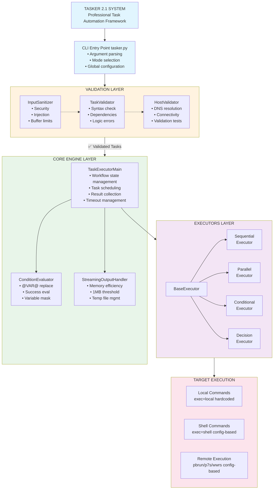
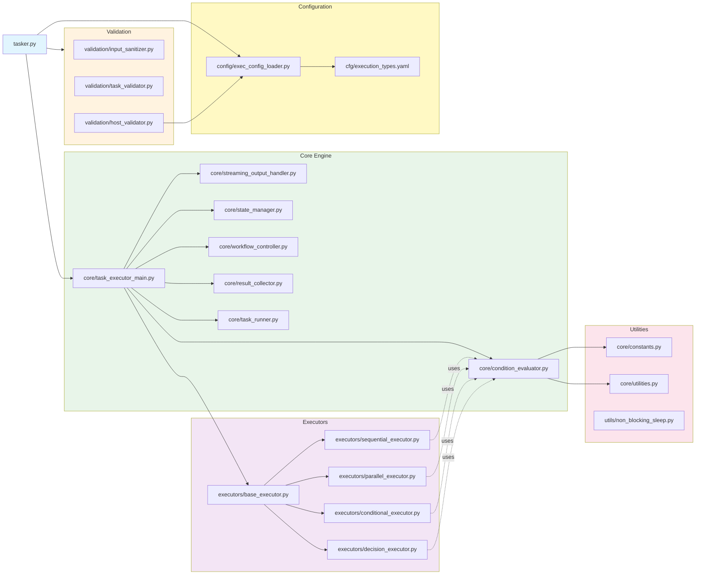
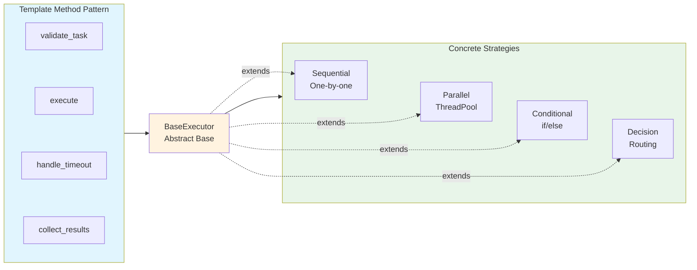
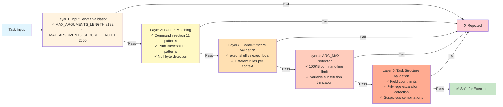
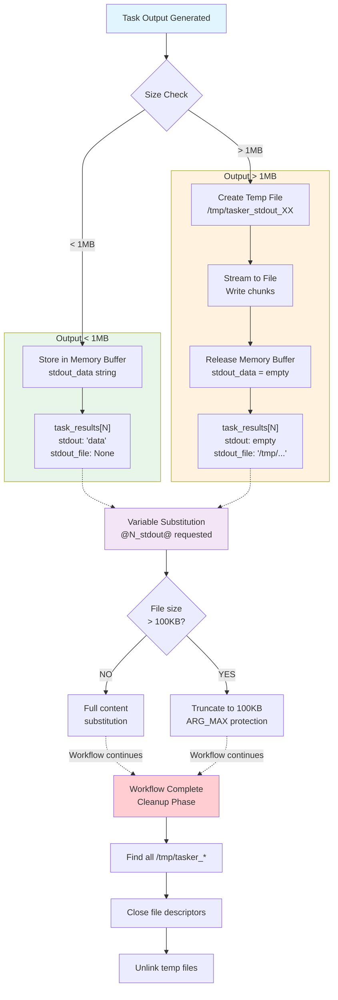

# TASKER 2.1 Architecture Diagram (Mermaid Version)

> **Note**: This is the Mermaid-rendered version. For ASCII text version,
> see bottom of document.

## 1. High-Level System Architecture

## 2. Data Flow Architecture

```mermaid
graph TB
    TaskFile[Task File .txt]
    Parser[File Parser]
    GlobalVars[Global Variables<br/>HOSTNAME=server1]
    Sanitizer[InputSanitizer]
    Validator[TaskValidator]
    TaskExec[TaskExecutorMain]
    Queue[Task Queue<br/>Tasks: 0, 1, 2, 3, ...]
    ExecSelect[Executor Selection<br/>• Sequential?<br/>• Parallel?<br/>• Conditional?]
    VarReplace[Variable Replacement<br/>@HOSTNAME@ → server1<br/>@0_stdout@ → data]
    CmdExec[Command Execution<br/>subprocess.Popen]
    OutputStream[Output Streaming<br/>Size < 1MB?<br/>YES → Memory Buffer<br/>NO → Temp File]
    SuccessEval[Success Evaluation<br/>• exit_0<br/>• stdout~pattern<br/>• @VAR@=value]
    ResultStore[Result Storage<br/>task_results#91;N#93;]
    FlowControl[Flow Control<br/>• next=always<br/>• on_success=5<br/>• on_failure=10<br/>• loop=3]
    FinalReport[Final Report<br/>• JSON output<br/>• Statistics<br/>• Execution path<br/>• Performance metrics]
    Cleanup[Cleanup Phase<br/>• Close file handles<br/>• Delete temp files<br/>• Free resources]

    TaskFile --> Parser
    Parser --> GlobalVars
    GlobalVars --> Sanitizer
    Sanitizer -->|✅ Safe Data| Validator
    Validator -->|✅ Valid Structure| TaskExec
    TaskExec --> Queue
    Queue --> ExecSelect
    ExecSelect --> VarReplace
    VarReplace --> CmdExec
    CmdExec --> OutputStream
    OutputStream --> SuccessEval
    SuccessEval --> ResultStore
    ResultStore --> FlowControl
    FlowControl --> FinalReport
    FinalReport --> Cleanup

    style TaskFile fill:#e1f5fe
    style Parser fill:#e1f5fe
    style Sanitizer fill:#fff3e0
    style Validator fill:#fff3e0
    style TaskExec fill:#e8f5e9
    style OutputStream fill:#f3e5f5
    style FinalReport fill:#e8f5e9
    style Cleanup fill:#ffcdd2
```

## 3. Cross-Task Variable Substitution Flow

```mermaid
graph TB
    subgraph Task0["Task 0 Execution"]
        T0Cmd[command: curl ...<br/>Output: 5MB data]
        T0Handler[StreamingOutputHandler<br/>Size check: 5MB > 1MB?<br/>YES]
        T0Actions[• Create temp file /tmp/tasker_stdout_XX<br/>• Stream data to file<br/>• Release memory buffer<br/>• Store path in result]
        T0Result[task_results#91;0#93;<br/>stdout: empty memory freed<br/>stdout_file: /tmp/...<br/>exit_code: 0<br/>success: True]
    end

    subgraph Task1["Task 1 Execution"]
        T1Cmd[command: process<br/>arguments: @0_stdout@]
        T1Eval[ConditionEvaluator<br/>replace_variables]
        T1Check{Check stdout_file exists?}
        T1FileSize[File size: 5MB]
        T1Decision{Size > 100KB?}
        T1Token[Replace @0_stdout@<br/>with @0_stdout_file@]
        T1Final[Final command:<br/>process @0_stdout_file@]
    end

    subgraph Phase3["Phase 3: Temp File Cleanup"]
        P3Find[Find all /tmp/tasker_*]
        P3Close[Close file descriptors]
        P3Unlink[Unlink temp files]
    end

    T0Cmd --> T0Handler
    T0Handler --> T0Actions
    T0Actions --> T0Result
    T0Result -.Task completes.-> T1Cmd
    T1Cmd --> T1Eval
    T1Eval --> T1Check
    T1Check -->|YES| T1FileSize
    T1FileSize --> T1Decision
    T1Decision -->|YES| T1Token
    T1Token --> T1Final
    T1Final -.Workflow completes.-> P3Find
    P3Find --> P3Close
    P3Close --> P3Unlink

    style T0Cmd fill:#e1f5fe
    style T0Handler fill:#f3e5f5
    style T1Eval fill:#fff3e0
    style P3Find fill:#ffcdd2
```

## 4. Module Dependency Graph

### External Dependencies

TASKER Main Application (tasker.py): NONE (Standard library only)

- ✅ subprocess
- ✅ threading
- ✅ tempfile
- ✅ json
- ✅ re (regex)

Note: Test infrastructure & utilities may use third-party packages
(e.g., psutil for performance monitoring in test runners)

## 5. Execution Strategy Pattern

**Key Benefits**:

- Pluggable execution strategies
- Easy to add new executors
- Consistent interface across all execution types
- Code reuse through template method pattern

## 6. Security Validation Pipeline

**Defense-in-Depth**: 5 independent validation layers ensure comprehensive security.

## 7. Test Infrastructure Architecture

```mermaid
graph TB
    Runner[intelligent_test_runner.py<br/>Orchestrator<br/>465 tests]

    subgraph Metadata["Test Metadata Validation"]
        ExitCode[expected_exit_code<br/>Exit code match]
        ExecPath[expected_execution_path<br/>Flow validation]
        ExpVars[expected_variables<br/>Variable resolution]
        ExpSuccess[expected_success<br/>Success criteria]
    end

    subgraph Categories["Test Categories 10"]
        Func[functional/ ~180<br/>Basic features]
        Integ[integration/ ~80<br/>End-to-end workflows]
        Edge[edge_cases/ ~60<br/>Boundary conditions]
        Sec[security/ ~40<br/>Security validation]
        Stream[streaming/ ~25<br/>Cross-task data flow]
        Json[output_json/ ~15<br/>JSON validation]
        Perf[performance/ ~10<br/>Timing tests]
        Recov[recovery/ ~10<br/>Failure recovery]
        Resume[resume/ ~10<br/>Workflow resumption]
        Readme[readme_examples/ ~35<br/>Documentation]
    end

    subgraph Mocks["Mock Infrastructure"]
        Pbrun[pbrun<br/>execution wrapper]
        P7s[p7s<br/>privilege tool]
        Wwrs[wwrs_clir<br/>remote wrapper]
        VerifyCleanup[verify_cleanup_wrapper.sh<br/>temp file verification]
    end

    subgraph Results["Zero Tolerance Validation"]
        ExitMatch{Exit code<br/>matches?}
        PathMatch{Execution path<br/>matches?}
        VarMatch{Variables<br/>correct?}
        ExceptCheck{Python<br/>exceptions?}
        PassFail[PASS / FAIL]
    end

    Runner --> Metadata
    Metadata --> Categories
    Categories --> Mocks
    Mocks --> Results
    Results --> ExitMatch
    ExitMatch -->|YES| PathMatch
    ExitMatch -->|NO| PassFail
    PathMatch -->|YES| VarMatch
    PathMatch -->|NO| PassFail
    VarMatch -->|YES| ExceptCheck
    VarMatch -->|NO| PassFail
    ExceptCheck -->|NO| PassFail
    ExceptCheck -->|YES| PassFail

    style Runner fill:#e1f5fe
    style Metadata fill:#fff3e0
    style Categories fill:#e8f5e9
    style Mocks fill:#f3e5f5
    style Results fill:#fce4ec
```

### Test Coverage

Total: 465 tests ✓

Note: templates/ contains test templates, not test cases

## 8. Memory Management Strategy

**Memory Efficiency**: O(1) memory for unlimited output sizes

- Outputs < 1MB: Kept in memory
- Outputs > 1MB: Streamed to temp file, memory freed immediately
- Variable substitution: 100KB safe limit (ARG_MAX protection)

---

## Summary

**TASKER 2.1 Architecture Highlights**:

1. **Layered Design**: Clear separation (Validation → Core → Execution → Target)
2. **Config-Based Execution**: External YAML configuration for execution types (PR#96, PR#97)
3. **Executor Pattern**: Pluggable strategies (4 execution strategies)
4. **Security-First**: Multi-layer validation with defense-in-depth
5. **Memory Efficient**: O(1) memory for unlimited output sizes (1MB threshold)
6. **Cross-Task Data**: Sophisticated variable substitution with ARG_MAX
   protection
7. **Test Infrastructure**: Metadata-driven validation (465/465 tests passing)
8. **No External Dependencies**: Pure Python 3.6.8 standard library

**Key Design Patterns** (with rationale):

- ✅ **Strategy Pattern** (Executors)
  - *Why*: Support multiple execution modes (Sequential, Parallel, Conditional,
    Decision) without conditional branching in core logic
  - *Benefit*: Easy addition of new execution strategies without modifying
    existing code

- ✅ **Template Method** (BaseExecutor)
  - *Why*: Define common execution workflow while allowing subclasses to
    customize specific steps
  - *Benefit*: Ensures consistent behavior (validation, timeout handling,
    result collection)

- ✅ **Singleton** (Constants, ExecConfigLoader)
  - *Why*: Centralize magic numbers and thresholds (MAX_CMDLINE_SUBST,
    MAX_VARIABLE_EXPANSION_DEPTH); Load execution type config once at startup
  - *Benefit*: Single source of truth, prevents duplication and inconsistency;
    Efficient config loading with callback updates for dynamic changes

- ✅ **Factory** (create_memory_efficient_handler)
  - *Why*: Encapsulate complex object creation logic for streaming handlers
  - *Benefit*: Hides implementation details, simplifies client code

- ✅ **Context Manager** (StreamingOutputHandler)
  - *Why*: Guarantee proper resource cleanup (temp files, file descriptors)
    even on exceptions
  - *Benefit*: Prevents resource leaks in production, automatic cleanup

---

## ASCII Text Version (Original)

> **Note**: For ASCII-based architecture diagrams optimized for terminal viewing,
> see [ARCHITECTURE.md](ARCHITECTURE.md). The ASCII version uses box-drawing
> characters and is ideal for command-line environments where Mermaid rendering
> is not available.
