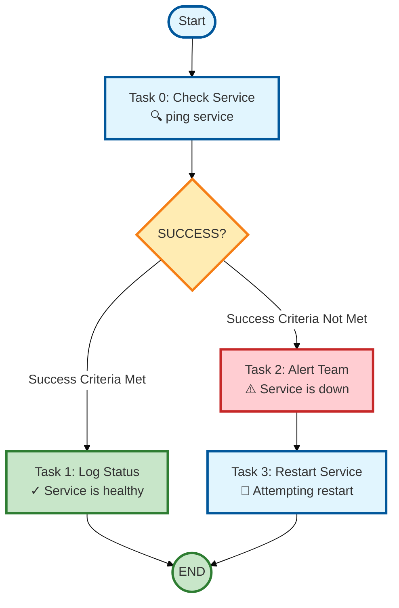

# TASK ExecutoR - TASKER 2.1

[](https://www.gnu.org/licenses/agpl-3.0)
[](COPYRIGHT)
[](LICENSE)

**No-Code Workflow Automation** - Transform complex operations into simple configuration files

## 📜 License & Copyright

### Copyright (C) 2024-2025 Bastelbude and Contributors

TASKER is licensed under the **GNU Affero General Public License v3.0 (AGPL-3.0)**. This strong copyleft license ensures the software remains free while preventing unauthorized commercial exploitation.

- ✅ **Free to use** internally in your organization
- ✅ **Free to modify** for your needs
- ⚠️ **Network use requires source disclosure** - SaaS/cloud deployments must share source
- ⚠️ **Commercial use must comply** with AGPL-3.0 requirements
- 📝 **Attribution required** - Must credit "TASKER by Bastelbude"

See [LICENSE](LICENSE), [COPYRIGHT](COPYRIGHT), and [NOTICE](NOTICE) files for full details.

## Why TASKER?

Transform complex operations into simple configuration files. TASKER automates workflows across servers with zero coding required.

**Key Capabilities:**

- ✅ **Zero Coding Required** - Write workflows in simple text files
- ✅ **Smart Decision Making** - Automatic routing based on command results
- ✅ **Enterprise Ready** - Scales from 1 to 1000+ servers effortlessly
- ✅ **Built-in Intelligence** - Detects success/failure from exit codes, stdout, stderr
- ✅ **Resume & Recovery** - Automatic recovery from failures with resume capability
- ✅ **Machine-Readable Output** - JSON workflow summaries for integration

## Your First Workflow: Service Health Check

Let's start with a simple example that checks if a service is running and takes action based on the result:



**The simple text configuration:**

```bash
# health_check.txt - Your first TASKER workflow!
# This example demonstrates basic routing based on success criteria

# Task 0: Check if service is running (simulated with true/false)
task=0
hostname=localhost
command=echo
arguments=Service check: OK
exec=local
# Define success as exit code 0
success=exit_0
# If success (exit code 0), go to task 1
on_success=1
# If failure (exit code not 0), go to task 2
on_failure=2

# Task 1: Log successful status
task=1
hostname=localhost
command=echo
arguments=Service is healthy
exec=local
# STOP here - don't continue to task 2
next=never

# Task 2: Alert about failure (only reached via on_failure=2)
task=2
hostname=localhost
command=echo
arguments=ALERT: Service is down!
exec=local
# After alert, continue to task 3 (default sequential flow)

# Task 3: Try to restart the service
task=3
hostname=localhost
command=echo
arguments=Attempting to restart service...
exec=local
# Workflow ends after restart attempt
```

**Run it:** `tasker -r health_check.txt` ✨

**🎯 What This Example Shows:**

- **`success=exit_0`**: Define success as exit code 0
- **`on_success=1`**: Jump to task 1 if success criteria is met
- **`on_failure=2`**: Jump to task 2 if success criteria is not met
- **`next=never`**: Stop sequential execution (firewall)
- **Default flow**: Task 2 continues to task 3 automatically (no `next` condition)

---

## Overview

TASKER 2.1 is a next-generation task automation framework that reads task definitions from configuration files and executes them with advanced orchestration capabilities. Built on a modular architecture for maximum maintainability and scalability.

📐 **Architecture Documentation** - Comprehensive system design with 8 detailed diagrams:
- **[Mermaid Version](ARCHITECTURE_MERMAID.md)** (GitHub-optimized, beautifully rendered diagrams)
- **[ASCII Version](ARCHITECTURE.md)** (Terminal-friendly, works everywhere)

Covers system layers, data flow, security pipeline, memory management, and execution patterns.

**Key Features:**

- **Multiple Execution Models**: Sequential, parallel, and conditional task execution
- **Multiple Execution Types**: Direct subprocess (`local`), shell execution (`shell`), enterprise tools (`pbrun`, `p7s`, `wwrs`)
- **Advanced Flow Control**: Complex conditions, loops, branching, and error handling
- **Variable System**: Dynamic substitution and data flow between tasks
- **File-Defined Arguments**: Task files can define their own command-line arguments for automation
- **Context-Aware Security**: Different validation rules for shell vs direct execution
- **Enterprise Scaling**: Support for 1-1000+ servers with robust timeout management
- **Professional Logging**: Structured output with debug capabilities and project tracking
- **Machine-Readable Output**: JSON workflow summaries with execution metadata, task results, and metrics

---

## Quick Start

### Installation

```bash
# Clone the repository
git clone https://github.com/bastelbude1/Tasker.git
cd Tasker

# Make TASKER executable
chmod +x vtps

# Add to PATH (optional)
export PATH=$PATH:/path/to/Tasker
```

### Basic Usage

Execute tasks in a file (dry run mode - doesn't actually execute commands):

```bash
tasker tasks.txt
```

Actually execute the commands:

```bash
tasker -r tasks.txt
```

Execute with project tracking and logging:

```bash
tasker -r -p DEPLOYMENT_2024 deployment_tasks.txt
```

### Your First Task File

Create a simple task file `hello.txt`:

```bash
# hello.txt - Your first TASKER task file
# Simple sequential execution with local commands

task=0
hostname=localhost
command=echo
arguments=Hello TASKER!
exec=local

task=1
hostname=localhost
command=date
exec=local
```

Run it:

```bash
tasker -r hello.txt
```

That's it! You've just executed your first TASKER workflow.

---

## Core Concepts

### Task File Basics

TASKER uses a simple key-value format where each task is defined by parameters:

```bash
# Comments start with #
# Global variables (uppercase)
ENVIRONMENT=production

# Task definition
task=0
hostname=localhost
command=echo
arguments=Hello from @ENVIRONMENT@
exec=local
```

**Key Rules:**

- **Simple format**: `key=value` pairs
- **Comments**: Full-line comments with `#` (inline comments NOT allowed)
- **Global variables**: UPPERCASE names, referenced with `@VARNAME@`
- **Task separation**: Blank lines between tasks (recommended but not required)
- **Sequential by default**: Tasks execute in order unless flow control is used

### The Three Execution Models

TASKER supports three execution patterns. For complete details and parameters, see [TaskER_FlowChart.md](TaskER_FlowChart.md).

#### 1. Sequential Execution (Default)

Tasks execute one after another in order. This is the most common pattern.

**Example:**

```bash
# Deploy application with rollback capability
ENVIRONMENT=production

task=0
hostname=app-server
command=stop_service
arguments=nginx
exec=local

task=1
hostname=app-server
command=deploy_app
arguments=v2.0 @ENVIRONMENT@
exec=local
success=exit_0
on_failure=99

task=2
hostname=app-server
command=start_service
arguments=nginx
exec=local

# Rollback task (only runs if deploy fails)
task=99
hostname=app-server
command=rollback
arguments=v1.9
exec=local
```

**Complete reference:** [TaskER_FlowChart.md - Execution Block](TaskER_FlowChart.md#1-execution-block)

#### 2. Parallel Execution

Execute the same task on multiple servers simultaneously.

**Example:**

```bash
# Health check on 100 web servers
task=0
hostname=web-01,web-02,web-03,...,web-100
command=curl
arguments=-f http://localhost/health
exec=local
max_parallel=20
retry_failed=true
```

**Key Features:**

- **Concurrent execution**: Tasks run simultaneously on multiple hosts
- **Aggregation**: Results collected from all hosts
- **Retry logic**: Failed hosts can be automatically retried
- **Throttling**: Control concurrency with `max_parallel`

**Complete reference:** [TaskER_FlowChart.md - Parallel Block](TaskER_FlowChart.md#9-parallel-block)

#### 3. Conditional Execution

Execute tasks based on conditions (previous task results).

**Example:**

```bash
# Conditional deployment based on environment check
task=0
hostname=config-server
command=get_environment
exec=local

# Only deploy to production if approved
task=1
condition=@0_stdout@~production
hostname=prod-server
command=deploy
arguments=app-v2.0
exec=local

# Deploy to staging if not production
task=2
condition=@0_stdout@~staging
hostname=staging-server
command=deploy
arguments=app-v2.0
exec=local
```

**Key Features:**

- **Condition-based routing**: Execute tasks only when conditions are met
- **Data-driven decisions**: Use stdout, stderr, exit codes from previous tasks
- **Complex logic**: Support for AND (`&`), OR (`|`), NOT (`!`) operators

**Complete reference:** [TaskER_FlowChart.md - Conditional Block](TaskER_FlowChart.md#8-conditional-block)

---

## Essential Parameters

### Core Task Parameters

| Parameter | Purpose | Example |
|-----------|---------|---------|
| `task` | Task ID (required) | `task=0` |
| `hostname` | Target server(s) | `hostname=localhost` or `hostname=server1,server2,server3` |
| `command` | Command to run | `command=deploy` |
| `arguments` | Command arguments | `arguments=--verbose --env=prod` |
| `exec` | Execution type | `exec=local` or `exec=pbrun` or `exec=shell` |

### Flow Control Parameters

| Parameter | Purpose | Example |
|-----------|---------|---------|
| `success` | Success criteria | `success=exit_0&stdout~OK` |
| `on_success` | Task to jump to on success | `on_success=10` |
| `on_failure` | Task to jump to on failure | `on_failure=99` |
| `condition` | Execute only if condition met | `condition=@0_exit@=0` |
| `next` | Control sequential flow | `next=never` or `next=always` |

### Parallel Execution Parameters

| Parameter | Purpose | Example |
|-----------|---------|---------|
| `max_parallel` | Max concurrent tasks | `max_parallel=20` |
| `retry_failed` | Retry failed hosts | `retry_failed=true` |
| `success_threshold` | Min success rate | `success_threshold=80` |

### Advanced Parameters

| Parameter | Purpose | Example |
|-----------|---------|---------|
| `timeout` | Task timeout in seconds | `timeout=120` |
| `loop` | Repeat task N times | `loop=5` |
| `return` | Set exit code | `return=0` |
| `sleep` | Delay after task | `sleep=10` |

**Complete parameter reference:** [TaskER_FlowChart.md](TaskER_FlowChart.md)

---

## Simple Examples

### Example 1: Basic Sequential Tasks

```bash
# Service management workflow (stop -> start -> status)
task=0
hostname=localhost
command=echo
arguments=Stopping nginx service
exec=local

task=1
hostname=localhost
command=echo
arguments=Starting nginx service
exec=local

task=2
hostname=localhost
command=echo
arguments=nginx service is active (running)
exec=local
```

### Example 2: With Global Variables

```bash
# Global variables for service management
SERVICE=nginx
ENVIRONMENT=production

task=0
hostname=localhost
command=echo
arguments=Restarting @SERVICE@ on @ENVIRONMENT@-web
exec=local

task=1
hostname=localhost
command=echo
arguments=@SERVICE@ is active (running)
exec=local
success=exit_0&stdout~active
```

### Example 3: Conditional Deployment

```bash
# Approval gate workflow with conditional deployment
ENVIRONMENT=production

task=0
hostname=localhost
command=echo
arguments=Deployment approved for @ENVIRONMENT@
exec=local

task=1
condition=@0_exit@=0
hostname=localhost
command=echo
arguments=Deploying application version latest to @ENVIRONMENT@-app
exec=local

task=2
condition=@1_exit@=0
hostname=localhost
command=echo
arguments=Deployment verified successfully
exec=local
```

### Example 4: Error Handling

```bash
# Deployment with success/failure notification
task=0
hostname=localhost
command=echo
arguments=Application deployed successfully
exec=local

task=1
condition=@0_exit@=0
hostname=localhost
command=echo
arguments=SUCCESS: Deployment completed
exec=local

task=99
condition=@0_exit@!=0
hostname=localhost
command=echo
arguments=FAILURE: Deployment failed - @0_stderr@
exec=local
```

---

## Documentation

### For New Users

- **Why TASKER?** (above) - Understand the value proposition
- **Your First Workflow** (above) - Get started immediately
- **Quick Start** (above) - Installation and basic usage
- **Core Concepts** (above) - Learn the fundamentals
- **Simple Examples** (above) - Copy and adapt working examples

### Complete Reference

- **[TaskER_FlowChart.md](TaskER_FlowChart.md)** - All 14 workflow blocks with parameters, diagrams, and detailed explanations
- **[ADVANCED_FEATURES.md](ADVANCED_FEATURES.md)** - Deep dive into advanced features with comprehensive examples

### Advanced Features

See [ADVANCED_FEATURES.md](ADVANCED_FEATURES.md) for detailed documentation:

- [File-Defined Arguments](ADVANCED_FEATURES.md#file-defined-arguments) - Define CLI arguments in task files
- [Global Variables](ADVANCED_FEATURES.md#global-variables) - Dynamic variable system with environment integration
- [Memory-Efficient Streaming](ADVANCED_FEATURES.md#memory-efficient-output-streaming) - Handle large outputs without memory issues
- [Resume and Recovery](ADVANCED_FEATURES.md#resume-and-recovery) - Automatic recovery from failures
- [JSON Output](ADVANCED_FEATURES.md#machine-readable-output-json) - Machine-readable workflow summaries
- [Variable Substitution](ADVANCED_FEATURES.md#variable-substitution) - Use task results in subsequent tasks
- [Success Criteria](ADVANCED_FEATURES.md#success-criteria) - Define complex success conditions
- [Loop Counters](ADVANCED_FEATURES.md#loop-counters) - Access loop iteration data

---

## Command Line Reference

### Essential Commands

```bash
# Dry run - validate and show execution plan without running
tasker tasks.txt

# Execute tasks for real
tasker -r tasks.txt

# Execute with project tracking
tasker -r -p PROJECT_NAME tasks.txt

# Execute with debug logging
tasker -r -d tasks.txt

# Resume from specific task
tasker -r --start-from=5 tasks.txt

# Auto-recovery mode (saves state, auto-resumes on failure)
tasker -r --auto-recovery tasks.txt
```

### Validation Commands

```bash
# Full validation without execution
tasker --validate-only tasks.txt

# Validation with connectivity testing
tasker -c --validate-only tasks.txt

# Skip specific validation types (use with caution)
tasker -r --skip-host-validation tasks.txt
tasker -r --skip-command-validation tasks.txt
```

### Workflow Instance Control

Prevent accidental concurrent execution of identical workflows - critical for avoiding disasters like duplicate deployments or database migrations running simultaneously.

```bash
# Enable instance control for critical workflows
tasker -r --instance-check deployment.txt


# Try to run again while first instance is running (BLOCKED)
$ tasker -r --instance-check deployment.txt
ERROR: Workflow instance already running!
  Task file: /path/to/deployment.txt
  Started: 2025-11-11T19:10:45.123456
  PID: 12345
  Lock file: ~/TASKER/locks/workflow_abc123def456.lock


To override instance check, use: --force-instance


# Emergency override for stuck locks
tasker -r --instance-check --force-instance deployment.txt


# Different environment variables = different instances (allowed in parallel)
$ ENV=prod tasker -r --instance-check deploy.txt &
$ ENV=dev tasker -r --instance-check deploy.txt &  # Also runs (different hash)
```

#### How it works

- Creates SHA-256 hash from task file content + expanded global variables
- Lock file stored in `~/TASKER/locks/workflow_{hash}.lock`
- Automatically detects and cleans up stale locks from crashed processes
- `--validate-only` never creates locks (validation can run anytime)
- `--auto-recovery` on resume: detects stale locks from crashed processes, cleans them up, then acquires fresh lock to prevent duplicate recovery attempts

#### Use cases

- Prevent duplicate deployments
- Avoid concurrent database migrations
- Protect against port/file conflicts
- Critical one-at-a-time operations

### Command Line Options

#### Execution Control

| Option | Description | Example |
|--------|-------------|---------|
| `-r, --run` | Execute commands (not dry run) | `tasker -r tasks.txt` |
| `-p, --project` | Project name for tracking | `tasker -r -p DEPLOY_2024 tasks.txt` |
| `-l, --log-dir` | Custom log directory | `tasker -r -l /custom/logs tasks.txt` |
| `--log-level` | Logging level (ERROR/WARN/INFO/DEBUG) | `tasker -r --log-level=DEBUG tasks.txt` |
| `-d, --debug` | Shorthand for --log-level=DEBUG | `tasker -r -d tasks.txt` |
| `-t, --type` | Default execution type | `tasker -r -t local tasks.txt` |
| `-o, --timeout` | Default timeout in seconds | `tasker -r -o 60 tasks.txt` |

#### Validation & Planning

| Option | Description | Example |
|--------|-------------|---------|
| `--show-plan` | Display execution plan and ask confirmation | `tasker --show-plan -r tasks.txt` |
| `--validate-only` | Validate task file and exit | `tasker --validate-only tasks.txt` |
| `--skip-task-validation` | Skip task file validation | `tasker -r --skip-task-validation tasks.txt` |
| `--skip-host-validation` | Skip host validation | `tasker -r --skip-host-validation tasks.txt` |
| `--skip-command-validation` | Skip command existence checks | `tasker -r --skip-command-validation tasks.txt` |
| `--skip-security-validation` | Skip security pattern checks | `tasker -r --skip-security-validation tasks.txt` |
| `--skip-validation` | Skip ALL validation | `tasker -r --skip-validation tasks.txt` |

#### Resume & Recovery

| Option | Description | Example |
|--------|-------------|---------|
| `--start-from` | Resume from specific task ID | `tasker -r --start-from=5 tasks.txt` |
| `--auto-recovery` | Enable automatic error recovery | `tasker -r --auto-recovery tasks.txt` |
| `--show-recovery-info` | Display recovery state and exit | `tasker --show-recovery-info tasks.txt` |

#### Execution Behavior

| Option | Description | Example |
|--------|-------------|---------|
| `--fire-and-forget` | Don't wait for task completion | `tasker -r --fire-and-forget tasks.txt` |
| `--instance-check` | Prevent concurrent identical workflows | `tasker -r --instance-check tasks.txt` |
| `--force-instance` | Override instance check (emergency) | `tasker -r --instance-check --force-instance tasks.txt` |
| `--strict-env-validation` | Require TASKER_ prefix for env vars | `tasker -r --strict-env-validation tasks.txt` |
| `--show-effective-args` | Show merged file + CLI arguments | `tasker --show-effective-args tasks.txt` |

**Complete CLI reference with all options:** [TaskER_FlowChart.md - Command Line Interface](TaskER_FlowChart.md)

---

## Exit Codes

TASKER uses specific exit codes to indicate different types of failures:

### Standard Exit Codes

| Exit Code | Constant | Description | Resolution |
|-----------|----------|-------------|------------|
| 0 | SUCCESS | Task execution completed successfully | N/A |
| 1 | GENERAL_ERROR | General task execution failure | Check task logs for details |
| 124 | TIMEOUT | Task exceeded timeout limit | Increase timeout or optimize task |
| 130 | SIGNAL_INTERRUPT | Execution interrupted (Ctrl+C) | N/A - User initiated |

### TASKER-Specific Exit Codes

| Exit Code | Constant | Description | Resolution |
|-----------|----------|-------------|------------|
| 10 | INVALID_ARGUMENTS | Invalid command-line arguments | Check command syntax |
| 11 | TASK_FILE_NOT_FOUND | Task file doesn't exist | Verify file path |
| 12 | TASK_FILE_EMPTY | Task file is empty | Add task definitions |
| 13 | TASK_FILE_PARSE_ERROR | Cannot parse task file | Check file syntax |
| 14 | CONDITIONAL_EXECUTION_FAILED | Conditional 'next' condition not met | Review condition logic |
| 15 | SIGNAL_INTERRUPT | Interrupted by signal (SIGINT/SIGTERM) | N/A - System initiated |
| 16 | PARALLEL_EXECUTION_FAILURE | Parallel task execution failed | Check individual task logs |
| 17 | CONDITIONAL_TASK_FAILURE | Conditional branch execution failed | Review branch logic |
| 18 | TASK_FAILED | Individual task execution failed | Check task configuration |
| 19 | TASK_DEPENDENCY_FAILED | Task dependency not satisfied | Verify task dependencies |
| 20 | TASK_FILE_VALIDATION_FAILED | Task file validation errors | Fix validation errors |
| 21 | HOST_VALIDATION_FAILED | Host connectivity validation failed | Verify host accessibility |
| 22 | HOST_CONNECTION_FAILED | Cannot connect to remote host | Check network/credentials |
| 23 | HOST_RESOLUTION_FAILED | Cannot resolve hostname | Verify DNS/hostname |
| 24 | EXEC_TYPE_VALIDATION_FAILED | Execution type validation failed | Check pbrun/p7s/wwrs setup |
| 25 | INSTANCE_ALREADY_RUNNING | Workflow instance already running | Wait for completion or use --force-instance |

### Using Exit Codes in Workflows

```bash
# Return specific exit code from workflow
task=99
return=20

# Check for specific exit codes in conditions
task=10
condition=@0_exit@=124
hostname=notification
command=send_timeout_alert

# Success criteria based on exit codes
task=20
hostname=app-server
command=health_check
success=exit_0|exit_3
```

---

## Troubleshooting

### Common Issues & Solutions

#### Task File Syntax Errors

```bash
# Validate syntax first
tasker --validate-only tasks.txt

# Common fixes:
# - Check for missing required parameters (task, hostname, command)
# - Verify global variable definitions
# - Check condition syntax and boolean operators
# - Ensure no inline comments after key=value pairs
```

#### Host Connectivity Problems

```bash
# Test connectivity
tasker -c --validate-only deployment.txt

# Emergency execution (use with caution)
tasker -r --skip-host-validation emergency_fix.txt
```

#### Parallel Task Failures

```bash
# Enable debug logging for parallel tasks
tasker -r -d parallel_workflow.txt

# Check for resource contention and timeout issues
# Review individual task logs in ~/TASKER/
```

#### Flow Control Debugging

```bash
# Use debug logging to trace condition evaluation
tasker -r -d complex_workflow.txt

# Verify variable replacement and condition logic
# Check task result data availability
```

#### Resume Problems

```bash
# Validate resume point first
tasker --start-from=15 --validate-only workflow.txt

# Use auto-recovery for automatic resume
tasker -r --auto-recovery workflow.txt

# Check for task data dependencies
# Ensure global variables are properly defined
```

### Debug Steps

1. **Validation Issues**: `tasker --validate-only tasks.txt`
2. **Debug Execution**: `tasker -r -d tasks.txt`
3. **Check Connectivity**: `tasker -r -c tasks.txt`
4. **Review Logs**: Check timestamped files in `~/TASKER/`
5. **Test Resume**: `tasker --start-from=X --validate-only tasks.txt`

---

## Getting Help

- **Complete Reference:** [TaskER_FlowChart.md](TaskER_FlowChart.md) - All workflow blocks, parameters, and diagrams
- **Advanced Features:** [ADVANCED_FEATURES.md](ADVANCED_FEATURES.md) - Deep dive into advanced capabilities
- **Examples:** See `test_cases/readme_examples/` directory for working examples
- **Issues:** <https://github.com/bastelbude1/Tasker/issues>

---

## Contributing

TASKER is actively developed and welcomes contributions. See [CLAUDE.md](CLAUDE.md) for development guidelines.

**Development Guidelines:**

- Python 3.6.8+ compatibility required
- Comprehensive test coverage expected
- Follow existing code style and conventions
- All tests must pass before submission

---

## License

TASKER is licensed under the **GNU Affero General Public License v3.0 (AGPL-3.0)**.

This strong copyleft license ensures:

- Software remains free and open source
- Modifications must be shared under the same license
- Network use (SaaS/cloud) requires source disclosure
- Attribution to original authors is required

See [LICENSE](LICENSE), [COPYRIGHT](COPYRIGHT), and [NOTICE](NOTICE) files for full details.

---

**TASKER 2.1** - Professional Task Automation for Enterprise Environments

Copyright (C) 2024-2025 Bastelbude and Contributors
