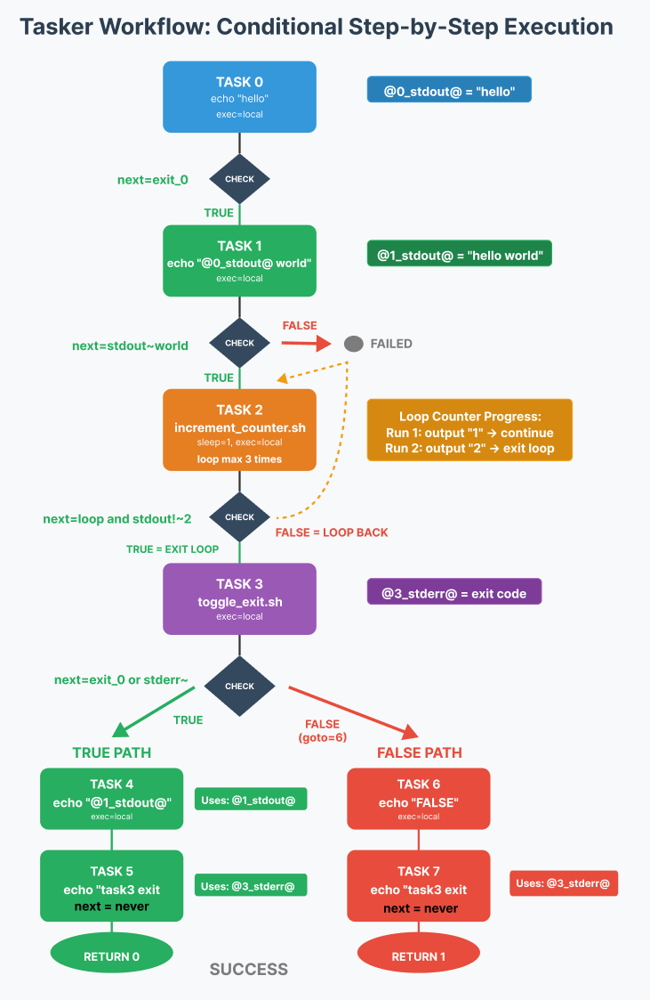
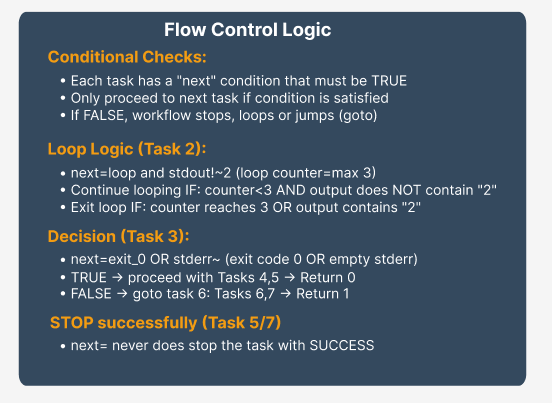

[[_TOC_]]

# TASK ExecutoR - TASKER 2.0

A sophisticated Python-based task execution system for running commands on remote or local servers with comprehensive flow control, parallel execution capabilities, and enterprise-grade validation.

## Overview

TASKER 2.0 is a next-generation task automation framework that reads task definitions from configuration files and executes them with advanced orchestration capabilities. Built on a modular architecture for maximum maintainability and scalability.

### Key Features

- **Multiple Execution Models**: Sequential, parallel, and conditional task execution
- **Advanced Flow Control**: Complex conditions, loops, branching, and error handling
- **Comprehensive Validation**: Task syntax validation and host connectivity testing
- **Variable System**: Dynamic substitution and data flow between tasks
- **Enterprise Scaling**: Support for 1-1000+ servers with robust timeout management
- **Professional Logging**: Structured output with debug capabilities and project tracking
- **Modular Architecture**: Clean separation of concerns with specialized execution engines

### Workflow Example

<details><summary>Workflow example - click to expand</summary>

```
# echo hello
task=0
hostname=localhost
command=echo
arguments=hello
exec=local
next=exit_0

# echo hello world
task=1
hostname=localhost
command=echo
arguments=@0_stdout@ world
exec=local
next=stdout~world

# count from 1 .. 3 (loop as long as stdout does NOT contain 2)
task=2
hostname=localhost
command=./increment_counter.sh
exec=local
sleep=1
next=loop&stdout!~2
loop=3

# toggle between exit 0 and exit (exit 1 = echo 1 to stderr, otherwise to stdout)
task=3
hostname=localhost
command=./toggle_exit.sh
exec=local
next=exit_0|stderr~
on_failure=6

# if task 4 was next TRUE, then echo hello world
task=4
hostname=localhost
command=echo
arguments=@1_stdout@
exec=local

# and show exit code from task 3 and stop successfully with return code = 0
task=5
hostname=localhost
command=echo
arguments=task3 exit code = @3_stderr@
exec=local
next=never
return 0

# if task 4 was next FALSE, then echo FAILED
task=6
hostname=localhost
command=echo
arguments=FAILED
exec=local
next=always

# and show exit code from task 3  and stop successfully with return code = 1
task=7
hostname=localhost
command=echo
arguments=task3 exit code = @3_stderr@
exec=local
next=never
return 1
```

</details>



#### Flow Control Logic



## Modular Architecture

TASKER 2.0 is built on a professional modular architecture that separates concerns and enables maintainable, scalable code:

```
TASKER 2.0 Architecture
┌─────────────────────────────────────────────────────────────────┐
│                         tasker.py                              │
│                    (Main Entry Point)                          │
└─────────────────────┬───────────────────────────────────────────┘
                      │
┌─────────────────────────────────────────────────────────────────┐
│                   Core Framework                               │
├─────────────────────────────────────────────────────────────────┤
│ TaskExecutor     │ Utilities         │ ExecutionContext        │
│ • Lifecycle      │ • Exit Codes      │ • Callback Management   │
│ • Logging        │ • Conversion      │ • State Coordination    │
│ • Orchestration  │ • Formatting      │ • Debug Infrastructure  │
└─────────────────────────────────────────────────────────────────┘
                      │
┌─────────────────────────────────────────────────────────────────┐
│                 Execution Engines                              │
├─────────────────────────────────────────────────────────────────┤
│ Sequential       │ Parallel          │ Conditional             │
│ • Standard Flow  │ • Multi-threading │ • Branch Logic          │
│ • Loops & Logic  │ • Retry Systems   │ • Dynamic Routing       │
│ • Error Handling │ • Aggregation     │ • Condition Evaluation  │
└─────────────────────────────────────────────────────────────────┘
                      │
┌─────────────────────────────────────────────────────────────────┐
│                 Validation Systems                             │
├─────────────────────────────────────────────────────────────────┤
│ Task Validator   │ Host Validator    │ Condition Evaluator     │
│ • Syntax Check   │ • DNS Resolution  │ • Variable Replacement  │
│ • Dependencies   │ • Connectivity    │ • Expression Parsing    │
│ • Structure      │ • Exec Types      │ • Boolean Logic         │
└─────────────────────────────────────────────────────────────────┘
```

## Installation

Command is available on ALL WMPC **jumphosts** as **tasker**, which is a symbolic link to task_executor.py

No special installation is required beyond Python 3.6.8 or higher. Simply download the `tasker.py` and `task_validator.py` scripts and make them executable.

```bash
chmod +x tasker.py task_validator.py
ln -s /<path>/bin/tasker.py /usr/bin/tasker
```

## Usage

### Basic Usage

To execute tasks in a file (dry run mode, doesn't actually execute commands):

```bash
tasker tasks.txt
```

To execute tasks for real:

```bash
tasker -r tasks.txt
```

### Command Line Options

```
usage: tasker.py [-h] [-r] [-l LOG_DIR] [--log-level {ERROR,WARN,INFO,DEBUG}]
                 [-t {pbrun,p7s,local,wwrs}] [-o TIMEOUT] [-c] [-p PROJECT]
                 [--start-from TASK_ID] [--skip-task-validation]
                 [--skip-host-validation] [--skip-validation]
                 [--validate-only] [--show-plan] [-d]
                 task_file

TASKER 2.0 - Execute tasks on remote servers with comprehensive flow control.

positional arguments:
  task_file             Path to the task file

options:
  -h, --help            show this help message and exit
  -r, --run             Actually run the commands (not dry run)
  -l, --log-dir LOG_DIR Directory to store log files
  --log-level {ERROR,WARN,INFO,DEBUG}
                        Set logging level (default: INFO)
  -t, --type {pbrun,p7s,local,wwrs}
                        Execution type (overridden by task-specific settings)
  -o, --timeout TIMEOUT Default command timeout in seconds (5-1000, default: 30)
  -c, --connection-test Check connectivity for pbrun,p7s,wwrs hosts
  -p, --project PROJECT Project name for summary logging
  --start-from TASK_ID  Start execution from specific task ID (resume capability)
  --skip-task-validation
                        Skip task file and dependency validation (faster resume)
  --skip-host-validation
                        Skip host validation and use hostnames as-is (WARNING: risky!)
  --skip-validation     Skip ALL validation (same as --skip-task-validation --skip-host-validation)
  --validate-only       Perform complete validation (task + host) and exit - no task execution
  --show-plan           Show execution plan and require confirmation before running
  -d, --debug           Enable debug logging (shorthand for --log-level=DEBUG)

Examples:
  tasker.py tasks.txt -r                    # Execute tasks (real run)
  tasker.py tasks.txt --log-level=DEBUG     # Execute with debug logging
  tasker.py tasks.txt --show-plan           # Show execution plan first
  tasker.py tasks.txt --start-from=5        # Resume from task 5
  tasker.py tasks.txt --validate-only       # Only validate, don't execute
```

### Environment Variables

You can use environment variables instead of command line arguments or task file instructions. This might be useful in wrapper scripts:

- `TASK_EXECUTOR_TYPE`: Sets the execution type (`pbrun`, `p7s`, `local`, or `wwrs`)
- `TASK_EXECUTOR_LOG`: Sets the custom log directory (default is ~/TASKER/)
- `TASK_EXECUTOR_TIMEOUT`: Sets the custom command timeout in seconds (default 30)

Note: Task file instructions override command line arguments, and arguments override environment variables.

### Validation Controls

TASKER 2.0 provides comprehensive validation capabilities:

```bash
# Full validation without execution
tasker --validate-only production_deployment.txt

# Skip task validation for faster resume
tasker --start-from=5 --skip-task-validation deployment.txt

# Skip host validation (use with caution!)
tasker --skip-host-validation emergency_fix.txt

# Skip all validation (emergency use only)
tasker --skip-validation critical_fix.txt

# Enable host connectivity testing
tasker -c --validate-only production_tasks.txt
```

## Default LOG Directory Structure

The task executor creates and uses the following directory structure by default:

```
~/TASKER/
├── logs/
│   ├── tasker_20240115_143015.log          # Detailed execution log
│   ├── project_DEPLOYMENT_2024_summary.log # Project summary
│   └── validation_report_20240115.log      # Validation details
└── tasks/
    ├── deployment_20240115_143015.txt      # Task file backup
    └── maintenance_20240115_143015.txt     # Task file backup
```

Each task file execution creates:
1. A timestamped log file in the logs directory
2. A timestamped copy of the task file in the tasks directory

If used with `-p <project>`, you will also find:
- A project summary file of all tasks run under this project ID (append mode)

## Task File Format

Task files use a simple key-value format with comments starting with `#`.

### Basic Task Structure

```
# Standard task definition
task=0
hostname=server1.example.com
command=systemctl
arguments=status nginx
exec=pbrun
timeout=30
next=exit_0
```

### Task Definition

Each task must have at least:
- `task`: unique numerical ID
- `hostname`: target server (except for return tasks and parallel/conditional parent tasks)
- `command`: the command to execute

Optional parameters include:
- `arguments`: command arguments
- `condition`: pre-execution condition (task is skipped if condition is false)
- `next`: condition for proceeding to next task (evaluated after execution)
- `exec`: execution type for this specific task
- `timeout`: command timeout in seconds
- `sleep`: pause after task completion
- `loop`: number of additional iterations
- `on_success`: task ID to execute on success
- `on_failure`: task ID to execute on failure
- `return`: exit workflow with specific return code

### Execution Types

TASKER 2.0 supports multiple execution models:

#### Sequential Execution (Default)
Standard task-by-task execution with flow control:

```
task=0
hostname=server1
command=echo
arguments="Sequential task"
exec=local
```

#### Parallel Execution
Execute multiple tasks simultaneously with advanced control:

```
# Parallel execution controller
task=10
type=parallel
max_parallel=5
tasks=11,12,13,14,15
next=min_success=3
on_success=20
on_failure=25

# Parallel subtasks
task=11
hostname=web1.example.com
command=deploy_service
exec=pbrun

task=12
hostname=web2.example.com
command=deploy_service
exec=pbrun

# ... additional parallel tasks
```

**Parallel Task Features:**
- `max_parallel`: Maximum concurrent executions
- `tasks`: Comma-separated list of task IDs to execute in parallel
- `next`: Success conditions (`all_success`, `any_success`, `majority_success`, `min_success=N`)
- `retry_failed`: Enable retry for failed parallel tasks
- `retry_count`: Number of retry attempts
- `retry_delay`: Delay between retries

#### Conditional Execution
Dynamic workflow branching based on runtime conditions:

```
# Conditional execution
task=20
type=conditional
condition=@10_exit_code@==0&@service_status_stdout@~running
if_true_tasks=21,22
if_false_tasks=25,26

# Success path
task=21
hostname=monitor.example.com
command=alert
arguments="Deployment successful"

# Failure path
task=25
hostname=monitor.example.com
command=alert
arguments="Deployment failed - initiating rollback"
```

**Conditional Task Features:**
- `condition`: Boolean expression for branch selection
- `if_true_tasks`: Task IDs to execute when condition is true
- `if_false_tasks`: Task IDs to execute when condition is false

### Flow Control

The `next` parameter controls whether to proceed to the next task:

```
# Proceed only if exit code is 0
next=exit_0

# Proceed only if stdout contains "Success"
next=stdout~Success

# Proceed if exit is 0 AND stdout contains "Success"
next=exit_0&stdout~Success

# Proceed if exit is 0 AND (stdout contains "Success" OR stderr is empty)
next=exit_0&(stdout~Success|stderr~)

# Never proceed (end of execution)
next=never

# Always proceed regardless of result
next=always
```

The `next=loop` parameter defines task repetition:

```
# Loop this task
next=loop
loop=3

# Loop with condition (exit if condition not met)
next=loop&exit_0
loop=5
```

Note: `loop=2` means the task will be executed 3 times total (original + 2 additional)!

### Special Features

#### Variable Substitution

Use output from previous tasks with dynamic variable replacement:

```
task=0
hostname=serverA
command=echo
arguments="Hello World"

task=1
hostname=serverB
command=echo
arguments="Previous output: @0_stdout@"

# Global variables
task=2
hostname=@ENVIRONMENT@.example.com
command=deploy
arguments=@SERVICE_NAME@ version @DEPLOY_VERSION@
```

**Variable Types:**
- `@TASK_ID_stdout@`: Standard output from specific task
- `@TASK_ID_stderr@`: Standard error from specific task
- `@TASK_ID_exit_code@`: Exit code from specific task
- `@TASK_ID_hostname@`: Hostname used by specific task
- `@VARIABLE_NAME@`: Global variables defined in task file

#### Output Splitting

Split and process task output by selecting specific elements:

```
task=0
hostname=serverA
command=echo
arguments="value1 value2 value3"
stdout_split=space,1

# Now @0_stdout@ will be "value2"
```

Supported delimiters:
- `space`: Split by whitespace
- `tab`: Split by tabs
- `comma`: Split by commas
- `semi`: Split by semicolons
- `pipe`: Split by pipes
- `newline`: Split by newlines

#### Pre-execution Conditions

Skip task execution based on conditions evaluated before the task runs:

```
task=0
hostname=serverA
command=echo
arguments="Creating file"
exec=local

# This task only runs if the previous task was successful
task=1
hostname=serverA
condition=@0_success@
command=echo
arguments="File creation was successful"
exec=local

# This task only runs if a global variable matches
task=2
hostname=serverA
condition=@ENVIRONMENT@=production
command=deploy_to_production
exec=local
```

**Pre-execution Condition Features:**
- Evaluated before task execution (unlike `next` which is evaluated after)
- If condition evaluates to false, task is skipped entirely
- Same condition syntax as `next` parameter
- Useful for conditional task execution based on previous results or global variables

#### Error Handling with Success/Failure Routing

Jump to specific tasks based on success or failure:

```
task=0
hostname=serverA
command=risky_command
next=exit_0
on_success=1
on_failure=2

task=1
hostname=serverA
command=success_command
next=never

task=2
hostname=serverA
command=error_handler
```

Note: If `next=never` is specified, it takes precedence over any `on_success`/`on_failure` instructions.

#### Return Codes

Exit the execution with a specific code:

```
task=0
hostname=serverA
command=check_condition
next=exit_0
on_failure=1

# Success path - execution continues normally and exits with return code 0
return=0

task=1
# Error path - jumped to on failure
return=1
```

#### Sleep

Pause between tasks:

```
task=0
hostname=serverA
command=echo
arguments="Starting"
sleep=5  # Sleep for 5 seconds
```

#### Command Timeouts

Set a timeout for command execution:

```
task=0
hostname=serverA
command=long_running_process
timeout=120  # Wait up to 120 seconds before killing the process
```

#### Customizable Execution Types

Specify different command execution formats:

```
task=0
hostname=serverA
command=ls
arguments=-la
exec=pbrun  # Use pbrun execution type

task=1
hostname=serverB
command=1234
exec=wwrs  # Use wwrs execution type
```

Available execution types:
- `pbrun`: `pbrun -n -h {hostname} {command} {arguments}`
- `p7s`: `p7s {hostname} {command} {arguments}`
- `local`: `{command} {arguments}`
- `wwrs`: `wwrs_cli {hostname} "{command} {arguments}"`

## Condition Syntax

### Exit Code Conditions
- `exit_0`: Exit code equals 0
- `exit_1`: Exit code equals 1
- `exit_N`: Exit code equals N

### Output Pattern Matching (same for stderr)
- `stdout~pattern`: stdout contains "pattern"
- `stdout!~pattern`: stdout does NOT contain "pattern"
- `stdout~`: stdout is empty
- `stdout!~`: stdout is NOT empty

### Line Count Conditions (same for stderr)
- `stdout_count=N`: stdout has exactly N lines
- `stdout_count>N`: stdout has more than N lines
- `stdout_count<N`: stdout has fewer than N lines

### Comparison Operations
- `@var@=value`: Variable equals value
- `@var@!=value`: Variable does not equal value
- `@var@>N`: Variable greater than N
- `@var@<N`: Variable less than N
- `@var@>=N`: Variable greater than or equal to N
- `@var@<=N`: Variable less than or equal to N

### Combined Conditions
- `&`: AND operator
- `|`: OR operator
- `()`: Grouping
- Example: `exit_0&(stdout~Success|stderr~)`

## Comprehensive Validation

TASKER 2.0 provides enterprise-grade validation systems:

### Task Validation

By default, TASKER validates task files for:
- Required fields and syntax errors
- Referenced but undefined tasks
- Invalid conditions and flow control logic
- Command formatting and structure
- Dependency chains and circular references
- Variable usage and availability

### Host Validation

By default, TASKER validates that all hostnames:
1. Can be resolved to an IP address (via DNS)
2. Are reachable (via ping)

With the `-c` option, it also checks connectivity for the specific execution type:
- For `pbrun`: Tests `pbrun -n -h {hostname} pbtest`
- For `p7s`: Tests `p7s {hostname} pbtest`
- For `wwrs`: Tests `wwrs_clir {hostname} wwrs_test`

**If there is any validation issue, TASKER will not execute any task**

### Validation Examples

```bash
# Quick syntax validation
tasker deployment.txt

# Full validation with connectivity testing
tasker -c --validate-only production_tasks.txt

# Validation output example:
# ✅ Task file syntax validation passed
# ✅ Dependency validation passed
# ✅ Flow control validation passed
# ✅ Host DNS resolution passed (15/15 hosts)
# ✅ Host connectivity validation passed (15/15 hosts)
# ✅ Execution type validation passed (pbrun: 12, local: 3)
# 🎉 All validations passed - ready for execution
```

## Project Summary Logging

When the `-p` option is used, TASKER creates a tab-delimited project summary log file containing:

- A header row with column names
- One entry per task file execution showing:
  - Timestamp
  - Task filename
  - Final task ID
  - Final hostname
  - Final command
  - Exit code
  - Success/failure status
  - Log file reference

This is useful for tracking multiple task executions across a project.

## Professional Logging

TASKER 2.0 provides structured, professional logging capabilities:

### Log Levels
- `ERROR`: Critical errors only
- `WARN`: Warnings and errors
- `INFO`: Standard operational information (default)
- `DEBUG`: Comprehensive execution details

### Enhanced Logging Examples

```bash
# Debug level logging with comprehensive output
tasker -r --log-level=DEBUG -p PROD_DEPLOY_2024 deployment.txt

# Log output structure:
# [2024-01-15 14:30:15] [INFO] Starting TASKER 2.0 execution
# [2024-01-15 14:30:15] [DEBUG] Loading task file: deployment.txt
# [2024-01-15 14:30:16] [INFO] Task validation passed (25 tasks)
# [2024-01-15 14:30:16] [INFO] Host validation passed (12 hosts)
# [2024-01-15 14:30:17] [INFO] Executing Task 0: Pre-deployment check
# [2024-01-15 14:30:18] [DEBUG] Command: pbrun -n -h deploy-server check_readiness
# [2024-01-15 14:30:20] [INFO] Task 0 completed successfully (exit_code=0)
```

Execution logs are stored in the specified log directory (default: `~/TASKER/logs/`). Each execution creates a timestamped log file with detailed information about:
- Commands executed
- Exit codes
- Standard output and error
- Flow control decisions
- Validation results
- Performance metrics

## Examples

### Simple Sequential Tasks

```
task=0
hostname=server1
command=echo
arguments="Step 1"

task=1
hostname=server1
command=echo
arguments="Step 2"
```

### Conditional Execution

```
task=0
hostname=server1
command=check_status
next=exit_0&stdout~running
on_failure=2

task=1
hostname=server1
command=echo
arguments="Service is running"
next=never

task=2
hostname=server1
command=echo
arguments="Service is not running"
command=start_service
```

### Loop Example

```
task=0
hostname=server1
command=setup
arguments="initialization"

task=1
hostname=server1
command=process_item
arguments="item_@0_stdout@"
next=loop
loop=5

task=2
hostname=server1
command=echo
arguments="Processing complete"
```

### Enterprise Deployment Example

```
# Pre-deployment validation
task=0
hostname=deploy-controller
command=validate_deployment_readiness
exec=local
next=exit_0
on_failure=99

# Parallel service deployment
task=5
type=parallel
max_parallel=3
retry_failed=true
retry_count=2
tasks=6,7,8
next=all_success
on_failure=90

task=6
hostname=web1.prod.com
command=deploy_application
arguments=v2.1.0
exec=pbrun
timeout=180

task=7
hostname=web2.prod.com
command=deploy_application
arguments=v2.1.0
exec=pbrun
timeout=180

task=8
hostname=web3.prod.com
command=deploy_application
arguments=v2.1.0
exec=pbrun
timeout=180

# Health check conditional
task=10
type=conditional
condition=@5_success_count@>=2
if_true_tasks=15
if_false_tasks=90

# Success notification
task=15
hostname=notification.service.com
command=send_notification
arguments="Deployment successful: @5_success_count@/3 servers"
exec=local
next=never
return=0

# Rollback procedure
task=90
hostname=deploy-controller
command=initiate_rollback
exec=local

# Failure notification
task=99
hostname=notification.service.com
command=send_alert
arguments="Deployment failed: @0_stderr@"
exec=local
return=1
```

### Project Execution

To execute tasks as part of a named project:

```bash
tasker -r -p myproject tasks.txt
```

This creates a summary log `~/TASKER/logs/project_myproject_summary.log` that tracks all executions for this project.

## Advanced Features

### Resume Capability

Resume execution from a specific task:

```bash
# Resume from task 10 with full validation
tasker -r --start-from=10 deployment.txt

# Resume with skip validation for faster restart
tasker -r --start-from=10 --skip-task-validation deployment.txt
```

### Execution Planning

Preview the execution plan before running:

```bash
tasker --show-plan complex_workflow.txt
```

### Performance Optimization

For large deployments (100+ servers):

```bash
# Optimize logging for large scale
tasker -r --log-level=WARN --skip-task-validation large_deployment.txt

# Parallel execution tuning
# Set optimal max_parallel based on network capacity:
# max_parallel=10  # For gigabit networks
# max_parallel=5   # For standard networks
# max_parallel=3   # For constrained environments
```

## Troubleshooting

If you encounter issues:

1. **Validation Issues**: `tasker --validate-only tasks.txt`
2. **Debug Execution**: `tasker -r --log-level=DEBUG tasks.txt`
3. **Check Connectivity**: `tasker -r -c tasks.txt`
4. **Review Logs**: Check timestamped files in `~/TASKER/logs/`
5. **Show Execution Plan**: `tasker --show-plan tasks.txt`

### Common Issues & Solutions

#### Parallel Task Failures
```bash
# Enable retry logic in task definition
retry_failed=true
retry_count=3
retry_delay=10

# Monitor with debug logging
tasker -r --log-level=DEBUG parallel_workflow.txt
```

#### Host Connectivity Problems
```bash
# Full validation with connectivity testing
tasker -c --validate-only deployment.txt

# Emergency execution (use with caution)
tasker -r --skip-host-validation emergency_fix.txt
```

#### Complex Flow Control Debugging
```bash
# Preview execution plan
tasker --show-plan complex_workflow.txt

# Detailed execution logging
tasker -r --log-level=DEBUG workflow.txt
```

## Best Practices

### Security
- Always validate in production environments: `tasker -c --validate-only production_tasks.txt`
- Use project tracking for audit trails: `tasker -r -p SECURITY_PATCH_2024Q1 security_updates.txt`
- Verify execution types match environment requirements

### Performance
- Test parallel workflows in non-production environments first
- Use appropriate `max_parallel` settings based on network capacity
- Monitor resource usage with debug logging
- Implement proper error handling with retry logic

### Operational
- Use meaningful project names for tracking
- Implement comprehensive validation before production execution
- Monitor execution with appropriate logging levels
- Document complex workflows with clear task descriptions

---

*TASKER 2.0 - Professional Task Automation for Enterprise Environments*