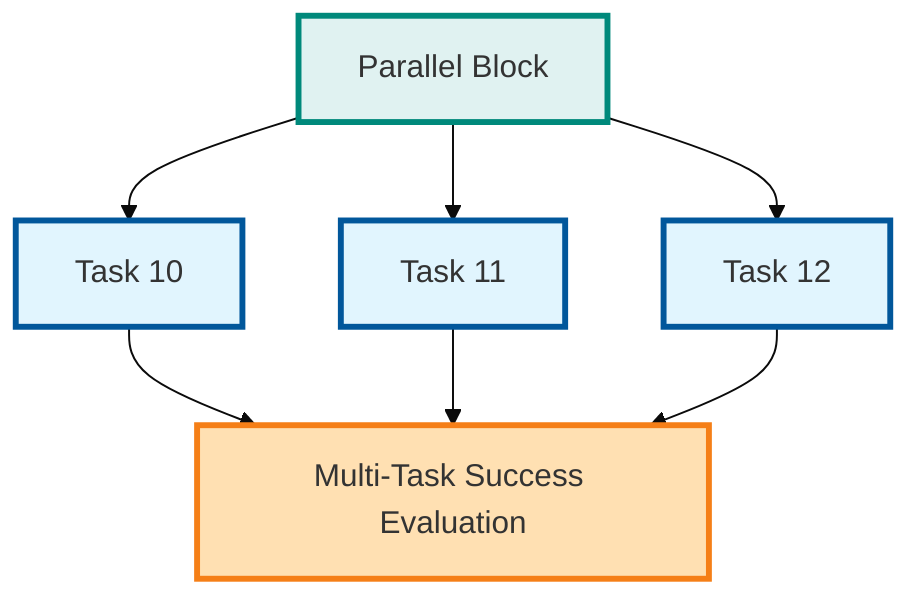
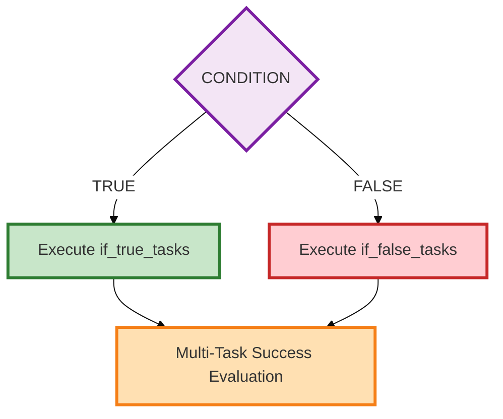
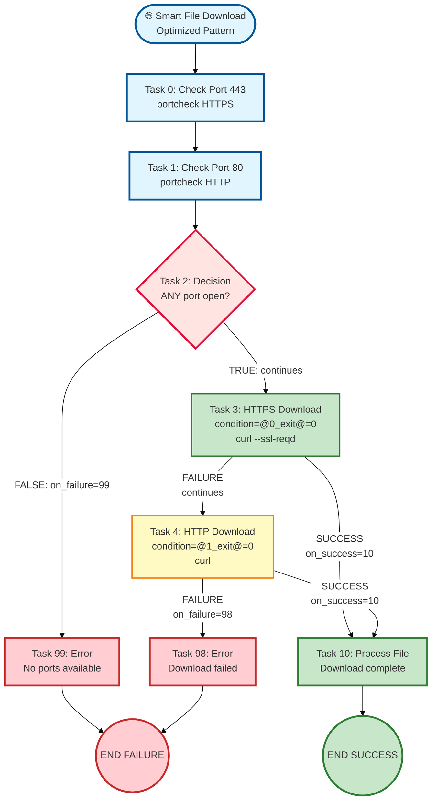

# TASK ExecutoR - TASKER 2.1

[](https://www.gnu.org/licenses/agpl-3.0)
[](COPYRIGHT)
[](LICENSE)

**No-Code Workflow Automation** - Transform complex operations into simple configuration files

## 📜 License & Copyright

**Copyright (C) 2024-2025 Bastelbude and Contributors**

TASKER is licensed under the **GNU Affero General Public License v3.0 (AGPL-3.0)**. This strong copyleft license ensures the software remains free while preventing unauthorized commercial exploitation.

- ✅ **Free to use** internally in your organization
- ✅ **Free to modify** for your needs
- ⚠️ **Network use requires source disclosure** - SaaS/cloud deployments must share source
- ⚠️ **Commercial use must comply** with AGPL-3.0 requirements
- 📝 **Attribution required** - Must credit "TASKER by Bastelbude"

See [LICENSE](LICENSE), [COPYRIGHT](COPYRIGHT), and [NOTICE](NOTICE) files for full details.

## Your First Workflow: Service Health Check

Let's start with a simple example that checks if a service is running and takes action based on the result:


**The simple text configuration:**
```
# health_check.txt - Your first TASKER workflow!
# This example demonstrates basic routing based on success criteria

# Task 0: Check if service is running (simulated with true/false)
task=0
hostname=localhost
command=echo
arguments=Service check: OK
exec=local
# Define success as exit code 0
success=exit_0
# If success (exit code 0), go to task 1
on_success=1
# If failure (exit code not 0), go to task 2
on_failure=2

# Task 1: Log successful status
task=1
hostname=localhost
command=echo
arguments=Service is healthy
exec=local
# STOP here - don't continue to task 2
next=never

# Task 2: Alert about failure (only reached via on_failure=2)
task=2
hostname=localhost
command=echo
arguments=ALERT: Service is down!
exec=local
# After alert, continue to task 3 (default sequential flow)

# Task 3: Try to restart the service
task=3
hostname=localhost
command=echo
arguments=Attempting to restart service...
exec=local
# Workflow ends after restart attempt
```

**Run it:** `tasker -r health_check.txt` ✨

**🎯 What This Example Shows:**
- **`success=exit_0`**: Define success as exit code 0
- **`on_success=1`**: Jump to task 1 if success criteria is met
- **`on_failure=2`**: Jump to task 2 if success criteria is not met
- **`next=never`**: Stop sequential execution (firewall)
- **Default flow**: Task 2 continues to task 3 automatically (no `next` condition)

**🚀 Why TASKER?**
- **Zero Coding Required**: Write workflows in simple text files
- **Smart Decision Making**: Automatic routing based on command results
- **Built-in Intelligence**: Detects success/failure from exit codes, stdout, stderr
- **Enterprise Ready**: Scales from 1 to 1000+ servers effortlessly

---

A sophisticated Python-based task execution system for running commands on remote or local servers with comprehensive flow control, parallel execution capabilities, and enterprise-grade validation.

## Overview

TASKER 2.1 is a next-generation task automation framework that reads task definitions from configuration files and executes them with advanced orchestration capabilities. Built on a modular architecture for maximum maintainability and scalability.

**Key Features:**
- **Multiple Execution Models**: Sequential, parallel, and conditional task execution
- **Multiple Execution Types**: Direct subprocess (`local`), shell execution (`shell`), enterprise tools (`pbrun`, `p7s`, `wwrs`)
- **Advanced Flow Control**: Complex conditions, loops, branching, and error handling
- **Variable System**: Dynamic substitution and data flow between tasks
- **File-Defined Arguments**: Task files can define their own command-line arguments for automation
- **Context-Aware Security**: Different validation rules for shell vs direct execution
- **Enterprise Scaling**: Support for 1-1000+ servers with robust timeout management
- **Professional Logging**: Structured output with debug capabilities and project tracking

---

# PART 1: Getting Started

Get up and running with TASKER quickly - learn the essentials to start automating your workflows.

## Quick Start

### Basic Usage

Execute tasks in a file (dry run mode - doesn't actually execute commands):
```bash
tasker tasks.txt
```

Actually execute the commands:
```bash
tasker -r tasks.txt
```

Execute with project tracking and logging:
```bash
tasker -r -p DEPLOYMENT_2024 deployment_tasks.txt
```

### Your First Task File

Create a simple task file `hello.txt`:
```
# hello.txt - Your first TASKER task file
# Simple sequential execution with local commands

task=0
hostname=localhost
command=echo
arguments=Hello TASKER!
exec=local

task=1
hostname=localhost
command=date
exec=local
```

Run it:
```bash
tasker -r hello.txt
```

That's it! You've just executed your first TASKER workflow.

## Task File Format

TASKER uses a simple key-value format where each task is defined by parameters. Tasks are executed based on their execution model (sequential by default, parallel, or conditional).

### ⚠️ Critical Syntax Rule: Comment Policy for Task Files

**TASKER Comment Policy - Strictly Enforced for Security and Parsing:**

- ✅ **ALLOWED**: Full-line comments starting with `#` at the beginning of lines
- ❌ **FORBIDDEN**: Inline comments after `key=value` pairs
- **Enforcement**: Validation engine detects inline comments and reports security errors
- **Rationale**: Inline comments can cause parsing errors and interfere with security validation

**❌ INCORRECT (Inline Comments):**
```
task=0
hostname=server1
command=deploy
timeout=120                 # This will cause validation errors!
success=exit_0&stdout~ok    # This will also fail!
```

**✅ CORRECT (Separate Comment Lines):**
```
task=0
hostname=server1
command=deploy
# Set timeout to 2 minutes
timeout=120
# Success requires exit 0 and specific output
success=exit_0&stdout~ok
```

### Sequential Execution (Default)

**Example - Simple sequential execution (task by task):**
```
# Simple sequential tasks - execute in order 0, 1, 2, 3
task=0
hostname=localhost
command=echo
arguments=Stopping service
exec=local

task=1
hostname=localhost
command=echo
arguments=Backing up database
exec=local

task=2
hostname=localhost
command=echo
arguments=Deploying application version 1.2.3
exec=local

task=3
hostname=localhost
command=echo
arguments=Starting service
exec=local
```

**Example - Sequential with simple flow control (next parameter):**
```
# Continue to next task only if success criteria is met
task=0
hostname=server1
command=deploy
arguments=--version=1.2.3
# Custom success criteria
success=exit_0&stdout~complete
# Continue ONLY if success criteria met
next=success

task=1
hostname=server1
command=verify_deployment
# This task only runs if task 0 succeeded
```

**Example - Sequential with routing (jumps on success/failure):**
```
# Jump to different tasks based on success/failure
task=0
hostname=localhost
command=echo
arguments=Deployment complete
exec=local
# Custom success criteria
success=exit_0&stdout~complete
# Jump to task 5 on success
on_success=5
# Jump to task 99 on failure
on_failure=99

# Success path
task=5
hostname=localhost
command=echo
arguments=Verifying deployment
exec=local

# Failure path
task=99
hostname=localhost
command=echo
arguments=ALERT: Deployment failed
exec=local
return=1
```

**Parameters:** See [Sequential Execution Parameters](#sequential-execution-parameters-default-mode) table below

### Parallel Execution

**Example - Parallel task with retry:**
```
task=1
# Required
type=parallel
# Required: Task IDs to execute
tasks=100,101,102,103,104
# Limit concurrent execution (default: 8 if not specified)
max_parallel=5
# Retry failed tasks up to 3 times
retry_count=3
# At least 3 must succeed
next=min_success=3
# Jump if condition met
on_success=10
# Jump if condition not met
on_failure=99
```

> **Note**: This is a syntax illustration showing parallel block configuration. For a complete working example with all subtasks defined, see `test_cases/readme_examples/readme_05_parallel_basic.txt`

**Parameters:** See [Parallel Execution Parameters](#parallel-execution-parameters) table below

**Important Parallel Execution Behavior:**
- **CRITICAL:** Individual task routing (`on_success`, `on_failure`, `next`) is **NOT ALLOWED** in subtasks
  - Subtasks cannot have routing parameters - control must return to the parallel block
  - Validation will **FAIL** if subtasks have routing parameters
  - The parallel block aggregates all results for Multi-Task Success Evaluation
- Individual task `success` criteria IS RESPECTED for determining success/retry
- Retry applies to individual tasks within the parallel group

**Subtask ID Range Convention (Recommended):**
- Use distinct ID ranges to clearly separate subtasks from main workflow
- Recommended: Task N subtasks in range `[N*100, (N+1)*100-1]`
- Example: Task 1 subtasks should be 100-199, Task 2 subtasks should be 200-299
- Improves readability and debugging
- Warning generated if convention not followed (use `--skip-subtask-range-validation` to suppress)

### Conditional Execution

**Example - Conditional branching:**
```
task=5
# Required
type=conditional
# Required: Expression to evaluate
condition=@4_stdout@~production
# Execute if TRUE (custom order)
if_true_tasks=200,201,202
# Execute if FALSE (custom order)
if_false_tasks=300,301
# Retry failed tasks
retry_count=2
# All branch tasks must succeed
next=all_success
# Jump if condition met
on_success=10
```

> **Note**: This is a syntax illustration showing conditional block configuration. For a complete working example with all subtasks defined, see `test_cases/readme_examples/readme_06_conditional_basic.txt`

**Parameters:** See [Conditional Execution Parameters](#conditional-execution-parameters) table below

**Important Conditional Execution Behavior:**
- Tasks in branches execute in the exact order listed (e.g., `100,300,150` executes in that order)
- **CRITICAL:** Individual task routing (`on_success`, `on_failure`, `next`) is **NOT ALLOWED** in subtasks
  - Subtasks cannot have routing parameters - control must return to the conditional block
  - Validation will **FAIL** if subtasks have routing parameters
  - Use **Decision Blocks** instead if individual task routing is needed
- Individual task `success` criteria IS RESPECTED for determining success/retry
- Retry applies to individual tasks within the branch, not the condition evaluation

**Subtask ID Range Convention (Recommended):**
- Use distinct ID ranges to clearly separate subtasks from main workflow
- Recommended: Task N subtasks in range `[N*100, (N+1)*100-1]`
- Example: Task 1 subtasks should be 100-199, Task 2 subtasks should be 200-299
- Improves readability and debugging
- Warning generated if convention not followed (use `--skip-subtask-range-validation` to suppress)

### Decision Blocks

**Lightweight conditional routing** - Evaluate conditions without executing commands:

```
task=2
# Required
type=decision
# Condition to evaluate (using success OR failure, not both)
success=@0_exit@=0|@1_exit@=0
# Route if condition is TRUE
on_success=10
# Route if condition is FALSE
on_failure=99
```

**Parameters:** See [Decision Block Parameters](#decision-block-parameters) table below

**Key Decision Block Features:**
- Pure routing logic - no command execution
- Uses familiar `success=` or `failure=` syntax (same as regular tasks)
- Standard flow control with `on_success`, `on_failure`, and `next`
- Lightweight alternative to conditional blocks when you only need branching

**When to Use Conditional vs Decision Blocks:**

| Feature | Conditional Blocks | Decision Blocks |
|---------|-------------------|-----------------|
| Execute multiple tasks | ✅ Yes (if_true_tasks, if_false_tasks) | ❌ No (routing only) |
| Multi-Task Success Evaluation | ✅ Yes (all_success, min_success, etc.) | ❌ No |
| Subtask routing allowed | ❌ **NO** - Validation error | ✅ Yes (this is the whole point) |
| Retry support | ✅ Yes (for branch tasks) | ❌ No |
| Use case | Execute groups of tasks based on condition | Route based on previous task results |
| Example | Deploy to prod/staging environments | Fallback logic (try port 80, else try 443) |

**Example - Port availability check:**
```
# Task 0: Check port 80
task=0
hostname=server1
command=nc
arguments=-zv server1 80
exec=local

# Task 1: Check port 443
task=1
hostname=server1
command=nc
arguments=-zv server1 443
exec=local

# Task 2: Decision - which port to use?
task=2
type=decision
# At least one port must be available
success=@0_exit@=0|@1_exit@=0
on_success=3   # Continue with connection
on_failure=99  # No ports available

# Task 3: Next decision - prefer HTTP or HTTPS?
task=3
type=decision
success=@0_exit@=0  # Is port 80 available?
on_success=10       # Use HTTP
on_failure=20       # Use HTTPS
```

> **Note**: This is a syntax illustration showing decision block logic. For a complete working example with all routing targets defined, see `test_cases/readme_examples/readme_07_decision_block.txt`

### Enhanced Loop Control

Advanced loop control with break conditions:

```bash
task=0
hostname=localhost
command=echo
arguments=Service status: HEALTHY
exec=local
# Execute exactly 10 times (Task 0.1 through 0.10)
loop=10
next=loop
# Break loop when output contains "HEALTHY"
loop_break=stdout~HEALTHY
# Wait 5 seconds between loop iterations
sleep=5
# Custom success criteria
success=exit_0
```

**Important:** Loop functionality requires `next=loop` parameter. Without `next=loop`, the `loop` parameter is ignored and the task executes only once.

**Loop Semantics:** `loop=N` executes exactly N times, displayed as Task X.1, X.2, ... X.N

**Loop vs Retry behavior:** Loops execute ALL iterations regardless of success/failure (unless `loop_break` condition is met). This differs from retry logic (parallel/conditional tasks), which ONLY retries tasks that fail.

**Placeholder Resolution:** When referencing loop task results with `@X_stdout@`, `@X_stderr@`, or `@X_exit@`, you will get the **last iteration's output** only. Previous iterations are not stored.

**Note:** Loop control is only available for sequential tasks. See [Sequential Execution Parameters](#sequential-execution-parameters-default-mode) table below.

### Output Processing Block

The Output Processing Block provides simple yet powerful text extraction capabilities for task outputs. These parameters allow you to split command output by delimiters and extract specific fields, making it easy to parse structured data like CSV, logs, configuration files, and more.

**Supported Delimiter Keywords:**
- `space` - Split by any whitespace character(s) (spaces, tabs, etc.)
- `tab` - Split by tab character(s)
- `newline` - Split by line break(s)
- `colon` - Split by colon character (`:`)
- `semicolon` - Split by semicolon character (`;`)
- `comma` - Split by comma character (`,`)
- `pipe` - Split by pipe character (`|`)
- `semi` - Alias for `semicolon` (backward compatibility)

```
task=0
hostname=localhost
command=printf
arguments=line1\nBETA_VALUE\nline3
# Extract second line using newline delimiter
stdout_split=newline,1
exec=local

task=1
hostname=localhost
command=echo
arguments=user:x:1000:1000:Admin:/home/user:/bin/bash
# Extract username from /etc/passwd style output
stdout_split=colon,0
exec=local

task=2
hostname=localhost
command=echo
arguments=key1=value1 key2=value2 key3=value3
# Get "key2=value2" using space delimiter
stdout_split=space,1
exec=local

task=3
condition=@2_stdout@~key2=value2
hostname=localhost
command=echo
# Uses "key2=value2" from split
arguments=Processing config: @2_stdout@
exec=local
```

**For Complex Processing:**

If you need more sophisticated text processing beyond simple splits, use `exec=local` with command-line tools:

```bash
# Complex Output Processing with awk/sed/perl
# Demonstrates various text processing utilities for output manipulation

# Generate sample output for processing
task=0
hostname=localhost
command=echo
arguments=Status: error detected in module 3/4 with version 1.5
exec=local

# Using awk for complex extraction (extract 3rd and 4th words)
task=1
hostname=localhost
command=/bin/sh
arguments=-c "echo '@0_stdout@' | awk '{print $3 \" \" $4}'"
exec=local

# Using sed for pattern replacement (replace 'error' with 'warning')
task=2
hostname=localhost
command=/bin/sh
arguments=-c "echo '@0_stdout@' | sed 's/error/warning/gi'"
exec=local

# Using perl one-liner for advanced processing (format version numbers)
task=3
hostname=localhost
command=/bin/sh
arguments=-c "echo '@0_stdout@' | perl -pe 's/(\\d+)\\.(\\d+)/v$1.$2/g'"
exec=local

# Using external script simulation for complex logic
task=4
hostname=localhost
command=echo
arguments=Processed output from task 0: @0_stdout@
exec=local
```

**Parameters:** See [Output Processing Parameters](#output-processing-parameters-all-standard-tasks) table below.

**Format:** `stdout_split=DELIMITER,INDEX` or `stderr_split=DELIMITER,INDEX`
- `DELIMITER`: One of the supported keywords above
- `INDEX`: Zero-based index of the element to extract (0 = first, 1 = second, etc.)

**Practical Examples:**

```
# Practical Disk Usage Parsing Example
# Extract disk usage percentage from df output
# Demonstrates stdout_split for field extraction

# Simulate df output with echo (realistic format)
task=0
hostname=localhost
command=echo
arguments=Filesystem      Size  Used Avail Use% Mounted on
exec=local

# Get disk usage line (simulate df -h /data | tail -1)
task=1
hostname=localhost
command=echo
arguments=/dev/sda1       100G   75G   25G  75% /data
exec=local

# Extract and display disk usage line
task=2
hostname=localhost
command=echo
arguments=Disk usage line: @1_stdout@
condition=@1_stdout@~%
exec=local

# Extract 5th column (usage%) using stdout_split
# Note: stdout_split uses zero-based indexing, so index 4 = 5th column
task=3
hostname=localhost
command=echo
arguments=Disk usage percentage: @1_stdout@
condition=@1_stdout@~%
stdout_split=space,4
exec=local

# Parse JSON-like output (original example preserved)
task=10
hostname=api-server
command=curl -s http://api/status
# Get second key-value pair
stdout_split=comma,1
exec=local

# Process error output
task=3
hostname=app-server
command=deploy_application
# Handle stderr with proper error checking
on_failure=99

task=99
hostname=notification
command=send_alert
# Uses split stderr
arguments=First error: @3_stderr@
```

### Complete Parameter Reference

For detailed parameter specifications and valid ranges, see the [Complete Parameter Field Reference](#complete-parameter-field-reference) section below, which includes:
- [Core Task Parameters](#core-task-parameters-all-execution-models) - Common to all tasks
- [Sequential Execution Parameters](#sequential-execution-parameters-default-mode) - Default mode with flow control
- [Parallel Execution Parameters](#parallel-execution-parameters) - Concurrent task execution
- [Conditional Execution Parameters](#conditional-execution-parameters) - Branch-based execution
- [Output Processing Parameters](#output-processing-parameters-all-standard-tasks) - Text extraction utilities

## File-Defined Arguments

**Self-documenting workflows** - Define TASKER command-line arguments directly in your task files, making workflows self-contained and reducing operator error.

### What Are File-Defined Arguments?

File-defined arguments allow you to embed TASKER command-line options directly in task files. Instead of remembering which flags to use when running a workflow, the task file itself declares its requirements.

**Benefits:**
- ✅ **Self-documenting**: Requirements visible directly in task files
- ✅ **Automation-friendly**: No need to remember or manage flags externally
- ✅ **Reduces errors**: Operators can't forget required flags
- ✅ **Version controlled**: Arguments tracked alongside workflow logic
- ✅ **CLI override**: Command-line arguments can still override file settings

### Basic Example

```bash
# File-defined arguments (must be at the very top)
--auto-recovery
--skip-host-validation
--log-level=DEBUG

# Global variables come after file-defined arguments
ENVIRONMENT=production
TARGET_HOST=localhost

# Tasks come last
task=0
hostname=@TARGET_HOST@
command=echo
arguments=Deploying to @ENVIRONMENT@ environment on @TARGET_HOST@
exec=local
```

**Execute with:**
```bash
# File-defined arguments are automatically applied
python3 tasker.py workflow.txt -r

# CLI args can override file args
python3 tasker.py workflow.txt -r --log-level=INFO  # Overrides DEBUG
```

### How File-Defined Arguments Work

**1. Argument Placement Rules**

File-defined arguments **MUST** appear at the **very beginning** of the task file:

```bash
# ✅ CORRECT ORDER
# File-defined arguments (first!)
--auto-recovery
--skip-host-validation

# Global variables (second)
ENVIRONMENT=production

# Tasks (last)
task=0
...
```

```bash
# ❌ WRONG ORDER - Arguments will be IGNORED
# Global variables appear first
ENVIRONMENT=production

# File-defined arguments (TOO LATE - will be ignored!)
--auto-recovery
--skip-host-validation

# Tasks
task=0
...
```

**Parser stopping rule**: The parser stops reading file-defined arguments at the **first line containing `=` that doesn't start with `-` or `--`**.

**2. Valid Argument Syntax**

File-defined arguments use **identical syntax** to command-line arguments:

```bash
# ✅ CORRECT - Boolean flags
--auto-recovery
--skip-host-validation
--run
-r
-d

# ✅ CORRECT - Value options
--log-level=DEBUG
--timeout=60
--start-from=5

# ❌ WRONG - Single dash with long names (invalid argparse syntax)
-auto-recovery      # Must be --auto-recovery
-skip-validation    # Must be --skip-validation

# ❌ WRONG - Spaces around equals
--log-level = DEBUG  # Must be --log-level=DEBUG
```

**3. Argument Precedence**

When both file and CLI arguments are present:

| Argument Type | Behavior | Example |
|--------------|----------|---------|
| **Boolean flags** | File OR CLI (additive) | File: `--skip-host-validation` + CLI: `-r` → Both active |
| **Value options** | CLI overrides file | File: `--log-level=DEBUG` + CLI: `--log-level=INFO` → INFO wins |
| **task_file** | Always from CLI | File args cannot override task file path |

```bash
# workflow.txt contains:
# --auto-recovery
# --log-level=DEBUG
# --timeout=30

# Command line overrides
python3 tasker.py workflow.txt -r --log-level=INFO --timeout=60

# Effective arguments:
# --auto-recovery    (from file)
# --run              (from CLI)
# --log-level=INFO   (CLI overrides file)
# --timeout=60       (CLI overrides file)
```

### Where Arguments Are Ignored

**Parser stops at first non-argument line:**

**Case 1: Arguments after global variables**
```bash
# Global variables appear first - parser stops here
ENVIRONMENT=production

# ❌ IGNORED - These arguments come too late
--auto-recovery
--skip-host-validation

task=0
...
```

**Case 2: Arguments mid-file**
```bash
# Proper file-defined arguments
--auto-recovery

# Global variables
ENVIRONMENT=production

# Tasks start
task=0
...

# ❌ IGNORED - Parser already stopped at task=0
--skip-host-validation

task=1
...
```

**Case 3: Arguments after task definitions**
```bash
# Tasks come first
task=0
hostname=server1
command=deploy

# ❌ IGNORED - Parser stopped at task=0
--auto-recovery
--skip-host-validation
```

**Why?** The parser stops reading file-defined arguments as soon as it encounters a line with `=` that doesn't start with `-` or `--`. This prevents task parameters from being misinterpreted as arguments.

### Security Controls

**CLI-Only Flags (Hard Blocked)**

These flags are **forbidden** in file-defined arguments and will cause immediate failure:

```bash
# ❌ BLOCKED - Exit code 20
--help
--version
-h

# Error message:
# ERROR: File-defined argument '--help' is not allowed (CLI-only flag)
```

**Security-Sensitive Flags (Warning)**

These flags generate warnings but are allowed:

```bash
# ⚠️ WARNING - Allowed but warned
--skip-security-validation
--skip-validation
--fire-and-forget

# Warning message:
# WARNING: File defines security-sensitive flag: --skip-security-validation
#          This flag reduces security checks - ensure this is intentional
```

### Complete Syntax Reference

**Supported in File-Defined Arguments:**

| Argument | Type | Example |
|----------|------|---------|
| `--run` / `-r` | Boolean | `--run` or `-r` |
| `--debug` / `-d` | Boolean | `--debug` or `-d` |
| `--log-level=LEVEL` | Value | `--log-level=DEBUG` |
| `--timeout=N` | Value | `--timeout=60` |
| `--start-from=N` | Value | `--start-from=5` |
| `--auto-recovery` | Boolean | `--auto-recovery` |
| `--skip-host-validation` | Boolean | `--skip-host-validation` |
| `--skip-task-validation` | Boolean | `--skip-task-validation` |
| `--skip-command-validation` | Boolean | `--skip-command-validation` |
| `--skip-security-validation` | Boolean | `--skip-security-validation` (warns) |
| `--strict-env-validation` | Boolean | `--strict-env-validation` |
| `--skip-validation` | Boolean | `--skip-validation` (warns) |
| `--fire-and-forget` | Boolean | `--fire-and-forget` (warns) |
| `--show-plan` | Boolean | `--show-plan` |
| `--validate-only` | Boolean | `--validate-only` |
| `--no-task-backup` | Boolean | `--no-task-backup` |

**NOT Supported (CLI Only):**

| Argument | Reason |
|----------|--------|
| `--help` / `-h` | Must be interactive |
| `--version` | Must be interactive |
| `task_file` | Always from CLI |

### Debugging File-Defined Arguments

Use `--show-effective-args` to see which arguments are active:

```bash
python3 tasker.py workflow.txt --show-effective-args
```

**Output:**
```
Effective TASKER arguments (file + CLI merged):
============================================================
File-defined arguments from workflow.txt:
  --auto-recovery
  --skip-host-validation
  --log-level=DEBUG

Final effective arguments:
  --auto-recovery: True
  --log-level: DEBUG
  --run: False
  --skip-host-validation: True
```

### Common Patterns

**Pattern 1: Recovery Workflows**
```bash
# Workflow with automatic recovery enabled
--auto-recovery
--skip-host-validation

# Tasks
task=0
...
```

**Pattern 2: Development Testing**
```bash
# Development workflow with debug logging
--log-level=DEBUG
--skip-host-validation
--no-task-backup

# Tasks for testing
task=0
...
```

**Pattern 3: Production Deployment**
```bash
# Production deployment with resume capability
--auto-recovery
--log-level=INFO
--show-plan

# Global variables
ENVIRONMENT=production

# Deployment tasks
task=0
...
```

**Pattern 4: Validation-Only Workflows**
```bash
# Workflow that only validates syntax
--validate-only
--log-level=DEBUG

# Tasks to validate
task=0
...
```

### Best Practices

**1. Keep arguments at the top:**
```bash
# ✅ GOOD
# File-defined arguments (line 1)
--auto-recovery
--skip-host-validation

# Global variables (after arguments)
ENVIRONMENT=production

# Tasks (last)
task=0
...
```

**2. Comment your argument choices:**
```bash
# ✅ GOOD - Explain why flags are needed
# File-defined arguments

# Auto-recovery: Long-running deployment workflow
--auto-recovery

# Skip host validation: Using localhost for local testing
--skip-host-validation

# Debug logging: Detailed output for troubleshooting
--log-level=DEBUG
```

**3. Don't duplicate CLI and file args:**
```bash
# ❌ BAD - Redundant
# workflow.txt contains --auto-recovery
python3 tasker.py workflow.txt -r --auto-recovery  # Redundant

# ✅ GOOD - File defines baseline, CLI runs it
# workflow.txt contains --auto-recovery
python3 tasker.py workflow.txt -r  # Simpler
```

**4. Use file args for workflow requirements:**
```bash
# ✅ GOOD - Workflow needs these to function correctly
--auto-recovery        # Required for recovery
--skip-host-validation # Required for localhost execution
```

**5. Use CLI args for runtime decisions:**
```bash
# ✅ GOOD - Override at runtime
python3 tasker.py workflow.txt -r --log-level=DEBUG  # Debug run
python3 tasker.py workflow.txt -r --log-level=INFO   # Normal run
```

## Global Variables

Define reusable variables at the top of your task file for configuration management and environment abstraction.

**Important:** TASKER automatically treats ANY key=value pair that is not a recognized task parameter as a global variable. This means you can define custom variables anywhere in the file, though it's best practice to place them at the top for clarity.

### How Global Variables Work

1. **Automatic Creation**: Any `KEY=VALUE` line that doesn't match a known task parameter becomes a global variable
2. **Case Sensitive**: Variable names are case-sensitive (`Environment` ≠ `ENVIRONMENT`)
3. **No Declaration Needed**: Simply write `MYVAR=value` and it's available as `@MYVAR@`
4. **Scope**: Global variables are read-only and available throughout the entire task file

### ✅ Environment Variable Support

**TASKER automatically expands environment variables** like `$HOME`, `$USER`, `$PWD`, etc. in:
- ✅ **Task arguments field** - Expanded at execution time
- ✅ **Global variable definitions** - Expanded at parse time (NEW!)

**✅ Environment variables in task arguments:**
```
task=0
hostname=localhost
command=rm
arguments=-f $HOME/.my_file  # $HOME automatically expands to /home/username
exec=local

task=1
hostname=localhost
command=echo
arguments=Current user is $USER in directory $PWD
exec=local
```

**✅ NEW: Environment variables in global variable definitions:**
```bash
# Global variables can now expand environment variables
MY_USER=$USER
MY_HOME=$HOME
DEPLOYMENT_PATH=/var/deployments/$USER
LOG_FILE=$HOME/logs/tasker.log

task=0
hostname=localhost
command=echo
arguments=Running as @MY_USER@ from @MY_HOME@
exec=local
```

**Supported environment variables:**
- `$HOME` - User's home directory
- `$USER` - Current username
- `$PWD` - Current working directory
- `$PATH` - System PATH variable
- `$HOSTNAME` - System hostname
- Any other environment variables available in the system

**Expansion timing:**
- **Global variables**: Expanded **once** at parse time (start of execution)
- **Arguments field**: Expanded at **task execution** time (allows dynamic values like `$PWD` after `cd` commands)

### Basic Global Variables

```
# Global variable definitions (at top of task file)
ENVIRONMENT=production
SERVICE_NAME=web-api
VERSION=v2.1.0
# Any name works - automatically becomes a global variable
CUSTOM_PATH=/opt/myapp

# Tasks using both global variables and environment variables
task=0
hostname=@ENVIRONMENT@-server
command=deploy
arguments=@SERVICE_NAME@ @VERSION@ --user=$USER --home=$HOME
```

### When to Use Global Variables

**Primary Rule: Use a global variable when the same value appears in multiple tasks.**

This makes your task files work like templates - update one variable, all tasks using it are updated automatically.

**Common Use Cases:**

**1. Template-Based Task Files:**
```
# Define once, use many times
TARGET_HOST=prod-db-01
PACKAGE_NAME=nginx
SERVICE_NAME=nginx

# All these tasks now use the same values
task=0
hostname=@TARGET_HOST@
command=check_package
arguments=@PACKAGE_NAME@

task=1
hostname=@TARGET_HOST@
command=stop_service
arguments=@SERVICE_NAME@

task=2
hostname=@TARGET_HOST@
command=update_package
arguments=@PACKAGE_NAME@

task=3
hostname=@TARGET_HOST@
command=start_service
arguments=@SERVICE_NAME@

# To run on different host/package: just change the global variables!
```

**2. Environment-Specific Deployments:**
```
# Switch entire workflow by changing one variable
# Change to 'production' for prod deployment
ENVIRONMENT=staging
APP_VERSION=v2.3.1

task=0
hostname=@ENVIRONMENT@-web-01
command=deploy
arguments=--version=@APP_VERSION@

task=1
hostname=@ENVIRONMENT@-web-02
command=deploy
arguments=--version=@APP_VERSION@

task=2
hostname=@ENVIRONMENT@-db-01
command=migrate_database
arguments=--version=@APP_VERSION@
```

**3. Repeated Command Arguments:**
```
# Same options used across multiple tasks
BACKUP_OPTIONS=--compress --encrypt --verify
BACKUP_PATH=/backup/2024

task=0
hostname=server1
command=backup_database
arguments=@BACKUP_OPTIONS@ --dest=@BACKUP_PATH@/db

task=1
hostname=server2
command=backup_files
arguments=@BACKUP_OPTIONS@ --dest=@BACKUP_PATH@/files

task=2
hostname=server3
command=backup_configs
arguments=@BACKUP_OPTIONS@ --dest=@BACKUP_PATH@/config
```

### Global Variable Limitations

**Read-Only During Execution**: Global variables cannot be modified by tasks during runtime.

**Alternative for Dynamic Data**: Use task output variables (`@TASK_ID_stdout@`) for values that change during execution:

```
# Get dynamic value from task
task=0
hostname=config-server
command=get_database_host
exec=local

# Use task output in subsequent tasks
task=1
# Use dynamic hostname from task 0
hostname=@0_stdout@
command=connect_database
```

### Global Variable Validation Rules

TASKER validates global variable names to prevent conflicts with internal keywords and task fields. Understanding these rules helps you choose safe, descriptive variable names.

#### ❌ Reserved Keywords (Cannot Be Used)

**1. The `task` Keyword**
```
# ❌ BLOCKED - Causes parser crash
task=my_custom_value

# ✅ USE INSTEAD
TASK_NAME=my_custom_value
MY_TASK=my_custom_value
```
**Why blocked:** `task` is reserved for task ID definitions and must be followed by an integer. Using it as a global variable causes parser crashes with `ValueError: invalid literal for int()`.

**2. Task Field Names**
```
# ❌ BLOCKED - Silently ignored, causes confusion
hostname=myvalue
command=myvalue
arguments=myvalue
success=myvalue
condition=myvalue
exec=myvalue
timeout=myvalue
next=myvalue
on_success=myvalue
on_failure=myvalue
loop=myvalue
sleep=myvalue
return=myvalue

# ✅ USE INSTEAD - Add prefix or make uppercase
MY_HOSTNAME=myvalue
TARGET_HOSTNAME=myvalue
HOSTNAME=myvalue
COMMAND=myvalue
```
**Why blocked:** These names are filtered out during parsing because they're task field names. Variables appear to be defined but report "undefined variable" errors when referenced - extremely confusing behavior.

**Validation Error Example:**
```
# This triggers validation error
hostname=web-server.com

# Error message:
Line 5: Cannot use task field name 'hostname' as a global variable name.
Task field names are reserved. Use a different name like 'HOSTNAME' or 'MY_HOSTNAME'.
```

#### ✅ Safe Names (Can Be Used!)

**Important Discovery:** Names like `stdout`, `stderr`, `exit`, `exit_0`, `exit_1` are **100% SAFE** to use as global variable names!

```
# ✅ PERFECTLY SAFE - No conflicts!
stdout=my_custom_stdout_value
stderr=my_custom_stderr_value
exit=my_custom_exit_value
exit_0=success_value
exit_1=failure_value

# Task 0: Generate real task output
task=0
hostname=localhost
command=echo
arguments=Task output here
exec=local

# Task 1: Use BOTH global variable AND task result variable
task=1
hostname=localhost
command=echo
# @stdout@ = global variable (my_custom_stdout_value)
# @0_stdout@ = task 0 result (Task output here)
arguments=Global: @stdout@, Task Result: @0_stdout@
exec=local
```

**Why these are safe:** TASKER uses different regex patterns for each:
- **Global variables**: `@([a-zA-Z_][a-zA-Z0-9_]*)@` matches `@stdout@`, `@exit@`, etc.
- **Task results**: `@(\d+)_(stdout|stderr|success|exit)@` matches `@0_stdout@`, `@1_exit@`, etc.

The patterns are mutually exclusive - no conflict possible!

#### Variable Expansion Depth

TASKER supports **nested variable expansion** (variable chaining) with a maximum depth of **10 iterations** to prevent infinite loops in circular references.

**How Variable Chaining Works:**
```
# Variables can reference other variables
BASE_PATH=/opt/myapp
CONFIG_PATH=@BASE_PATH@/config
LOG_PATH=@BASE_PATH@/logs
FULL_CONFIG=@CONFIG_PATH@/app.conf

# Resolves to:
# CONFIG_PATH = /opt/myapp/config
# LOG_PATH = /opt/myapp/logs
# FULL_CONFIG = /opt/myapp/config/app.conf
```

**Circular Reference Handling:**
```
# Self-referencing variable (intentional or accidental)
VAR_A=prefix_@VAR_A@_suffix

# After 10 expansions, stops automatically:
# Result: prefix_prefix_prefix_prefix_prefix_prefix_prefix_prefix_prefix_prefix_prefix_@VAR_A@_suffix_suffix_suffix_suffix_suffix_suffix_suffix_suffix_suffix_suffix_suffix
# (11 copies of prefix/suffix = original + 10 expansions)
```

**Technical Details:**
- **Constant**: `MAX_VARIABLE_EXPANSION_DEPTH = 10`
- **Location**: `tasker/core/constants.py`
- **Usage**: Used consistently in both validation phase (`task_validator.py`) and runtime execution (`condition_evaluator.py`)
- **Benefit**: Prevents infinite loops while allowing reasonable chaining depth

**Best Practices:**
- Keep variable chains under 3-4 levels deep for maintainability
- Avoid circular references (TASKER handles them safely, but they indicate a design issue)
- Use descriptive names to make variable relationships clear

#### Variable Naming Best Practices

**✅ Recommended Naming Patterns:**
```
# 1. ALL_CAPS for true constants
ENVIRONMENT=production
VERSION=v2.1.0
MAX_RETRIES=3

# 2. PascalCase for configuration values
DatabaseHost=prod-db-01
ServiceName=web-api
BackupPath=/backup/data

# 3. Prefixed names for clarity
TARGET_HOST=app-server
SOURCE_DIR=/src/app
DEST_DIR=/opt/app

# 4. Descriptive names that indicate purpose
DEPLOYMENT_ENV=staging
API_ENDPOINT=https://api.example.com
RETRY_DELAY=5
```

**❌ Names to Avoid:**
```
# Too generic - unclear what they represent
VALUE=something
DATA=mydata
TEMP=tmpvalue

# Looks like task field - confusing
next=5
success=true
command=mycommand

# Single letter - not descriptive
X=value
Y=value
```

## Memory-Efficient Output Streaming

TASKER 2.1 includes an advanced memory-efficient output streaming system that prevents Out-of-Memory (OOM) errors when processing commands that generate large amounts of output (1GB+). This system automatically manages memory usage and seamlessly handles outputs of any size.

### The Problem with Large Outputs

Before the streaming system, TASKER would load entire command outputs into memory, causing system crashes with large outputs:

```bash
# This would crash TASKER 1.x with OOM errors
task=0
hostname=server1
command=find /data -type f -exec ls -la {} \;
# Could generate 1GB+ of output

task=1
hostname=server2
command=mysqldump --all-databases --single-transaction
# Database dumps can be several GB

task=2
hostname=log-server
command=cat /var/log/application.log
# Log files can grow to hundreds of MB
```

### How Memory-Efficient Streaming Works

The streaming system implements a sophisticated three-tier approach:

#### Tier 1: In-Memory Buffering (Up to 10MB)
For small to medium outputs, everything stays in memory for maximum performance:

```text
└── Memory Buffer (1MB chunks)
    ├── Fast access for small outputs
    ├── Zero disk I/O overhead
    └── Instant variable resolution
```

#### Tier 2: Temporary File Streaming (10MB+)
When outputs exceed 10MB, TASKER automatically streams to temporary files:

```text
└── System Temp Directory (/tmp)
    ├── tasker_stdout_abc123 (stdout content)
    ├── tasker_stderr_def456 (stderr content)
    └── Automatic cleanup after task completion
```

#### Tier 3: Memory Protection (100MB+ per task)
Absolute limits prevent system overload:

```text
└── Hard Memory Limits
    ├── 100MB maximum per individual task
    ├── Automatic temp file fallback
    └── System resource protection
```

### Automatic Operation

The streaming system operates completely transparently - no configuration required:

```bash
# These all work identically regardless of output size
task=0
hostname=web-server
command=generate_small_report
# Output: 50KB - stays in memory

task=1
hostname=database-server
command=generate_large_export
# Output: 50MB - automatically streams to temp files

task=2
hostname=log-server
command=analyze_massive_dataset
# Output: 500MB - streams with memory protection
```

### Technical Implementation Details

#### Memory Thresholds
- **In-Memory Limit**: 10MB per task (hardcoded for optimal performance)
- **Buffer Size**: 1MB chunks for optimal I/O performance
- **Maximum Memory**: 100MB absolute limit per task
- **Temp File Location**: System temp directory (`/tmp` on Linux)

#### Streaming Process
1. **Real-time Processing**: Output is processed as it's generated
2. **Threshold Detection**: Automatically switches to temp files at 10MB
3. **Memory Management**: Constant memory usage regardless of output size
4. **Resource Cleanup**: Temporary files automatically deleted after task completion

#### File Naming Convention
```text
/tmp/tasker_stdout_XXXXXX  # Standard output temp file
/tmp/tasker_stderr_XXXXXX  # Standard error temp file
```
Where `XXXXXX` is a random 6-character suffix for uniqueness.

### Performance Characteristics

#### Small Outputs (< 10MB)
- **Memory Usage**: Actual output size
- **Processing Time**: Near-instant
- **Disk I/O**: None
- **Best for**: Configuration commands, status checks, small reports

#### Large Outputs (10MB - 100MB)
- **Memory Usage**: ~10MB constant
- **Processing Time**: <1 second processing overhead
- **Disk I/O**: Sequential write to temp files
- **Best for**: Database exports, large file operations, comprehensive logs

#### Massive Outputs (100MB+)
- **Memory Usage**: ~10MB constant (protected)
- **Processing Time**: Minimal streaming overhead
- **Disk I/O**: Efficient streaming with automatic cleanup
- **Best for**: Full system backups, massive dataset processing, extensive logging

### Real-World Examples

#### Database Operations
```bash
# Large database export - streams automatically
task=0
hostname=db-server
command=pg_dump
arguments=--verbose --format=plain --no-owner production_db
timeout=1800
exec=pbrun
```

#### Log Analysis
```bash
# Process massive log files without memory issues
task=1
hostname=log-server
command=grep "ERROR" /var/log/application.log
# Processes multi-GB log files efficiently
exec=pbrun

task=2
hostname=analysis-server
command=analyze_errors
arguments=@1_stdout@
# Uses extracted error data
exec=local
```

#### System Monitoring
```bash
# Generate comprehensive system reports
task=0
hostname=monitoring-server
command=sar -A
arguments=-f /var/log/sa/sa01
# Processes complete system activity reports
exec=pbrun

task=1
hostname=report-server
command=generate_performance_report
arguments=--data=@0_stdout@
# Creates reports from large monitoring data
exec=local
```

### Monitoring and Debugging

#### Debug Information
Enable debug logging to see streaming behavior:

```bash
tasker -r --log-level=DEBUG large_output_workflow.txt
```

Debug output shows:
```text
[02Oct25 15:47:21] DEBUG: Task 0: Used temp files for large output (stdout: 20840000 bytes, stderr: 0 bytes)
```

#### Memory Usage Awareness
Tasks that trigger streaming are automatically logged:

```text
[02Oct25 15:47:20] Task 0: Executing [local]: python3 -c large_data_generation.py
[02Oct25 15:47:21] Task 0: Exit code: 0
[02Oct25 15:47:21] Task 0: STDOUT: Large dataset line 000000 with data: XXX... (20839999 chars total)
```

### System Compatibility

#### Python Version Support
- **Python 3.6.8+**: Full compatibility with legacy systems
- **Cross-platform**: Linux, macOS, Windows support
- **Memory Management**: Uses standard Python tempfile module

#### Resource Requirements
- **Minimum Memory**: 50MB free RAM for streaming operations
- **Temp Space**: Sufficient disk space in `/tmp` for largest expected output
- **File Descriptors**: Standard subprocess file descriptor usage

### Benefits for Enterprise Operations

#### Reliability
- **No OOM Crashes**: System remains stable with any output size
- **Predictable Memory Usage**: Constant memory footprint prevents resource exhaustion
- **Automatic Recovery**: Graceful handling of unexpected large outputs

#### Performance
- **Efficient Processing**: Minimal overhead for small outputs
- **Scalable Architecture**: Handles outputs from KB to GB range
- **Resource Optimization**: Uses memory efficiently across all scenarios

#### Operational Excellence
- **Transparent Operation**: No configuration changes required
- **Backward Compatibility**: All existing workflows continue working
- **Diagnostic Support**: Clear logging of memory-efficient operations

### Migration and Adoption

#### Zero Configuration Required
Existing workflows automatically benefit from streaming:

```bash
# No changes needed - automatically enhanced
task=0
hostname=backup-server
command=tar -czf - /data | split -b 100M
# Now handles multi-GB backup operations safely
```

#### Gradual Enhancement
Teams can gradually adopt larger-scale operations:

```bash
# Phase 1: Test with medium outputs (10-50MB)
task=0
hostname=test-server
command=generate_medium_dataset

# Phase 2: Scale to large outputs (50-200MB)
task=1
hostname=test-server
command=generate_large_dataset

# Phase 3: Production massive outputs (200MB+)
task=2
hostname=prod-server
command=full_system_backup
```

### Troubleshooting Large Output Issues

#### Insufficient Temp Space
```bash
# Check available temp space
df -h /tmp

# Clean temp directory if needed
sudo find /tmp -name "tasker_*" -mtime +1 -delete
```

#### Memory Warnings
```bash
# Monitor memory usage during execution
tasker -r --log-level=DEBUG memory_intensive_workflow.txt

# Look for temp file usage messages:
# "Task X: Used temp files for large output (stdout: N bytes, stderr: M bytes)"
```

#### Performance Optimization
```bash
# For very large outputs, consider pre-processing
task=0
hostname=server1
command=large_data_command | head -1000
# Limit output size at source when possible

task=1
hostname=server2
command=large_data_command | tail -1
# Extract only needed data
```

## Basic Flow Control

Control when and how tasks execute using conditions and flow control parameters.

### Task Skipping with Conditions

### Task-Level Conditional Execution

Use `condition` parameter on **regular tasks** to skip individual tasks when conditions aren't met:

```bash
# Task 0: Check service status
task=0
hostname=localhost
command=echo
arguments=service_running
exec=local

# Task 1: Restart service (only if check succeeded)
task=1
hostname=localhost
# Skip this task if service check failed
condition=@0_exit@=0
command=echo
arguments=Restarting service
exec=local

# Task 2: Send alert (only if check failed)
task=2
hostname=localhost
# Skip this task if service check succeeded
condition=@0_exit@!=0
command=echo
arguments=Service check failed - sending alert
exec=local
```

**How Task-Level Conditions Work:**
- If `condition` evaluates to **FALSE** → task is **skipped**, execution continues to next sequential task
- If `condition` evaluates to **TRUE** → task executes normally
- Skipped tasks store `exit_code=-1` and `stderr='Task skipped due to condition'`
- Can be combined with `on_success`, `on_failure`, and routing parameters

**Important Distinctions:**

| Mechanism | Type | Purpose | Routing Allowed |
|-----------|------|---------|-----------------|
| **Task Condition** | Regular task parameter | Skip individual tasks | ✅ Yes |
| **Conditional Block** | `type=conditional` | Execute task groups | ❌ No (subtasks) |
| **Decision Block** | `type=decision` | Pure routing logic | ✅ Yes (the purpose) |

**When to Use Task Conditions:**
- ✅ Skip individual tasks based on previous results
- ✅ Simple sequential workflows with conditional steps
- ✅ When you need both execution and routing on same task

**When NOT to Use Task Conditions:**
- ❌ Pure routing logic → Use **Decision Blocks** instead (clearer intent)
- ❌ Executing groups of tasks → Use **Conditional Blocks** instead
- ❌ Complex branching → Use **Decision Blocks** for better maintainability

**Note:** `condition` determines whether a task runs or is skipped. For controlling workflow flow (stop/continue/jump), use `next`, `on_success`, and `on_failure`.

### Exit Code Conditions

Exit codes are numeric values (0-255) returned by commands. **Exit code 0 means success**, non-zero indicates failure.

**Common flow control with exit codes:**
- `next=exit_0`: Continue only if command succeeded
- `next=exit_1`: Continue only if command failed with code 1
- `next=exit_127`: Continue only if command not found

**Using `next` for flow control based on exit codes:**
```bash
# Task 0: Health check
task=0
hostname=localhost
command=echo
arguments=healthy
exec=local
# Define success as exit code 0
success=exit_0
# Jump to task 1 if health check passed
on_success=1
# Jump to task 2 if health check failed
on_failure=2

# Task 1: Success notification
task=1
hostname=localhost
command=echo
arguments=API is healthy
exec=local
# Stop here - don't continue to task 2
next=never

# Task 2: Failure notification
task=2
hostname=localhost
command=echo
arguments=API health check failed
exec=local
```

**Using `condition` to skip tasks based on previous exit codes:**

```bash
# Task 0: API health check
task=0
hostname=localhost
command=echo
arguments=healthy
exec=local

# Task 1: Deploy if healthy
task=1
# Skip this task if health check failed
condition=@0_exit@=0
hostname=localhost
command=echo
arguments=Deploying new version
exec=local

# Task 2: Send alert if unhealthy
task=2
# Skip this task if health check succeeded
condition=@0_exit@!=0
hostname=localhost
command=echo
arguments=Sending failure alert
exec=local
```

### Output Pattern Matching

Use task output for conditional execution and flow control:

**Flow Control with Output Patterns (using `next`):**
```
# Task 0: Detect environment
task=0
hostname=localhost
command=echo
arguments=production
exec=local
# Define success as output containing "production"
success=stdout~production
# Jump to production tasks if success
on_success=10
# Jump to non-production tasks if no success
on_failure=20

# Task 10: Production deployment
task=10
hostname=localhost
command=echo
arguments=Deploying to production
exec=local
# Stop here - don't fall through to task 20
next=never

# Task 20: Development deployment
task=20
hostname=localhost
command=echo
arguments=Deploying to development
exec=local
```

**Selective Task Execution (using `condition`):**

```bash
# Task 0: Detect environment
task=0
hostname=localhost
command=echo
arguments=staging
exec=local

# Task 1: Production deployment
task=1
# Skip unless output contains "production"
condition=@0_stdout@~production
hostname=localhost
command=echo
arguments=Deploying to production
exec=local

# Task 2: Development deployment
task=2
# Skip unless output contains "development"
condition=@0_stdout@~development
hostname=localhost
command=echo
arguments=Deploying to development
exec=local

# Task 3: Staging deployment
task=3
# Skip unless output contains "staging"
condition=@0_stdout@~staging
hostname=localhost
command=echo
arguments=Deploying to staging
exec=local
```

### Success Criteria

Define custom success conditions beyond just exit codes.

**🎉 NEW: Case-Insensitive Support (v2.1)**
TASKER now supports case-insensitive conditions! Use uppercase, lowercase, or mixed case as you prefer:
- ✅ `success=stdout~complete` (lowercase)
- ✅ `success=STDOUT~COMPLETE` (uppercase)
- ✅ `success=StdOut~Complete` (mixed case)
- ✅ `@0_STDOUT@`, `@0_EXIT@`, `@0_SUCCESS@` (uppercase placeholders)

All work identically! This applies to:
- `stdout`, `stderr`, `exit`, `success` keywords
- Variable placeholders like `@task_stdout@`
- All condition contexts: `success=`, `condition=`, `failure=`

**Define custom success conditions:**

```
task=0
hostname=backup-server
command=backup_database
# Must exit 0 AND output contain "backup_complete"
success=exit_0&stdout~backup_complete
# If success criteria met, go to task 1
on_success=1
# If success criteria not met, go to task 99
on_failure=99

task=1
hostname=notification
command=send_success_alert
arguments=Backup completed successfully
# Stop here
next=never

task=99
hostname=notification
command=send_failure_alert
arguments=Backup failed or incomplete
```

### Sequential Execution Flow with Success Criteria

When you use `next=success`, it simply evaluates to whatever the task's success criteria evaluates to:

- If `success` is defined: Uses that custom criteria
- If `success` is not defined: Defaults to `exit_0`
- Result: Continue if success=true, stop if success=false

**Example - Custom Success with Flow Control:**
```
# Task 0: Database backup
task=0
hostname=localhost
command=echo
arguments=Backup complete: 100% finished
exec=local
# Must complete AND show 100%
success=exit_0&stdout~100%
# Continue ONLY if success criteria met
next=success

# Task 1: Backup success notification
task=1
hostname=localhost
command=echo
arguments=Backup notification sent
exec=local
```

**Example - Using on_failure without next:**

```bash
# Task 0: Critical operation
task=0
hostname=localhost
command=echo
arguments=Operation completed successfully
exec=local
# Success: exit 0 AND no errors in stderr
success=exit_0&stderr!~error
# Continue to task 1 if success (default behavior)
# If success criteria not met, jump to task 99
on_failure=99

# Task 1: Continue workflow
task=1
hostname=localhost
command=echo
arguments=Continuing workflow after successful operation
exec=local

# Task 99: Failure alert
task=99
hostname=localhost
command=echo
arguments=Critical operation failed - sending alert
exec=local
```

**Important Notes:**
- **CRITICAL**: `next` and `on_success/on_failure` are mutually exclusive for sequential tasks
- Use EITHER `next` for conditional continuation OR `on_success/on_failure` for routing
- Without `next`, tasks continue to next sequential task by default
- `success` parameter defines criteria, `on_success/on_failure` route based on that criteria
- Default behavior (no routing parameters): Continue to next sequential task

### Failure Criteria (Inverse Success)

The `failure=` parameter provides an **inverse alternative** to `success=` for simpler workflow definitions when most exit codes represent success.

**Instead of listing all success codes:**
```
# Complex: List all success codes
success=exit_0,exit_2,exit_3,exit_4,exit_5
```

**Use the simpler inverse approach:**
```
# Simple: List only failure code(s)
failure=exit_1
```

**How it works:**
1. Task is assumed to succeed by default
2. Failure condition is evaluated
3. If failure condition is TRUE → task failed
4. If failure condition is FALSE → task succeeded

**Examples:**

Single failure code:
```bash
task=1
hostname=deployment-server
command=deploy_application
# Fail ONLY on exit code 1 (permission denied)
# All other exit codes (0, 2, 3, etc.) = success
failure=exit_1
```

Multiple failure codes:
```bash
task=1
hostname=database-server
command=db_migration
# Fail on exit codes 1, 2, or 127
failure=exit_1|exit_2|exit_127
```

Complex failure conditions:
```bash
task=1
hostname=app-server
command=health_check
# Fail if previous task failed
failure=@0_success@=false
```

```bash
task=2
hostname=monitoring
command=check_status
# Fail if output contains "ERROR"
failure=@stdout@~ERROR
```

**Validation Rules:**

**1. Mutual Exclusion:**
- ❌ `success` and `failure` **cannot** be used together on the same task
- ✅ Both support the same condition syntax (exit codes, variables, expressions)

**2. Task Type Restrictions:**

The `failure` parameter is **only supported for sequential tasks** (regular tasks).
The `success` parameter is supported for **all task types** (sequential, parallel, and conditional).

✅ **VALID - Parallel blocks can use success for flexible routing:**
```bash
task=1
type=parallel
tasks=10,11,12
max_parallel=3
success=min_success=2   # At least 2 must succeed
on_success=100         # Jump to success handler
on_failure=200         # Jump to failure handler
```

✅ **VALID - Conditional blocks can use success for flexible routing:**
```bash
task=1
type=conditional
condition=@ENV@=production
if_true_tasks=10,11,12
if_false_tasks=20
success=any_success    # At least one must succeed
on_success=100        # Jump to success handler
on_failure=200        # Jump to failure handler
```

❌ **INVALID - Parallel/conditional blocks cannot use failure:**
```bash
task=1
type=parallel
tasks=10,11
failure=exit_1     # ERROR: failure parameter not allowed
```

**Why?** Parallel and conditional blocks execute multiple subtasks. They use **aggregate conditions** that evaluate overall success based on subtask outcomes:

- `min_success=N` - Minimum number of successful subtasks
- `max_failed=N` - Maximum number of failed subtasks
- `all_success` - All subtasks must succeed
- `any_success` - At least one subtask must succeed
- `majority_success` - Majority of subtasks must succeed

✅ **VALID - Use aggregate conditions for blocks:**
```bash
task=1
type=parallel
tasks=10,11
max_parallel=2
next=min_success=2
on_success=2
on_failure=99
```

**When to use `failure=` vs `success=`:**

| Scenario | Using `success=` | Using `failure=` |
|----------|------------------|------------------|
| Fail on exit 1 only | `success=exit_0\|exit_2\|exit_3\|...` | `failure=exit_1` ✅ |
| Success on exit 0 only | `success=exit_0` ✅ | `failure=exit_1\|exit_2\|exit_3\|...` |
| Fail if task 0 failed | `success=@0_success@=true` | `failure=@0_success@=false` ✅ |
| Success if stdout contains "OK" | `success=stdout~OK` ✅ | `failure=stdout!~OK` |

- **Use `failure=`** when most exit codes are acceptable (simpler - fewer codes to list)
- **Use `success=`** when only specific codes are acceptable (more restrictive)

### Advanced Condition Operators

TASKER supports comprehensive comparison operators for sophisticated condition evaluation:

**Comparison Operators:**
- `=` : Equal to (string or numeric)
- `!=` : Not equal to
- `~` : Contains (substring search)
- `!~` : Does not contain
- `<` : Less than (numeric)
- `<=` : Less than or equal to
- `>` : Greater than (numeric)
- `>=` : Greater than or equal to

**Examples:**
```
# Numeric comparisons with task results
# Exit code equals 0
condition=@0_exit@=0
# Exit code not 0
condition=@0_exit@!=0
# Previous task exit code less than 5
condition=@1_exit@<5
# Task 2's exit code >= 2
condition=@2_exit@>=2

# Numeric comparisons with task results
# Previous task exit code less than 5
condition=@0_exit@<5
# Task 1's exit code >= 2
condition=@1_exit@>=2
# Task 2 failed (non-zero exit)
condition=@2_exit@!=0

# String operations with task output
# Output contains "success"
condition=@0_stdout@~success
# Stderr doesn't contain "error"
condition=@0_stderr@!~error
# Task 1's output contains "complete"
condition=@1_stdout@~complete
# Task 2 had empty stderr
condition=@2_stderr@=

# Mixed comparisons with task results
# Task 0 met its success criteria
condition=@0_success@=true
# Compare outputs of two tasks
condition=@1_stdout@!=@2_stdout@
# Either task succeeded
condition=@3_exit@=0|@4_exit@=0

# Complex conditions with boolean operators
# AND condition
condition=@0_exit@=0&@0_stdout@~complete
# OR condition
condition=@0_success@=true|@1_success@=true
# Parenthesized conditions (operators OUTSIDE parentheses)
condition=(@0_exit@=0)&(@0_stdout@~done)
# Multiple OR with parentheses
condition=(@0_stdout@~done)|(@0_stdout@~finished)
```

**Note on Parentheses Support:**
Parentheses can only wrap simple conditions without operators inside them. Operators (`&`, `|`, `AND`, `OR`) must be placed OUTSIDE parentheses:
- ✅ **Supported:** `(exit_0)`, `(stdout~OK)`, `(exit_0)&(stdout~OK)`, `(exit_0) AND (stdout~OK)`
- ❌ **Not Supported:** `(exit_0&stdout~OK)`, `(exit_0 AND stdout~OK)`, `(exit_0|exit_1)`, `(exit_0 OR exit_1)`

For complex grouping with operators inside parentheses, wait for JSON/YAML task file support (see Future Features section). Validation will reject both symbolic and textual operators inside parentheses with clear error messages.

**Note:** Global variables must be defined at the start of your task file and are read-only during execution. Dynamic variable updates during task execution are not yet supported (see Feature Requests section).

**Note on Output Count Conditions:**
The `stdout_count` and `stderr_count` operators are fully implemented for counting lines in command output. They support `=`, `<`, and `>` operators (e.g., `stdout_count>5`, `stderr_count=0`). See the "Output Line Counting" section in Success Criteria for complete documentation and examples.

### Retry Parameters for Parallel and Conditional Tasks

Advanced retry logic for robust task execution in parallel and conditional workflows:

**Retry Configuration Parameters:**
- `retry_count=N` : Number of retry attempts (1-1000, default: 1). Setting this automatically enables retry.
- `retry_delay=N` : Delay between retries in seconds (0-300, default: 1)

**Parallel Task Retries:**
```
# Parallel deployment with automatic retry
task=10
type=parallel
max_parallel=3
tasks=20,21,22
# Retry each failed task up to 3 times
retry_count=3
# Wait 10 seconds between retries
retry_delay=10
# Continue if majority succeed
next=majority_success
```

> **Note**: This is a syntax illustration. For a complete working example, see `test_cases/readme_examples/readme_19_parallel_retry.txt`

**Conditional Task Retries:**
```
# Conditional execution with retry
task=30
type=conditional
# Based on previous task output
condition=@29_stdout@~production
if_true_tasks=40,41,42
if_false_tasks=50,51
# Retry failed branch tasks
retry_count=2
# 5 second retry delay
retry_delay=5
```

> **Note**: This is a syntax illustration. For a complete working example, see `test_cases/readme_examples/readme_20_conditional_retry.txt`

**Retry Display in Logs:**
- Initial attempt: `Task 10-20: Executing`
- First retry: `Task 10-20.2: Retrying (attempt 2/4)`
- Second retry: `Task 10-20.3: Retrying (attempt 3/4)`
- Final retry: `Task 10-20.4: Final attempt (4/4)`

**Important Notes:**
- **Retry vs Loop behavior**: Retries ONLY occur for tasks that fail execution. In contrast, loops (`loop=N`) execute all iterations regardless of success/failure unless `loop_break` condition is met.
- Each retry uses the same parameters as the original task
- Variables are re-evaluated on each retry attempt
- Master timeout still applies to all retry attempts combined


### Flexible Routing Patterns with on_success and on_failure

TASKER supports flexible routing where `on_success` and `on_failure` can be used independently, providing three distinct routing patterns for different use cases.

#### Pattern 1: on_failure Only (Error Handler Pattern)

**Use Case**: Firewall/cleanup handlers that execute on failure, while success continues sequentially.

**Behavior**:
- **Success**: Continue to next sequential task (task_id + 1)
- **Failure**: Jump to error handler task

**Example**:
```bash
# Error handler pattern with on_failure only
# Task 1 succeeds and continues to task 2
# If task 1 failed, it would jump to task 99

task=1
hostname=localhost
command=echo
arguments=Critical operation succeeded
exec=local
on_failure=99

task=2
hostname=localhost
command=echo
arguments=This executes if task 1 succeeds
exec=local

# Error handler in special range 90-99
task=99
hostname=localhost
command=echo
arguments=Error handler - cleaning up after failure
exec=local
return=1
```

**Advantages**:
- Clean separation of happy path and error handling
- Common pattern for firewall/cleanup tasks
- No need to specify on_success for every task

#### Pattern 2: on_success Only (Strict Success Pattern)

**Use Case**: Workflows where success jumps to a specific task, but failure should terminate immediately.

**Behavior**:
- **Success**: Jump to specified task
- **Failure**: Workflow exits with code 10 (TASK_FAILED)

**Example**:
```bash
# Success-only routing pattern
# Task 1 succeeds and jumps to task 5, skipping task 2
# If task 1 failed, workflow would exit with code 10

task=1
hostname=localhost
command=echo
arguments=Critical check passed
exec=local
on_success=5

task=2
hostname=localhost
command=echo
arguments=Skipped if task 1 succeeds
exec=local

task=5
hostname=localhost
command=echo
arguments=Critical check passed - continuing
exec=local
```

**Advantages**:
- Enforces that failures are fatal
- Cleaner for workflows where failures should not continue
- Exit code 10 provides clear signal to calling scripts

#### Pattern 3: Both on_success AND on_failure (Explicit Routing)

**Use Case**: Complete control over both success and failure paths.

**Behavior**:
- **Success**: Jump to on_success target
- **Failure**: Jump to on_failure target

**Example**:
```bash
# Both on_success AND on_failure routing
# Task 1 determines the execution path
# Success goes to task 10, failure would go to task 99

task=1
hostname=localhost
command=echo
arguments=Check status - returning success
exec=local
on_success=10
on_failure=99

task=10
hostname=localhost
command=echo
arguments=Success path
exec=local

task=99
hostname=localhost
command=echo
arguments=Failure path
exec=local
```

**Advantages**:
- Most explicit control
- Both outcomes explicitly handled
- Traditional TASKER pattern

#### Exit Codes by Pattern

- **Pattern 1** (on_failure only): Failure jumps to handler; handler's return code determines workflow exit code
- **Pattern 2** (on_success only): Failure exits with code **10** (TASK_FAILED)
- **Pattern 3** (both): Determined by final executed task

#### Validation Rules

- ✅ on_success can be used without on_failure
- ✅ on_failure can be used without on_success  
- ✅ Both can be used together
- ❌ on_success/on_failure cannot be used with `next` parameter (conflicting routing logic)
- ✅ Target task IDs validated when routing parameters present

**Migration Note**: Existing workflows with both on_success and on_failure continue to work unchanged. The flexibility to use them independently is a backward-compatible enhancement.

## Complete Parameter Field Reference

This section provides a comprehensive reference of all valid task parameters in TASKER, organized by execution model.

### Core Task Parameters (All Execution Models)

These parameters are fundamental to all task types:

| Parameter | Required | Type | Description | Valid Values/Range |
|-----------|----------|------|-------------|-------------------|
| `task` | **Yes** | Integer | Unique task identifier | 0, 1, 2, ... (sequential recommended) |
| `hostname` | Yes* | String | Target server hostname | Any valid hostname, IP, or `@VARIABLE@` |
| `command` | Yes* | String | Command to execute | Any executable command |
| `arguments` | No | String | Command arguments | Any valid arguments |
| `exec` | No | String | Execution method | `local`, `shell`, `pbrun`, `p7s`, `wwrs` (default: pbrun for remote) - [See Execution Types](#execution-types-exec) |
| `timeout` | No | Integer | Command timeout in seconds | 5-3600 (default: 30) |
| `sleep` | No | Integer | Delay after task completion | 0-300 seconds |
| `success` | No | String | Custom success criteria | `exit_0` (default), `stdout~text`, combinations |

*Required for standard tasks executing commands. Not required for `type=parallel`, `type=conditional`, or `return` tasks.

### Sequential Execution Parameters (Default Mode)

Parameters specific to sequential task execution:

| Parameter | Type | Description | Example Values |
|-----------|------|-------------|----------------|
| `condition` | String | Pre-execution condition (skip if false) | `@VAR@=value`, boolean expressions |
| `next` | String | Post-execution flow control | `exit_0`, `success`, `never`, `loop` |
| `on_success` | Integer | Task ID to jump to on success | Any valid task ID |
| `on_failure` | Integer | Task ID to jump to on failure | Any valid task ID |
| `return` | Integer | Exit workflow with return code | 0-255 |
| `loop` | Integer | Additional execution iterations | 1-1000 (sequential tasks only) |
| `loop_break` | String | Condition to break loop early | Any valid condition (sequential only) |

**Important Notes:**
- Loop control (`loop`, `loop_break`) is ONLY available for sequential tasks, not for parallel or conditional execution
- **CRITICAL**: For sequential tasks, `next` and `on_success/on_failure` are MUTUALLY EXCLUSIVE - use one OR the other, never both
- For parallel/conditional tasks, `next` defines the success evaluation condition and CAN be used with `on_success/on_failure`

#### Default Routing Behavior (No Explicit Routing)

When a task has **no routing parameters** (`next`, `on_success`, `on_failure`), TASKER uses **implicit `next=success` behavior**:

**✅ Task Succeeds** (success condition evaluates to TRUE):
- Workflow continues to the next sequential task
- Equivalent to having `next=success`

**❌ Task Fails** (success condition evaluates to FALSE):
- Workflow **stops execution** (safe default behavior)
- Prevents cascading failures in production
- Use `--fire-and-forget` flag to override this behavior

**Example - Default routing (no parameters):**
```bash
# Default routing behavior (implicit sequential)
# No routing specified - uses implicit next=success
# Task 0 succeeds and continues to task 1
# If task 0 fails, workflow stops execution

task=0
hostname=localhost
command=echo
arguments=Health check passed
exec=local

task=1
hostname=localhost
command=echo
arguments=Deploying application
exec=local
```

**Example - Explicit routing (recommended for clarity):**

```bash
# Explicit routing for clarity
# Task 0 has explicit next=success and routing defined
# Success continues to task 1, failure would go to task 99

task=0
hostname=localhost
command=echo
arguments=Health check passed
exec=local
on_success=1
on_failure=99

task=1
hostname=localhost
command=echo
arguments=Deploying application
exec=local

task=99
hostname=localhost
command=echo
arguments=Rolling back changes
exec=local
```

#### Fire-and-Forget Mode

Use `--fire-and-forget` flag to continue execution even when tasks fail:

**Command Line:**
```bash
./tasker.py workflow.txt --fire-and-forget
```

**Behavior:**
- Tasks without explicit routing **continue on failure** instead of stopping
- Useful for best-effort workflows (monitoring, cleanup, bulk operations)
- **Warning**: Failed tasks may cause downstream task failures

**Example - Best-effort cleanup workflow:**
```bash
# Fire-and-forget mode - best-effort cleanup
# Each cleanup task continues regardless of individual failures
# Completes cleanup on all servers even if some fail

task=0
hostname=localhost
command=echo
arguments=Cleaning up temporary files on server1
exec=local

task=1
hostname=localhost
command=echo
arguments=Cleaning up log files on server2
exec=local

task=2
hostname=localhost
command=echo
arguments=Cleaning up cache on server3
exec=local
```

**When to use fire-and-forget:**
- ✅ Monitoring/health checks across multiple servers
- ✅ Cleanup operations where partial completion is acceptable
- ✅ Data collection tasks that shouldn't block workflow
- ❌ **DO NOT use** for critical workflows (deployments, database migrations)
- ❌ **DO NOT use** when task dependencies exist

### Parallel Execution Parameters

Parameters for executing multiple tasks concurrently:

| Parameter | Type | Required | Description | Valid Values |
|-----------|------|----------|-------------|-------------|
| `type` | String | **Yes** | Must be "parallel" | `parallel` |
| `tasks` | String | **Yes** | Comma-separated task IDs to execute | "10,11,12" |
| `max_parallel` | Integer | No | Max concurrent tasks | 1-50 (default: all) |
| `timeout` | Integer | No | Master timeout for all tasks | 5-3600 seconds |
| `retry_count` | Integer | No | Number of retry attempts (enables retry) | 1-1000 (default: 1) |
| `retry_delay` | Integer | No | Delay between retries | 0-300 seconds (default: 1) |
| `next` | String | No | Success evaluation condition | See below |
| `success` | String | No | Success condition for flexible routing | Same as `next` conditions |
| `on_success` | Integer | No | Task ID if success/next condition met | Any valid task ID |
| `on_failure` | Integer | No | Task ID if success/next condition not met | Any valid task ID |

**Parallel `next` and `success` Conditions:** See [Multi-Task Success Evaluation Conditions](#multi-task-success-evaluation-conditions) below.

**Difference between `next` and `success` parameters:**
- `next`: Evaluates condition → if true, continues to next sequential task; if false, stops execution
- `success`: Evaluates condition → if true, jumps to `on_success`; if false, jumps to `on_failure`
- Both use the same evaluation logic (min_success, all_success, etc.) but differ in routing behavior

**Default Parallel Behavior (no `next` or `success` condition specified):**
- Uses `all_success` logic (strictest possible)
- `on_success` → Triggered only when ALL tasks succeed (100% success rate)
- `on_failure` → Triggered when at least one task fails (less than 100% success)
- To get different behavior, explicitly specify `next` or `success` condition (e.g., `success=min_success=2`)

### Conditional Execution Parameters

Parameters for branching based on runtime conditions:

| Parameter | Type | Required | Description | Example |
|-----------|------|----------|-------------|----------|
| `type` | String | **Yes** | Must be "conditional" | `conditional` |
| `condition` | String | **Yes** | Boolean expression to evaluate | `@ENV@=prod&@0_success@=true` |
| `if_true_tasks` | String | **Yes** | Task IDs for TRUE branch (non-empty) | "100,300,150" (custom order) |
| `if_false_tasks` | String | **Yes** | Task IDs for FALSE branch (non-empty) | "200,205,210" (skip tasks) |
| `next` | String | No | Success evaluation condition | Same as parallel conditions |
| `success` | String | No | Success condition for flexible routing | Same as `next` conditions |
| `on_success` | Integer | No | Task ID if success/next condition met | Any valid task ID |
| `on_failure` | Integer | No | Task ID if success/next condition not met | Any valid task ID |
| `retry_count` | Integer | No | Number of retry attempts (enables retry) | 1-1000 (default: 1) |
| `retry_delay` | Integer | No | Delay between retries | 0-300 seconds (default: 1) |

**Both branches are required and must be non-empty** (validation error otherwise).

**Conditional `next` Conditions:** See [Multi-Task Success Evaluation Conditions](#multi-task-success-evaluation-conditions) below.

### Decision Block Parameters

Parameters for lightweight conditional routing without command execution:

| Parameter | Type | Required | Description | Example |
|-----------|------|----------|-------------|----------|
| `type` | String | **Yes** | Must be "decision" | `decision` |
| `success` | String | No* | Success condition to evaluate | `@0_exit@=0\|@1_exit@=0` |
| `failure` | String | No* | Failure condition to evaluate | `@ENV@!=production` |
| `on_success` | Int | No | Task to jump to if condition is TRUE | `10` |
| `on_failure` | Int | No | Task to jump to if condition is FALSE | `99` |
| `next` | String | No | Default routing if no conditions match | `never`, `end`, or conditional |

*Either `success` OR `failure` is required (not both)

**Key Differences from Conditional Blocks:**
- No `if_true_tasks` or `if_false_tasks` - decision blocks don't execute tasks
- No `hostname` or `command` - purely evaluates conditions
- Lighter weight - ideal for simple branching decisions
- Uses same condition syntax as regular task `success`/`failure` fields

**Default Conditional Behavior (no `next` condition specified):**
- Uses `all_success` logic (same as parallel execution)
- `on_success` → Triggered only when ALL tasks in chosen branch succeed (100% success rate)
- `on_failure` → Triggered when at least one task in chosen branch fails (less than 100% success)
- To get different behavior, explicitly specify `next` condition (e.g., `next=majority_success`)

**Important:** Tasks listed in `if_true_tasks`/`if_false_tasks` have their flow control (`on_success`, `on_failure`, `next`) ignored, but their `success` criteria is respected.

## Execution Types (`exec`)

The `exec` parameter determines how commands are executed. TASKER supports multiple execution methods optimized for different use cases.

### Available Execution Types

| Type | Description | Use Case | Command Execution |
|------|-------------|----------|-------------------|
| `local` | Direct subprocess execution (no shell) | Simple commands without shell syntax | `subprocess.Popen(['command', 'arg1', 'arg2'])` |
| `shell` | Shell execution via `/bin/bash -c` | Commands requiring shell features (pipes, redirects, substitution) | `/bin/bash -c "command arg1 arg2"` |
| `pbrun` | PowerBroker sudo execution | Privileged remote operations | `pbrun -h hostname command args` |
| `p7s` | P7S execution engine | Enterprise P7S environments | `p7s command execution` |
| `wwrs` | WWRS execution engine | WWRS-managed systems | `wwrs_clir command execution` |

**Default Behavior:** If `exec` is not specified, TASKER defaults to `pbrun` for remote hosts and `local` for localhost.

### exec=local vs exec=shell

The choice between `local` and `shell` is critical for security and functionality:

#### exec=local (Recommended for simple commands)
```bash
# Direct execution - NO shell interpretation
task=0
hostname=localhost
command=echo
arguments=Hello World
exec=local
# Executes: echo "Hello" "World"
# Shell metacharacters are NOT interpreted
```

**Characteristics:**
- ✅ **Faster**: No shell overhead
- ✅ **Safer**: Shell injection impossible
- ✅ **Simpler**: Arguments passed directly as array
- ❌ **Limited**: No pipes, redirects, wildcards, or command substitution

**Security Note:** TASKER validation blocks shell syntax in `exec=local` to prevent user mistakes.

#### exec=shell (Use for shell features)
```bash
# Shell execution - FULL shell interpretation
task=0
hostname=localhost
command=echo
arguments=User: $(whoami) | tee /tmp/log.txt
exec=shell
# Executes: /bin/bash -c "echo User: $(whoami) | tee /tmp/log.txt"
# Shell features ARE executed
```

**Characteristics:**
- ✅ **Powerful**: Full bash shell features available
- ✅ **Flexible**: Pipes (`|`), redirects (`>`), wildcards (`*`), substitution (`$(...)`)
- ✅ **Complex**: Multi-command sequences possible
- ⚠️ **Slower**: Shell startup overhead
- ⚠️ **Risk**: Requires careful input validation

**Security Note:** TASKER validation allows shell syntax with `exec=shell` but warns about dangerous patterns (e.g., `rm -rf /`).

### Shell Type Aliases

For convenience, TASKER recognizes common aliases that map to `exec=shell`:

| Alias | Maps To | Example |
|-------|---------|---------|
| `bash` | `shell` | `exec=bash` → `exec=shell` |
| `sh` | `shell` | `exec=sh` → `exec=shell` |
| `/bin/bash` | `shell` | `exec=/bin/bash` → `exec=shell` |
| `/bin/sh` | `shell` | `exec=/bin/sh` → `exec=shell` |

### Execution Type Examples

#### Example 1: Simple Command (exec=local)
```bash
# exec=local - Simple local command execution
# Executes command directly without shell interpretation

task=0
hostname=localhost
command=date
exec=local
```

#### Example 2: Shell Piping (exec=shell)
```bash
# exec=shell with piping
# Shell mode enables pipes, redirects, and other shell features
# Example: echo test and grep for it

task=0
hostname=localhost
command=echo "test output" | grep "test" | wc -l
exec=shell
```

#### Example 3: Command Substitution (exec=shell)

```bash
# exec=shell with command substitution
# Shell mode enables command substitution using $()
# Example: Embed whoami and date in output

task=0
hostname=localhost
command=echo
arguments=Deployed by $(whoami) at $(date +%Y-%m-%d)
exec=shell
```

#### Example 4: Using Global Variables for exec Type
```bash
# Global variable for exec type
# EXEC_MODE controls execution mode dynamically
# Can be set to 'local' or 'shell' at runtime

EXEC_MODE=shell

task=0
hostname=localhost
command=echo "Process count:" && ps aux | grep -v grep | wc -l
exec=@EXEC_MODE@
```

### When to Use Which exec Type?

| Scenario | Recommended Type | Reason |
|----------|------------------|--------|
| Run a single command | `local` | Faster, safer |
| Use pipes (`\|`) or redirects (`>`) | `shell` | Shell features required |
| Command substitution `$(...)` or `` `...` `` | `shell` | Shell expansion needed |
| Wildcards (`*.txt`) | `shell` | Shell globbing required |
| Simple date/echo/ls commands | `local` | No shell needed |
| Multi-command sequences | `shell` | Shell chaining needed |
| Privileged remote operations | `pbrun` | Enterprise sudo |
| Complex text processing | `shell` or `local` with tools | Depends on complexity |

## Multi-Task Success Evaluation Conditions

These `next` conditions are shared by both **Parallel Execution** and **Conditional Execution** for evaluating the success of multiple tasks and controlling workflow flow.

### Available Conditions

| Condition | Description | Example | Logic |
|-----------|-------------|---------|-------|
| `min_success=N` | At least N tasks must succeed | `min_success=3` | success_count ≥ N |
| `max_failed=N` | At most N tasks can fail | `max_failed=1` | failed_count ≤ N |
| `all_success` | All tasks must succeed | `all_success` | success_count = total_tasks |
| `any_success` | At least one task must succeed | `any_success` | success_count > 0 |
| `majority_success` | More than 50% must succeed | `majority_success` | success_count > total_tasks/2 |

### Usage Context

**Parallel Execution:**
```
task=0
type=parallel
tasks=10,11,12,13
success=@exit@=0
next=min_success=3
on_success=20
on_failure=99
```

**Conditional Execution:**
```
task=1
type=conditional
condition=@DEPLOY_ENV@=production
if_true_tasks=30,31,32
success=@exit@=0&@stdout@~completed
next=majority_success
on_success=40
on_failure=99
```

### Behavior

- **Success Determination**: Each individual task's success is determined by its `success` parameter (or default exit code = 0)
- **Condition Evaluation**: The `next` condition evaluates the aggregate results of all tasks in the group
- **Flow Control**: Based on condition result, workflow continues to `on_success` or `on_failure` task IDs

### Output Processing Parameters (All Standard Tasks)

Simple extraction functions for any task that executes a command:

| Parameter | Type | Description | Format | Example |
|-----------|------|-------------|--------|---------|
| `stdout_split` | String | Split stdout by delimiter and select element at index | `DELIMITER,INDEX` | `stdout_split=comma,1` |
| `stderr_split` | String | Split stderr by delimiter and select element at index | `DELIMITER,INDEX` | `stderr_split=space,0` |

**Supported Delimiter Keywords:**

| Keyword | Splits On | Example Usage | Input → Output |
|---------|-----------|---------------|----------------|
| `space` | Any whitespace(s) | `stdout_split=space,1` | `"alpha beta gamma"` → `"beta"` |
| `tab` | Tab character(s) | `stdout_split=tab,2` | `"A\tB\tC\tD"` → `"C"` |
| `comma` | Comma | `stdout_split=comma,0` | `"red,green,blue"` → `"red"` |
| `semicolon` | Semicolon | `stdout_split=semicolon,1` | `"foo;bar;baz"` → `"bar"` |
| `colon` | Colon | `stdout_split=colon,2` | `"user:x:1000:1000"` → `"1000"` |
| `pipe` | Pipe character | `stdout_split=pipe,1` | `"cmd1|cmd2|cmd3"` → `"cmd2"` |
| `newline` | Line break(s) | `stdout_split=newline,0` | `"line1\nline2\nline3"` → `"line1"` |
| `semi` | Semicolon (alias) | `stdout_split=semi,2` | `"a;b;c;d"` → `"c"` |

**Important Notes:**
- Index is zero-based (0 = first element, 1 = second element, etc.)
- If index is out of bounds, the original output is returned unchanged
- The split operation occurs AFTER command execution but BEFORE placeholder storage
- Split results are what gets stored in `@TASK_stdout@` and `@TASK_stderr@` placeholders

**Simple Example:**
```
task=0
command=echo "apple,banana,cherry"
# Result: @0_stdout@ = "banana"
stdout_split=comma,1
```

**Complex Processing Recommendation:**

For advanced text processing beyond simple splits, use `exec=local` with Unix tools:
```
# Complex extraction with awk/sed/perl
task=1
hostname=localhost
command=echo "@0_stdout@" | awk -F',' '{print $2 "=" $3}'
exec=local

# Or call external processing script
task=2
hostname=localhost
command=/path/to/parser.py "@0_stdout@"
exec=local
```

### Reserved/Planned Parameters

The following parameters are recognized but **not yet implemented**:

| Parameter | Planned Purpose | Status |
|-----------|----------------|--------|
| *(No reserved parameters at this time)* | | |

### Parameter Validation Rules

1. **Task ID Uniqueness**: Each `task` ID must be unique within the file
2. **Parameter Precedence**: Task-level parameters override command-line defaults
3. **Variable Resolution**: `@VARIABLE@` references are resolved before execution
4. **Type Validation**:
   - Numeric parameters must be valid integers
   - Boolean parameters accept `true` or `false` (case-insensitive)
   - String parameters can contain spaces if properly formatted

### 🛡️ Security Validation (Input Sanitization)

**TASKER 2.1 includes comprehensive context-aware input validation:**

#### Validation Features:

1. **Command Injection Prevention**: Detects shell metacharacters and injection patterns
2. **Path Traversal Protection**: Blocks directory traversal attempts (`../`, encoded variants)
3. **Buffer Overflow Protection**: Enforces field length limits (hostname: 253, arguments: 2000 chars)
4. **Boundary Validation**: Strict numeric limits (timeout: 1-86400s, max_parallel: 1-1000)
5. **Global Variable Security**: Enhanced validation treats global variables as potential attack vectors
6. **Inline Comment Detection**: Security-enforced prohibition of inline comments after `key=value` pairs
7. **Context-Aware Validation**: Different validation rules based on `exec` type

#### Context-Aware Security Validation

TASKER applies different validation rules based on the execution type:

| exec Type | Validation Mode | Shell Syntax | Dangerous Patterns |
|-----------|-----------------|--------------|-------------------|
| `exec=local` | **Strict** | ❌ Blocked | ⚠️ Warned |
| `exec=shell` | **Relaxed** | ✅ Allowed | ⚠️ Warned |
| `exec=pbrun/p7s/wwrs` | **Strict** | ❌ Blocked | ⚠️ Warned |

**Validation Behavior:**

```bash
# exec=local: Shell syntax is BLOCKED (prevents user mistakes)
task=0
hostname=localhost
command=echo
arguments=test $(whoami)    # ❌ VALIDATION ERROR
exec=local

# exec=shell: Shell syntax is ALLOWED (shell execution intended)
task=1
hostname=localhost
command=echo
arguments=test $(whoami)    # ✅ VALIDATION PASSES
exec=shell

# Dangerous patterns are WARNED for all exec types
task=2
hostname=localhost
command=rm -rf /            # ⚠️ WARNING (all exec types)
exec=shell
```

#### Security Error Examples

**Blocked with exec=local (strict validation):**
```bash
hostname=localhost; cat /etc/passwd    # Command injection blocked
arguments=test $(whoami)               # Command substitution blocked
arguments=file1 | grep pattern         # Pipe operator blocked
command=ls *.txt                       # Wildcard blocked (use exec=shell)
```

**Warned for all exec types (dangerous patterns):**
```bash
arguments=rm -rf /                     # Dangerous delete operation
arguments=chmod 777 /etc/passwd        # Overly permissive permissions
arguments=cat /etc/shadow              # Sensitive file access
arguments=dd if=/dev/zero of=/dev/sda  # Dangerous disk operation
```

**Allowed with exec=shell (relaxed validation):**
```bash
arguments=ps aux | grep nginx          # Pipe allowed
arguments=echo $(whoami)               # Command substitution allowed
arguments=cat *.log                    # Wildcard allowed
arguments=cmd1 && cmd2 || cmd3         # Command chaining allowed
```

#### Environment Variable Validation

**NEW: Strict Environment Variable Validation** prevents accidental secret leakage in global variables:

```bash
# Normal mode (default): Allow any environment variable
MY_USER=$USER
MY_PASSWORD=$DB_PASSWORD    # ✅ Allowed (but risky!)
```

```bash
# Strict mode via CLI flag
tasker --strict-env-validation tasks.txt -r

# Strict mode via task file header (recommended for portable task files)
# File: tasks.txt
--strict-env-validation

MY_USER=$TASKER_USERNAME     # ✅ Allowed (TASKER_ prefix)
MY_PASSWORD=$DB_PASSWORD      # ❌ BLOCKED (no TASKER_ prefix)

task=0
hostname=localhost
command=echo
arguments=User: @MY_USER@
exec=local
```

**When to use strict mode:**
- Shared/production environments with environment variables containing secrets
- CI/CD pipelines where environment variables may include tokens/keys
- Multi-user systems where env vars might contain sensitive data
- Portable task files that enforce security across different environments

**Default behavior:** Strict mode is **OPT-IN**. Normal mode allows any environment variable since users typically control both the task file and environment.

**Configuration methods:**
1. **CLI flag**: `tasker --strict-env-validation tasks.txt -r` (per-execution)
2. **Task file header**: Add `--strict-env-validation` at top of task file (portable, recommended)

**Security note:** Expanded values still go through security validation (command injection detection, etc.)

#### Skipping Security Validation

For advanced users or migration scenarios, security validation can be bypassed:

```bash
# Skip only security validation
tasker --skip-security-validation tasks.txt -r

# Skip all validation (including security)
tasker --skip-validation tasks.txt -r
```

**⚠️ Warning:** Skipping security validation disables input sanitization checks and should only be used when you fully understand the risks.

### Examples of Parameter Combinations

```
# Global variable for conditional execution
READY=true

# Minimal task (task 0)
task=0
hostname=localhost
command=date
exec=local

# Full-featured task showing all possible parameters (without loop to avoid complexity)
task=1
hostname=localhost
command=echo
arguments=Deployment v2.0 to production: deployed successfully
exec=local
timeout=300
sleep=10
condition=@READY@=true
success=exit_0
on_success=2
on_failure=18

# Parallel task showing all parallel parameters
task=2
type=parallel
max_parallel=5
tasks=6,7,8,9,10
retry_count=2
retry_delay=5
next=min_success=3

# Conditional task showing all conditional parameters
task=3
type=conditional
condition=@2_success@=true
if_true_tasks=12,13,14
if_false_tasks=15,16,17
next=all_success

# Success completion
task=4
hostname=localhost
command=echo
arguments=All tasks completed successfully
exec=local

# Firewall to prevent sequential execution into parallel and conditional subtasks
task=5
return=0

# Parallel worker tasks
task=6
hostname=localhost
command=echo
arguments=Worker 1 complete
exec=local

task=7
hostname=localhost
command=echo
arguments=Worker 2 complete
exec=local

task=8
hostname=localhost
command=echo
arguments=Worker 3 complete
exec=local

task=9
hostname=localhost
command=echo
arguments=Worker 4 complete
exec=local

task=10
hostname=localhost
command=echo
arguments=Worker 5 complete
exec=local

# Firewall for conditional subtasks
task=11
return=0

# True path tasks (executed by conditional)
task=12
hostname=localhost
command=echo
arguments=True path task 12
exec=local

task=13
hostname=localhost
command=echo
arguments=True path task 13
exec=local

task=14
hostname=localhost
command=echo
arguments=True path task 14
exec=local

# False path tasks (won't execute in this test)
task=15
hostname=localhost
command=echo
arguments=False path task 15
exec=local

task=16
hostname=localhost
command=echo
arguments=False path task 16
exec=local

task=17
hostname=localhost
command=echo
arguments=False path task 17
exec=local

# Return task showing return parameter
task=18
hostname=localhost
command=echo
arguments=Workflow complete
exec=local
return=1
```

## Simple Examples

### Example 1: Basic Sequential Tasks

```
# Example 1: Basic Sequential Tasks
# Service management workflow (stop -> start -> status)
# Using echo commands instead of systemctl for testing

task=0
hostname=localhost
command=echo
arguments=Stopping nginx service
exec=local

task=1
hostname=localhost
command=echo
arguments=Starting nginx service
exec=local

task=2
hostname=localhost
command=echo
arguments=nginx service is active (running)
exec=local
```

### Example 2: With Global Variables

```bash
# Example 2: With Global Variables
# Global variables for service management
SERVICE=nginx
ENVIRONMENT=production

task=0
hostname=localhost
command=echo
arguments=Restarting @SERVICE@ on @ENVIRONMENT@-web
exec=local

task=1
hostname=localhost
command=echo
arguments=@SERVICE@ is active (running)
exec=local
success=exit_0&stdout~active
```

### Example 3: Conditional Deployment

```bash
# Example 3: Conditional Deployment
# Approval gate workflow with conditional deployment
ENVIRONMENT=production

task=0
hostname=localhost
command=echo
arguments=Deployment approved for @ENVIRONMENT@
exec=local

task=1
condition=@0_exit@=0
hostname=localhost
command=echo
arguments=Deploying application version latest to @ENVIRONMENT@-app
exec=local

task=2
condition=@1_exit@=0
hostname=localhost
command=echo
arguments=Deployment verified successfully
exec=local
```

### Example 4: Error Handling

```bash
# Example 4: Error Handling
# Deployment with success/failure notification

task=0
hostname=localhost
command=echo
arguments=Application deployed successfully
exec=local

task=1
condition=@0_exit@=0
hostname=localhost
command=echo
arguments=SUCCESS: Deployment completed
exec=local

task=99
condition=@0_exit@!=0
hostname=localhost
command=echo
arguments=FAILURE: Deployment failed - @0_stderr@
exec=local
```

---

# PART 2: Advanced Features

Once you're comfortable with the basics, explore TASKER's powerful advanced capabilities.

## Execution Models

TASKER supports three execution models for different workflow patterns:

### Sequential Execution Model

Task-by-task execution with flow control and conditions. See [TaskER FlowChart - Execution Block](TaskER_FlowChart.md#1-execution-block) for the standard sequential task flow diagram.

**When to use**: Standard workflows where tasks must complete in order.

**Example**:
```
# Sequential Execution Model
# Task-by-task execution with flow control
# Standard workflow where tasks must complete in order

task=0
hostname=localhost
command=echo
arguments=Stopping application
exec=local

task=1
hostname=localhost
command=echo
arguments=Deploying new version
exec=local

task=2
hostname=localhost
command=echo
arguments=Starting application
exec=local
```

### Parallel Execution Model

Multi-threaded execution with aggregation and retry logic:



**When to use**: Deploy to multiple servers simultaneously, or run independent tasks in parallel. See [TaskER FlowChart - Parallel Block](TaskER_FlowChart.md#9-parallel-block) for details.

**Example**:
```
# Parallel execution master task
task=0
type=parallel
max_parallel=3
tasks=10,11,12
timeout=300
retry_count=2
next=all_success
on_success=1
on_failure=99

# Parallel worker tasks
task=10
hostname=web1
command=deploy_application
exec=pbrun

task=11
hostname=web2
command=deploy_application
exec=pbrun

task=12
hostname=web3
command=deploy_application
exec=pbrun

task=1
hostname=notification
command=send_success_notification
exec=local

task=99
hostname=notification
command=send_failure_alert
exec=local
```

> **Note**: For a complete working example with all subtasks defined, see `test_cases/readme_examples/readme_38_parallel_model.txt`

### Conditional Execution Model

Dynamic workflow branching based on runtime conditions - use ONLY when you need to evaluate data before choosing which tasks to execute.

#### When to Use Conditional vs Sequential with on_success/on_failure

**❓ Common Question**: "Why use conditional execution when I can achieve similar results with `on_success`/`on_failure`?"

**Key Difference**:
- **Sequential + on_success/on_failure**: Routes based on task execution **outcome** (success/failure)
- **Conditional**: Routes based on **data evaluation** before task execution

#### ✅ Use Conditional Model When:

**1. Data-Driven Decisions (BEFORE execution)**
```
# Conditional: Choose deployment based on previous detection
task=0
hostname=detector
command=detect_environment
exec=local

task=1
type=conditional
# Based on detected environment
condition=@0_stdout@~production
# Production deployment tasks
if_true_tasks=10,11
# Development deployment tasks
if_false_tasks=20,21
```

**2. Custom Task Sequences with Non-Sequential IDs**
```
# Conditional: Execute tasks in custom order, skipping others
task=1
type=conditional
condition=@ENV_TYPE@=production
# Skip 101-104, 106-109, 111-199!
if_true_tasks=100,105,110,200
# Execute out of numerical order!
if_false_tasks=300,250,400

# Production executes: 100 → 105 → 110 → 200 (custom path)
# Non-production executes: 300 → 250 → 400 (reverse order!)
```

#### ✅ Use Sequential + on_success/on_failure When:

**1. Outcome-Based Routing (AFTER execution)**
```
# Sequential: Route based on deployment result
task=1
hostname=app-server
command=deploy_application
# Continue if deployment succeeds
on_success=2
# Alert if deployment fails
on_failure=99
```

**2. Simple Success/Failure Paths**
```
# Sequential: Basic error handling
task=1
hostname=backup-server
command=create_backup
# Continue to next step
on_success=2
# Jump to error handler
on_failure=90
```

#### ❌ Wrong Model Choice Examples:

**Don't use conditional for simple success/failure routing:**
```
# OVERCOMPLICATED - should use on_success/on_failure
task=1
hostname=app-server
command=deploy_application

task=2
type=conditional
condition=@1_success@=True
# Continue deployment
if_true_tasks=10
# Send error alert
if_false_tasks=99
```

**Don't use on_success/on_failure for pre-determined routing:**
```
# WRONG - on_success/on_failure respond to execution results, not pre-existing data
task=1
hostname=server
command=deploy
# This only triggers based on deploy success/failure
on_success=2
# Can't use on_success to route based on pre-existing conditions
```

#### Summary: Choose the Right Model

| Scenario | Use Model | Why |
|----------|-----------|-----|
| Route based on variable values | **Conditional** | Evaluates data before execution |
| Route based on task outcomes | **Sequential** | Handles success/failure after execution |
| Multiple parallel branches | **Conditional** | Cleaner than complex on_success chains |
| Simple linear workflow | **Sequential** | Simpler and more readable |
| Environment-specific logic | **Conditional** | Data-driven decision making |
| Error handling and retries | **Sequential** | Outcome-based flow control |



**When to use**: Different execution paths based on environment, conditions, or runtime decisions. See [TaskER FlowChart - Conditional Block](TaskER_FlowChart.md#5-conditional-block) for details.

**Example**:
```
# Environment detection
task=0
hostname=env-detector
command=detect_environment
exec=local

# Conditional execution based on environment
task=1
type=conditional
condition=@0_stdout@~production
if_true_tasks=10,11
if_false_tasks=20,21
next=all_success
on_success=2
on_failure=99

# Success notification
task=2
hostname=notification
command=send_deployment_success
exec=local

# Failure handler
task=99
hostname=notification
command=send_deployment_failure
exec=local

# === FIREWALL: Prevents sequential execution ===
task=9
return=0

# Production deployment tasks (executed only by conditional)
task=10
hostname=prod-deployer
command=deploy_to_production
exec=pbrun

task=11
hostname=prod-lb
command=update_load_balancer
exec=pbrun

# Development deployment tasks (executed only by conditional)
task=20
hostname=dev-deployer
command=deploy_to_development
exec=pbrun

task=21
hostname=dev-tester
command=run_integration_tests
exec=pbrun
```

> **Note**: For a complete working example with environment detection and all subtasks defined, see `test_cases/readme_examples/readme_39_conditional_model.txt`

## Workflow Organization Best Practices

Understanding TASKER's sequential execution model is crucial for creating reliable workflows. Tasks are executed in numerical order, so proper organization prevents unexpected behavior.

### The Golden Rule: Success Path First

**Always organize your workflow with the success path in sequential order, and place error handling at the end.**

#### ✅ GOOD: Success Path Sequential
```
# Success path flows naturally 1→2→3→4
task=0
hostname=app-server
command=backup_database
on_success=1
on_failure=99

task=1
hostname=app-server
command=deploy_application
on_success=2
on_failure=99

task=2
hostname=app-server
command=start_services
on_success=3
on_failure=99

task=3
hostname=notification
command=send_success_notification
# FIREWALL: Prevents sequential execution into error handlers
next=never

# Error handlers at the end
task=99
hostname=notification
command=send_failure_alert
```

#### ❌ BAD: Mixed Success and Error Tasks
```
# This creates confusion and potential execution bugs
task=0
hostname=app-server
command=backup_database
# Jumps over error handler
on_success=2
on_failure=1

# Error handler in middle of workflow
task=1
hostname=notification
command=send_failure_alert
return=1

# Success continues here
task=2
hostname=app-server
command=deploy_application
# Problem: If task=1 doesn't return, task=2 runs after error!
```

### Firewall Pattern

Use "firewall" techniques to prevent sequential execution from flowing into conditional branches or error handlers:

#### Method 1: `next=never` (Recommended)
```
task=5
hostname=final-server
command=complete_workflow
# FIREWALL: Stops sequential execution immediately
next=never

# Tasks below are only executed via explicit routing (on_success/on_failure)
task=99
hostname=notification
command=send_error_alert

task=100
hostname=conditional-server
command=special_operation
```

#### Method 2: `return=N` (Exit Workflow)
```
task=5
hostname=final-server
command=complete_workflow

# === FIREWALL: Stops sequential execution and exits workflow ===
task=98
# Exit with success code 0
return=0

# Tasks below are only executed via explicit routing (on_success/on_failure)
task=99
hostname=notification
command=send_error_alert
```

**When to Use Each Method:**
- **`next=never`**: Stop sequential execution but allow explicit routing to continue
- **`return=N`**: Stop entire workflow and exit with specific return code

### Complex Workflow Organization

For workflows with multiple branches (parallel, conditional), organize sections clearly:

```
# === MAIN WORKFLOW (Sequential) ===
task=0
task=1
task=2

# === SUCCESS COMPLETION ===
task=10
hostname=notification
command=send_success_report

# === FIREWALL ===
task=89
return=0

# === ERROR HANDLERS ===
task=90
task=91
task=99

# === CONDITIONAL BRANCHES ===
task=100
task=101
task=102

# === PARALLEL WORKER TASKS ===
task=200
task=201
task=202
```

### Why This Organization Matters

**Sequential Execution Risk**: After any task completes (including conditional or parallel tasks), TASKER continues with the next sequential task ID unless explicitly told otherwise.

**Example Problem**:
```
task=1
type=conditional
if_true_tasks=10,11
if_false_tasks=20,21

task=10
hostname=prod-server
command=deploy_to_production

task=11
hostname=prod-lb
command=update_load_balancer

# DANGER: This runs after production tasks complete!
task=20
hostname=dev-server
command=deploy_to_development
```

**Solution**: Use firewalls and proper task numbering to prevent unintended sequential execution.

### Task Numbering Best Practices

- **0-9**: Main workflow (success path)
- **10-89**: Success completion and notification tasks
- **90-99**: Error handlers and failure notifications
- **100+**: Conditional branches, parallel workers, special operations

This creates clear separation and prevents accidental cross-execution between different workflow sections.

## Advanced Flow Control

### Complex Conditions

Combine multiple conditions using boolean operators:

**Supported Operators:**
- `&`: AND operator (symbolic)
- `|`: OR operator (symbolic)
- `AND`: AND operator (textual, case-insensitive)
- `OR`: OR operator (textual, case-insensitive)
- `()`: Grouping (simple conditions only)

**Operator Forms:**
```
# Symbolic operators (compact)
success=exit_0&stdout~OK
condition=@0_exit@=0|@1_exit@=0

# Textual operators (more readable)
success=exit_0 AND stdout~OK
condition=@0_exit@=0 OR @1_exit@=0

# Both forms are equivalent and can be used interchangeably
```

```
# Complex condition example
task=1
condition=@0_exit@=0&(@0_stdout@~success|@0_stdout@~complete)
hostname=next-server
command=continue_workflow
```

**Exit Code Conditions:**
- `exit_0`: Command succeeded
- `exit_1`: Command failed (general error)
- `exit_127`: Command not found
- `exit_N`: Any specific exit code

**Output Pattern Matching:**
- `stdout~pattern`: stdout contains "pattern"
- `stdout!~pattern`: stdout does NOT contain "pattern"
- `stdout~`: stdout is empty
- `stdout!~`: stdout is NOT empty
- Same operators work for `stderr`

**Output Equality/Inequality:**
- `stdout=value`: stdout equals "value" (exact match)
- `stdout!=value`: stdout does not equal "value"
- Same operators work for `stderr`

**Output Line Counting:**
- `stdout_count=N`: stdout has exactly N lines
- `stdout_count<N`: stdout has fewer than N lines
- `stdout_count>N`: stdout has more than N lines
- Same operators work for `stderr_count`

**Output Numeric Comparisons:**
- `stdout<N`: stdout is numeric and less than N
- `stdout<=N`: stdout is numeric and less than or equal to N
- `stdout>N`: stdout is numeric and greater than N
- `stdout>=N`: stdout is numeric and greater than or equal to N
- Returns false if stdout is not numeric (e.g., "hello" vs 100 = false)
- Same operators work for `stderr`

**Examples:**
```
success=stdout_count>5                    # Success if more than 5 lines
success=stdout=OK                         # Success if output is exactly "OK"
success=stdout~SUCCESS&stderr~           # Success if stdout contains "SUCCESS" and stderr is empty
success=stdout>100                        # Success if stdout is numeric and greater than 100
```

### Loop Control

Repeat tasks with the `loop` parameter:

```
task=0
hostname=retry-server
command=attempt_connection
# Execute exactly 3 times (Task 0.1, 0.2, 0.3)
loop=3
next=loop
success=exit_0&stdout~connected
exec=pbrun
```

**Important**: Loop functionality requires `next=loop` parameter. Without `next=loop`, the `loop` parameter is ignored and the task executes only once.

**Loop Semantics**: `loop=N` executes exactly N times, displayed as Task X.1, X.2, ... X.N

### Task Routing

Control workflow flow with `on_success` and `on_failure`:

```
task=0
hostname=critical-server
command=deploy_application
# Jump to task 10 if successful
on_success=10
# Jump to task 99 if failed
on_failure=99
exec=pbrun

task=10
hostname=notification
command=send_success_notification
exec=local

task=99
hostname=notification
command=send_failure_alert
arguments=Deployment failed on critical-server
exec=local
```

## Task Result Storage and Data Flow

TASKER automatically captures execution data from every task for use in subsequent tasks.

### What Data is Stored

For every executed task, TASKER captures:

| Data Type | Variable Format | Description | Storage Limit |
|-----------|----------------|-------------|---------------|
| **Standard Output** | `@TASK-ID_stdout@` | Complete stdout from command (or split result) | 4,096 characters |
| **Standard Error** | `@TASK-ID_stderr@` | Complete stderr from command (or split result) | 4,096 characters |
| **Exit Code** | `@TASK-ID_exit@` | Command exit code (0-255) | No limit |
| **Hostname** | `@TASK-ID_hostname@` | Actual hostname used (resolved from @HOSTNAME@) | 256 characters |
| **Success Status** | `@TASK-ID_success@` | Boolean success status (True/False) | No limit |
| **Timing Data** | `@TASK-ID_duration@` | Execution time in seconds (decimal) | No limit |

### Complete Variable Reference

#### Global Variables
- **Definition**: `VARIABLE=value` at top of task file
- **Usage**: `@VARIABLE@` anywhere in task parameters
- **Scope**: Read-only during execution
- **Example**: `ENVIRONMENT=production`, use as `@ENVIRONMENT@`

#### Task Result Variables
- **`@TASK-ID_stdout@`**: Standard output from task TASK-ID (affected by stdout_split)
- **`@TASK-ID_stderr@`**: Standard error from task TASK-ID (affected by stderr_split)
- **`@TASK-ID_exit@`**: Exit code from task TASK-ID (0-255)
- **`@TASK-ID_hostname@`**: Actual hostname used by task TASK-ID
- **`@TASK-ID_success@`**: Success status of task TASK-ID (True/False string)
- **`@TASK-ID_duration@`**: Execution time of task TASK-ID in seconds (e.g., "5.234")

#### Special Variables for Parallel Tasks
When using `type=parallel`, additional aggregated variables are available:
- **`@TASK-ID_success_count@`**: Number of successful parallel subtasks
- **`@TASK-ID_failed_count@`**: Number of failed parallel subtasks
- **`@TASK-ID_total_count@`**: Total number of parallel subtasks executed

#### Variable Resolution Notes
- Variables are resolved at task execution time
- Undefined variables remain as literal text (e.g., `@UNDEFINED@`)
- Task result variables are only available after the task completes
- Variables can be nested: `@TASK_@ID@_stdout@` where ID is another variable

### Using Task Data

**Basic Data Flow:**
```
task=0
hostname=config-server
command=get_database_config
exec=local

task=1
# Use output as hostname
hostname=@0_stdout@
command=connect_database
# Only if config retrieval succeeded
condition=@0_exit@=0
```

**Error Handling with Task Data:**
```
task=0
hostname=backup-server
command=backup_database
exec=local

task=1
# Only run if there were errors
condition=@0_stderr@!~
hostname=notification
command=send_error_alert
arguments=Backup failed: @0_stderr@
exec=local
```

**Performance Monitoring:**
```
task=0
hostname=batch-processor
command=process_large_dataset
exec=local

task=1
# Alert if task took more than 5 minutes
condition=@0_duration@>300
hostname=monitor
command=send_performance_alert
arguments=Long-running task: @0_duration@ seconds
exec=local
```

### Data Limitations

**Output Truncation**: stdout/stderr are limited to 4,096 characters each. For larger output:

```
# Use output splitting to extract specific data
task=0
hostname=log-server
# Limit output size
command=tail -10 /var/log/app.log | head -1
# Get first line using head command (alternative to stdout_split=newline,0)
exec=local
```

## Resume and Recovery

TASKER provides powerful resume capabilities for handling failures and workflow interruptions.

### When to Use Resume

**Common Scenarios:**
- **Task failure recovery**: Fix issues and continue from failure point
- **Workflow interruption**: Resume after system restart or network issues
- **Staged deployments**: Execute workflows in approved phases
- **Development testing**: Test specific workflow sections

### Basic Resume Usage

```bash
# Original execution failed at task 7
tasker -r deployment.txt
# ... execution stops at task 7 due to error

# Fix the issue, then resume from task 7
tasker -r --start-from=7 deployment.txt
```

### Fast Resume (Skip Validation)

```bash
# Resume with validation skipped (faster, use after initial validation)
tasker -r --start-from=5 --skip-task-validation deployment.txt

# Resume with all validation skipped (emergency use only)
tasker -r --start-from=10 --skip-validation emergency_fix.txt
```

### Resume Considerations

**Task Data Dependencies**: Tasks before the start point haven't executed, so their output variables won't be available:

```bash
# This WILL NOT WORK if resuming from task 5
task=3
hostname=server1
command=get_deployment_id
exec=local

task=5
hostname=server2
command=deploy_application
# ❌ Task 3 didn't execute!
arguments=--deployment-id=@3_stdout@
```

**Global Variables Still Work**: Global variables are always available during resume:

```bash
# This works fine when resuming
ENVIRONMENT=production

task=10
# ✅ Global variables always available
hostname=@ENVIRONMENT@-server
command=deploy
```

### Production Resume Patterns

**Standard Failure Recovery:**
```bash
# Initial execution
tasker -r -p PROD_DEPLOY deployment.txt
# Fails at task 12 due to permission issue

# Fix permission issue
sudo chmod +x /opt/deploy/scripts/configure.sh

# Resume from failed task
tasker -r -p PROD_DEPLOY --start-from=12 --skip-task-validation deployment.txt
```

**Staged Production Deployment:**
```bash
# Phase 1: Pre-deployment (0-10)
tasker -r -p PROD_DEPLOY deployment.txt

# Phase 2: Core deployment (11-25) - after approval
tasker -r -p PROD_DEPLOY --start-from=11 --skip-task-validation deployment.txt

# Phase 3: Post-deployment (26-35) - after verification
tasker -r -p PROD_DEPLOY --start-from=26 --skip-task-validation deployment.txt
```

## Validation Systems

TASKER provides comprehensive validation to catch errors before execution.

### Pre-execution Validation (Optional Safety Checks)

**Task Validation**: Validates task file syntax, structure, and dependencies.
**Host Validation**: Validates hostname resolution, connectivity, and execution type compatibility.

### Validation Commands (Basic Usage)

```bash
# Full validation without execution
tasker --validate-only production_deployment.txt

# Extended validation with connectivity testing
tasker -c --validate-only production_tasks.txt

# Execute with validation (default behavior)
tasker -r deployment.txt

# Skip validation for faster resume (use with caution)
tasker -r --skip-validation emergency_fix.txt

# Skip subtask ID range warnings (when using non-standard ID ranges)
tasker --validate-only --skip-subtask-range-validation workflow.txt
```

**Available Validation Skip Flags:**
- `--skip-task-validation` - Skip task file parsing and structure validation
- `--skip-host-validation` - Skip hostname FQDN and connectivity checks
- `--skip-command-validation` - Skip local command existence checks
- `--skip-security-validation` - Skip security pattern validation
- `--skip-subtask-range-validation` - Skip subtask ID range convention warnings
- `--skip-validation` - Skip ALL validation checks (combination of all above)

### Host Connectivity Testing

With the `-c` flag, TASKER tests actual connectivity:
- **pbrun**: Tests `pbrun -n -h {hostname} pbtest`
- **p7s**: Tests `p7s {hostname} pbtest`
- **wwrs**: Tests `wwrs_clir {hostname} wwrs_test`

### Validation Examples

```bash
# Pre-production validation workflow
tasker --validate-only production_deployment.txt
# ✅ All validations passed - ready for execution

# Then execute with confidence
tasker -r -p PRODUCTION_DEPLOY production_deployment.txt
```

## Complex Example

### Smart File Download with Port Detection

**Real-world scenario**: Download a file via HTTP(80) or HTTPS(443) based on which ports are available.

**Optimized pattern**: Check both ports upfront, use early exit decision, leverage conditional execution.



**Configuration file** (optimized pattern):
```bash
# smart_download.txt - Optimized port checking with early exit and conditional execution
# Global configuration
SERVER=localhost
TARGET_HOST=download.example.com
FILENAME=installer.zip
DOWNLOAD_PATH=/tmp/downloads
TIMEOUT=10

# Task 0: Check Port 443 (HTTPS - preferred)
task=0
hostname=@SERVER@
command=obb_portcheck_ubsmc_443
arguments=@TARGET_HOST@
timeout=@TIMEOUT@
exec=local

# Task 1: Check Port 80 (HTTP - fallback)
task=1
hostname=@SERVER@
command=obb_portcheck_ubsmc_80
arguments=@TARGET_HOST@
timeout=@TIMEOUT@
exec=local

# Task 2: Decision - Early Exit if Both Ports Failed
task=2
type=decision
# If at least one port is available, try downloads (continues to task 3)
# If both ports failed, jump to error handler
success=@0_exit@=0|@1_exit@=0
on_failure=99

# Task 3: HTTPS Download (Conditional - only if port 443 open)
task=3
hostname=@SERVER@
command=obb_curl_rOBBin_tarball_443
arguments=@DOWNLOAD_PATH@/@FILENAME@ https://@TARGET_HOST@/@FILENAME@
timeout=300
exec=local
# Skip if port 443 was closed
condition=@0_exit@=0
on_success=10

# Task 4: HTTP Download (Conditional - only if port 80 open)
task=4
hostname=@SERVER@
command=obb_curl_rOBBin_tarball_80
arguments=@DOWNLOAD_PATH@/@FILENAME@ http://@TARGET_HOST@/@FILENAME@
timeout=300
exec=local
# Skip if port 80 was closed
condition=@1_exit@=0
on_success=10
on_failure=98

# Task 10: Process Downloaded File
task=10
hostname=@SERVER@
command=echo
arguments=SUCCESS: Downloaded @FILENAME@ from @TARGET_HOST@ - check @DOWNLOAD_PATH@/@FILENAME@
exec=local
next=never

# Task 98: Curl Failed
task=98
hostname=@SERVER@
command=echo
arguments=ERROR: Curl download failed
exec=local
return=2

# Task 99: No Ports Available
task=99
hostname=@SERVER@
command=echo
arguments=ERROR: No accessible ports (80,443) on @TARGET_HOST@ - download impossible
exec=local
return=1
```

**Why this optimized pattern is superior:**

**1. Efficient Port Checking:**
- ✅ **Check both ports first** - Could even be parallelized for faster execution
- ✅ **Early exit decision** - Avoids unnecessary curl attempts if both ports are closed
- ✅ **Fewer decision blocks** - Only 1 decision block instead of 2

**2. Conditional Execution:**
- ✅ **Smart task skipping** - Tasks 3 and 4 use `condition=` to skip if port is closed
- ✅ **Clean fallback** - HTTPS preferred, HTTP fallback, clear error handling
- ✅ **No wasted resources** - Skipped tasks don't consume time or resources

**3. Clear Workflow Phases:**
- ✅ **Phase 1: Check** - Gather port availability data
- ✅ **Phase 2: Decide** - Early exit if no ports available
- ✅ **Phase 3: Execute** - Conditional downloads based on port status

**4. Optimization Benefits:**
```text
BEFORE: Check port 443 → Decide → Download → Check port 80 → Decide → Download
AFTER:  Check both ports → Decide (early exit) → Try downloads with conditions

Benefits:
- Fewer decision blocks (1 instead of 2)
- Early exit avoids wasted work
- Conditional execution = cleaner logic
- Easy to extend (add more ports/protocols)
```

**Pattern Comparison:**

| Aspect | Old Pattern | Optimized Pattern |
|--------|-------------|-------------------|
| Port Checks | Sequential, interleaved | Upfront, parallelizable |
| Decision Blocks | 2 (one per port) | 1 (early exit) |
| Download Logic | Decision-based routing | Condition-based execution |
| Extensibility | Add more decision blocks | Add more conditional tasks |
| Early Exit | No | Yes (avoids wasted work) |

---

# PART 3: Technical Details

Advanced technical information for system administrators and developers.

## Command Line Reference

### Basic Commands

```bash
# Dry run - validate and show execution plan without running
tasker tasks.txt

# Execute tasks for real
tasker -r tasks.txt

# Execute with project tracking
tasker -r -p PROJECT_NAME tasks.txt

# Execute with debug logging
tasker -r --log-level=DEBUG tasks.txt
```

### Validation Commands (Advanced)

```bash
# Full validation without execution (task + host + command + security)
tasker --validate-only tasks.txt

# Validation with connectivity testing
tasker -c --validate-only tasks.txt

# Skip specific validation types
tasker -r --skip-task-validation tasks.txt       # Skip task file validation
tasker -r --skip-host-validation tasks.txt       # Skip host validation
tasker -r --skip-command-validation tasks.txt    # Skip command checks
tasker -r --skip-security-validation tasks.txt   # Skip security checks

# Skip ALL validation (use with caution)
tasker -r --skip-validation tasks.txt
```

### Resume Commands

```bash
# Resume from specific task
tasker -r --start-from=5 tasks.txt

# Fast resume (skip validation)
tasker -r --start-from=10 --skip-task-validation tasks.txt

# Emergency resume (skip all validation)
tasker -r --start-from=15 --skip-validation tasks.txt
```

### File-Defined Arguments

**NEW:** Task files can now define TASKER command-line arguments directly in the file header, making workflows self-documenting and reducing operator error.

```bash
# recovery_workflow.txt - Arguments defined at file start
--auto-recovery
--skip-host-validation
--log-level=DEBUG

# Global variables
DEPLOY_ENV=production

# Tasks
task=0
hostname=app-server
command=deploy.sh
arguments=@DEPLOY_ENV@
```

**Execute with file-defined arguments:**
```bash
# Uses file-defined args automatically (--auto-recovery, --skip-host-validation, --log-level=DEBUG)
tasker -r recovery_workflow.txt

# CLI can override file-defined args (log-level changes from DEBUG to WARN)
tasker -r recovery_workflow.txt --log-level=WARN

# Debug: Show effective merged arguments
tasker recovery_workflow.txt --show-effective-args
```

**Key Features:**
- **Position:** Arguments must appear at file start (before globals and tasks)
- **Syntax:** Use 1:1 CLI format (`--flag` or `--option=value`)
- **Precedence:** File args provide baseline, CLI args override/add
- **Boolean Flags:** Additive (file OR cli)
- **Value Options:** CLI overrides file defaults
- **Security:** Blocks dangerous flags (`--help`, `--version`), warns about security-sensitive flags

**Benefits:**
- **Automation-Friendly:** Simpler CI/CD scripts (`tasker workflow.txt` vs `tasker workflow.txt --auto-recovery --skip-host-validation`)
- **Self-Documenting:** Task files show required flags
- **Error Prevention:** Operators can't forget critical flags
- **Consistent:** Reuses existing argparse validation

**Security Controls:**
```bash
# ❌ NOT ALLOWED: CLI-only flags
--help        # Reserved for CLI only
--version     # Reserved for CLI only

# ⚠️ WARNS: Security-sensitive flags (allowed but generates warning)
--skip-security-validation
--skip-validation
--fire-and-forget
```

### Command Line Options

#### Execution Control
| Option | Description | Example |
|--------|-------------|---------|
| `-r, --run` | Execute commands (not dry run) | `tasker -r tasks.txt` |
| `-p, --project` | Project name for summary logging and tracking | `tasker -r -p DEPLOY_2024 tasks.txt` |
| `-l, --log-dir` | Custom log directory (default: ~/TASKER/) | `tasker -r -l /custom/logs tasks.txt` |
| `--log-level` | Logging level (ERROR/WARN/INFO/DEBUG) | `tasker -r --log-level=DEBUG tasks.txt` |
| `-d, --debug` | Shorthand for --log-level=DEBUG | `tasker -r -d tasks.txt` |
| `-t, --type` | Default execution type (pbrun/p7s/local/wwrs/shell) | `tasker -r -t local tasks.txt` |
| `-o, --timeout` | Default timeout in seconds (5-1000, default: 30) | `tasker -r -o 60 tasks.txt` |

#### Planning and Validation
| Option | Description | Example |
|--------|-------------|---------|
| `--show-plan` | Display execution plan and ask for confirmation | `tasker --show-plan -r tasks.txt` |
| `--validate-only` | Perform complete validation (task + host + command + security) and exit | `tasker --validate-only tasks.txt` |
| `--show-effective-args` | Display effective arguments (file + CLI merged) and exit - useful for debugging file-defined arguments | `tasker --show-effective-args tasks.txt` |
| `-c, --connection-test` | Enable host connectivity testing | `tasker -r -c tasks.txt` |
| `--skip-task-validation` | Skip task file and dependency validation (use for faster resume) | `tasker -r --skip-task-validation tasks.txt` |
| `--skip-host-validation` | Skip host validation - use hostnames as-is (WARNING: may cause connection failures) | `tasker -r --skip-host-validation tasks.txt` |
| `--skip-command-validation` | Skip command existence validation (WARNING: may cause execution failures) | `tasker -r --skip-command-validation tasks.txt` |
| `--skip-security-validation` | Skip security pattern validation - disables input sanitization (WARNING: allows risky patterns) | `tasker -r --skip-security-validation tasks.txt` |
| `--strict-env-validation` | Require TASKER_ prefix for environment variables in global variables (security: prevents accidental secret leakage) | `tasker -r --strict-env-validation tasks.txt` |
| `--skip-validation` | Skip ALL validation (task + host + command + security) | `tasker -r --skip-validation tasks.txt` |

#### Resume and Recovery
| Option | Description | Example |
|--------|-------------|---------|
| `--start-from` | Resume execution from specific task ID | `tasker -r --start-from=5 tasks.txt` |
| `--auto-recovery` | Enable automatic error recovery - saves state after each task and auto-resumes on failure | `tasker -r --auto-recovery tasks.txt` |
| `--show-recovery-info` | Display recovery state information and exit without execution | `tasker --show-recovery-info tasks.txt` |

#### Execution Behavior
| Option | Description | Example |
|--------|-------------|---------|
| `--fire-and-forget` | Continue workflow execution even when tasks fail (WARNING: Failed tasks will not stop execution) | `tasker -r --fire-and-forget tasks.txt` |
| `--no-task-backup` | Disable task file backup creation - reduces file clutter, useful for testing | `tasker -r --no-task-backup tasks.txt` |

### Complete Usage Reference

```text
usage: tasker [-h] [-r] [-l LOG_DIR] [--log-level {ERROR,WARN,INFO,DEBUG}]
              [-t {pbrun,p7s,local,wwrs,shell}] [-o TIMEOUT] [-c] [-p PROJECT]
              [--start-from TASK_ID] [--auto-recovery] [--show-recovery-info]
              [--skip-task-validation] [--skip-host-validation]
              [--skip-command-validation] [--skip-security-validation]
              [--strict-env-validation] [--skip-subtask-range-validation]
              [--skip-validation] [--validate-only] [--fire-and-forget]
              [--no-task-backup] [--show-plan] [-d] [--show-effective-args]
              task_file

TASKER 2.1 - Execute tasks on remote servers with comprehensive flow control.

positional arguments:
  task_file             Path to the task file

optional arguments:
  -h, --help            Show this help message and exit
  -r, --run             Actually run the commands (not dry run)
  -l LOG_DIR, --log-dir LOG_DIR
                        Directory to store log files
  --log-level {ERROR,WARN,INFO,DEBUG}
                        Set logging level (default: INFO)
  -t {pbrun,p7s,local,wwrs,shell}, --type {pbrun,p7s,local,wwrs,shell}
                        Execution type (overridden by task-specific settings)
  -o TIMEOUT, --timeout TIMEOUT
                        Default command timeout in seconds (5-1000, default: 30)
  -c, --connection-test
                        Check connectivity for pbrun,p7s,wwrs hosts
  -p PROJECT, --project PROJECT
                        Project name for summary logging
  --start-from TASK_ID  Start execution from specific task ID (resume capability)
  --auto-recovery       Enable automatic error recovery (saves state after each task,
                        auto-resumes on failure)
  --show-recovery-info  Display recovery state information and exit
  --skip-task-validation
                        Skip task file and dependency validation (use for faster resume)
  --skip-host-validation
                        Skip host validation - use hostnames as-is without FQDN/connectivity
                        checks (WARNING: may cause connection failures)
  --skip-command-validation
                        Skip command existence validation - allows missing local commands
                        (WARNING: may cause execution failures)
  --skip-security-validation
                        Skip security pattern validation - disables input sanitization checks
                        (WARNING: allows potentially risky patterns)
  --skip-validation     Skip ALL validation checks (same as --skip-task-validation
                        --skip-host-validation --skip-command-validation
                        --skip-security-validation)
  --validate-only       Perform complete validation (task + host + command + security)
                        and exit without task execution
  --fire-and-forget     Continue workflow execution even when tasks fail (no routing
                        parameters). WARNING: Failed tasks will not stop execution
  --no-task-backup      Disable task file backup creation (reduces file clutter,
                        useful for testing)
  --show-plan           Show execution plan and require confirmation before running
  -d, --debug           Enable debug logging (shorthand for --log-level=DEBUG)
  --show-effective-args Display effective arguments (file + CLI merged) and exit

Examples:
  tasker tasks.txt -r                    # Execute tasks (real run)
  tasker tasks.txt --log-level=DEBUG     # Execute with debug logging
  tasker tasks.txt --show-plan           # Show execution plan first
  tasker tasks.txt --start-from=5        # Resume from task 5
  tasker tasks.txt --validate-only       # Only validate, don't execute
  tasker tasks.txt --auto-recovery       # Enable automatic recovery
  tasker tasks.txt --show-recovery-info  # Display recovery state
  tasker tasks.txt --show-effective-args # Display merged arguments
```

## Log Directory Structure

TASKER creates timestamped logs in the default directory:

```
~/TASKER/
├── tasker_20240115_143015.log              # Detailed execution log
├── project_DEPLOYMENT_2024_summary.log     # Project summary
├── validation_report_20240115.log          # Validation details
├── deployment_20240115_143015.txt          # Task file backup
└── maintenance_20240115_143015.txt         # Task file backup
```

Each execution creates:
1. A timestamped log file with detailed execution information
2. A timestamped copy of the task file for audit trails
3. Optional project summary logs when using `-p` flag

## Modular Architecture

TASKER 2.1 follows a clean modular architecture where each file has a specific purpose:

```
TASKER 2.1 Project Structure
./
├── tasker.py                    # Main executable script (CLI entry point)
│
└── tasker/                     # Core modular package
    ├── __init__.py             # Package initialization
    │
    ├── core/                   # Fundamental framework components
    │   ├── __init__.py         # Core package exports
    │   ├── utilities.py        # Shared utility functions & exit codes
    │   ├── execution_context.py # Unified callback and state management
    │   ├── condition_evaluator.py # Variable replacement & condition logic
    │   └── task_executor_main.py # Main TaskExecutor class
    │
    ├── executors/              # Task execution engines
    │   ├── __init__.py         # Executor package exports
    │   ├── base_executor.py    # Abstract base class for all executors
    │   ├── sequential_executor.py # Standard task-by-task execution
    │   ├── parallel_executor.py   # Multi-threaded parallel execution
    │   └── conditional_executor.py # Conditional branching logic
    │
    └── validation/             # Optional validation systems
        ├── __init__.py         # Validation package exports
        ├── task_validator.py   # Task file syntax & dependency validation
        └── host_validator.py   # Host connectivity & DNS validation
```

### Module Responsibilities

#### Main Script
- **`tasker.py`**: CLI interface and argument parsing, delegates to TaskExecutor

#### Core Framework (`tasker/core/`)
- **`utilities.py`**: Shared infrastructure (exit codes, data conversion, formatting)
- **`execution_context.py`**: State coordination and unified callback system
- **`condition_evaluator.py`**: Runtime logic engine (variable replacement, boolean evaluation)
- **`task_executor_main.py`**: Main orchestrator (workflow lifecycle, logging, engine selection)

#### Execution Engines (`tasker/executors/`)
- **`base_executor.py`**: Common interface and shared functionality
- **`sequential_executor.py`**: Task-by-task execution with flow control
- **`parallel_executor.py`**: Multi-threaded execution with retry logic
- **`conditional_executor.py`**: Runtime branch selection based on conditions

#### Optional Validation (`tasker/validation/`)
- **`task_validator.py`**: Pre-execution safety (syntax, dependencies, flow control)
- **`host_validator.py`**: Connectivity verification (DNS, ping, execution type testing)

### Design Benefits

1. **Single Responsibility**: Each module has one clear purpose
2. **Loose Coupling**: Modules interact through well-defined interfaces
3. **High Cohesion**: Related functionality is grouped together
4. **Testability**: Each module can be tested independently
5. **Maintainability**: Changes are localized to specific modules
6. **Extensibility**: New execution engines can be added easily
7. **Optional Components**: Validation can be bypassed when not needed

## Environment Variables

Configure TASKER behavior using environment variables:

| Variable | Description | Default | Example |
|----------|-------------|---------|---------|
| `TASK_EXECUTOR_DEBUG` | Enable debug logging | `false` | `export TASK_EXECUTOR_DEBUG=true` |
| `TASK_EXECUTOR_LOG_DIR` | Custom log directory | `~/TASKER` | `export TASK_EXECUTOR_LOG_DIR=/var/log/tasker` |
| `TASK_EXECUTOR_TIMEOUT` | Default command timeout | `30` | `export TASK_EXECUTOR_TIMEOUT=60` |
| `TASK_EXECUTOR_EXEC_TYPE` | Default execution type | `pbrun` | `export TASK_EXECUTOR_EXEC_TYPE=local` |

**Priority Order**: Task file parameters > Command line arguments > Environment variables

## Best Practices

### Security
- **Always validate in production**: `tasker -c --validate-only production_tasks.txt`
- **Use project tracking for audit trails**: `tasker -r -p SECURITY_PATCH_2024Q1 security_updates.txt`
- **Verify execution types match environment requirements**
- **Never commit credentials to task files** - use external secret management

### Performance & Thread Safety

#### Thread Pool Management
TASKER implements intelligent thread pool management to prevent resource exhaustion:

- **Default `max_parallel`**: 8 threads (safe for any system)
- **Maximum recommended**: 32 threads for single-instance execution
- **High parallelism warning**: Triggered when `max_parallel` > 32

#### Parallel Execution Limits
System-based automatic limits (when not running multiple TASKER instances):
- Small systems (≤4 CPU cores): Max 50 threads
- Medium systems (≤8 CPU cores): Max 75 threads
- Large systems (>8 CPU cores): Max 100 threads

#### Running Multiple TASKER Instances
When running multiple TASKER instances in parallel (e.g., CI/CD, batch processing):

```bash
# IMPORTANT: Set this environment variable to prevent thread explosion
export TASKER_PARALLEL_INSTANCES=10  # Number of parallel TASKER instances

# Now safe to run multiple instances
for i in {1..10}; do
    tasker.py workflow_$i.txt -r &
done
wait
```

Without `TASKER_PARALLEL_INSTANCES` set, 10 instances × 50 threads = 500 threads (system crash risk)
With `TASKER_PARALLEL_INSTANCES=10`, each instance automatically reduces its thread limit.

#### Best Practices
- **Test parallel workflows in non-production first**
- **Set `TASKER_PARALLEL_INSTANCES` when running multiple instances**
- **Use appropriate timeout settings** based on network and server capacity
- **Monitor resource usage** with debug logging (`-d` flag shows thread capping)
- **Start with default `max_parallel=8`** and increase only if needed
- **Read warnings**: High parallelism warnings indicate potential risks

### Operational Excellence
- **Implement comprehensive validation** before production execution
- **Use resume capabilities** for staged deployments and failure recovery
- **Monitor execution with appropriate logging levels**
- **Document complex workflows** with clear task descriptions and comments
- **Maintain task file version control** and backup procedures

### Development Workflow

1. **Design Phase**:
   ```bash
   # Start with validation-only to test syntax
   tasker --validate-only new_workflow.txt
   ```

2. **Testing Phase**:
   ```bash
   # Test in development environment
   tasker -r --log-level=DEBUG dev_workflow.txt

   # Test specific sections during development
   tasker -r --start-from=10 --skip-task-validation dev_workflow.txt
   ```

3. **Staging Phase**:
   ```bash
   # Full validation with connectivity testing
   tasker -c --validate-only staging_workflow.txt

   # Execute with full logging
   tasker -r -p STAGING_TEST_2024 staging_workflow.txt
   ```

4. **Production Phase**:
   ```bash
   # Pre-production validation
   tasker -c --validate-only production_workflow.txt

   # Execute with project tracking
   tasker -r -p PRODUCTION_DEPLOY_2024 production_workflow.txt
   ```

### Test Execution Requirements

When running TASKER test cases, supporting scripts must be available in your PATH:

**PATH Setup for Test Execution:**
```bash
# From main TASKER directory:
export PATH="/home/baste/tasker/test_cases/bin:$PATH"
./tasker.py test_cases/functional/example_task.txt -r --skip-host-validation

# From test_cases/functional directory:
export PATH="../bin:$PATH"
../../tasker.py example_task.txt -r --skip-host-validation
```

**Supporting Scripts Location:**
- **Directory**: `/home/baste/tasker/test_cases/bin/`
- **Scripts**: `increment_counter.sh`, `toggle_exit.sh`, `pbrun`, `p7s`, `wwrs_clir`
- **Purpose**: Mock commands and utilities for test workflow execution

**Why PATH is Required:**
- Test cases use realistic command names (e.g., `increment_counter.sh`) rather than full paths
- Mirrors production usage where commands are resolved via PATH
- Enables portable test cases that work across different directory structures
- Validates TASKER's command resolution and validation logic

**Alternative Approaches:**
- **Full paths**: Use `/home/baste/tasker/test_cases/bin/script.sh` in test files (less portable)
- **Symbolic links**: Create symlinks in `/usr/local/bin` (requires admin privileges)
- **Current approach** (recommended): Set PATH as shown above

## Exit Codes Reference

TASKER uses specific exit codes to indicate different types of failures:

### Standard Exit Codes

| Exit Code | Constant | Description | Resolution |
|-----------|----------|-------------|------------|
| 0 | SUCCESS | Task execution completed successfully | N/A |
| 1 | GENERAL_ERROR | General task execution failure | Check task logs for details |
| 124 | TIMEOUT | Task exceeded timeout limit | Increase timeout or optimize task |
| 130 | SIGNAL_INTERRUPT | Execution interrupted (Ctrl+C) | N/A - User initiated |

### TASKER-Specific Exit Codes

| Exit Code | Constant | Description | Resolution |
|-----------|----------|-------------|------------|
| 10 | INVALID_ARGUMENTS | Invalid command-line arguments | Check command syntax |
| 11 | TASK_FILE_NOT_FOUND | Task file doesn't exist | Verify file path |
| 12 | TASK_FILE_EMPTY | Task file is empty | Add task definitions |
| 13 | TASK_FILE_PARSE_ERROR | Cannot parse task file | Check file syntax |
| 14 | CONDITIONAL_EXECUTION_FAILED | Conditional 'next' condition not met | Review condition logic |
| 15 | SIGNAL_INTERRUPT | Interrupted by signal (SIGINT/SIGTERM) | N/A - System initiated |
| 16 | PARALLEL_EXECUTION_FAILURE | Parallel task execution failed | Check individual task logs |
| 17 | CONDITIONAL_TASK_FAILURE | Conditional branch execution failed | Review branch logic |
| 18 | TASK_FAILED | Individual task execution failed | Check task configuration |
| 19 | TASK_DEPENDENCY_FAILED | Task dependency not satisfied | Verify task dependencies |
| 20 | TASK_FILE_VALIDATION_FAILED | Task file validation errors | Fix validation errors |
| 21 | HOST_VALIDATION_FAILED | Host connectivity validation failed | Verify host accessibility |
| 22 | HOST_CONNECTION_FAILED | Cannot connect to remote host | Check network/credentials |
| 23 | HOST_RESOLUTION_FAILED | Cannot resolve hostname | Verify DNS/hostname |
| 24 | EXEC_TYPE_VALIDATION_FAILED | Execution type validation failed | Check pbrun/p7s/wwrs setup |

### Using Exit Codes in Workflows

```
# Return specific exit code from workflow
task=99
# Exit with validation failure code
return=20

# Check for specific exit codes in conditions
task=10
# Previous task timed out
condition=@0_exit@=124
hostname=notification
command=send_timeout_alert

# Success criteria based on exit codes
task=20
hostname=app-server
command=health_check
# Success on 0 or 3 (3 = service already running)
success=exit_0|exit_3
```

### Exit Code Precedence

1. **Return parameter**: Explicit `return=N` in task
2. **Task execution result**: Actual command exit code
3. **Workflow completion**: Final task's exit code
4. **Validation failures**: TASKER-specific codes (20-24)
5. **System interrupts**: Signal codes (130, 15)

## Troubleshooting

### Common Issues & Solutions

#### Task File Syntax Errors
```bash
# Validate syntax first
tasker --validate-only tasks.txt

# Common fixes:
# - Check for missing required parameters (task, hostname, command)
# - Verify global variable definitions
# - Check condition syntax and boolean operators
```

#### Host Connectivity Problems
```bash
# Test connectivity
tasker -c --validate-only deployment.txt

# Emergency execution (use with caution)
tasker -r --skip-host-validation emergency_fix.txt
```

#### Parallel Task Failures
```bash
# Enable debug logging for parallel tasks
tasker -r --log-level=DEBUG parallel_workflow.txt

# Check for resource contention and timeout issues
# Review individual task logs in ~/TASKER/
```

#### Flow Control Debugging
```bash
# Use debug logging to trace condition evaluation
tasker -r --log-level=DEBUG complex_workflow.txt

# Verify variable replacement and condition logic
# Check task result data availability
```

#### Resume Problems
```bash
# Validate resume point first
tasker --start-from=15 --validate-only workflow.txt

# Check for task data dependencies
# Ensure global variables are properly defined
```

### Debug Steps

1. **Validation Issues**: `tasker --validate-only tasks.txt`
2. **Debug Execution**: `tasker -r --log-level=DEBUG tasks.txt`
3. **Check Connectivity**: `tasker -r -c tasks.txt`
4. **Review Logs**: Check timestamped files in `~/TASKER/`
5. **Test Resume**: `tasker --start-from=X --validate-only tasks.txt`

## Feature Requests

This section documents potential enhancements that could improve TASKER's functionality in future versions.

### Global Variable Updates During Execution

**Current Limitation**: Global variables are read-only during workflow execution and cannot be modified by tasks.

**Proposed Enhancement**: Allow tasks to update global variables during runtime using `type=update_global` blocks.

**Proposed Implementation**:
```bash
# Pre-declare globals (required by default validation)
DEPLOYMENT_TARGET=localhost
APP_VERSION=1.0.0

# Detect deployment target
task=0
hostname=config-server
command=get_deployment_target
exec=local

# Update global variables (always sequential execution)
task=1
type=update_global
set_DEPLOYMENT_TARGET=@0_stdout@
set_APP_VERSION=@0_stdout@
condition=@0_success@=true

# Use updated global variables
task=2
hostname=@DEPLOYMENT_TARGET@
command=deploy
arguments=--version=@APP_VERSION@
```

**Use Cases**:
- Dynamic environment configuration based on runtime detection
- Updating deployment targets based on availability checks
- Setting global parameters from external configuration services
- Runtime decision making that affects multiple subsequent tasks

**Architecture Benefits**:
- **Thread Safety**: `type=update_global` blocks execute sequentially by design
- **Validation**: Pre-declared globals prevent runtime errors
- **Consistency**: Follows existing `type=parallel` and `type=conditional` patterns
- **Safety**: Validation prevents `update_global` tasks in parallel execution blocks

**Current Workarounds**:
- Use `@TASK_ID_stdout@` variables for dynamic data flow
- Load external configuration files during execution
- Use conditional task execution based on task results

### Logical Parameter Validation

**Current Limitation**: TASKER does not prevent illogical parameter combinations that make no practical sense.

**Example of Illogical Configuration**:
```
task=2
hostname=app-server
command=start_service
success=exit_0&stdout~started
# Illogical: why loop if already successful?
loop=3
# Conflicts with loop behavior
on_success=3
on_failure=99
```

**Problem**: If the service starts successfully on first attempt (`exit_0&stdout~started`), the task jumps to task 3, making `loop=3` meaningless. The loop parameter expects to retry until success, but `on_success` immediately exits the loop.

**Proposed Enhancement**: Add logical validation that detects and warns about conflicting parameter combinations:
- `loop=N` with `on_success` when success condition is achievable on first attempt
- `if_true_tasks` and `if_false_tasks` both empty in conditional tasks
- `timeout=0` or negative timeout values
- `max_parallel=0` or exceeding reasonable limits

**Benefits**:
- **Prevent Configuration Errors**: Catch illogical combinations before execution
- **Improve Debugging**: Clear warnings about conflicting parameters
- **Better User Experience**: Guide users toward correct configurations
- **Reduce Runtime Issues**: Prevent unexpected workflow behavior

**Current Workaround**: Manually review task files for logical consistency.

### Unconditional Flow Control (goto Parameter)

**Current Limitation**: Flow control depends on task success/failure state, requiring complex combinations of `on_success` and `on_failure` to achieve unconditional jumps.

**Example Problem - Current Workaround**:
```
# Want to always go to task 50 regardless of success/failure
task=10
hostname=app-server
command=deploy_application
on_success=50
# Redundant but necessary
on_failure=50
```

**Proposed Enhancement**: Add `goto` parameter for unconditional task routing that always executes regardless of task outcome.

**Proposed Implementation**:
```bash
# Proposed syntax (NOT currently supported)
task=10
hostname=app-server
command=deploy_application
# Always jump to task 50, regardless of success/failure
goto=50

# Alternative syntax option
task=20
hostname=app-server
command=cleanup_operation
next=always
# Unconditional jump after any outcome
goto=100
```

**Use Cases**:
- **Cleanup Operations**: Always proceed to cleanup regardless of deployment success/failure
- **Workflow Convergence**: Multiple branches that always merge at a common point
- **Mandatory Notifications**: Always send status updates regardless of outcome
- **Simplified Flow Control**: Reduce redundant `on_success=X on_failure=X` patterns

**Benefits**:
- **Cleaner Configuration**: Eliminate redundant success/failure routing
- **Improved Readability**: Clear intent for unconditional flow
- **Simplified Workflow Organization**: Easier to create convergent workflows
- **Reduced Configuration Errors**: Less duplication of routing parameters

**Current Workarounds**:
- Use identical `on_success` and `on_failure` parameters
- Create intermediate tasks that always succeed and route appropriately
- Rely on sequential execution with careful task numbering

### JSON and YAML Task File Support

**Current Limitation**: TASKER only supports simple key-value text format for task files.

**Proposed Enhancement**: Support JSON and YAML formats for defining complex workflows with nested structures, arrays, and advanced data types.

**Benefits of Structured Formats**:
- **Complex Data Structures**: Arrays, nested objects, multi-line strings
- **Better Organization**: Logical grouping and hierarchical structure
- **Validation**: Schema validation and IDE support
- **Tool Integration**: Easy parsing by external tools and CI/CD systems
- **Advanced Workflows**: More sophisticated task definitions and relationships

**Potential YAML Implementation**:
```yaml
# tasks.yaml
global_variables:
  ENVIRONMENT: production
  APP_VERSION: v2.1.0
  REGIONS: [us-west-2, us-east-1, eu-west-1]

tasks:
  - id: 0
    name: "Environment Validation"
    hostname: "{{ ENVIRONMENT }}-validator"
    command: validate_environment
    arguments:
      - "--env={{ ENVIRONMENT }}"
      - "--version={{ APP_VERSION }}"
    timeout: 30
    condition: "{{ ENVIRONMENT }}!=development"

  - id: 1
    name: "Multi-Region Deployment"
    type: parallel
    max_parallel: 3
    tasks:
      - hostname: "{{ ENVIRONMENT }}-{{ item }}"
        command: deploy_application
        arguments: ["--region={{ item }}", "--version={{ APP_VERSION }}"]
        with_items: "{{ REGIONS }}"
```

**Advanced Features Enabled**:
- **Template Variables**: `{{ VARIABLE_NAME }}` syntax with Jinja2-style templating
- **Arrays and Loops**: `with_items` for iterating over lists
- **Nested Task Groups**: Logical organization and parallel execution groups
- **Complex Arguments**: Objects and arrays as command arguments
- **Conditional Branches**: Native if/else logic structures
- **Retry Logic**: Built-in retry configuration with backoff
- **Task Metadata**: Names, descriptions, and documentation
- **Schema Validation**: JSON Schema or YAML schema validation

**Migration Strategy**:
- **Maintain backward compatibility** with existing text format
- **Auto-detect format** based on file extension (.txt, .json, .yaml)
- **Conversion tools** to migrate existing workflows
- **Side-by-side support** allowing mixed format usage

---

## TASKER 2.1

Professional Task Automation for Enterprise Environments

<!-- Trigger for comprehensive CodeRabbit review -->
