# TASK ExecutoR - TASKER 2.0

**No-Code Workflow Automation** - Transform complex operations into simple configuration files

```mermaid
graph TD
    Start([📋 No-Code Workflow Automation<br/>Simple Text Config]) --> T1[Task 1: Deploy App<br/>🔄 Running...]
    T1 --> Check1{Exit Code?<br/>stdout? stderr?}

    Check1 -->|✅ Success<br/>exit_0 & stdout~deployed| T2[Task 2: Start Service<br/>🔄 Running...]
    Check1 -->|❌ Failure<br/>exit_1 or stderr~error| Error[Task 99: Send Alert<br/>📧 Notify team]

    T2 --> Check2{Exit Code?<br/>stdout? stderr?}
    Check2 -->|✅ Success<br/>exit_0 & stdout~started| T3[Task 3: Verify Health<br/>🔄 Running...]
    Check2 -->|❌ Failure<br/>exit_1| Rollback[Task 10: Rollback<br/>⏪ Restore previous version]

    T3 --> Check3{Exit Code?<br/>stdout? stderr?}
    Check3 -->|✅ Success<br/>stdout~healthy| Success[🎉 Send Success Report<br/>📊 Notify completion]
    Check3 -->|❌ Failure<br/>stdout~unhealthy| Rollback

    Error --> End([🛑 Workflow Failed])
    Success --> Complete([✅ Workflow Complete])
    Rollback --> End

    style Start fill:#e1f5fe
    style T1 fill:#f3e5f5
    style T2 fill:#f3e5f5
    style T3 fill:#f3e5f5
    style Check1 fill:#fff3e0
    style Check2 fill:#fff3e0
    style Check3 fill:#fff3e0
    style Success fill:#e8f5e8
    style Error fill:#ffebee
    style Rollback fill:#fff3e0
    style Complete fill:#e8f5e8
```



**🚀 Why TASKER?**
- **Zero Coding Required**: Write workflows in simple text files
- **Smart Decision Making**: Automatic routing based on command results
- **Built-in Intelligence**: Detects success/failure from exit codes, stdout, stderr
- **Enterprise Ready**: Scales from 1 to 1000+ servers effortlessly

**The workflow above is created with this simple text file:**
```
# deployment.txt - No programming required!
task=1
hostname=app-server
command=deploy_application
success=exit_0&stdout~deployed
on_success=2
on_failure=99

task=2
hostname=app-server
command=start_service
success=exit_0&stdout~started
on_success=3
on_failure=10

task=3
hostname=app-server
command=health_check
success=stdout~healthy
on_success=100
on_failure=10

task=10
hostname=app-server
command=rollback_deployment
on_success=100
next=never

task=99
hostname=notification
command=send_alert
arguments=Deployment failed on app-server
next=never

task=100
hostname=notification
command=send_success_report
arguments=Deployment completed successfully
next=never
```

**Run it:** `tasker -r deployment.txt` ✨

---

A sophisticated Python-based task execution system for running commands on remote or local servers with comprehensive flow control, parallel execution capabilities, and enterprise-grade validation.

## Overview

TASKER 2.0 is a next-generation task automation framework that reads task definitions from configuration files and executes them with advanced orchestration capabilities. Built on a modular architecture for maximum maintainability and scalability.

**Key Features:**
- **Multiple Execution Models**: Sequential, parallel, and conditional task execution
- **Advanced Flow Control**: Complex conditions, loops, branching, and error handling
- **Variable System**: Dynamic substitution and data flow between tasks
- **Enterprise Scaling**: Support for 1-1000+ servers with robust timeout management
- **Professional Logging**: Structured output with debug capabilities and project tracking

---

# PART 1: Getting Started

Get up and running with TASKER quickly - learn the essentials to start automating your workflows.

## Quick Start

### Basic Usage

Execute tasks in a file (dry run mode - doesn't actually execute commands):
```bash
tasker tasks.txt
```

Actually execute the commands:
```bash
tasker -r tasks.txt
```

Execute with project tracking and logging:
```bash
tasker -r -p DEPLOYMENT_2024 deployment_tasks.txt
```

### Your First Task File

Create a simple task file `hello.txt`:
```
task=0
hostname=localhost
command=echo
arguments=Hello TASKER!
exec=local

task=1
hostname=localhost
command=date
exec=local
```

Run it:
```bash
tasker -r hello.txt
```

That's it! You've just executed your first TASKER workflow.

## Task File Format

TASKER uses a simple key-value format where each task is defined by parameters. Tasks are executed in order by their `task` ID.

### Required Parameters

Every task needs these essential parameters:

```
task=0                    # Unique task ID (0, 1, 2, ...)
hostname=server1          # Target server hostname
command=deploy            # Command to execute
```

### Optional Parameters

Enhance your tasks with these optional parameters:

```
task=0
hostname=server1
command=deploy
arguments=--version=1.2.3         # Command arguments
exec=pbrun                        # Execution type (pbrun, p7s, local, wwrs)
timeout=120                       # Command timeout in seconds (5-3600)
sleep=10                          # Sleep after task execution (0-300)
condition=@ENVIRONMENT@=production # Pre-execution condition
success=exit_0&stdout~complete    # Custom success criteria
next=exit_0                       # Flow control condition
on_success=5                      # Jump to task 5 on success
on_failure=99                     # Jump to task 99 on failure
loop=3                            # Repeat task 3 additional times
return=0                          # Exit workflow with return code
```

### Parallel Execution Parameters

Execute multiple tasks simultaneously with sophisticated control and retry logic:

```
# Parallel execution example
task=1
type=parallel                   # Enable parallel execution mode
max_parallel=5                  # Maximum concurrent tasks
tasks=100,101,102,103,104       # Task IDs to execute in parallel
timeout=30                      # Master timeout for all parallel tasks
retry_failed=true               # Enable retry for failed tasks
retry_count=3                   # Number of retry attempts (1-10)
retry_delay=2                   # Delay between retries in seconds (1-300)
next=min_success=3              # Require at least 3 tasks to succeed
on_success=10                   # Jump to task 10 if condition met
on_failure=99                   # Jump to task 99 if condition failed
```

**Parallel Task Control:**
- `type=parallel`: Enable parallel execution mode
- `max_parallel=N`: Maximum concurrent tasks (1-50)
- `tasks=X,Y,Z`: Comma-separated task IDs to execute in parallel
- `timeout=N`: Master timeout applies to ALL parallel tasks
- `retry_failed=true/false`: Enable automatic retry for failed tasks
- `retry_count=N`: Number of retry attempts per failed task (1-10)
- `retry_delay=N`: Seconds to wait between retry attempts (1-300)

**Parallel Success Conditions:**
- `next=min_success=N`: Minimum number of tasks that must succeed
- `next=max_failed=N`: Maximum number of tasks allowed to fail
- `next=all_success`: All parallel tasks must succeed
- `next=any_success`: At least one task must succeed
- `next=majority_success`: More than 50% of tasks must succeed

### Conditional Execution Parameters

Execute different task branches based on runtime conditions:

```
# Conditional execution example
task=5
type=conditional                # Enable conditional execution mode
condition=@ENVIRONMENT@=production&@0_success@=True
if_true_tasks=200,201,202       # Tasks to execute if condition is TRUE
if_false_tasks=300,301          # Tasks to execute if condition is FALSE
timeout=60                      # Master timeout for conditional tasks
retry_failed=true               # Enable retry for failed conditional tasks
retry_count=2                   # Retry attempts for failed tasks
next=all_success                # All conditional tasks must succeed
on_success=10                   # Jump to task 10 if condition met
on_failure=99                   # Jump to task 99 if condition failed
```

**Conditional Task Control:**
- `type=conditional`: Enable conditional execution mode
- `condition=EXPR`: Boolean expression to evaluate
- `if_true_tasks=X,Y`: Tasks to execute when condition is TRUE
- `if_false_tasks=A,B`: Tasks to execute when condition is FALSE
- Note: Either `if_true_tasks` OR `if_false_tasks` can be omitted

### Enhanced Loop Control

Advanced loop control with break conditions:

```
task=0
hostname=server1
command=check_service_status
loop=10                         # Execute up to 11 times total
loop_break=stdout~HEALTHY       # Break loop when output contains "HEALTHY"
sleep=5                         # Wait 5 seconds between loop iterations
success=exit_0                  # Custom success criteria
```

**Loop Control Parameters:**
- `loop=N`: Execute N additional times (total = original + N loops)
- `loop_break=CONDITION`: Condition to break out of loop early
- `sleep=N`: Delay between loop iterations

### Parameter Details

#### Execution Types (`exec`)
- `pbrun`: Execute via pbrun (default for remote hosts)
- `p7s`: Execute via p7s
- `local`: Execute locally on current machine
- `wwrs`: Execute via wwrs_clir

#### Flow Control
- `condition`: Pre-execution condition (task skipped if false)
- `success`: Custom success criteria (default: `exit_0`)
- `next`: Post-execution flow control
- `on_success`/`on_failure`: Jump to specific task IDs
- `loop`: Repeat task execution
- `return`: Exit workflow with specific return code

#### Timeouts and Delays
- `timeout`: Individual task timeout (5-3600 seconds, default: 30)
- `sleep`: Delay after task completion (0-300 seconds)

## Global Variables

Define reusable variables at the top of your task file for configuration management and environment abstraction.

### Basic Global Variables

```
# Global variable definitions (at top of task file)
ENVIRONMENT=production
SERVICE_NAME=web-api
VERSION=v2.1.0

# Tasks using global variables
task=0
hostname=@ENVIRONMENT@-server
command=deploy
arguments=@SERVICE_NAME@ @VERSION@
```

### When to Use Global Variables

**Environment Management:**
```
ENVIRONMENT=production
DB_HOST=@ENVIRONMENT@-database.company.com

task=0
hostname=@ENVIRONMENT@-server1
command=connect_database
arguments=--host=@DB_HOST@
```

**Version Control:**
```
APP_VERSION=v3.2.1
DOCKER_TAG=@APP_VERSION@

task=0
hostname=build-server
command=docker
arguments=build -t myapp:@DOCKER_TAG@ .
```

**Scaling Configurations:**
```
MAX_INSTANCES=10
REGION=us-west-2

task=0
hostname=orchestrator
command=scale_cluster
arguments=--instances=@MAX_INSTANCES@ --region=@REGION@
```

### Global Variable Limitations

**Read-Only During Execution**: Global variables cannot be modified by tasks during runtime.

**Alternative for Dynamic Data**: Use task output variables (`@TASK_ID_stdout@`) for values that change during execution:

```
# Get dynamic value from task
task=0
hostname=config-server
command=get_database_host
exec=local

# Use task output in subsequent tasks
task=1
hostname=@0_stdout@  # Use dynamic hostname from task 0
command=connect_database
```

## Basic Flow Control

Control when and how tasks execute using conditions and flow control parameters.

### Simple Conditions

Execute tasks only when conditions are met:

```
task=0
hostname=web-server
command=check_service
exec=local

task=1
hostname=web-server
condition=@0_exit_code@=0  # Only run if previous task succeeded
command=restart_service
```

### Exit Code Conditions

Exit codes are numeric values (0-255) returned by commands. **Exit code 0 means success**, non-zero indicates failure.

**Common conditions:**
- `exit_0`: Command succeeded (standard success)
- `exit_1`: Command failed (general error)
- `exit_127`: Command not found

```
task=0
hostname=health-check
command=curl -f http://api/health
exec=local

task=1
condition=@0_exit_code@=0    # Proceed only if health check passed
hostname=notification
command=send_alert
arguments=API is healthy

task=2
condition=@0_exit_code@!=0   # Proceed only if health check failed
hostname=notification
command=send_alert
arguments=API health check failed
```

### Output Pattern Matching

Use task output in conditions and subsequent tasks:

```
task=0
hostname=env-check
command=detect_environment
exec=local

# Production deployment
task=1
condition=@0_stdout@~production
hostname=prod-server
command=deploy_to_production

# Development deployment
task=2
condition=@0_stdout@~development
hostname=dev-server
command=deploy_to_development
```

### Success Criteria

Define custom success conditions beyond just exit codes:

```
task=0
hostname=backup-server
command=backup_database
success=exit_0&stdout~backup_complete
exec=local

task=1
condition=@0_success@=true  # Only run if backup actually completed
hostname=notification
command=send_success_alert
```

## Simple Examples

### Example 1: Basic Sequential Tasks

```
task=0
hostname=web-server
command=systemctl
arguments=stop nginx
exec=pbrun

task=1
hostname=web-server
command=systemctl
arguments=start nginx
exec=pbrun

task=2
hostname=web-server
command=systemctl
arguments=status nginx
exec=pbrun
```

### Example 2: With Global Variables

```
SERVICE=nginx
ENVIRONMENT=production

task=0
hostname=@ENVIRONMENT@-web
command=systemctl
arguments=restart @SERVICE@
exec=pbrun

task=1
hostname=@ENVIRONMENT@-web
command=systemctl
arguments=status @SERVICE@
success=exit_0&stdout~active
exec=pbrun
```

### Example 3: Conditional Deployment

```
ENVIRONMENT=production

task=0
hostname=deployment-gate
command=check_deployment_approval
exec=local

task=1
condition=@0_exit_code@=0
hostname=@ENVIRONMENT@-app
command=deploy_application
arguments=--version=latest
exec=pbrun

task=2
condition=@1_exit_code@=0
hostname=monitor
command=verify_deployment
exec=local
```

### Example 4: Error Handling

```
task=0
hostname=primary-server
command=deploy_application
exec=pbrun

task=1
condition=@0_exit_code@=0
hostname=notification
command=send_success_notification
exec=local

task=99
condition=@0_exit_code@!=0
hostname=notification
command=send_failure_alert
arguments=Deployment failed: @0_stderr@
exec=local
```

---

# PART 2: Advanced Features

Once you're comfortable with the basics, explore TASKER's powerful advanced capabilities.

## Execution Models

TASKER supports three execution models for different workflow patterns:

### Sequential Execution Model

Task-by-task execution with flow control and conditions:


**When to use**: Standard workflows where tasks must complete in order.

**Example**:
```
task=0
hostname=app-server
command=stop_application
exec=pbrun

task=1
hostname=app-server
command=deploy_new_version
exec=pbrun

task=2
hostname=app-server
command=start_application
exec=pbrun
```

### Parallel Execution Model

Multi-threaded execution with aggregation and retry logic:


**When to use**: Deploy to multiple servers simultaneously, or run independent tasks in parallel.

**Example**:
```
# Parallel execution master task
task=0
type=parallel
max_parallel=3
tasks=10,11,12
timeout=300
retry_failed=true
retry_count=2
next=all_success
on_success=1
on_failure=99

# Parallel worker tasks
task=10
hostname=web1
command=deploy_application
exec=pbrun

task=11
hostname=web2
command=deploy_application
exec=pbrun

task=12
hostname=web3
command=deploy_application
exec=pbrun

task=1
hostname=notification
command=send_success_notification
exec=local

task=99
hostname=notification
command=send_failure_alert
exec=local
```

### Conditional Execution Model

Dynamic workflow branching based on runtime conditions - use ONLY when you need to evaluate data before choosing which tasks to execute.

#### When to Use Conditional vs Sequential with on_success/on_failure

**❓ Common Question**: "Why use conditional execution when I can achieve similar results with `on_success`/`on_failure`?"

**Key Difference**:
- **Sequential + on_success/on_failure**: Routes based on task execution **outcome** (success/failure)
- **Conditional**: Routes based on **data evaluation** before task execution

#### ✅ Use Conditional Model When:

**1. Data-Driven Decisions (BEFORE execution)**
```
# Conditional: Choose deployment target based on environment variable
task=1
type=conditional
condition=@ENVIRONMENT@=production
if_true_tasks=10,11    # Production deployment tasks
if_false_tasks=20,21   # Development deployment tasks
```

**2. Multiple Branch Logic**
```
# Conditional: Handle multiple environment types
task=1
type=conditional
condition=@ENV_TYPE@=production
if_true_tasks=100,101,102     # 3 production tasks
if_false_tasks=200,201,202    # 3 development tasks
```

#### ✅ Use Sequential + on_success/on_failure When:

**1. Outcome-Based Routing (AFTER execution)**
```
# Sequential: Route based on deployment result
task=1
hostname=app-server
command=deploy_application
on_success=2          # Continue if deployment succeeds
on_failure=99         # Alert if deployment fails
```

**2. Simple Success/Failure Paths**
```
# Sequential: Basic error handling
task=1
hostname=backup-server
command=create_backup
on_success=2          # Continue to next step
on_failure=90         # Jump to error handler
```

#### ❌ Wrong Model Choice Examples:

**Don't use conditional for simple success/failure routing:**
```
# OVERCOMPLICATED - should use on_success/on_failure
task=1
hostname=app-server
command=deploy_application

task=2
type=conditional
condition=@1_success@=True
if_true_tasks=10      # Continue deployment
if_false_tasks=99     # Send error alert
```

**Don't use on_success/on_failure for data-driven decisions:**
```
# IMPOSSIBLE - can't evaluate data before task execution
task=1
condition=@ENVIRONMENT@=production  # This checks data
hostname=prod-server
command=deploy_to_production
on_success=2          # This only handles execution outcome
```

#### Summary: Choose the Right Model

| Scenario | Use Model | Why |
|----------|-----------|-----|
| Route based on variable values | **Conditional** | Evaluates data before execution |
| Route based on task outcomes | **Sequential** | Handles success/failure after execution |
| Multiple parallel branches | **Conditional** | Cleaner than complex on_success chains |
| Simple linear workflow | **Sequential** | Simpler and more readable |
| Environment-specific logic | **Conditional** | Data-driven decision making |
| Error handling and retries | **Sequential** | Outcome-based flow control |


**When to use**: Different execution paths based on environment, conditions, or runtime decisions.

**Example**:
```
# Environment detection
task=0
hostname=env-detector
command=detect_environment
exec=local

# Conditional execution based on environment
task=1
type=conditional
condition=@0_stdout@~production
if_true_tasks=10,11
if_false_tasks=20,21
next=all_success
on_success=2
on_failure=99

# Success notification
task=2
hostname=notification
command=send_deployment_success
exec=local

# Failure handler
task=99
hostname=notification
command=send_deployment_failure
exec=local

# === FIREWALL: Prevents sequential execution ===
task=9
return=0

# Production deployment tasks (executed only by conditional)
task=10
hostname=prod-deployer
command=deploy_to_production
exec=pbrun

task=11
hostname=prod-lb
command=update_load_balancer
exec=pbrun

# Development deployment tasks (executed only by conditional)
task=20
hostname=dev-deployer
command=deploy_to_development
exec=pbrun

task=21
hostname=dev-tester
command=run_integration_tests
exec=pbrun
```

## Workflow Organization Best Practices

Understanding TASKER's sequential execution model is crucial for creating reliable workflows. Tasks are executed in numerical order, so proper organization prevents unexpected behavior.

### The Golden Rule: Success Path First

**Always organize your workflow with the success path in sequential order, and place error handling at the end.**

#### ✅ GOOD: Success Path Sequential
```
# Success path flows naturally 1→2→3→4
task=0
hostname=app-server
command=backup_database
on_success=1
on_failure=99

task=1
hostname=app-server
command=deploy_application
on_success=2
on_failure=99

task=2
hostname=app-server
command=start_services
on_success=3
on_failure=99

task=3
hostname=notification
command=send_success_notification
next=never          # FIREWALL: Prevents sequential execution into error handlers

# Error handlers at the end
task=99
hostname=notification
command=send_failure_alert
```

#### ❌ BAD: Mixed Success and Error Tasks
```
# This creates confusion and potential execution bugs
task=0
hostname=app-server
command=backup_database
on_success=2      # Jumps over error handler
on_failure=1

task=1            # Error handler in middle of workflow
hostname=notification
command=send_failure_alert
return=1

task=2            # Success continues here
hostname=app-server
command=deploy_application
# Problem: If task=1 doesn't return, task=2 runs after error!
```

### Firewall Pattern

Use "firewall" techniques to prevent sequential execution from flowing into conditional branches or error handlers:

#### Method 1: `next=never` (Recommended)
```
task=5
hostname=final-server
command=complete_workflow
next=never          # FIREWALL: Stops sequential execution immediately

# Tasks below are only executed via explicit routing (on_success/on_failure)
task=99
hostname=notification
command=send_error_alert

task=100
hostname=conditional-server
command=special_operation
```

#### Method 2: `return=N` (Exit Workflow)
```
task=5
hostname=final-server
command=complete_workflow

# === FIREWALL: Stops sequential execution and exits workflow ===
task=98
return=0            # Exit with success code 0

# Tasks below are only executed via explicit routing (on_success/on_failure)
task=99
hostname=notification
command=send_error_alert
```

**When to Use Each Method:**
- **`next=never`**: Stop sequential execution but allow explicit routing to continue
- **`return=N`**: Stop entire workflow and exit with specific return code

### Complex Workflow Organization

For workflows with multiple branches (parallel, conditional), organize sections clearly:

```
# === MAIN WORKFLOW (Sequential) ===
task=0
task=1
task=2

# === SUCCESS COMPLETION ===
task=10
hostname=notification
command=send_success_report

# === FIREWALL ===
task=89
return=0

# === ERROR HANDLERS ===
task=90
task=91
task=99

# === CONDITIONAL BRANCHES ===
task=100
task=101
task=102

# === PARALLEL WORKER TASKS ===
task=200
task=201
task=202
```

### Why This Organization Matters

**Sequential Execution Risk**: After any task completes (including conditional or parallel tasks), TASKER continues with the next sequential task ID unless explicitly told otherwise.

**Example Problem**:
```
task=1
type=conditional
if_true_tasks=10,11
if_false_tasks=20,21

task=10
hostname=prod-server
command=deploy_to_production

task=11
hostname=prod-lb
command=update_load_balancer

task=20  # DANGER: This runs after production tasks complete!
hostname=dev-server
command=deploy_to_development
```

**Solution**: Use firewalls and proper task numbering to prevent unintended sequential execution.

### Task Numbering Best Practices

- **0-9**: Main workflow (success path)
- **10-89**: Success completion and notification tasks
- **90-99**: Error handlers and failure notifications
- **100+**: Conditional branches, parallel workers, special operations

This creates clear separation and prevents accidental cross-execution between different workflow sections.

## Advanced Flow Control

### Complex Conditions

Combine multiple conditions using boolean operators:

**Supported Operators:**
- `&`: AND operator
- `|`: OR operator
- `()`: Grouping

```
# Complex condition example
task=1
condition=@0_exit_code@=0&(@0_stdout@~success|@0_stdout@~complete)
hostname=next-server
command=continue_workflow
```

**Exit Code Conditions:**
- `exit_0`: Command succeeded
- `exit_1`: Command failed (general error)
- `exit_127`: Command not found
- `exit_N`: Any specific exit code

**Output Pattern Matching:**
- `stdout~pattern`: stdout contains "pattern"
- `stdout!~pattern`: stdout does NOT contain "pattern"
- `stdout~`: stdout is empty
- `stdout!~`: stdout is NOT empty

### Loop Control

Repeat tasks with the `loop` parameter:

```
task=0
hostname=retry-server
command=attempt_connection
loop=3                    # Execute 4 times total (original + 3 loops)
success=exit_0&stdout~connected
exec=pbrun
```

**Note**: `loop=2` means the task executes 3 times total (original + 2 additional loops).

### Task Routing

Control workflow flow with `on_success` and `on_failure`:

```
task=0
hostname=critical-server
command=deploy_application
on_success=10            # Jump to task 10 if successful
on_failure=99            # Jump to task 99 if failed
exec=pbrun

task=10
hostname=notification
command=send_success_notification
exec=local

task=99
hostname=notification
command=send_failure_alert
arguments=Deployment failed on critical-server
exec=local
```

## Task Result Storage and Data Flow

TASKER automatically captures execution data from every task for use in subsequent tasks.

### What Data is Stored

For every executed task, TASKER captures:

| Data Type | Variable Format | Description | Storage Limit |
|-----------|----------------|-------------|---------------|
| **Standard Output** | `@TASK_ID_stdout@` | Complete stdout from command | 4,096 characters |
| **Standard Error** | `@TASK_ID_stderr@` | Complete stderr from command | 4,096 characters |
| **Exit Code** | `@TASK_ID_exit_code@` | Command exit code (0-255) | No limit |
| **Hostname** | `@TASK_ID_hostname@` | Actual hostname used | 256 characters |
| **Success Status** | `@TASK_ID_success@` | Boolean success status | No limit |
| **Timing Data** | `@TASK_ID_duration@` | Execution time in seconds | No limit |

### Using Task Data

**Basic Data Flow:**
```
task=0
hostname=config-server
command=get_database_config
exec=local

task=1
hostname=@0_stdout@      # Use output as hostname
command=connect_database
condition=@0_exit_code@=0  # Only if config retrieval succeeded
```

**Error Handling with Task Data:**
```
task=0
hostname=backup-server
command=backup_database
exec=local

task=1
condition=@0_stderr@!~   # Only run if there were errors
hostname=notification
command=send_error_alert
arguments=Backup failed: @0_stderr@
exec=local
```

**Performance Monitoring:**
```
task=0
hostname=batch-processor
command=process_large_dataset
exec=local

task=1
condition=@0_duration@>300    # Alert if task took more than 5 minutes
hostname=monitor
command=send_performance_alert
arguments=Long-running task: @0_duration@ seconds
exec=local
```

### Data Limitations

**Output Truncation**: stdout/stderr are limited to 4,096 characters each. For larger output:

```
# Use output splitting to extract specific data
task=0
hostname=log-server
command=tail -10 /var/log/app.log  # Limit output size
stdout_split=newline,0             # Keep only first line
exec=local
```

## Resume and Recovery

TASKER provides powerful resume capabilities for handling failures and workflow interruptions.

### When to Use Resume

**Common Scenarios:**
- **Task failure recovery**: Fix issues and continue from failure point
- **Workflow interruption**: Resume after system restart or network issues
- **Staged deployments**: Execute workflows in approved phases
- **Development testing**: Test specific workflow sections

### Basic Resume Usage

```bash
# Original execution failed at task 7
tasker -r deployment.txt
# ... execution stops at task 7 due to error

# Fix the issue, then resume from task 7
tasker -r --start-from=7 deployment.txt
```

### Fast Resume (Skip Validation)

```bash
# Resume with validation skipped (faster, use after initial validation)
tasker -r --start-from=5 --skip-task-validation deployment.txt

# Resume with all validation skipped (emergency use only)
tasker -r --start-from=10 --skip-validation emergency_fix.txt
```

### Resume Considerations

**Task Data Dependencies**: Tasks before the start point haven't executed, so their output variables won't be available:

```bash
# This WILL NOT WORK if resuming from task 5
task=3
hostname=server1
command=get_deployment_id
exec=local

task=5
hostname=server2
command=deploy_application
arguments=--deployment-id=@3_stdout@  # ❌ Task 3 didn't execute!
```

**Global Variables Still Work**: Global variables are always available during resume:

```bash
# This works fine when resuming
ENVIRONMENT=production

task=10
hostname=@ENVIRONMENT@-server  # ✅ Global variables always available
command=deploy
```

### Production Resume Patterns

**Standard Failure Recovery:**
```bash
# Initial execution
tasker -r -p PROD_DEPLOY deployment.txt
# Fails at task 12 due to permission issue

# Fix permission issue
sudo chmod +x /opt/deploy/scripts/configure.sh

# Resume from failed task
tasker -r -p PROD_DEPLOY --start-from=12 --skip-task-validation deployment.txt
```

**Staged Production Deployment:**
```bash
# Phase 1: Pre-deployment (0-10)
tasker -r -p PROD_DEPLOY deployment.txt

# Phase 2: Core deployment (11-25) - after approval
tasker -r -p PROD_DEPLOY --start-from=11 --skip-task-validation deployment.txt

# Phase 3: Post-deployment (26-35) - after verification
tasker -r -p PROD_DEPLOY --start-from=26 --skip-task-validation deployment.txt
```

## Validation Systems

TASKER provides comprehensive validation to catch errors before execution.

### Pre-execution Validation (Optional Safety Checks)

**Task Validation**: Validates task file syntax, structure, and dependencies.
**Host Validation**: Validates hostname resolution, connectivity, and execution type compatibility.

### Validation Commands

```bash
# Full validation without execution
tasker --validate-only production_deployment.txt

# Extended validation with connectivity testing
tasker -c --validate-only production_tasks.txt

# Execute with validation (default behavior)
tasker -r deployment.txt

# Skip validation for faster resume (use with caution)
tasker -r --skip-validation emergency_fix.txt
```

### Host Connectivity Testing

With the `-c` flag, TASKER tests actual connectivity:
- **pbrun**: Tests `pbrun -n -h {hostname} pbtest`
- **p7s**: Tests `p7s {hostname} pbtest`
- **wwrs**: Tests `wwrs_clir {hostname} wwrs_test`

### Validation Examples

```bash
# Pre-production validation workflow
tasker --validate-only production_deployment.txt
# ✅ All validations passed - ready for execution

# Then execute with confidence
tasker -r -p PRODUCTION_DEPLOY production_deployment.txt
```

## Complex Examples

### Example 1: Multi-Server Deployment with Rollback

```
# Global configuration
ENVIRONMENT=production
APP_VERSION=v2.1.0
ROLLBACK_VERSION=v2.0.5

# Health check before deployment
task=0
hostname=health-monitor
command=check_cluster_health
success=exit_0&stdout~healthy
exec=local

# Parallel deployment to web servers
task=1
type=parallel
condition=@0_success@=true
max_parallel=3
tasks=10,11,12
timeout=300
retry_failed=true
retry_count=2
next=all_success
on_success=2
on_failure=90

# Parallel deployment worker tasks
task=10
hostname=@ENVIRONMENT@-web1
command=deploy_application
arguments=--version=@APP_VERSION@
exec=pbrun

task=11
hostname=@ENVIRONMENT@-web2
command=deploy_application
arguments=--version=@APP_VERSION@
exec=pbrun

task=12
hostname=@ENVIRONMENT@-web3
command=deploy_application
arguments=--version=@APP_VERSION@
exec=pbrun

# Post-deployment verification
task=2
hostname=health-monitor
command=verify_deployment
arguments=--version=@APP_VERSION@
success=exit_0&stdout~verification_passed
exec=local

# Success notification
task=10
condition=@2_success@=true
hostname=notification
command=send_deployment_success
arguments=Successfully deployed @APP_VERSION@ to @ENVIRONMENT@
exec=local

# Rollback procedure (triggered by on_failure)
task=90
hostname=@ENVIRONMENT@-web1
command=deploy_application
arguments=--version=@ROLLBACK_VERSION@
exec=pbrun

task=91
hostname=@ENVIRONMENT@-web2
command=deploy_application
arguments=--version=@ROLLBACK_VERSION@
exec=pbrun

task=92
hostname=@ENVIRONMENT@-web3
command=deploy_application
arguments=--version=@ROLLBACK_VERSION@
exec=pbrun

# Rollback notification
task=99
hostname=notification
command=send_rollback_alert
arguments=Deployment failed, rolled back to @ROLLBACK_VERSION@
exec=local
return=1
```

### Example 2: Environment-Aware Database Migration

```
# Configuration
DATABASE_MIGRATION_VERSION=20240115_001
ENVIRONMENT=production

# Detect database type
task=0
hostname=@ENVIRONMENT@-db-primary
command=detect_database_type
exec=pbrun

# PostgreSQL migration path
task=10
condition=@0_stdout@~postgresql
hostname=@ENVIRONMENT@-db-primary
command=run_postgresql_migration
arguments=--version=@DATABASE_MIGRATION_VERSION@
success=exit_0&stdout~migration_complete
exec=pbrun

# MySQL migration path
task=20
condition=@0_stdout@~mysql
hostname=@ENVIRONMENT@-db-primary
command=run_mysql_migration
arguments=--version=@DATABASE_MIGRATION_VERSION@
success=exit_0&stdout~migration_complete
exec=pbrun

# Verification (runs after either migration)
task=30
condition=@10_success@=true|@20_success@=true
hostname=@ENVIRONMENT@-db-primary
command=verify_migration
arguments=--version=@DATABASE_MIGRATION_VERSION@
exec=pbrun

# Update application configuration
task=31
condition=@30_success@=true
hostname=@ENVIRONMENT@-app-config
command=update_database_version
arguments=@DATABASE_MIGRATION_VERSION@
exec=pbrun

# Success notification
task=40
condition=@31_success@=true
hostname=notification
command=send_migration_success
arguments=Database migration @DATABASE_MIGRATION_VERSION@ completed on @ENVIRONMENT@
exec=local
```

### Example 3: Smart File Download with Port Detection

**Real-world scenario**: Download a file via HTTP(80) or HTTPS(443) based on which ports are available.

**Why conditional execution is perfect here**: We need to make decisions based on port scan results, not task outcomes.

```mermaid
graph TD
    Start([🌐 Smart File Download<br/>Simplified Protocol Selection]) --> T0[Task 0: Port Scan<br/>Check ports 80,443]
    T0 --> T1[Task 1: Conditional<br/>Any port open?]

    T1 -->|✅ At least one port OPEN<br/>80/tcp OR 443/tcp| T2[Task 2: Conditional<br/>Which protocol?]
    T1 -->|❌ No ports OPEN<br/>Both closed| Failed[Task 99: Error<br/>❌ Download impossible]

    T2 -->|✅ Port 443 OPEN<br/>Use HTTPS (preferred)| T10[Task 10: Download HTTPS<br/>🔒 curl https://...]
    T2 -->|❌ Port 443 CLOSED<br/>Use HTTP (port 80 open)| T20[Task 20: Download HTTP<br/>⚠️ curl http://...]

    T10 --> Success[Task 100: Success<br/>✅ Download complete]
    T20 --> Success

    Failed --> Stop([🛑 Workflow Failed<br/>Return code 1])
    Success --> Complete([✅ Workflow Complete<br/>File downloaded])

    style Start fill:#e1f5fe
    style T0 fill:#f3e5f5
    style T1 fill:#fff3e0
    style T2 fill:#fff3e0
    style T10 fill:#e8f5e8
    style T20 fill:#fff8e1
    style Success fill:#e8f5e8
    style Failed fill:#ffebee
    style Complete fill:#e8f5e8
    style Stop fill:#ffebee
```

**Configuration file**:
```
# smart_download.txt - Demonstrates conditional execution superiority
# Global configuration
TARGET_HOST=download.example.com
FILENAME=installer.zip
DOWNLOAD_PATH=/tmp/downloads

# Task 0: Check both ports to see if ANY are available
task=0
hostname=localhost
command=nmap
arguments=-p 80,443 --open @TARGET_HOST@
timeout=30
exec=local

# Task 1: Conditional - At least one port is open?
task=1
type=conditional
condition=@0_stdout@~80/tcp|@0_stdout@~443/tcp
if_true_tasks=2
if_false_tasks=99
next=success

# Task 2: Conditional - Which protocol to use? (443 preferred)
task=2
type=conditional
condition=@0_stdout@~443/tcp
if_true_tasks=10
if_false_tasks=20
next=success
on_success=100

# === SUCCESS NOTIFICATION (Same for all protocols) ===
task=100
hostname=localhost
command=echo
arguments=SUCCESS: Downloaded @FILENAME@ from @TARGET_HOST@ - check @DOWNLOAD_PATH@/@FILENAME@
exec=local
next=never

# === FAILURE HANDLER ===
task=99
hostname=localhost
command=echo
arguments=ERROR: No ports (80,443) are open on @TARGET_HOST@ - download impossible
exec=local
return=1

# === FIREWALL ===
task=98
return=0

# === HTTPS DOWNLOAD (Preferred - port 443) ===
task=10
hostname=localhost
command=curl
arguments=--ssl-reqd -o @DOWNLOAD_PATH@/@FILENAME@ https://@TARGET_HOST@/@FILENAME@
timeout=300
success=exit_0
exec=local

# === HTTP DOWNLOAD (Fallback - port 80) ===
task=20
hostname=localhost
command=curl
arguments=-o @DOWNLOAD_PATH@/@FILENAME@ http://@TARGET_HOST@/@FILENAME@
timeout=300
success=exit_0
exec=local
```

**Why this example demonstrates conditional execution superiority:**

1. **Multiple Decision Points**: Three different branches based on port scan results
2. **Data-Driven Logic**: Decisions made on scan output, not task success/failure
3. **Complex Conditions**: `@0_stdout@~80/tcp&@0_stdout@!~443/tcp` (HTTP only)
4. **Impossible with Sequential**: Can't achieve this branching with `on_success`/`on_failure`
5. **Real-World Value**: Practical example users will encounter

**Try with on_success/on_failure (doesn't work)**:
```
# IMPOSSIBLE - sequential model can't handle 3-way branching based on data
task=0
hostname=localhost
command=nmap
arguments=-p 80,443 --open @TARGET_HOST@
on_success=???    # Success doesn't tell us WHICH ports are open!
on_failure=92     # Only handles scan failure, not port states
```

---

# PART 3: Technical Details

Advanced technical information for system administrators and developers.

## Command Line Reference

### Basic Commands

```bash
# Dry run - validate and show execution plan without running
tasker tasks.txt

# Execute tasks for real
tasker -r tasks.txt

# Execute with project tracking
tasker -r -p PROJECT_NAME tasks.txt

# Execute with debug logging
tasker -r --log-level=DEBUG tasks.txt
```

### Validation Commands

```bash
# Full validation without execution
tasker --validate-only tasks.txt

# Validation with connectivity testing
tasker -c --validate-only tasks.txt

# Skip validation (use with caution)
tasker -r --skip-validation tasks.txt
```

### Resume Commands

```bash
# Resume from specific task
tasker -r --start-from=5 tasks.txt

# Fast resume (skip validation)
tasker -r --start-from=10 --skip-task-validation tasks.txt

# Emergency resume (skip all validation)
tasker -r --start-from=15 --skip-validation tasks.txt
```

### Command Line Options

| Option | Description | Example |
|--------|-------------|---------|
| `-r, --run` | Execute commands (not dry run) | `tasker -r tasks.txt` |
| `-p, --project` | Project name for logging | `tasker -r -p DEPLOY_2024 tasks.txt` |
| `-l, --log-dir` | Custom log directory | `tasker -r -l /custom/logs tasks.txt` |
| `--log-level` | Logging level (ERROR/WARN/INFO/DEBUG) | `tasker -r --log-level=DEBUG tasks.txt` |
| `-t, --type` | Default execution type | `tasker -r -t pbrun tasks.txt` |
| `-o, --timeout` | Default timeout in seconds | `tasker -r -o 60 tasks.txt` |
| `-c, --connection-test` | Enable connectivity testing | `tasker -r -c tasks.txt` |
| `--start-from` | Resume from task ID | `tasker -r --start-from=5 tasks.txt` |
| `--validate-only` | Validate without execution | `tasker --validate-only tasks.txt` |
| `--skip-validation` | Skip all validation | `tasker -r --skip-validation tasks.txt` |

## Log Directory Structure

TASKER creates timestamped logs in the default directory:

```
~/TASKER/
├── tasker_20240115_143015.log              # Detailed execution log
├── project_DEPLOYMENT_2024_summary.log     # Project summary
├── validation_report_20240115.log          # Validation details
├── deployment_20240115_143015.txt          # Task file backup
└── maintenance_20240115_143015.txt         # Task file backup
```

Each execution creates:
1. A timestamped log file with detailed execution information
2. A timestamped copy of the task file for audit trails
3. Optional project summary logs when using `-p` flag

## Modular Architecture

TASKER 2.0 follows a clean modular architecture where each file has a specific purpose:

```
TASKER 2.0 Project Structure
./
├── tasker.py                    # Main executable script (CLI entry point)
│
└── tasker/                     # Core modular package
    ├── __init__.py             # Package initialization
    │
    ├── core/                   # Fundamental framework components
    │   ├── __init__.py         # Core package exports
    │   ├── utilities.py        # Shared utility functions & exit codes
    │   ├── execution_context.py # Unified callback and state management
    │   ├── condition_evaluator.py # Variable replacement & condition logic
    │   └── task_executor_main.py # Main TaskExecutor class
    │
    ├── executors/              # Task execution engines
    │   ├── __init__.py         # Executor package exports
    │   ├── base_executor.py    # Abstract base class for all executors
    │   ├── sequential_executor.py # Standard task-by-task execution
    │   ├── parallel_executor.py   # Multi-threaded parallel execution
    │   └── conditional_executor.py # Conditional branching logic
    │
    └── validation/             # Optional validation systems
        ├── __init__.py         # Validation package exports
        ├── task_validator.py   # Task file syntax & dependency validation
        └── host_validator.py   # Host connectivity & DNS validation
```

### Module Responsibilities

#### Main Script
- **`tasker.py`**: CLI interface and argument parsing, delegates to TaskExecutor

#### Core Framework (`tasker/core/`)
- **`utilities.py`**: Shared infrastructure (exit codes, data conversion, formatting)
- **`execution_context.py`**: State coordination and unified callback system
- **`condition_evaluator.py`**: Runtime logic engine (variable replacement, boolean evaluation)
- **`task_executor_main.py`**: Main orchestrator (workflow lifecycle, logging, engine selection)

#### Execution Engines (`tasker/executors/`)
- **`base_executor.py`**: Common interface and shared functionality
- **`sequential_executor.py`**: Task-by-task execution with flow control
- **`parallel_executor.py`**: Multi-threaded execution with retry logic
- **`conditional_executor.py`**: Runtime branch selection based on conditions

#### Optional Validation (`tasker/validation/`)
- **`task_validator.py`**: Pre-execution safety (syntax, dependencies, flow control)
- **`host_validator.py`**: Connectivity verification (DNS, ping, execution type testing)

### Design Benefits

1. **Single Responsibility**: Each module has one clear purpose
2. **Loose Coupling**: Modules interact through well-defined interfaces
3. **High Cohesion**: Related functionality is grouped together
4. **Testability**: Each module can be tested independently
5. **Maintainability**: Changes are localized to specific modules
6. **Extensibility**: New execution engines can be added easily
7. **Optional Components**: Validation can be bypassed when not needed

## Environment Variables

Configure TASKER behavior using environment variables:

| Variable | Description | Default | Example |
|----------|-------------|---------|---------|
| `TASK_EXECUTOR_DEBUG` | Enable debug logging | `false` | `export TASK_EXECUTOR_DEBUG=true` |
| `TASK_EXECUTOR_LOG_DIR` | Custom log directory | `~/TASKER` | `export TASK_EXECUTOR_LOG_DIR=/var/log/tasker` |
| `TASK_EXECUTOR_TIMEOUT` | Default command timeout | `30` | `export TASK_EXECUTOR_TIMEOUT=60` |
| `TASK_EXECUTOR_EXEC_TYPE` | Default execution type | `pbrun` | `export TASK_EXECUTOR_EXEC_TYPE=local` |

**Priority Order**: Task file parameters > Command line arguments > Environment variables

## Best Practices

### Security
- **Always validate in production**: `tasker -c --validate-only production_tasks.txt`
- **Use project tracking for audit trails**: `tasker -r -p SECURITY_PATCH_2024Q1 security_updates.txt`
- **Verify execution types match environment requirements**
- **Never commit credentials to task files** - use external secret management

### Performance
- **Test parallel workflows in non-production first**
- **Use appropriate timeout settings** based on network and server capacity
- **Monitor resource usage** with debug logging
- **Implement proper error handling** with retry logic and rollback procedures

### Operational Excellence
- **Implement comprehensive validation** before production execution
- **Use resume capabilities** for staged deployments and failure recovery
- **Monitor execution with appropriate logging levels**
- **Document complex workflows** with clear task descriptions and comments
- **Maintain task file version control** and backup procedures

### Development Workflow

1. **Design Phase**:
   ```bash
   # Start with validation-only to test syntax
   tasker --validate-only new_workflow.txt
   ```

2. **Testing Phase**:
   ```bash
   # Test in development environment
   tasker -r --log-level=DEBUG dev_workflow.txt

   # Test specific sections during development
   tasker -r --start-from=10 --skip-task-validation dev_workflow.txt
   ```

3. **Staging Phase**:
   ```bash
   # Full validation with connectivity testing
   tasker -c --validate-only staging_workflow.txt

   # Execute with full logging
   tasker -r -p STAGING_TEST_2024 staging_workflow.txt
   ```

4. **Production Phase**:
   ```bash
   # Pre-production validation
   tasker -c --validate-only production_workflow.txt

   # Execute with project tracking
   tasker -r -p PRODUCTION_DEPLOY_2024 production_workflow.txt
   ```

## Troubleshooting

### Common Issues & Solutions

#### Task File Syntax Errors
```bash
# Validate syntax first
tasker --validate-only tasks.txt

# Common fixes:
# - Check for missing required parameters (task, hostname, command)
# - Verify global variable definitions
# - Check condition syntax and boolean operators
```

#### Host Connectivity Problems
```bash
# Test connectivity
tasker -c --validate-only deployment.txt

# Emergency execution (use with caution)
tasker -r --skip-host-validation emergency_fix.txt
```

#### Parallel Task Failures
```bash
# Enable debug logging for parallel tasks
tasker -r --log-level=DEBUG parallel_workflow.txt

# Check for resource contention and timeout issues
# Review individual task logs in ~/TASKER/
```

#### Flow Control Debugging
```bash
# Use debug logging to trace condition evaluation
tasker -r --log-level=DEBUG complex_workflow.txt

# Verify variable replacement and condition logic
# Check task result data availability
```

#### Resume Problems
```bash
# Validate resume point first
tasker --start-from=15 --validate-only workflow.txt

# Check for task data dependencies
# Ensure global variables are properly defined
```

### Debug Steps

1. **Validation Issues**: `tasker --validate-only tasks.txt`
2. **Debug Execution**: `tasker -r --log-level=DEBUG tasks.txt`
3. **Check Connectivity**: `tasker -r -c tasks.txt`
4. **Review Logs**: Check timestamped files in `~/TASKER/`
5. **Test Resume**: `tasker --start-from=X --validate-only tasks.txt`

## Feature Requests

This section documents potential enhancements that could improve TASKER's functionality in future versions.

### Global Variable Updates During Execution

**Current Limitation**: Global variables are read-only during workflow execution and cannot be modified by tasks.

**Proposed Enhancement**: Allow tasks to update global variables during runtime using special syntax.

**Potential Implementation**:
```bash
# Proposed syntax (NOT currently supported)
task=0
hostname=config-server
command=get_deployment_target
exec=local
set_global=DEPLOYMENT_TARGET,@0_stdout@  # Set global var to task output

# Then use updated global variable
task=1
hostname=@DEPLOYMENT_TARGET@
command=deploy
```

**Use Cases**:
- Dynamic environment configuration based on runtime detection
- Updating deployment targets based on availability checks
- Setting global parameters from external configuration services
- Runtime decision making that affects multiple subsequent tasks

**Current Workarounds**:
- Use `@TASK_ID_stdout@` variables for dynamic data flow
- Load external configuration files during execution
- Use conditional task execution based on task results

### Logical Parameter Validation

**Current Limitation**: TASKER does not prevent illogical parameter combinations that make no practical sense.

**Example of Illogical Configuration**:
```
task=2
hostname=app-server
command=start_service
success=exit_0&stdout~started
loop=3                          # Illogical: why loop if already successful?
on_success=3                    # Conflicts with loop behavior
on_failure=99
```

**Problem**: If the service starts successfully on first attempt (`exit_0&stdout~started`), the task jumps to task 3, making `loop=3` meaningless. The loop parameter expects to retry until success, but `on_success` immediately exits the loop.

**Proposed Enhancement**: Add logical validation that detects and warns about conflicting parameter combinations:
- `loop=N` with `on_success` when success condition is achievable on first attempt
- `retry_failed=true` with `success=exit_1` (will never retry since exit_1 is defined as success)
- `if_true_tasks` and `if_false_tasks` both empty in conditional tasks
- `timeout=0` or negative timeout values
- `max_parallel=0` or exceeding reasonable limits

**Benefits**:
- **Prevent Configuration Errors**: Catch illogical combinations before execution
- **Improve Debugging**: Clear warnings about conflicting parameters
- **Better User Experience**: Guide users toward correct configurations
- **Reduce Runtime Issues**: Prevent unexpected workflow behavior

**Current Workaround**: Manually review task files for logical consistency.

### Unconditional Flow Control (goto Parameter)

**Current Limitation**: Flow control depends on task success/failure state, requiring complex combinations of `on_success` and `on_failure` to achieve unconditional jumps.

**Example Problem - Current Workaround**:
```
# Want to always go to task 50 regardless of success/failure
task=10
hostname=app-server
command=deploy_application
on_success=50
on_failure=50      # Redundant but necessary
```

**Proposed Enhancement**: Add `goto` parameter for unconditional task routing that always executes regardless of task outcome.

**Proposed Implementation**:
```bash
# Proposed syntax (NOT currently supported)
task=10
hostname=app-server
command=deploy_application
goto=50             # Always jump to task 50, regardless of success/failure

# Alternative syntax option
task=20
hostname=app-server
command=cleanup_operation
next=always
goto=100            # Unconditional jump after any outcome
```

**Use Cases**:
- **Cleanup Operations**: Always proceed to cleanup regardless of deployment success/failure
- **Workflow Convergence**: Multiple branches that always merge at a common point
- **Mandatory Notifications**: Always send status updates regardless of outcome
- **Simplified Flow Control**: Reduce redundant `on_success=X on_failure=X` patterns

**Benefits**:
- **Cleaner Configuration**: Eliminate redundant success/failure routing
- **Improved Readability**: Clear intent for unconditional flow
- **Simplified Workflow Organization**: Easier to create convergent workflows
- **Reduced Configuration Errors**: Less duplication of routing parameters

**Current Workarounds**:
- Use identical `on_success` and `on_failure` parameters
- Create intermediate tasks that always succeed and route appropriately
- Rely on sequential execution with careful task numbering

### JSON and YAML Task File Support

**Current Limitation**: TASKER only supports simple key-value text format for task files.

**Proposed Enhancement**: Support JSON and YAML formats for defining complex workflows with nested structures, arrays, and advanced data types.

**Benefits of Structured Formats**:
- **Complex Data Structures**: Arrays, nested objects, multi-line strings
- **Better Organization**: Logical grouping and hierarchical structure
- **Validation**: Schema validation and IDE support
- **Tool Integration**: Easy parsing by external tools and CI/CD systems
- **Advanced Workflows**: More sophisticated task definitions and relationships

**Potential YAML Implementation**:
```yaml
# tasks.yaml
global_variables:
  ENVIRONMENT: production
  APP_VERSION: v2.1.0
  REGIONS: [us-west-2, us-east-1, eu-west-1]

tasks:
  - id: 0
    name: "Environment Validation"
    hostname: "{{ ENVIRONMENT }}-validator"
    command: validate_environment
    arguments:
      - "--env={{ ENVIRONMENT }}"
      - "--version={{ APP_VERSION }}"
    timeout: 30
    condition: "{{ ENVIRONMENT }}!=development"

  - id: 1
    name: "Multi-Region Deployment"
    type: parallel
    max_parallel: 3
    tasks:
      - hostname: "{{ ENVIRONMENT }}-{{ item }}"
        command: deploy_application
        arguments: ["--region={{ item }}", "--version={{ APP_VERSION }}"]
        with_items: "{{ REGIONS }}"
```

**Advanced Features Enabled**:
- **Template Variables**: `{{ VARIABLE_NAME }}` syntax with Jinja2-style templating
- **Arrays and Loops**: `with_items` for iterating over lists
- **Nested Task Groups**: Logical organization and parallel execution groups
- **Complex Arguments**: Objects and arrays as command arguments
- **Conditional Branches**: Native if/else logic structures
- **Retry Logic**: Built-in retry configuration with backoff
- **Task Metadata**: Names, descriptions, and documentation
- **Schema Validation**: JSON Schema or YAML schema validation

**Migration Strategy**:
- **Maintain backward compatibility** with existing text format
- **Auto-detect format** based on file extension (.txt, .json, .yaml)
- **Conversion tools** to migrate existing workflows
- **Side-by-side support** allowing mixed format usage

---

*TASKER 2.0 - Professional Task Automation for Enterprise Environments*
