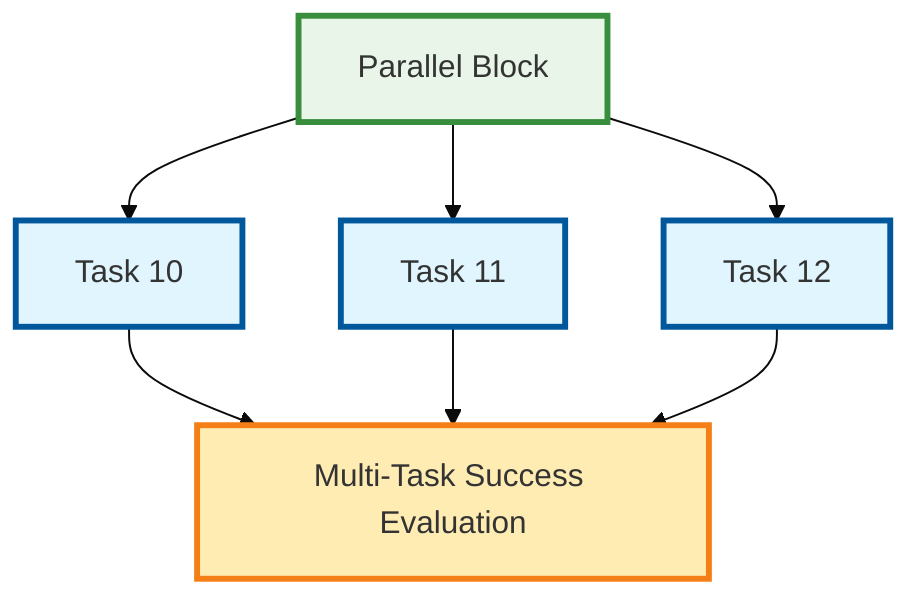
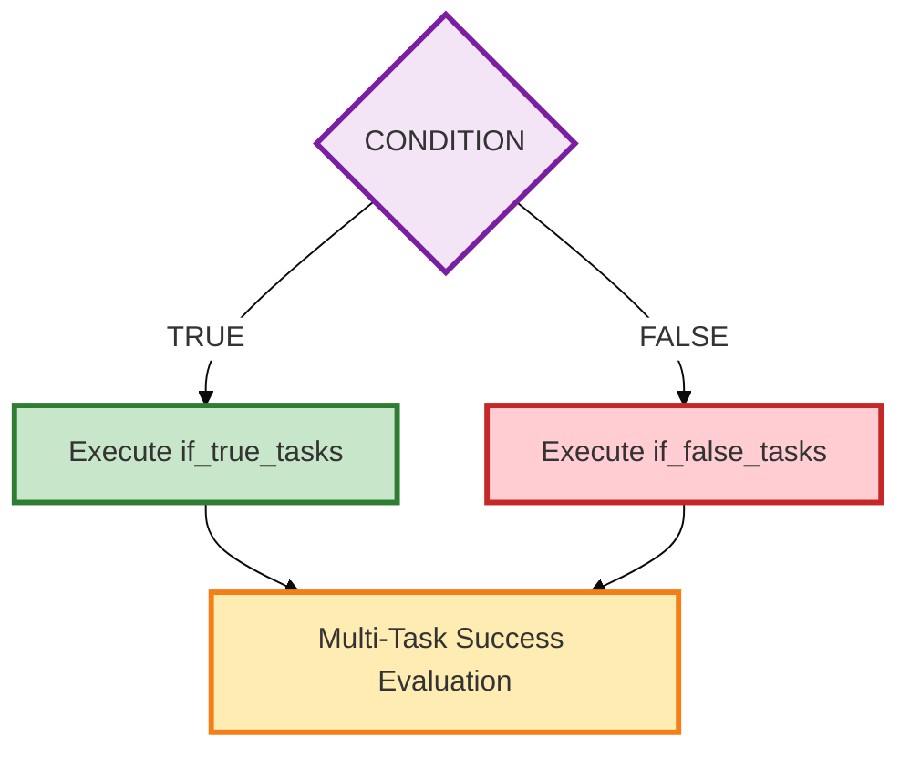

# TASK ExecutoR - TASKER 2.1

**No-Code Workflow Automation** - Transform complex operations into simple configuration files

## Your First Workflow: Service Health Check

Let's start with a simple example that checks if a service is running and takes action based on the result:

```mermaid
%%{init: {'theme':'base', 'themeVariables': {'primaryColor':'#ffffff'}}}%%
flowchart TD
    Start([Start]) --> T0[Task 0: Check Service<br/>🔍 ping service]
    T0 --> Check{SUCCESS?}

    Check -->|Success Criteria Met| T1[Task 1: Log Status<br/>✓ Service is healthy]
    Check -->|Success Criteria Not Met| T2[Task 2: Alert Team<br/>⚠️ Service is down]

    T1 --> End((END))
    T2 --> T3[Task 3: Restart Service<br/>🔄 Attempting restart]
    T3 --> End

    style Start fill:#e1f5fe,stroke:#01579b,stroke-width:3px
    style T0 fill:#e1f5fe,stroke:#01579b,stroke-width:3px
    style Check fill:#ffecb3,stroke:#f57f17,stroke-width:3px
    style T1 fill:#c8e6c9,stroke:#2e7d32,stroke-width:3px
    style T2 fill:#ffcdd2,stroke:#c62828,stroke-width:3px
    style T3 fill:#e1f5fe,stroke:#01579b,stroke-width:3px
    style End fill:#c8e6c9,stroke:#2e7d32,stroke-width:3px
```



**The simple text configuration:**
```
# health_check.txt - Your first TASKER workflow!

# Task 0: Check if service is running
task=0
hostname=web-server
command=ping -c 1 api.service
# Define success as exit code 0
success=exit_0
# If success (exit code 0), go to task 1
on_success=1
# If failure (exit code not 0), go to task 2
on_failure=2

# Task 1: Log successful status
task=1
hostname=log-server
command=echo "Service is healthy"
# STOP here - don't continue to task 2
next=never

# Task 2: Alert about failure (only reached via on_failure=2)
task=2
hostname=alert-server
command=send_alert "Service is down!"
# After alert, continue to task 3 (default sequential flow)

# Task 3: Try to restart the service
task=3
hostname=web-server
command=restart_service.sh
# Workflow ends after restart attempt
```

**Run it:** `tasker -r health_check.txt` ✨

**🎯 What This Example Shows:**
- **`success=exit_0`**: Define success as exit code 0
- **`on_success=1`**: Jump to task 1 if success criteria is met
- **`on_failure=2`**: Jump to task 2 if success criteria is not met
- **`next=never`**: Stop sequential execution (firewall)
- **Default flow**: Task 2 continues to task 3 automatically (no `next` condition)

**🚀 Why TASKER?**
- **Zero Coding Required**: Write workflows in simple text files
- **Smart Decision Making**: Automatic routing based on command results
- **Built-in Intelligence**: Detects success/failure from exit codes, stdout, stderr
- **Enterprise Ready**: Scales from 1 to 1000+ servers effortlessly

---

A sophisticated Python-based task execution system for running commands on remote or local servers with comprehensive flow control, parallel execution capabilities, and enterprise-grade validation.

## Overview

TASKER 2.1 is a next-generation task automation framework that reads task definitions from configuration files and executes them with advanced orchestration capabilities. Built on a modular architecture for maximum maintainability and scalability.

**Key Features:**
- **Multiple Execution Models**: Sequential, parallel, and conditional task execution
- **Multiple Execution Types**: Direct subprocess (`local`), shell execution (`shell`), enterprise tools (`pbrun`, `p7s`, `wwrs`)
- **Advanced Flow Control**: Complex conditions, loops, branching, and error handling
- **Variable System**: Dynamic substitution and data flow between tasks
- **Context-Aware Security**: Different validation rules for shell vs direct execution
- **Enterprise Scaling**: Support for 1-1000+ servers with robust timeout management
- **Professional Logging**: Structured output with debug capabilities and project tracking

---

# PART 1: Getting Started

Get up and running with TASKER quickly - learn the essentials to start automating your workflows.

## Quick Start

### Basic Usage

Execute tasks in a file (dry run mode - doesn't actually execute commands):
```bash
tasker tasks.txt
```

Actually execute the commands:
```bash
tasker -r tasks.txt
```

Execute with project tracking and logging:
```bash
tasker -r -p DEPLOYMENT_2024 deployment_tasks.txt
```

### Your First Task File

Create a simple task file `hello.txt`:
```
task=0
hostname=localhost
command=echo
arguments=Hello TASKER!
exec=local

task=1
hostname=localhost
command=date
exec=local
```

Run it:
```bash
tasker -r hello.txt
```

That's it! You've just executed your first TASKER workflow.

## Task File Format

TASKER uses a simple key-value format where each task is defined by parameters. Tasks are executed based on their execution model (sequential by default, parallel, or conditional).

### ⚠️ Critical Syntax Rule: Comment Policy for Task Files

**TASKER Comment Policy - Strictly Enforced for Security and Parsing:**

- ✅ **ALLOWED**: Full-line comments starting with `#` at the beginning of lines
- ❌ **FORBIDDEN**: Inline comments after `key=value` pairs
- **Enforcement**: Validation engine detects inline comments and reports security errors
- **Rationale**: Inline comments can cause parsing errors and interfere with security validation

**❌ INCORRECT (Inline Comments):**
```
task=0
hostname=server1
command=deploy
timeout=120                 # This will cause validation errors!
success=exit_0&stdout~ok    # This will also fail!
```

**✅ CORRECT (Separate Comment Lines):**
```
task=0
hostname=server1
command=deploy
# Set timeout to 2 minutes
timeout=120
# Success requires exit 0 and specific output
success=exit_0&stdout~ok
```

### Sequential Execution (Default)

**Example - Simple sequential execution (task by task):**
```
# Simple sequential tasks - execute in order 0, 1, 2, 3
task=0
hostname=server1
command=stop_service

task=1
hostname=server1
command=backup_database

task=2
hostname=server1
command=deploy_application
arguments=--version=1.2.3

task=3
hostname=server1
command=start_service
```

**Example - Sequential with simple flow control (next parameter):**
```
# Continue to next task only if success criteria is met
task=0
hostname=server1
command=deploy
arguments=--version=1.2.3
# Custom success criteria
success=exit_0&stdout~complete
# Continue ONLY if success criteria met
next=success

task=1
hostname=server1
command=verify_deployment
# This task only runs if task 0 succeeded
```

**Example - Sequential with routing (jumps on success/failure):**
```
# Jump to different tasks based on success/failure
task=0
hostname=server1
command=deploy
arguments=--version=1.2.3
# Custom success criteria
success=exit_0&stdout~complete
# Jump to task 5 on success
on_success=5
# Jump to task 99 on failure
on_failure=99

# Success path
task=5
hostname=server1
command=verify_deployment

# Failure path
task=99
hostname=alert-server
command=send_alert
arguments=Deployment failed
return=1
```

**Parameters:** See [Sequential Execution Parameters](#sequential-execution-parameters-default-mode) table below

### Parallel Execution

**Example - Parallel task with retry:**
```
task=1
# Required
type=parallel
# Required: Task IDs to execute
tasks=100,101,102,103,104
# Limit concurrent execution (default: 8 if not specified)
max_parallel=5
# Retry failed tasks up to 3 times
retry_count=3
# At least 3 must succeed
next=min_success=3
# Jump if condition met
on_success=10
# Jump if condition not met
on_failure=99
```

**Parameters:** See [Parallel Execution Parameters](#parallel-execution-parameters) table below

**Note:** Referenced tasks use their individual parameters but flow control is ignored

### Conditional Execution

**Example - Conditional branching:**
```
task=5
# Required
type=conditional
# Required: Expression to evaluate
condition=@4_stdout@~production
# Execute if TRUE (custom order)
if_true_tasks=200,201,202
# Execute if FALSE (custom order)
if_false_tasks=300,301
# Retry failed tasks
retry_count=2
# All branch tasks must succeed
next=all_success
# Jump if condition met
on_success=10
```

**Parameters:** See [Conditional Execution Parameters](#conditional-execution-parameters) table below

**Important Conditional Execution Behavior:**
- Tasks in branches execute in the exact order listed (e.g., `100,300,150` executes in that order)
- Individual task flow control (`on_success`, `on_failure`, `next`) is IGNORED
- Individual task `success` criteria IS RESPECTED for determining success/retry
- Retry applies to individual tasks within the branch, not the condition evaluation

### Enhanced Loop Control

Advanced loop control with break conditions:

```
task=0
hostname=server1
command=check_service_status
# Execute exactly 10 times (Task 0.1 through 0.10)
loop=10
next=loop
# Break loop when output contains "HEALTHY"
loop_break=stdout~HEALTHY
# Wait 5 seconds between loop iterations
sleep=5
# Custom success criteria
success=exit_0
```

**Important:** Loop functionality requires `next=loop` parameter. Without `next=loop`, the `loop` parameter is ignored and the task executes only once.

**Loop Semantics:** `loop=N` executes exactly N times, displayed as Task X.1, X.2, ... X.N

**Loop vs Retry behavior:** Loops execute ALL iterations regardless of success/failure (unless `loop_break` condition is met). This differs from retry logic (parallel/conditional tasks), which ONLY retries tasks that fail.

**Placeholder Resolution:** When referencing loop task results with `@X_stdout@`, `@X_stderr@`, or `@X_exit_code@`, you will get the **last iteration's output** only. Previous iterations are not stored.

**Note:** Loop control is only available for sequential tasks. See [Sequential Execution Parameters](#sequential-execution-parameters-default-mode) table below.

### Output Processing Parameters

Extract specific data from command output using simple split operations. These are basic functions for common extraction needs.

**Available Delimiters:**
- `space` - Split by whitespace
- `tab` - Split by tab characters
- `newline` - Split by line breaks (NEW!)
- `colon` - Split by colons (`:`)
- `semicolon` - Split by semicolons (`;`)
- `comma` - Split by commas
- `pipe` - Split by pipe characters
- `semi` - Legacy alias for semicolon

```
task=0
hostname=server1
command=printf "line1\nBETA_VALUE\nline3"
# Extract second line using newline delimiter
stdout_split=newline,1
exec=local

task=1
hostname=server2
command=echo "user:x:1000:1000:Admin:/home/user:/bin/bash"
# Extract username from /etc/passwd style output
stdout_split=colon,0
exec=local

task=2
hostname=server3
command=echo "key1=value1 key2=value2 key3=value3"
# Get "key2=value2" using space delimiter
stdout_split=space,1
exec=local

task=3
condition=@2_stdout@~key2=value2
hostname=server4
command=process_data
# Uses "key2=value2" from split
arguments=--config=@2_stdout@
```

**For Complex Processing:**

If you need more sophisticated text processing beyond simple splits, use `exec=local` with command-line tools:

```
# Using awk for complex extraction
task=10
hostname=localhost
command=echo "@5_stdout@" | awk '{print $3 "/" $4}'
exec=local

# Using sed for pattern replacement
task=11
hostname=localhost
command=echo "@5_stdout@" | sed 's/error/warning/gi'
exec=local

# Using perl one-liner for advanced processing
task=12
hostname=localhost
command=echo "@5_stdout@" | perl -pe 's/(\d+)\.(\d+)/v$1.$2/g'
exec=local

# Using external script for complex logic
task=13
hostname=localhost
command=/usr/local/bin/process_output.sh
arguments="@5_stdout@"
exec=local
```

**Parameters:** See [Output Processing Parameters](#output-processing-parameters-all-standard-tasks) table below.

**Supported delimiters:** `space` (any whitespace), `tab`, `comma`, `semi`, `pipe`, or any literal string (e.g., `\n` for newline, `:` for colon)

**Practical Examples:**

```
# Extract disk usage percentage from df output
task=0
hostname=server1
command=df -h /data | tail -1
# Extract last line using tail command (alternative to stdout_split=newline,-1)
exec=local

task=1
command=echo
arguments=Disk usage line: @0_stdout@
# Check if percentage exists
condition=@0_stdout@~%
# Extract 5th column (usage%)
stdout_split=space,4
exec=local

# Parse JSON-like output
task=2
hostname=api-server
command=curl -s http://api/status
# Get second key-value pair
stdout_split=comma,1
exec=local

# Process error output
task=3
hostname=app-server
command=deploy_application
# Handle stderr with proper error checking
on_failure=99

task=99
hostname=notification
command=send_alert
# Uses split stderr
arguments=First error: @3_stderr@
```

### Complete Parameter Reference

For detailed parameter specifications and valid ranges, see the [Complete Parameter Field Reference](#complete-parameter-field-reference) section below, which includes:
- [Core Task Parameters](#core-task-parameters-all-execution-models) - Common to all tasks
- [Sequential Execution Parameters](#sequential-execution-parameters-default-mode) - Default mode with flow control
- [Parallel Execution Parameters](#parallel-execution-parameters) - Concurrent task execution
- [Conditional Execution Parameters](#conditional-execution-parameters) - Branch-based execution
- [Output Processing Parameters](#output-processing-parameters-all-standard-tasks) - Text extraction utilities

## Global Variables

Define reusable variables at the top of your task file for configuration management and environment abstraction.

**Important:** TASKER automatically treats ANY key=value pair that is not a recognized task parameter as a global variable. This means you can define custom variables anywhere in the file, though it's best practice to place them at the top for clarity.

### How Global Variables Work

1. **Automatic Creation**: Any `KEY=VALUE` line that doesn't match a known task parameter becomes a global variable
2. **Case Sensitive**: Variable names are case-sensitive (`Environment` ≠ `ENVIRONMENT`)
3. **No Declaration Needed**: Simply write `MYVAR=value` and it's available as `@MYVAR@`
4. **Scope**: Global variables are read-only and available throughout the entire task file

### ✅ Environment Variable Support

**TASKER automatically expands environment variables** like `$HOME`, `$USER`, `$PWD`, etc. in task arguments.

**✅ Environment variables work as expected:**
```
task=0
hostname=localhost
command=rm
arguments=-f $HOME/.my_file  # $HOME automatically expands to /home/username
exec=local

task=1
hostname=localhost
command=echo
arguments=Current user is $USER in directory $PWD
exec=local
```

**Supported environment variables:**
- `$HOME` - User's home directory
- `$USER` - Current username
- `$PWD` - Current working directory
- `$PATH` - System PATH variable
- Any other environment variables available in the system

**Note:** Environment variables are expanded only in the `arguments` field. Use TASKER global variables (`@VARIABLE@`) for custom values that need to be shared across tasks.

### Basic Global Variables

```
# Global variable definitions (at top of task file)
ENVIRONMENT=production
SERVICE_NAME=web-api
VERSION=v2.1.0
# Any name works - automatically becomes a global variable
CUSTOM_PATH=/opt/myapp

# Tasks using both global variables and environment variables
task=0
hostname=@ENVIRONMENT@-server
command=deploy
arguments=@SERVICE_NAME@ @VERSION@ --user=$USER --home=$HOME
```

### When to Use Global Variables

**Primary Rule: Use a global variable when the same value appears in multiple tasks.**

This makes your task files work like templates - update one variable, all tasks using it are updated automatically.

**Common Use Cases:**

**1. Template-Based Task Files:**
```
# Define once, use many times
TARGET_HOST=prod-db-01
PACKAGE_NAME=nginx
SERVICE_NAME=nginx

# All these tasks now use the same values
task=0
hostname=@TARGET_HOST@
command=check_package
arguments=@PACKAGE_NAME@

task=1
hostname=@TARGET_HOST@
command=stop_service
arguments=@SERVICE_NAME@

task=2
hostname=@TARGET_HOST@
command=update_package
arguments=@PACKAGE_NAME@

task=3
hostname=@TARGET_HOST@
command=start_service
arguments=@SERVICE_NAME@

# To run on different host/package: just change the global variables!
```

**2. Environment-Specific Deployments:**
```
# Switch entire workflow by changing one variable
# Change to 'production' for prod deployment
ENVIRONMENT=staging
APP_VERSION=v2.3.1

task=0
hostname=@ENVIRONMENT@-web-01
command=deploy
arguments=--version=@APP_VERSION@

task=1
hostname=@ENVIRONMENT@-web-02
command=deploy
arguments=--version=@APP_VERSION@

task=2
hostname=@ENVIRONMENT@-db-01
command=migrate_database
arguments=--version=@APP_VERSION@
```

**3. Repeated Command Arguments:**
```
# Same options used across multiple tasks
BACKUP_OPTIONS=--compress --encrypt --verify
BACKUP_PATH=/backup/2024

task=0
hostname=server1
command=backup_database
arguments=@BACKUP_OPTIONS@ --dest=@BACKUP_PATH@/db

task=1
hostname=server2
command=backup_files
arguments=@BACKUP_OPTIONS@ --dest=@BACKUP_PATH@/files

task=2
hostname=server3
command=backup_configs
arguments=@BACKUP_OPTIONS@ --dest=@BACKUP_PATH@/config
```

### Global Variable Limitations

**Read-Only During Execution**: Global variables cannot be modified by tasks during runtime.

**Alternative for Dynamic Data**: Use task output variables (`@TASK_ID_stdout@`) for values that change during execution:

```
# Get dynamic value from task
task=0
hostname=config-server
command=get_database_host
exec=local

# Use task output in subsequent tasks
task=1
# Use dynamic hostname from task 0
hostname=@0_stdout@
command=connect_database
```

## Memory-Efficient Output Streaming

TASKER 2.1 includes an advanced memory-efficient output streaming system that prevents Out-of-Memory (OOM) errors when processing commands that generate large amounts of output (1GB+). This system automatically manages memory usage and seamlessly handles outputs of any size.

### The Problem with Large Outputs

Before the streaming system, TASKER would load entire command outputs into memory, causing system crashes with large outputs:

```bash
# This would crash TASKER 1.x with OOM errors
task=0
hostname=server1
command=find /data -type f -exec ls -la {} \;
# Could generate 1GB+ of output

task=1
hostname=server2
command=mysqldump --all-databases --single-transaction
# Database dumps can be several GB

task=2
hostname=log-server
command=cat /var/log/application.log
# Log files can grow to hundreds of MB
```

### How Memory-Efficient Streaming Works

The streaming system implements a sophisticated three-tier approach:

#### Tier 1: In-Memory Buffering (Up to 10MB)
For small to medium outputs, everything stays in memory for maximum performance:

```text
└── Memory Buffer (1MB chunks)
    ├── Fast access for small outputs
    ├── Zero disk I/O overhead
    └── Instant variable resolution
```

#### Tier 2: Temporary File Streaming (10MB+)
When outputs exceed 10MB, TASKER automatically streams to temporary files:

```text
└── System Temp Directory (/tmp)
    ├── tasker_stdout_abc123 (stdout content)
    ├── tasker_stderr_def456 (stderr content)
    └── Automatic cleanup after task completion
```

#### Tier 3: Memory Protection (100MB+ per task)
Absolute limits prevent system overload:

```text
└── Hard Memory Limits
    ├── 100MB maximum per individual task
    ├── Automatic temp file fallback
    └── System resource protection
```

### Automatic Operation

The streaming system operates completely transparently - no configuration required:

```bash
# These all work identically regardless of output size
task=0
hostname=web-server
command=generate_small_report
# Output: 50KB - stays in memory

task=1
hostname=database-server
command=generate_large_export
# Output: 50MB - automatically streams to temp files

task=2
hostname=log-server
command=analyze_massive_dataset
# Output: 500MB - streams with memory protection
```

### Technical Implementation Details

#### Memory Thresholds
- **In-Memory Limit**: 10MB per task (hardcoded for optimal performance)
- **Buffer Size**: 1MB chunks for optimal I/O performance
- **Maximum Memory**: 100MB absolute limit per task
- **Temp File Location**: System temp directory (`/tmp` on Linux)

#### Streaming Process
1. **Real-time Processing**: Output is processed as it's generated
2. **Threshold Detection**: Automatically switches to temp files at 10MB
3. **Memory Management**: Constant memory usage regardless of output size
4. **Resource Cleanup**: Temporary files automatically deleted after task completion

#### File Naming Convention
```text
/tmp/tasker_stdout_XXXXXX  # Standard output temp file
/tmp/tasker_stderr_XXXXXX  # Standard error temp file
```
Where `XXXXXX` is a random 6-character suffix for uniqueness.

### Performance Characteristics

#### Small Outputs (< 10MB)
- **Memory Usage**: Actual output size
- **Processing Time**: Near-instant
- **Disk I/O**: None
- **Best for**: Configuration commands, status checks, small reports

#### Large Outputs (10MB - 100MB)
- **Memory Usage**: ~10MB constant
- **Processing Time**: <1 second processing overhead
- **Disk I/O**: Sequential write to temp files
- **Best for**: Database exports, large file operations, comprehensive logs

#### Massive Outputs (100MB+)
- **Memory Usage**: ~10MB constant (protected)
- **Processing Time**: Minimal streaming overhead
- **Disk I/O**: Efficient streaming with automatic cleanup
- **Best for**: Full system backups, massive dataset processing, extensive logging

### Real-World Examples

#### Database Operations
```bash
# Large database export - streams automatically
task=0
hostname=db-server
command=pg_dump
arguments=--verbose --format=plain --no-owner production_db
timeout=1800
exec=pbrun
```

#### Log Analysis
```bash
# Process massive log files without memory issues
task=1
hostname=log-server
command=grep "ERROR" /var/log/application.log
# Processes multi-GB log files efficiently
exec=pbrun

task=2
hostname=analysis-server
command=analyze_errors
arguments=@1_stdout@
# Uses extracted error data
exec=local
```

#### System Monitoring
```bash
# Generate comprehensive system reports
task=0
hostname=monitoring-server
command=sar -A
arguments=-f /var/log/sa/sa01
# Processes complete system activity reports
exec=pbrun

task=1
hostname=report-server
command=generate_performance_report
arguments=--data=@0_stdout@
# Creates reports from large monitoring data
exec=local
```

### Monitoring and Debugging

#### Debug Information
Enable debug logging to see streaming behavior:

```bash
tasker -r --log-level=DEBUG large_output_workflow.txt
```

Debug output shows:
```text
[02Oct25 15:47:21] DEBUG: Task 0: Used temp files for large output (stdout: 20840000 bytes, stderr: 0 bytes)
```

#### Memory Usage Awareness
Tasks that trigger streaming are automatically logged:

```text
[02Oct25 15:47:20] Task 0: Executing [local]: python3 -c large_data_generation.py
[02Oct25 15:47:21] Task 0: Exit code: 0
[02Oct25 15:47:21] Task 0: STDOUT: Large dataset line 000000 with data: XXX... (20839999 chars total)
```

### System Compatibility

#### Python Version Support
- **Python 3.6.8+**: Full compatibility with legacy systems
- **Cross-platform**: Linux, macOS, Windows support
- **Memory Management**: Uses standard Python tempfile module

#### Resource Requirements
- **Minimum Memory**: 50MB free RAM for streaming operations
- **Temp Space**: Sufficient disk space in `/tmp` for largest expected output
- **File Descriptors**: Standard subprocess file descriptor usage

### Benefits for Enterprise Operations

#### Reliability
- **No OOM Crashes**: System remains stable with any output size
- **Predictable Memory Usage**: Constant memory footprint prevents resource exhaustion
- **Automatic Recovery**: Graceful handling of unexpected large outputs

#### Performance
- **Efficient Processing**: Minimal overhead for small outputs
- **Scalable Architecture**: Handles outputs from KB to GB range
- **Resource Optimization**: Uses memory efficiently across all scenarios

#### Operational Excellence
- **Transparent Operation**: No configuration changes required
- **Backward Compatibility**: All existing workflows continue working
- **Diagnostic Support**: Clear logging of memory-efficient operations

### Migration and Adoption

#### Zero Configuration Required
Existing workflows automatically benefit from streaming:

```bash
# No changes needed - automatically enhanced
task=0
hostname=backup-server
command=tar -czf - /data | split -b 100M
# Now handles multi-GB backup operations safely
```

#### Gradual Enhancement
Teams can gradually adopt larger-scale operations:

```bash
# Phase 1: Test with medium outputs (10-50MB)
task=0
hostname=test-server
command=generate_medium_dataset

# Phase 2: Scale to large outputs (50-200MB)
task=1
hostname=test-server
command=generate_large_dataset

# Phase 3: Production massive outputs (200MB+)
task=2
hostname=prod-server
command=full_system_backup
```

### Troubleshooting Large Output Issues

#### Insufficient Temp Space
```bash
# Check available temp space
df -h /tmp

# Clean temp directory if needed
sudo find /tmp -name "tasker_*" -mtime +1 -delete
```

#### Memory Warnings
```bash
# Monitor memory usage during execution
tasker -r --log-level=DEBUG memory_intensive_workflow.txt

# Look for temp file usage messages:
# "Task X: Used temp files for large output (stdout: N bytes, stderr: M bytes)"
```

#### Performance Optimization
```bash
# For very large outputs, consider pre-processing
task=0
hostname=server1
command=large_data_command | head -1000
# Limit output size at source when possible

task=1
hostname=server2
command=large_data_command | tail -1
# Extract only needed data
```

## Basic Flow Control

Control when and how tasks execute using conditions and flow control parameters.

### Task Skipping with Conditions

Use `condition` parameter to skip tasks when certain conditions aren't met:

```bash
task=0
hostname=web-server
command=check_service
exec=local

task=1
hostname=web-server
# Skip this task if service check failed
condition=@0_exit_code@=0
command=restart_service

task=2
hostname=web-server
# Skip this task if service check succeeded
condition=@0_exit_code@!=0
command=send_alert
arguments=Service check failed
```

**Note:** `condition` determines whether a task runs or is skipped. For controlling workflow flow (stop/continue/jump), use `next`, `on_success`, and `on_failure`.

### Exit Code Conditions

Exit codes are numeric values (0-255) returned by commands. **Exit code 0 means success**, non-zero indicates failure.

**Common flow control with exit codes:**
- `next=exit_0`: Continue only if command succeeded
- `next=exit_1`: Continue only if command failed with code 1
- `next=exit_127`: Continue only if command not found

**Using `next` for flow control based on exit codes:**
```bash
task=0
hostname=health-check
command=curl -f http://api/health
exec=local
# Define success as exit code 0
success=exit_0
# Jump to task 1 if health check passed
on_success=1
# Jump to task 2 if health check failed
on_failure=2

task=1
hostname=notification
command=send_alert
arguments=API is healthy
# Stop here - don't continue to task 2
next=never

task=2
hostname=notification
command=send_alert
arguments=API health check failed
```

**Using `condition` to skip tasks based on previous exit codes:**
```bash
task=0
hostname=health-check
command=curl -f http://api/health
exec=local

task=1
# Skip this task if health check failed
condition=@0_exit_code@=0
hostname=deployment
command=deploy_new_version

task=2
# Skip this task if health check succeeded
condition=@0_exit_code@!=0
hostname=notification
command=send_failure_alert
```

### Output Pattern Matching

Use task output for conditional execution and flow control:

**Flow Control with Output Patterns (using `next`):**
```
task=0
hostname=env-check
command=detect_environment
exec=local
# Define success as output containing "production"
success=stdout~production
# Jump to production tasks if success
on_success=10
# Jump to non-production tasks if no success
on_failure=20

# Production workflow
task=10
hostname=prod-server
command=deploy_to_production
# Stop here - don't fall through to task 20
next=never

# Non-production workflow
task=20
hostname=dev-server
command=deploy_to_development
```

**Selective Task Execution (using `condition`):**
```
task=0
hostname=env-check
command=detect_environment
exec=local

# These tasks run sequentially but skip based on conditions
task=1
# Skip unless output contains "production"
condition=@0_stdout@~production
hostname=prod-server
command=deploy_to_production

task=2
# Skip unless output contains "development"
condition=@0_stdout@~development
hostname=dev-server
command=deploy_to_development

task=3
# Skip unless output contains "staging"
condition=@0_stdout@~staging
hostname=staging-server
command=deploy_to_staging
```

### Success Criteria

Define custom success conditions beyond just exit codes:

```
task=0
hostname=backup-server
command=backup_database
# Must exit 0 AND output contain "backup_complete"
success=exit_0&stdout~backup_complete
# If success criteria met, go to task 1
on_success=1
# If success criteria not met, go to task 99
on_failure=99

task=1
hostname=notification
command=send_success_alert
arguments=Backup completed successfully
# Stop here
next=never

task=99
hostname=notification
command=send_failure_alert
arguments=Backup failed or incomplete
```

### Sequential Execution Flow with Success Criteria

When you use `next=success`, it simply evaluates to whatever the task's success criteria evaluates to:

- If `success` is defined: Uses that custom criteria
- If `success` is not defined: Defaults to `exit_0`
- Result: Continue if success=true, stop if success=false

**Example - Custom Success with Flow Control:**
```
task=0
hostname=database-server
command=backup_database
# Must complete AND show 100%
success=exit_0&stdout~100%
# Continue ONLY if success criteria met
next=success
# If backup succeeds (exit 0 AND output contains "100%"), continue to task 1
# If backup fails, stop here (no task 1 execution)

task=1
hostname=notification-server
command=send_backup_complete
# This task only runs if task 0's success criteria was met
```

**Example - Using on_failure without next:**
```
task=0
hostname=critical-server
command=critical_operation
# Success: exit 0 AND no errors in stderr
success=exit_0&stderr!~error
# Continue to task 1 if success (default behavior)
# If success criteria not met, jump to task 99
on_failure=99

task=1
hostname=next-server
command=continue_workflow
# Only reached if task 0's success criteria was met

task=99
hostname=alert-server
command=send_failure_alert
# Only reached if task 0's success criteria was NOT met
```

**Important Notes:**
- **CRITICAL**: `next` and `on_success/on_failure` are mutually exclusive for sequential tasks
- Use EITHER `next` for conditional continuation OR `on_success/on_failure` for routing
- Without `next`, tasks continue to next sequential task by default
- `success` parameter defines criteria, `on_success/on_failure` route based on that criteria
- Default behavior (no routing parameters): Continue to next sequential task

### Failure Criteria (Inverse Success)

The `failure=` parameter provides an **inverse alternative** to `success=` for simpler workflow definitions when most exit codes represent success.

**Instead of listing all success codes:**
```
# Complex: List all success codes
success=exit_0,exit_2,exit_3,exit_4,exit_5
```

**Use the simpler inverse approach:**
```
# Simple: List only failure code(s)
failure=exit_1
```

**How it works:**
1. Task is assumed to succeed by default
2. Failure condition is evaluated
3. If failure condition is TRUE → task failed
4. If failure condition is FALSE → task succeeded

**Examples:**

Single failure code:
```bash
task=1
hostname=deployment-server
command=deploy_application
# Fail ONLY on exit code 1 (permission denied)
# All other exit codes (0, 2, 3, etc.) = success
failure=exit_1
```

Multiple failure codes:
```bash
task=1
hostname=database-server
command=db_migration
# Fail on exit codes 1, 2, or 127
failure=exit_1|exit_2|exit_127
```

Complex failure conditions:
```bash
task=1
hostname=app-server
command=health_check
# Fail if previous task failed
failure=@0_success@=false
```

```bash
task=2
hostname=monitoring
command=check_status
# Fail if output contains "ERROR"
failure=@stdout@~ERROR
```

**Validation Rules:**

**1. Mutual Exclusion:**
- ❌ `success` and `failure` **cannot** be used together on the same task
- ✅ Both support the same condition syntax (exit codes, variables, expressions)

**2. Task Type Restrictions:**

The `success` and `failure` parameters are **only supported for sequential tasks** (regular tasks).

❌ **INVALID - Parallel blocks cannot use success/failure:**
```bash
task=1
type=parallel
tasks=10,11
max_parallel=2
success=exit_0     # ERROR: Not allowed in parallel blocks
```

❌ **INVALID - Conditional blocks cannot use success/failure:**
```bash
task=1
type=conditional
condition=@0_success@=true
if_true_tasks=10
if_false_tasks=11
failure=exit_1     # ERROR: Not allowed in conditional blocks
```

**Why?** Parallel and conditional blocks execute multiple subtasks. They use **aggregate conditions** in the `next` parameter to evaluate overall success based on subtask outcomes:

- `min_success=N` - Minimum number of successful subtasks
- `max_failed=N` - Maximum number of failed subtasks
- `all_success` - All subtasks must succeed
- `any_success` - At least one subtask must succeed
- `majority_success` - Majority of subtasks must succeed

✅ **VALID - Use aggregate conditions for blocks:**
```bash
task=1
type=parallel
tasks=10,11
max_parallel=2
next=min_success=2
on_success=2
on_failure=99
```

**When to use `failure=` vs `success=`:**

| Scenario | Using `success=` | Using `failure=` |
|----------|------------------|------------------|
| Fail on exit 1 only | `success=exit_0\|exit_2\|exit_3\|...` | `failure=exit_1` ✅ |
| Success on exit 0 only | `success=exit_0` ✅ | `failure=exit_1\|exit_2\|exit_3\|...` |
| Fail if task 0 failed | `success=@0_success@=true` | `failure=@0_success@=false` ✅ |
| Success if stdout contains "OK" | `success=stdout~OK` ✅ | `failure=stdout!~OK` |

- **Use `failure=`** when most exit codes are acceptable (simpler - fewer codes to list)
- **Use `success=`** when only specific codes are acceptable (more restrictive)

### Advanced Condition Operators

TASKER supports comprehensive comparison operators for sophisticated condition evaluation:

**Comparison Operators:**
- `=` : Equal to (string or numeric)
- `!=` : Not equal to
- `~` : Contains (substring search)
- `!~` : Does not contain
- `<` : Less than (numeric)
- `<=` : Less than or equal to
- `>` : Greater than (numeric)
- `>=` : Greater than or equal to

**Examples:**
```
# Numeric comparisons with task results
# Exit code equals 0
condition=@0_exit_code@=0
# Exit code not 0
condition=@0_exit_code@!=0
# Previous task exit code less than 5
condition=@1_exit_code@<5
# Task 2's exit code >= 2
condition=@2_exit_code@>=2

# Numeric comparisons with task results
# Previous task exit code less than 5
condition=@0_exit_code@<5
# Task 1's exit code >= 2
condition=@1_exit_code@>=2
# Task 2 failed (non-zero exit)
condition=@2_exit_code@!=0

# String operations with task output
# Output contains "success"
condition=@0_stdout@~success
# Stderr doesn't contain "error"
condition=@0_stderr@!~error
# Task 1's output contains "complete"
condition=@1_stdout@~complete
# Task 2 had empty stderr
condition=@2_stderr@=

# Mixed comparisons with task results
# Task 0 met its success criteria
condition=@0_success@=true
# Compare outputs of two tasks
condition=@1_stdout@!=@2_stdout@
# Either task succeeded
condition=@3_exit_code@=0|@4_exit_code@=0

# Complex conditions with boolean operators
# AND condition
condition=@0_exit_code@=0&@0_stdout@~complete
# OR condition
condition=@0_success@=true|@1_success@=true
# Parenthesized conditions (operators OUTSIDE parentheses)
condition=(@0_exit_code@=0)&(@0_stdout@~done)
# Multiple OR with parentheses
condition=(@0_stdout@~done)|(@0_stdout@~finished)
```

**Note on Parentheses Support:**
Parentheses can only wrap simple conditions without operators inside them. Operators (`&`, `|`) must be placed OUTSIDE parentheses:
- ✅ **Supported:** `(exit_0)`, `(stdout~OK)`, `(exit_0)&(stdout~OK)`, `(exit_0)|(exit_1)`
- ❌ **Not Supported:** `(exit_0&stdout~OK)`, `(exit_0|exit_1)`, `(@0_exit_code@=0&@0_stdout@~done)`

For complex grouping with operators inside parentheses, wait for JSON/YAML task file support (see Future Features section). Validation will reject operators inside parentheses with clear error messages.

**Note:** Global variables must be defined at the start of your task file and are read-only during execution. Dynamic variable updates during task execution are not yet supported (see Feature Requests section).

**Note on Output Count Conditions:**
The `stdout_count` and `stderr_count` operators are fully implemented for counting lines in command output. They support `=`, `<`, and `>` operators (e.g., `stdout_count>5`, `stderr_count=0`). See the "Output Line Counting" section in Success Criteria for complete documentation and examples.

### Retry Parameters for Parallel and Conditional Tasks

Advanced retry logic for robust task execution in parallel and conditional workflows:

**Retry Configuration Parameters:**
- `retry_count=N` : Number of retry attempts (1-1000, default: 1). Setting this automatically enables retry.
- `retry_delay=N` : Delay between retries in seconds (0-300, default: 1)

**Parallel Task Retries:**
```
# Parallel deployment with automatic retry
task=10
type=parallel
max_parallel=3
tasks=20,21,22
# Retry each failed task up to 3 times
retry_count=3
# Wait 10 seconds between retries
retry_delay=10
# Continue if majority succeed
next=majority_success
```

**Conditional Task Retries:**
```
# Conditional execution with retry
task=30
type=conditional
# Based on previous task output
condition=@29_stdout@~production
if_true_tasks=40,41,42
if_false_tasks=50,51
# Retry failed branch tasks
retry_count=2
# 5 second retry delay
retry_delay=5
```

**Retry Display in Logs:**
- Initial attempt: `Task 10-20: Executing`
- First retry: `Task 10-20.2: Retrying (attempt 2/4)`
- Second retry: `Task 10-20.3: Retrying (attempt 3/4)`
- Final retry: `Task 10-20.4: Final attempt (4/4)`

**Important Notes:**
- **Retry vs Loop behavior**: Retries ONLY occur for tasks that fail execution. In contrast, loops (`loop=N`) execute all iterations regardless of success/failure unless `loop_break` condition is met.
- Each retry uses the same parameters as the original task
- Variables are re-evaluated on each retry attempt
- Master timeout still applies to all retry attempts combined

## Complete Parameter Field Reference

This section provides a comprehensive reference of all valid task parameters in TASKER, organized by execution model.

### Core Task Parameters (All Execution Models)

These parameters are fundamental to all task types:

| Parameter | Required | Type | Description | Valid Values/Range |
|-----------|----------|------|-------------|-------------------|
| `task` | **Yes** | Integer | Unique task identifier | 0, 1, 2, ... (sequential recommended) |
| `hostname` | Yes* | String | Target server hostname | Any valid hostname, IP, or `@VARIABLE@` |
| `command` | Yes* | String | Command to execute | Any executable command |
| `arguments` | No | String | Command arguments | Any valid arguments |
| `exec` | No | String | Execution method | `local`, `shell`, `pbrun`, `p7s`, `wwrs` (default: pbrun for remote) - [See Execution Types](#execution-types-exec) |
| `timeout` | No | Integer | Command timeout in seconds | 5-3600 (default: 30) |
| `sleep` | No | Integer | Delay after task completion | 0-300 seconds |
| `success` | No | String | Custom success criteria | `exit_0` (default), `stdout~text`, combinations |

*Required for standard tasks executing commands. Not required for `type=parallel`, `type=conditional`, or `return` tasks.

### Sequential Execution Parameters (Default Mode)

Parameters specific to sequential task execution:

| Parameter | Type | Description | Example Values |
|-----------|------|-------------|----------------|
| `condition` | String | Pre-execution condition (skip if false) | `@VAR@=value`, boolean expressions |
| `next` | String | Post-execution flow control | `exit_0`, `success`, `never`, `loop` |
| `on_success` | Integer | Task ID to jump to on success | Any valid task ID |
| `on_failure` | Integer | Task ID to jump to on failure | Any valid task ID |
| `return` | Integer | Exit workflow with return code | 0-255 |
| `loop` | Integer | Additional execution iterations | 1-1000 (sequential tasks only) |
| `loop_break` | String | Condition to break loop early | Any valid condition (sequential only) |

**Important Notes:**
- Loop control (`loop`, `loop_break`) is ONLY available for sequential tasks, not for parallel or conditional execution
- **CRITICAL**: For sequential tasks, `next` and `on_success/on_failure` are MUTUALLY EXCLUSIVE - use one OR the other, never both
- For parallel/conditional tasks, `next` defines the success evaluation condition and CAN be used with `on_success/on_failure`

#### Default Routing Behavior (No Explicit Routing)

When a task has **no routing parameters** (`next`, `on_success`, `on_failure`), TASKER uses **implicit `next=success` behavior**:

**✅ Task Succeeds** (success condition evaluates to TRUE):
- Workflow continues to the next sequential task
- Equivalent to having `next=success`

**❌ Task Fails** (success condition evaluates to FALSE):
- Workflow **stops execution** (safe default behavior)
- Prevents cascading failures in production
- Use `--fire-and-forget` flag to override this behavior

**Example - Default routing (no parameters):**
```bash
task=0
hostname=localhost
command=/usr/bin/check_health
exec=local
# No routing specified - uses implicit next=success
# If check succeeds → continues to task 1
# If check fails → stops execution

task=1
hostname=localhost
command=/usr/bin/deploy
exec=local
# This task only runs if task 0 succeeded
```

**Example - Explicit routing (recommended for clarity):**
```bash
task=0
hostname=localhost
command=/usr/bin/check_health
exec=local
next=success
on_success=1
on_failure=99
# Explicit routing - clearer intent

task=1
hostname=localhost
command=/usr/bin/deploy
exec=local

task=99
hostname=localhost
command=/usr/bin/rollback
exec=local
```

#### Fire-and-Forget Mode

Use `--fire-and-forget` flag to continue execution even when tasks fail:

**Command Line:**
```bash
./tasker.py workflow.txt --fire-and-forget
```

**Behavior:**
- Tasks without explicit routing **continue on failure** instead of stopping
- Useful for best-effort workflows (monitoring, cleanup, bulk operations)
- **Warning**: Failed tasks may cause downstream task failures

**Example - Best-effort cleanup workflow:**
```bash
# Run with: ./tasker.py cleanup.txt --fire-and-forget

task=0
hostname=server1
command=/usr/bin/cleanup_temp
exec=local
# May fail - continues anyway

task=1
hostname=server2
command=/usr/bin/cleanup_logs
exec=local
# May fail - continues anyway

task=2
hostname=server3
command=/usr/bin/cleanup_cache
exec=local
# Completes cleanup on all servers regardless of individual failures
```

**When to use fire-and-forget:**
- ✅ Monitoring/health checks across multiple servers
- ✅ Cleanup operations where partial completion is acceptable
- ✅ Data collection tasks that shouldn't block workflow
- ❌ **DO NOT use** for critical workflows (deployments, database migrations)
- ❌ **DO NOT use** when task dependencies exist

### Parallel Execution Parameters

Parameters for executing multiple tasks concurrently:

| Parameter | Type | Required | Description | Valid Values |
|-----------|------|----------|-------------|-------------|
| `type` | String | **Yes** | Must be "parallel" | `parallel` |
| `tasks` | String | **Yes** | Comma-separated task IDs to execute | "10,11,12" |
| `max_parallel` | Integer | No | Max concurrent tasks | 1-50 (default: all) |
| `timeout` | Integer | No | Master timeout for all tasks | 5-3600 seconds |
| `retry_count` | Integer | No | Number of retry attempts (enables retry) | 1-1000 (default: 1) |
| `retry_delay` | Integer | No | Delay between retries | 0-300 seconds (default: 1) |
| `next` | String | No | Success evaluation condition | See below |
| `on_success` | Integer | No | Task ID if next condition met | Any valid task ID |
| `on_failure` | Integer | No | Task ID if next condition not met | Any valid task ID |

**Parallel `next` Conditions:** See [Multi-Task Success Evaluation Conditions](#multi-task-success-evaluation-conditions) below.

**Default Parallel Behavior (no `next` condition specified):**
- Uses `all_success` logic (strictest possible)
- `on_success` → Triggered only when ALL tasks succeed (100% success rate)
- `on_failure` → Triggered when at least one task fails (less than 100% success)
- To get different behavior, explicitly specify `next` condition (e.g., `next=min_success=2`)

### Conditional Execution Parameters

Parameters for branching based on runtime conditions:

| Parameter | Type | Required | Description | Example |
|-----------|------|----------|-------------|----------|
| `type` | String | **Yes** | Must be "conditional" | `conditional` |
| `condition` | String | **Yes** | Boolean expression to evaluate | `@ENV@=prod&@0_success@=true` |
| `if_true_tasks` | String | No* | Task IDs for TRUE branch | "100,300,150" (custom order) |
| `if_false_tasks` | String | No* | Task IDs for FALSE branch | "200,205,210" (skip tasks) |
| `next` | String | No | Success evaluation condition | Same as parallel conditions |
| `on_success` | Integer | No | Task ID if next condition met | Any valid task ID |
| `on_failure` | Integer | No | Task ID if next condition not met | Any valid task ID |
| `retry_count` | Integer | No | Number of retry attempts (enables retry) | 1-1000 (default: 1) |
| `retry_delay` | Integer | No | Delay between retries | 0-300 seconds (default: 1) |

*At least one of `if_true_tasks` or `if_false_tasks` must be specified.

**Conditional `next` Conditions:** See [Multi-Task Success Evaluation Conditions](#multi-task-success-evaluation-conditions) below.

**Default Conditional Behavior (no `next` condition specified):**
- Uses `all_success` logic (same as parallel execution)
- `on_success` → Triggered only when ALL tasks in chosen branch succeed (100% success rate)
- `on_failure` → Triggered when at least one task in chosen branch fails (less than 100% success)
- To get different behavior, explicitly specify `next` condition (e.g., `next=majority_success`)

**Important:** Tasks listed in `if_true_tasks`/`if_false_tasks` have their flow control (`on_success`, `on_failure`, `next`) ignored, but their `success` criteria is respected.

## Execution Types (`exec`)

The `exec` parameter determines how commands are executed. TASKER supports multiple execution methods optimized for different use cases.

### Available Execution Types

| Type | Description | Use Case | Command Execution |
|------|-------------|----------|-------------------|
| `local` | Direct subprocess execution (no shell) | Simple commands without shell syntax | `subprocess.Popen(['command', 'arg1', 'arg2'])` |
| `shell` | Shell execution via `/bin/bash -c` | Commands requiring shell features (pipes, redirects, substitution) | `/bin/bash -c "command arg1 arg2"` |
| `pbrun` | PowerBroker sudo execution | Privileged remote operations | `pbrun -h hostname command args` |
| `p7s` | P7S execution engine | Enterprise P7S environments | `p7s command execution` |
| `wwrs` | WWRS execution engine | WWRS-managed systems | `wwrs_clir command execution` |

**Default Behavior:** If `exec` is not specified, TASKER defaults to `pbrun` for remote hosts and `local` for localhost.

### exec=local vs exec=shell

The choice between `local` and `shell` is critical for security and functionality:

#### exec=local (Recommended for simple commands)
```bash
# Direct execution - NO shell interpretation
task=0
hostname=localhost
command=echo
arguments=Hello World
exec=local
# Executes: echo "Hello" "World"
# Shell metacharacters are NOT interpreted
```

**Characteristics:**
- ✅ **Faster**: No shell overhead
- ✅ **Safer**: Shell injection impossible
- ✅ **Simpler**: Arguments passed directly as array
- ❌ **Limited**: No pipes, redirects, wildcards, or command substitution

**Security Note:** TASKER validation blocks shell syntax in `exec=local` to prevent user mistakes.

#### exec=shell (Use for shell features)
```bash
# Shell execution - FULL shell interpretation
task=0
hostname=localhost
command=echo
arguments=User: $(whoami) | tee /tmp/log.txt
exec=shell
# Executes: /bin/bash -c "echo User: $(whoami) | tee /tmp/log.txt"
# Shell features ARE executed
```

**Characteristics:**
- ✅ **Powerful**: Full bash shell features available
- ✅ **Flexible**: Pipes (`|`), redirects (`>`), wildcards (`*`), substitution (`$(...)`)
- ✅ **Complex**: Multi-command sequences possible
- ⚠️ **Slower**: Shell startup overhead
- ⚠️ **Risk**: Requires careful input validation

**Security Note:** TASKER validation allows shell syntax with `exec=shell` but warns about dangerous patterns (e.g., `rm -rf /`).

### Shell Type Aliases

For convenience, TASKER recognizes common aliases that map to `exec=shell`:

| Alias | Maps To | Example |
|-------|---------|---------|
| `bash` | `shell` | `exec=bash` → `exec=shell` |
| `sh` | `shell` | `exec=sh` → `exec=shell` |
| `/bin/bash` | `shell` | `exec=/bin/bash` → `exec=shell` |
| `/bin/sh` | `shell` | `exec=/bin/sh` → `exec=shell` |

### Execution Type Examples

#### Example 1: Simple Command (exec=local)
```bash
# Best practice for simple commands
task=0
hostname=localhost
command=date
exec=local
```

#### Example 2: Shell Piping (exec=shell)
```bash
# Extract disk usage percentage
task=0
hostname=localhost
command=df -h / | grep -v Filesystem | awk '{print $5}'
exec=shell
```

#### Example 3: Command Substitution (exec=shell)
```bash
# Capture current user in output
task=0
hostname=localhost
command=echo
arguments=Deployed by $(whoami) at $(date +%Y-%m-%d)
exec=shell
```

#### Example 4: Using Global Variables for exec Type
```bash
# Define execution type globally
EXEC_MODE=shell

task=0
hostname=localhost
command=ps aux | grep nginx | wc -l
exec=@EXEC_MODE@
```

### When to Use Which exec Type?

| Scenario | Recommended Type | Reason |
|----------|------------------|--------|
| Run a single command | `local` | Faster, safer |
| Use pipes (`\|`) or redirects (`>`) | `shell` | Shell features required |
| Command substitution `$(...)` or `` `...` `` | `shell` | Shell expansion needed |
| Wildcards (`*.txt`) | `shell` | Shell globbing required |
| Simple date/echo/ls commands | `local` | No shell needed |
| Multi-command sequences | `shell` | Shell chaining needed |
| Privileged remote operations | `pbrun` | Enterprise sudo |
| Complex text processing | `shell` or `local` with tools | Depends on complexity |

## Multi-Task Success Evaluation Conditions

These `next` conditions are shared by both **Parallel Execution** and **Conditional Execution** for evaluating the success of multiple tasks and controlling workflow flow.

### Available Conditions

| Condition | Description | Example | Logic |
|-----------|-------------|---------|-------|
| `min_success=N` | At least N tasks must succeed | `min_success=3` | success_count ≥ N |
| `max_failed=N` | At most N tasks can fail | `max_failed=1` | failed_count ≤ N |
| `all_success` | All tasks must succeed | `all_success` | success_count = total_tasks |
| `any_success` | At least one task must succeed | `any_success` | success_count > 0 |
| `majority_success` | More than 50% must succeed | `majority_success` | success_count > total_tasks/2 |

### Usage Context

**Parallel Execution:**
```
task=0
type=parallel
tasks=10,11,12,13
success=@exit_code@=0
next=min_success=3
on_success=20
on_failure=99
```

**Conditional Execution:**
```
task=1
type=conditional
condition=@DEPLOY_ENV@=production
if_true_tasks=30,31,32
success=@exit_code@=0&@stdout@~completed
next=majority_success
on_success=40
on_failure=99
```

### Behavior

- **Success Determination**: Each individual task's success is determined by its `success` parameter (or default exit code = 0)
- **Condition Evaluation**: The `next` condition evaluates the aggregate results of all tasks in the group
- **Flow Control**: Based on condition result, workflow continues to `on_success` or `on_failure` task IDs

### Output Processing Parameters (All Standard Tasks)

Simple extraction functions for any task that executes a command:

| Parameter | Type | Description | Format |
|-----------|------|-------------|--------|
| `stdout_split` | String | Split stdout and select element | `DELIMITER,INDEX` |
| `stderr_split` | String | Split stderr and select element | `DELIMITER,INDEX` |

**Valid Delimiters:**
- `space` (any whitespace)
- `tab` (tab characters)
- `comma` (comma)
- `semi` (semicolon)
- `pipe` (pipe character |)

**✅ NEW**: Added support for newline, colon, and semicolon delimiters! See Available Delimiters list above.

**Simple Example:**
```
task=0
command=echo "apple,banana,cherry"
# Result: @0_stdout@ = "banana"
stdout_split=comma,1
```

**Complex Processing Recommendation:**

For advanced text processing beyond simple splits, use `exec=local` with Unix tools:
```
# Complex extraction with awk/sed/perl
task=1
hostname=localhost
command=echo "@0_stdout@" | awk -F',' '{print $2 "=" $3}'
exec=local

# Or call external processing script
task=2
hostname=localhost
command=/path/to/parser.py "@0_stdout@"
exec=local
```

### Reserved/Planned Parameters

The following parameters are recognized but **not yet implemented**:

| Parameter | Planned Purpose | Status |
|-----------|----------------|--------|
| *(No reserved parameters at this time)* | | |

### Parameter Validation Rules

1. **Task ID Uniqueness**: Each `task` ID must be unique within the file
2. **Parameter Precedence**: Task-level parameters override command-line defaults
3. **Variable Resolution**: `@VARIABLE@` references are resolved before execution
4. **Type Validation**:
   - Numeric parameters must be valid integers
   - Boolean parameters accept `true` or `false` (case-insensitive)
   - String parameters can contain spaces if properly formatted

### 🛡️ Security Validation (Input Sanitization)

**TASKER 2.1 includes comprehensive context-aware input validation:**

#### Validation Features:

1. **Command Injection Prevention**: Detects shell metacharacters and injection patterns
2. **Path Traversal Protection**: Blocks directory traversal attempts (`../`, encoded variants)
3. **Buffer Overflow Protection**: Enforces field length limits (hostname: 253, arguments: 2000 chars)
4. **Boundary Validation**: Strict numeric limits (timeout: 1-86400s, max_parallel: 1-1000)
5. **Global Variable Security**: Enhanced validation treats global variables as potential attack vectors
6. **Inline Comment Detection**: Security-enforced prohibition of inline comments after `key=value` pairs
7. **Context-Aware Validation**: Different validation rules based on `exec` type

#### Context-Aware Security Validation

TASKER applies different validation rules based on the execution type:

| exec Type | Validation Mode | Shell Syntax | Dangerous Patterns |
|-----------|-----------------|--------------|-------------------|
| `exec=local` | **Strict** | ❌ Blocked | ⚠️ Warned |
| `exec=shell` | **Relaxed** | ✅ Allowed | ⚠️ Warned |
| `exec=pbrun/p7s/wwrs` | **Strict** | ❌ Blocked | ⚠️ Warned |

**Validation Behavior:**

```bash
# exec=local: Shell syntax is BLOCKED (prevents user mistakes)
task=0
hostname=localhost
command=echo
arguments=test $(whoami)    # ❌ VALIDATION ERROR
exec=local

# exec=shell: Shell syntax is ALLOWED (shell execution intended)
task=1
hostname=localhost
command=echo
arguments=test $(whoami)    # ✅ VALIDATION PASSES
exec=shell

# Dangerous patterns are WARNED for all exec types
task=2
hostname=localhost
command=rm -rf /            # ⚠️ WARNING (all exec types)
exec=shell
```

#### Security Error Examples

**Blocked with exec=local (strict validation):**
```bash
hostname=localhost; cat /etc/passwd    # Command injection blocked
arguments=test $(whoami)               # Command substitution blocked
arguments=file1 | grep pattern         # Pipe operator blocked
command=ls *.txt                       # Wildcard blocked (use exec=shell)
```

**Warned for all exec types (dangerous patterns):**
```bash
arguments=rm -rf /                     # Dangerous delete operation
arguments=chmod 777 /etc/passwd        # Overly permissive permissions
arguments=cat /etc/shadow              # Sensitive file access
arguments=dd if=/dev/zero of=/dev/sda  # Dangerous disk operation
```

**Allowed with exec=shell (relaxed validation):**
```bash
arguments=ps aux | grep nginx          # Pipe allowed
arguments=echo $(whoami)               # Command substitution allowed
arguments=cat *.log                    # Wildcard allowed
arguments=cmd1 && cmd2 || cmd3         # Command chaining allowed
```

#### Skipping Security Validation

For advanced users or migration scenarios, security validation can be bypassed:

```bash
# Skip only security validation
tasker --skip-security-validation tasks.txt -r

# Skip all validation (including security)
tasker --skip-validation tasks.txt -r
```

**⚠️ Warning:** Skipping security validation disables input sanitization checks and should only be used when you fully understand the risks.

### Examples of Parameter Combinations

```
# Minimal task
task=0
hostname=server1
command=date

# Full-featured task
task=1
hostname=prod-server
command=deploy_application
arguments=--version=2.0 --environment=production
exec=pbrun
timeout=300
sleep=10
condition=@READY@=true
success=exit_0&stdout~deployed
on_success=2
on_failure=99
loop=3
loop_break=stdout~success

# Parallel task
task=2
type=parallel
max_parallel=5
tasks=10,11,12,13,14
retry_count=2
retry_delay=5
next=min_success=3

# Conditional task
task=3
type=conditional
# Based on task 2's success
condition=@2_success@=true
# Execute 20→21→25 (skip 22-24)
if_true_tasks=20,21,25
# Execute 30→35→31 (custom order!)
if_false_tasks=30,35,31

# Return task
task=99
return=1
```

## Simple Examples

### Example 1: Basic Sequential Tasks

```
task=0
hostname=web-server
command=systemctl
arguments=stop nginx
exec=pbrun

task=1
hostname=web-server
command=systemctl
arguments=start nginx
exec=pbrun

task=2
hostname=web-server
command=systemctl
arguments=status nginx
exec=pbrun
```

### Example 2: With Global Variables

```
SERVICE=nginx
ENVIRONMENT=production

task=0
hostname=@ENVIRONMENT@-web
command=systemctl
arguments=restart @SERVICE@
exec=pbrun

task=1
hostname=@ENVIRONMENT@-web
command=systemctl
arguments=status @SERVICE@
success=exit_0&stdout~active
exec=pbrun
```

### Example 3: Conditional Deployment

```
ENVIRONMENT=production

task=0
hostname=deployment-gate
command=check_deployment_approval
exec=local

task=1
condition=@0_exit_code@=0
hostname=@ENVIRONMENT@-app
command=deploy_application
arguments=--version=latest
exec=pbrun

task=2
condition=@1_exit_code@=0
hostname=monitor
command=verify_deployment
exec=local
```

### Example 4: Error Handling

```
task=0
hostname=primary-server
command=deploy_application
exec=pbrun

task=1
condition=@0_exit_code@=0
hostname=notification
command=send_success_notification
exec=local

task=99
condition=@0_exit_code@!=0
hostname=notification
command=send_failure_alert
arguments=Deployment failed: @0_stderr@
exec=local
```

---

# PART 2: Advanced Features

Once you're comfortable with the basics, explore TASKER's powerful advanced capabilities.

## Execution Models

TASKER supports three execution models for different workflow patterns:

### Sequential Execution Model

Task-by-task execution with flow control and conditions. See [TaskER FlowChart - Execution Block](TaskER_FlowChart.md#1-execution-block) for the standard sequential task flow diagram.

**When to use**: Standard workflows where tasks must complete in order.

**Example**:
```
task=0
hostname=app-server
command=stop_application
exec=pbrun

task=1
hostname=app-server
command=deploy_new_version
exec=pbrun

task=2
hostname=app-server
command=start_application
exec=pbrun
```

### Parallel Execution Model

Multi-threaded execution with aggregation and retry logic:



**When to use**: Deploy to multiple servers simultaneously, or run independent tasks in parallel. See [TaskER FlowChart - Parallel Block](TaskER_FlowChart.md#7-parallel-block) for details.

**Example**:
```
# Parallel execution master task
task=0
type=parallel
max_parallel=3
tasks=10,11,12
timeout=300
retry_count=2
next=all_success
on_success=1
on_failure=99

# Parallel worker tasks
task=10
hostname=web1
command=deploy_application
exec=pbrun

task=11
hostname=web2
command=deploy_application
exec=pbrun

task=12
hostname=web3
command=deploy_application
exec=pbrun

task=1
hostname=notification
command=send_success_notification
exec=local

task=99
hostname=notification
command=send_failure_alert
exec=local
```

### Conditional Execution Model

Dynamic workflow branching based on runtime conditions - use ONLY when you need to evaluate data before choosing which tasks to execute.

#### When to Use Conditional vs Sequential with on_success/on_failure

**❓ Common Question**: "Why use conditional execution when I can achieve similar results with `on_success`/`on_failure`?"

**Key Difference**:
- **Sequential + on_success/on_failure**: Routes based on task execution **outcome** (success/failure)
- **Conditional**: Routes based on **data evaluation** before task execution

#### ✅ Use Conditional Model When:

**1. Data-Driven Decisions (BEFORE execution)**
```
# Conditional: Choose deployment based on previous detection
task=0
hostname=detector
command=detect_environment
exec=local

task=1
type=conditional
# Based on detected environment
condition=@0_stdout@~production
# Production deployment tasks
if_true_tasks=10,11
# Development deployment tasks
if_false_tasks=20,21
```

**2. Custom Task Sequences with Non-Sequential IDs**
```
# Conditional: Execute tasks in custom order, skipping others
task=1
type=conditional
condition=@ENV_TYPE@=production
# Skip 101-104, 106-109, 111-199!
if_true_tasks=100,105,110,200
# Execute out of numerical order!
if_false_tasks=300,250,400

# Production executes: 100 → 105 → 110 → 200 (custom path)
# Non-production executes: 300 → 250 → 400 (reverse order!)
```

#### ✅ Use Sequential + on_success/on_failure When:

**1. Outcome-Based Routing (AFTER execution)**
```
# Sequential: Route based on deployment result
task=1
hostname=app-server
command=deploy_application
# Continue if deployment succeeds
on_success=2
# Alert if deployment fails
on_failure=99
```

**2. Simple Success/Failure Paths**
```
# Sequential: Basic error handling
task=1
hostname=backup-server
command=create_backup
# Continue to next step
on_success=2
# Jump to error handler
on_failure=90
```

#### ❌ Wrong Model Choice Examples:

**Don't use conditional for simple success/failure routing:**
```
# OVERCOMPLICATED - should use on_success/on_failure
task=1
hostname=app-server
command=deploy_application

task=2
type=conditional
condition=@1_success@=True
# Continue deployment
if_true_tasks=10
# Send error alert
if_false_tasks=99
```

**Don't use on_success/on_failure for pre-determined routing:**
```
# WRONG - on_success/on_failure respond to execution results, not pre-existing data
task=1
hostname=server
command=deploy
# This only triggers based on deploy success/failure
on_success=2
# Can't use on_success to route based on pre-existing conditions
```

#### Summary: Choose the Right Model

| Scenario | Use Model | Why |
|----------|-----------|-----|
| Route based on variable values | **Conditional** | Evaluates data before execution |
| Route based on task outcomes | **Sequential** | Handles success/failure after execution |
| Multiple parallel branches | **Conditional** | Cleaner than complex on_success chains |
| Simple linear workflow | **Sequential** | Simpler and more readable |
| Environment-specific logic | **Conditional** | Data-driven decision making |
| Error handling and retries | **Sequential** | Outcome-based flow control |



**When to use**: Different execution paths based on environment, conditions, or runtime decisions. See [TaskER FlowChart - Conditional Block](TaskER_FlowChart.md#5-conditional-block) for details.

**Example**:
```
# Environment detection
task=0
hostname=env-detector
command=detect_environment
exec=local

# Conditional execution based on environment
task=1
type=conditional
condition=@0_stdout@~production
if_true_tasks=10,11
if_false_tasks=20,21
next=all_success
on_success=2
on_failure=99

# Success notification
task=2
hostname=notification
command=send_deployment_success
exec=local

# Failure handler
task=99
hostname=notification
command=send_deployment_failure
exec=local

# === FIREWALL: Prevents sequential execution ===
task=9
return=0

# Production deployment tasks (executed only by conditional)
task=10
hostname=prod-deployer
command=deploy_to_production
exec=pbrun

task=11
hostname=prod-lb
command=update_load_balancer
exec=pbrun

# Development deployment tasks (executed only by conditional)
task=20
hostname=dev-deployer
command=deploy_to_development
exec=pbrun

task=21
hostname=dev-tester
command=run_integration_tests
exec=pbrun
```

## Workflow Organization Best Practices

Understanding TASKER's sequential execution model is crucial for creating reliable workflows. Tasks are executed in numerical order, so proper organization prevents unexpected behavior.

### The Golden Rule: Success Path First

**Always organize your workflow with the success path in sequential order, and place error handling at the end.**

#### ✅ GOOD: Success Path Sequential
```
# Success path flows naturally 1→2→3→4
task=0
hostname=app-server
command=backup_database
on_success=1
on_failure=99

task=1
hostname=app-server
command=deploy_application
on_success=2
on_failure=99

task=2
hostname=app-server
command=start_services
on_success=3
on_failure=99

task=3
hostname=notification
command=send_success_notification
# FIREWALL: Prevents sequential execution into error handlers
next=never

# Error handlers at the end
task=99
hostname=notification
command=send_failure_alert
```

#### ❌ BAD: Mixed Success and Error Tasks
```
# This creates confusion and potential execution bugs
task=0
hostname=app-server
command=backup_database
# Jumps over error handler
on_success=2
on_failure=1

# Error handler in middle of workflow
task=1
hostname=notification
command=send_failure_alert
return=1

# Success continues here
task=2
hostname=app-server
command=deploy_application
# Problem: If task=1 doesn't return, task=2 runs after error!
```

### Firewall Pattern

Use "firewall" techniques to prevent sequential execution from flowing into conditional branches or error handlers:

#### Method 1: `next=never` (Recommended)
```
task=5
hostname=final-server
command=complete_workflow
# FIREWALL: Stops sequential execution immediately
next=never

# Tasks below are only executed via explicit routing (on_success/on_failure)
task=99
hostname=notification
command=send_error_alert

task=100
hostname=conditional-server
command=special_operation
```

#### Method 2: `return=N` (Exit Workflow)
```
task=5
hostname=final-server
command=complete_workflow

# === FIREWALL: Stops sequential execution and exits workflow ===
task=98
# Exit with success code 0
return=0

# Tasks below are only executed via explicit routing (on_success/on_failure)
task=99
hostname=notification
command=send_error_alert
```

**When to Use Each Method:**
- **`next=never`**: Stop sequential execution but allow explicit routing to continue
- **`return=N`**: Stop entire workflow and exit with specific return code

### Complex Workflow Organization

For workflows with multiple branches (parallel, conditional), organize sections clearly:

```
# === MAIN WORKFLOW (Sequential) ===
task=0
task=1
task=2

# === SUCCESS COMPLETION ===
task=10
hostname=notification
command=send_success_report

# === FIREWALL ===
task=89
return=0

# === ERROR HANDLERS ===
task=90
task=91
task=99

# === CONDITIONAL BRANCHES ===
task=100
task=101
task=102

# === PARALLEL WORKER TASKS ===
task=200
task=201
task=202
```

### Why This Organization Matters

**Sequential Execution Risk**: After any task completes (including conditional or parallel tasks), TASKER continues with the next sequential task ID unless explicitly told otherwise.

**Example Problem**:
```
task=1
type=conditional
if_true_tasks=10,11
if_false_tasks=20,21

task=10
hostname=prod-server
command=deploy_to_production

task=11
hostname=prod-lb
command=update_load_balancer

# DANGER: This runs after production tasks complete!
task=20
hostname=dev-server
command=deploy_to_development
```

**Solution**: Use firewalls and proper task numbering to prevent unintended sequential execution.

### Task Numbering Best Practices

- **0-9**: Main workflow (success path)
- **10-89**: Success completion and notification tasks
- **90-99**: Error handlers and failure notifications
- **100+**: Conditional branches, parallel workers, special operations

This creates clear separation and prevents accidental cross-execution between different workflow sections.

## Advanced Flow Control

### Complex Conditions

Combine multiple conditions using boolean operators:

**Supported Operators:**
- `&`: AND operator
- `|`: OR operator
- `()`: Grouping

```
# Complex condition example
task=1
condition=@0_exit_code@=0&(@0_stdout@~success|@0_stdout@~complete)
hostname=next-server
command=continue_workflow
```

**Exit Code Conditions:**
- `exit_0`: Command succeeded
- `exit_1`: Command failed (general error)
- `exit_127`: Command not found
- `exit_N`: Any specific exit code

**Output Pattern Matching:**
- `stdout~pattern`: stdout contains "pattern"
- `stdout!~pattern`: stdout does NOT contain "pattern"
- `stdout~`: stdout is empty
- `stdout!~`: stdout is NOT empty
- Same operators work for `stderr`

**Output Equality/Inequality:**
- `stdout=value`: stdout equals "value" (exact match)
- `stdout!=value`: stdout does not equal "value"
- Same operators work for `stderr`

**Output Line Counting:**
- `stdout_count=N`: stdout has exactly N lines
- `stdout_count<N`: stdout has fewer than N lines
- `stdout_count>N`: stdout has more than N lines
- Same operators work for `stderr_count`

**Output Numeric Comparisons:**
- `stdout<N`: stdout is numeric and less than N
- `stdout<=N`: stdout is numeric and less than or equal to N
- `stdout>N`: stdout is numeric and greater than N
- `stdout>=N`: stdout is numeric and greater than or equal to N
- Returns false if stdout is not numeric (e.g., "hello" vs 100 = false)
- Same operators work for `stderr`

**Examples:**
```
success=stdout_count>5                    # Success if more than 5 lines
success=stdout=OK                         # Success if output is exactly "OK"
success=stdout~SUCCESS&stderr~           # Success if stdout contains "SUCCESS" and stderr is empty
success=stdout>100                        # Success if stdout is numeric and greater than 100
```

### Loop Control

Repeat tasks with the `loop` parameter:

```
task=0
hostname=retry-server
command=attempt_connection
# Execute exactly 3 times (Task 0.1, 0.2, 0.3)
loop=3
next=loop
success=exit_0&stdout~connected
exec=pbrun
```

**Important**: Loop functionality requires `next=loop` parameter. Without `next=loop`, the `loop` parameter is ignored and the task executes only once.

**Loop Semantics**: `loop=N` executes exactly N times, displayed as Task X.1, X.2, ... X.N

### Task Routing

Control workflow flow with `on_success` and `on_failure`:

```
task=0
hostname=critical-server
command=deploy_application
# Jump to task 10 if successful
on_success=10
# Jump to task 99 if failed
on_failure=99
exec=pbrun

task=10
hostname=notification
command=send_success_notification
exec=local

task=99
hostname=notification
command=send_failure_alert
arguments=Deployment failed on critical-server
exec=local
```

## Task Result Storage and Data Flow

TASKER automatically captures execution data from every task for use in subsequent tasks.

### What Data is Stored

For every executed task, TASKER captures:

| Data Type | Variable Format | Description | Storage Limit |
|-----------|----------------|-------------|---------------|
| **Standard Output** | `@TASK-ID_stdout@` | Complete stdout from command (or split result) | 4,096 characters |
| **Standard Error** | `@TASK-ID_stderr@` | Complete stderr from command (or split result) | 4,096 characters |
| **Exit Code** | `@TASK-ID_exit_code@` | Command exit code (0-255) | No limit |
| **Hostname** | `@TASK-ID_hostname@` | Actual hostname used (resolved from @HOSTNAME@) | 256 characters |
| **Success Status** | `@TASK-ID_success@` | Boolean success status (True/False) | No limit |
| **Timing Data** | `@TASK-ID_duration@` | Execution time in seconds (decimal) | No limit |

### Complete Variable Reference

#### Global Variables
- **Definition**: `VARIABLE=value` at top of task file
- **Usage**: `@VARIABLE@` anywhere in task parameters
- **Scope**: Read-only during execution
- **Example**: `ENVIRONMENT=production`, use as `@ENVIRONMENT@`

#### Task Result Variables
- **`@TASK-ID_stdout@`**: Standard output from task TASK-ID (affected by stdout_split)
- **`@TASK-ID_stderr@`**: Standard error from task TASK-ID (affected by stderr_split)
- **`@TASK-ID_exit_code@`**: Exit code from task TASK-ID (0-255)
- **`@TASK-ID_hostname@`**: Actual hostname used by task TASK-ID
- **`@TASK-ID_success@`**: Success status of task TASK-ID (True/False string)
- **`@TASK-ID_duration@`**: Execution time of task TASK-ID in seconds (e.g., "5.234")

#### Special Variables for Parallel Tasks
When using `type=parallel`, additional aggregated variables are available:
- **`@TASK-ID_success_count@`**: Number of successful parallel subtasks
- **`@TASK-ID_failed_count@`**: Number of failed parallel subtasks
- **`@TASK-ID_total_count@`**: Total number of parallel subtasks executed

#### Variable Resolution Notes
- Variables are resolved at task execution time
- Undefined variables remain as literal text (e.g., `@UNDEFINED@`)
- Task result variables are only available after the task completes
- Variables can be nested: `@TASK_@ID@_stdout@` where ID is another variable

### Using Task Data

**Basic Data Flow:**
```
task=0
hostname=config-server
command=get_database_config
exec=local

task=1
# Use output as hostname
hostname=@0_stdout@
command=connect_database
# Only if config retrieval succeeded
condition=@0_exit_code@=0
```

**Error Handling with Task Data:**
```
task=0
hostname=backup-server
command=backup_database
exec=local

task=1
# Only run if there were errors
condition=@0_stderr@!~
hostname=notification
command=send_error_alert
arguments=Backup failed: @0_stderr@
exec=local
```

**Performance Monitoring:**
```
task=0
hostname=batch-processor
command=process_large_dataset
exec=local

task=1
# Alert if task took more than 5 minutes
condition=@0_duration@>300
hostname=monitor
command=send_performance_alert
arguments=Long-running task: @0_duration@ seconds
exec=local
```

### Data Limitations

**Output Truncation**: stdout/stderr are limited to 4,096 characters each. For larger output:

```
# Use output splitting to extract specific data
task=0
hostname=log-server
# Limit output size
command=tail -10 /var/log/app.log | head -1
# Get first line using head command (alternative to stdout_split=newline,0)
exec=local
```

## Resume and Recovery

TASKER provides powerful resume capabilities for handling failures and workflow interruptions.

### When to Use Resume

**Common Scenarios:**
- **Task failure recovery**: Fix issues and continue from failure point
- **Workflow interruption**: Resume after system restart or network issues
- **Staged deployments**: Execute workflows in approved phases
- **Development testing**: Test specific workflow sections

### Basic Resume Usage

```bash
# Original execution failed at task 7
tasker -r deployment.txt
# ... execution stops at task 7 due to error

# Fix the issue, then resume from task 7
tasker -r --start-from=7 deployment.txt
```

### Fast Resume (Skip Validation)

```bash
# Resume with validation skipped (faster, use after initial validation)
tasker -r --start-from=5 --skip-task-validation deployment.txt

# Resume with all validation skipped (emergency use only)
tasker -r --start-from=10 --skip-validation emergency_fix.txt
```

### Resume Considerations

**Task Data Dependencies**: Tasks before the start point haven't executed, so their output variables won't be available:

```bash
# This WILL NOT WORK if resuming from task 5
task=3
hostname=server1
command=get_deployment_id
exec=local

task=5
hostname=server2
command=deploy_application
# ❌ Task 3 didn't execute!
arguments=--deployment-id=@3_stdout@
```

**Global Variables Still Work**: Global variables are always available during resume:

```bash
# This works fine when resuming
ENVIRONMENT=production

task=10
# ✅ Global variables always available
hostname=@ENVIRONMENT@-server
command=deploy
```

### Production Resume Patterns

**Standard Failure Recovery:**
```bash
# Initial execution
tasker -r -p PROD_DEPLOY deployment.txt
# Fails at task 12 due to permission issue

# Fix permission issue
sudo chmod +x /opt/deploy/scripts/configure.sh

# Resume from failed task
tasker -r -p PROD_DEPLOY --start-from=12 --skip-task-validation deployment.txt
```

**Staged Production Deployment:**
```bash
# Phase 1: Pre-deployment (0-10)
tasker -r -p PROD_DEPLOY deployment.txt

# Phase 2: Core deployment (11-25) - after approval
tasker -r -p PROD_DEPLOY --start-from=11 --skip-task-validation deployment.txt

# Phase 3: Post-deployment (26-35) - after verification
tasker -r -p PROD_DEPLOY --start-from=26 --skip-task-validation deployment.txt
```

## Validation Systems

TASKER provides comprehensive validation to catch errors before execution.

### Pre-execution Validation (Optional Safety Checks)

**Task Validation**: Validates task file syntax, structure, and dependencies.
**Host Validation**: Validates hostname resolution, connectivity, and execution type compatibility.

### Validation Commands

```bash
# Full validation without execution
tasker --validate-only production_deployment.txt

# Extended validation with connectivity testing
tasker -c --validate-only production_tasks.txt

# Execute with validation (default behavior)
tasker -r deployment.txt

# Skip validation for faster resume (use with caution)
tasker -r --skip-validation emergency_fix.txt
```

### Host Connectivity Testing

With the `-c` flag, TASKER tests actual connectivity:
- **pbrun**: Tests `pbrun -n -h {hostname} pbtest`
- **p7s**: Tests `p7s {hostname} pbtest`
- **wwrs**: Tests `wwrs_clir {hostname} wwrs_test`

### Validation Examples

```bash
# Pre-production validation workflow
tasker --validate-only production_deployment.txt
# ✅ All validations passed - ready for execution

# Then execute with confidence
tasker -r -p PRODUCTION_DEPLOY production_deployment.txt
```

## Complex Example

### Smart File Download with Port Detection

**Real-world scenario**: Download a file via HTTP(80) or HTTPS(443) based on which ports are available.

**Why conditional execution is perfect here**: We need to make decisions based on port scan results, not task outcomes.

```mermaid
%%{init: {'theme':'base', 'themeVariables': {'primaryColor':'#ffffff'}}}%%
flowchart TD
    Start([🌐 Smart File Download<br/>Sequential Port Testing]) --> T0[Task 0: Check Port 443<br/>nmap -p 443]
    T0 --> C1{Condition Check:<br/>@0_stdout@~OPEN}

    C1 -->|TRUE: Port 443 OPEN| T1[Task 1: HTTPS Download<br/>curl --ssl-reqd]
    C1 -->|FALSE: Port 443 CLOSED| Skip1[Task 1: Skipped]

    T1 --> S1{SUCCESS?}
    S1 -->|Success| Success[Task 100: Success<br/>Download complete]
    S1 -->|Failure<br/>on_failure=2| T2[Task 2: Check Port 80<br/>nmap -p 80]

    Skip1 --> T2
    T2 --> C2{Condition Check:<br/>@2_stdout@~OPEN}

    C2 -->|TRUE: Port 80 OPEN| T3[Task 3: HTTP Download<br/>curl]
    C2 -->|FALSE: Port 80 CLOSED| Skip3[Task 3: Skipped]

    T3 --> S3{SUCCESS?}
    S3 -->|Success| Success
    S3 -->|Failure<br/>on_failure=99| Failed[Task 99: Error<br/>No ports available]

    Skip3 --> Failed

    Success --> Complete((END SUCCESS))
    Failed --> Stop((END FAILURE))

    style Start fill:#e1f5fe,stroke:#01579b,stroke-width:3px
    style T0 fill:#e1f5fe,stroke:#01579b,stroke-width:3px
    style T1 fill:#e1f5fe,stroke:#01579b,stroke-width:3px
    style T2 fill:#e1f5fe,stroke:#01579b,stroke-width:3px
    style T3 fill:#e1f5fe,stroke:#01579b,stroke-width:3px
    style C1 fill:#f3e5f5,stroke:#7b1fa2,stroke-width:3px
    style C2 fill:#f3e5f5,stroke:#7b1fa2,stroke-width:3px
    style S1 fill:#ffecb3,stroke:#f57f17,stroke-width:3px
    style S3 fill:#ffecb3,stroke:#f57f17,stroke-width:3px
    style Skip1 fill:#e0e0e0,stroke:#616161,stroke-width:3px
    style Skip3 fill:#e0e0e0,stroke:#616161,stroke-width:3px
    style Success fill:#c8e6c9,stroke:#2e7d32,stroke-width:3px
    style Failed fill:#ffcdd2,stroke:#c62828,stroke-width:3px
    style Complete fill:#c8e6c9,stroke:#2e7d32,stroke-width:3px
    style Stop fill:#ffcdd2,stroke:#c62828,stroke-width:3px
```



**Configuration file**:
```
# smart_download.txt - Demonstrates conditional execution superiority
# Global configuration
TARGET_HOST=download.example.com
FILENAME=installer.zip
DOWNLOAD_PATH=/tmp/downloads

# Task 0: Check HTTPS port 443 first (preferred)
task=0
hostname=localhost
command=nmap
arguments=-p 443 --open @TARGET_HOST@
timeout=15
exec=local

# Task 1: Check if HTTPS is available
task=1
condition=@0_stdout@~OPEN
hostname=localhost
command=curl
arguments=--ssl-reqd -o @DOWNLOAD_PATH@/@FILENAME@ https://@TARGET_HOST@/@FILENAME@
timeout=300
success=exit_0
exec=local
on_success=100
on_failure=2

# Task 2: Check HTTP port 80 (fallback)
task=2
hostname=localhost
command=nmap
arguments=-p 80 --open @TARGET_HOST@
timeout=15
exec=local

# Task 3: Check if HTTP is available
task=3
condition=@2_stdout@~OPEN
hostname=localhost
command=curl
arguments=-o @DOWNLOAD_PATH@/@FILENAME@ http://@TARGET_HOST@/@FILENAME@
timeout=300
success=exit_0
exec=local
on_success=100
on_failure=99

# === SUCCESS NOTIFICATION (Same for all protocols) ===
task=100
hostname=localhost
command=echo
arguments=SUCCESS: Downloaded @FILENAME@ from @TARGET_HOST@ - check @DOWNLOAD_PATH@/@FILENAME@
exec=local
next=never

# === FAILURE HANDLER ===
task=99
hostname=localhost
command=echo
arguments=ERROR: No ports (80,443) are open on @TARGET_HOST@ - download impossible
exec=local
return=1

# === FIREWALL ===
task=98
return=0
```

**Why this example demonstrates conditional execution superiority:**

1. **Multiple Decision Points**: Three different branches based on port scan results
2. **Data-Driven Logic**: Decisions made on scan output, not task success/failure
3. **Complex Conditions**: `@0_stdout@~80/tcp&@0_stdout@!~443/tcp` (HTTP only)
4. **Impossible with Sequential**: Can't achieve this branching with `on_success`/`on_failure`
5. **Real-World Value**: Practical example users will encounter

---

# PART 3: Technical Details

Advanced technical information for system administrators and developers.

## Command Line Reference

### Basic Commands

```bash
# Dry run - validate and show execution plan without running
tasker tasks.txt

# Execute tasks for real
tasker -r tasks.txt

# Execute with project tracking
tasker -r -p PROJECT_NAME tasks.txt

# Execute with debug logging
tasker -r --log-level=DEBUG tasks.txt
```

### Validation Commands

```bash
# Full validation without execution (task + host + command + security)
tasker --validate-only tasks.txt

# Validation with connectivity testing
tasker -c --validate-only tasks.txt

# Skip specific validation types
tasker -r --skip-task-validation tasks.txt       # Skip task file validation
tasker -r --skip-host-validation tasks.txt       # Skip host validation
tasker -r --skip-command-validation tasks.txt    # Skip command checks
tasker -r --skip-security-validation tasks.txt   # Skip security checks

# Skip ALL validation (use with caution)
tasker -r --skip-validation tasks.txt
```

### Resume Commands

```bash
# Resume from specific task
tasker -r --start-from=5 tasks.txt

# Fast resume (skip validation)
tasker -r --start-from=10 --skip-task-validation tasks.txt

# Emergency resume (skip all validation)
tasker -r --start-from=15 --skip-validation tasks.txt
```

### Command Line Options

#### Execution Control
| Option | Description | Example |
|--------|-------------|---------|
| `-r, --run` | Execute commands (not dry run) | `tasker -r tasks.txt` |
| `-p, --project` | Project name for summary logging and tracking | `tasker -r -p DEPLOY_2024 tasks.txt` |
| `-l, --log-dir` | Custom log directory (default: ~/TASKER/) | `tasker -r -l /custom/logs tasks.txt` |
| `--log-level` | Logging level (ERROR/WARN/INFO/DEBUG) | `tasker -r --log-level=DEBUG tasks.txt` |
| `-d, --debug` | Shorthand for --log-level=DEBUG | `tasker -r -d tasks.txt` |
| `-t, --type` | Default execution type (pbrun/p7s/local/wwrs) | `tasker -r -t pbrun tasks.txt` |
| `-o, --timeout` | Default timeout in seconds (5-1000, default: 30) | `tasker -r -o 60 tasks.txt` |

#### Planning and Validation
| Option | Description | Example |
|--------|-------------|---------|
| `--show-plan` | Display execution plan and ask for confirmation | `tasker --show-plan -r tasks.txt` |
| `--validate-only` | Perform complete validation (task + host + command + security) and exit | `tasker --validate-only tasks.txt` |
| `-c, --connection-test` | Enable host connectivity testing | `tasker -r -c tasks.txt` |
| `--skip-task-validation` | Skip task file and dependency validation (use for faster resume) | `tasker -r --skip-task-validation tasks.txt` |
| `--skip-host-validation` | Skip host validation - use hostnames as-is (WARNING: may cause connection failures) | `tasker -r --skip-host-validation tasks.txt` |
| `--skip-command-validation` | Skip command existence validation (WARNING: may cause execution failures) | `tasker -r --skip-command-validation tasks.txt` |
| `--skip-security-validation` | Skip security pattern validation - disables input sanitization (WARNING: allows risky patterns) | `tasker -r --skip-security-validation tasks.txt` |
| `--skip-validation` | Skip ALL validation (task + host + command + security) | `tasker -r --skip-validation tasks.txt` |

#### Resume and Recovery
| Option | Description | Example |
|--------|-------------|---------|
| `--start-from` | Resume execution from specific task ID | `tasker -r --start-from=5 tasks.txt` |

### Complete Usage Reference

```
usage: tasker [-h] [-r] [-l LOG_DIR] [--log-level {ERROR,WARN,INFO,DEBUG}]
              [-t {pbrun,p7s,local,wwrs}] [-o TIMEOUT] [-c] [-p PROJECT]
              [--start-from TASK_ID] [--skip-task-validation]
              [--skip-host-validation] [--skip-command-validation]
              [--skip-security-validation] [--skip-validation]
              [--validate-only] [--show-plan] [-d]
              task_file

TASKER 2.1 - Execute tasks on remote servers with comprehensive flow control.

positional arguments:
  task_file             Path to the task file

optional arguments:
  -h, --help            Show this help message and exit
  -r, --run             Actually run the commands (not dry run)
  -l LOG_DIR, --log-dir LOG_DIR
                        Directory to store log files
  --log-level {ERROR,WARN,INFO,DEBUG}
                        Set logging level (default: INFO)
  -t {pbrun,p7s,local,wwrs}, --type {pbrun,p7s,local,wwrs}
                        Execution type (overridden by task-specific settings)
  -o TIMEOUT, --timeout TIMEOUT
                        Default command timeout in seconds (5-1000, default: 30)
  -c, --connection-test
                        Check connectivity for pbrun,p7s,wwrs hosts
  -p PROJECT, --project PROJECT
                        Project name for summary logging
  --start-from TASK_ID  Start execution from specific task ID (resume capability)
  --skip-task-validation
                        Skip task file and dependency validation (use for faster resume)
  --skip-host-validation
                        Skip host validation - use hostnames as-is without FQDN/connectivity
                        checks (WARNING: may cause connection failures)
  --skip-command-validation
                        Skip command existence validation - allows missing local commands
                        (WARNING: may cause execution failures)
  --skip-security-validation
                        Skip security pattern validation - disables input sanitization checks
                        (WARNING: allows potentially risky patterns)
  --skip-validation     Skip ALL validation checks (same as --skip-task-validation
                        --skip-host-validation --skip-command-validation
                        --skip-security-validation)
  --validate-only       Perform complete validation (task + host + command + security)
                        and exit without task execution
  --show-plan           Show execution plan and require confirmation before running
  -d, --debug           Enable debug logging (shorthand for --log-level=DEBUG)

Examples:
  tasker tasks.txt -r                    # Execute tasks (real run)
  tasker tasks.txt --log-level=DEBUG     # Execute with debug logging
  tasker tasks.txt --show-plan           # Show execution plan first
  tasker tasks.txt --start-from=5        # Resume from task 5
  tasker tasks.txt --validate-only       # Only validate, don't execute
```

## Log Directory Structure

TASKER creates timestamped logs in the default directory:

```
~/TASKER/
├── tasker_20240115_143015.log              # Detailed execution log
├── project_DEPLOYMENT_2024_summary.log     # Project summary
├── validation_report_20240115.log          # Validation details
├── deployment_20240115_143015.txt          # Task file backup
└── maintenance_20240115_143015.txt         # Task file backup
```

Each execution creates:
1. A timestamped log file with detailed execution information
2. A timestamped copy of the task file for audit trails
3. Optional project summary logs when using `-p` flag

## Modular Architecture

TASKER 2.1 follows a clean modular architecture where each file has a specific purpose:

```
TASKER 2.1 Project Structure
./
├── tasker.py                    # Main executable script (CLI entry point)
│
└── tasker/                     # Core modular package
    ├── __init__.py             # Package initialization
    │
    ├── core/                   # Fundamental framework components
    │   ├── __init__.py         # Core package exports
    │   ├── utilities.py        # Shared utility functions & exit codes
    │   ├── execution_context.py # Unified callback and state management
    │   ├── condition_evaluator.py # Variable replacement & condition logic
    │   └── task_executor_main.py # Main TaskExecutor class
    │
    ├── executors/              # Task execution engines
    │   ├── __init__.py         # Executor package exports
    │   ├── base_executor.py    # Abstract base class for all executors
    │   ├── sequential_executor.py # Standard task-by-task execution
    │   ├── parallel_executor.py   # Multi-threaded parallel execution
    │   └── conditional_executor.py # Conditional branching logic
    │
    └── validation/             # Optional validation systems
        ├── __init__.py         # Validation package exports
        ├── task_validator.py   # Task file syntax & dependency validation
        └── host_validator.py   # Host connectivity & DNS validation
```

### Module Responsibilities

#### Main Script
- **`tasker.py`**: CLI interface and argument parsing, delegates to TaskExecutor

#### Core Framework (`tasker/core/`)
- **`utilities.py`**: Shared infrastructure (exit codes, data conversion, formatting)
- **`execution_context.py`**: State coordination and unified callback system
- **`condition_evaluator.py`**: Runtime logic engine (variable replacement, boolean evaluation)
- **`task_executor_main.py`**: Main orchestrator (workflow lifecycle, logging, engine selection)

#### Execution Engines (`tasker/executors/`)
- **`base_executor.py`**: Common interface and shared functionality
- **`sequential_executor.py`**: Task-by-task execution with flow control
- **`parallel_executor.py`**: Multi-threaded execution with retry logic
- **`conditional_executor.py`**: Runtime branch selection based on conditions

#### Optional Validation (`tasker/validation/`)
- **`task_validator.py`**: Pre-execution safety (syntax, dependencies, flow control)
- **`host_validator.py`**: Connectivity verification (DNS, ping, execution type testing)

### Design Benefits

1. **Single Responsibility**: Each module has one clear purpose
2. **Loose Coupling**: Modules interact through well-defined interfaces
3. **High Cohesion**: Related functionality is grouped together
4. **Testability**: Each module can be tested independently
5. **Maintainability**: Changes are localized to specific modules
6. **Extensibility**: New execution engines can be added easily
7. **Optional Components**: Validation can be bypassed when not needed

## Environment Variables

Configure TASKER behavior using environment variables:

| Variable | Description | Default | Example |
|----------|-------------|---------|---------|
| `TASK_EXECUTOR_DEBUG` | Enable debug logging | `false` | `export TASK_EXECUTOR_DEBUG=true` |
| `TASK_EXECUTOR_LOG_DIR` | Custom log directory | `~/TASKER` | `export TASK_EXECUTOR_LOG_DIR=/var/log/tasker` |
| `TASK_EXECUTOR_TIMEOUT` | Default command timeout | `30` | `export TASK_EXECUTOR_TIMEOUT=60` |
| `TASK_EXECUTOR_EXEC_TYPE` | Default execution type | `pbrun` | `export TASK_EXECUTOR_EXEC_TYPE=local` |

**Priority Order**: Task file parameters > Command line arguments > Environment variables

## Best Practices

### Security
- **Always validate in production**: `tasker -c --validate-only production_tasks.txt`
- **Use project tracking for audit trails**: `tasker -r -p SECURITY_PATCH_2024Q1 security_updates.txt`
- **Verify execution types match environment requirements**
- **Never commit credentials to task files** - use external secret management

### Performance & Thread Safety

#### Thread Pool Management
TASKER implements intelligent thread pool management to prevent resource exhaustion:

- **Default `max_parallel`**: 8 threads (safe for any system)
- **Maximum recommended**: 32 threads for single-instance execution
- **High parallelism warning**: Triggered when `max_parallel` > 32

#### Parallel Execution Limits
System-based automatic limits (when not running multiple TASKER instances):
- Small systems (≤4 CPU cores): Max 50 threads
- Medium systems (≤8 CPU cores): Max 75 threads
- Large systems (>8 CPU cores): Max 100 threads

#### Running Multiple TASKER Instances
When running multiple TASKER instances in parallel (e.g., CI/CD, batch processing):

```bash
# IMPORTANT: Set this environment variable to prevent thread explosion
export TASKER_PARALLEL_INSTANCES=10  # Number of parallel TASKER instances

# Now safe to run multiple instances
for i in {1..10}; do
    tasker.py workflow_$i.txt -r &
done
wait
```

Without `TASKER_PARALLEL_INSTANCES` set, 10 instances × 50 threads = 500 threads (system crash risk)
With `TASKER_PARALLEL_INSTANCES=10`, each instance automatically reduces its thread limit.

#### Best Practices
- **Test parallel workflows in non-production first**
- **Set `TASKER_PARALLEL_INSTANCES` when running multiple instances**
- **Use appropriate timeout settings** based on network and server capacity
- **Monitor resource usage** with debug logging (`-d` flag shows thread capping)
- **Start with default `max_parallel=8`** and increase only if needed
- **Read warnings**: High parallelism warnings indicate potential risks

### Operational Excellence
- **Implement comprehensive validation** before production execution
- **Use resume capabilities** for staged deployments and failure recovery
- **Monitor execution with appropriate logging levels**
- **Document complex workflows** with clear task descriptions and comments
- **Maintain task file version control** and backup procedures

### Development Workflow

1. **Design Phase**:
   ```bash
   # Start with validation-only to test syntax
   tasker --validate-only new_workflow.txt
   ```

2. **Testing Phase**:
   ```bash
   # Test in development environment
   tasker -r --log-level=DEBUG dev_workflow.txt

   # Test specific sections during development
   tasker -r --start-from=10 --skip-task-validation dev_workflow.txt
   ```

3. **Staging Phase**:
   ```bash
   # Full validation with connectivity testing
   tasker -c --validate-only staging_workflow.txt

   # Execute with full logging
   tasker -r -p STAGING_TEST_2024 staging_workflow.txt
   ```

4. **Production Phase**:
   ```bash
   # Pre-production validation
   tasker -c --validate-only production_workflow.txt

   # Execute with project tracking
   tasker -r -p PRODUCTION_DEPLOY_2024 production_workflow.txt
   ```

### Test Execution Requirements

When running TASKER test cases, supporting scripts must be available in your PATH:

**PATH Setup for Test Execution:**
```bash
# From main TASKER directory:
export PATH="/home/baste/tasker/test_cases/bin:$PATH"
./tasker.py test_cases/functional/example_task.txt -r --skip-host-validation

# From test_cases/functional directory:
export PATH="../bin:$PATH"
../../tasker.py example_task.txt -r --skip-host-validation
```

**Supporting Scripts Location:**
- **Directory**: `/home/baste/tasker/test_cases/bin/`
- **Scripts**: `increment_counter.sh`, `toggle_exit.sh`, `pbrun`, `p7s`, `wwrs_clir`
- **Purpose**: Mock commands and utilities for test workflow execution

**Why PATH is Required:**
- Test cases use realistic command names (e.g., `increment_counter.sh`) rather than full paths
- Mirrors production usage where commands are resolved via PATH
- Enables portable test cases that work across different directory structures
- Validates TASKER's command resolution and validation logic

**Alternative Approaches:**
- **Full paths**: Use `/home/baste/tasker/test_cases/bin/script.sh` in test files (less portable)
- **Symbolic links**: Create symlinks in `/usr/local/bin` (requires admin privileges)
- **Current approach** (recommended): Set PATH as shown above

## Exit Codes Reference

TASKER uses specific exit codes to indicate different types of failures:

### Standard Exit Codes

| Exit Code | Constant | Description | Resolution |
|-----------|----------|-------------|------------|
| 0 | SUCCESS | Task execution completed successfully | N/A |
| 1 | GENERAL_ERROR | General task execution failure | Check task logs for details |
| 124 | TIMEOUT | Task exceeded timeout limit | Increase timeout or optimize task |
| 130 | SIGNAL_INTERRUPT | Execution interrupted (Ctrl+C) | N/A - User initiated |

### TASKER-Specific Exit Codes

| Exit Code | Constant | Description | Resolution |
|-----------|----------|-------------|------------|
| 10 | INVALID_ARGUMENTS | Invalid command-line arguments | Check command syntax |
| 11 | TASK_FILE_NOT_FOUND | Task file doesn't exist | Verify file path |
| 12 | TASK_FILE_EMPTY | Task file is empty | Add task definitions |
| 13 | TASK_FILE_PARSE_ERROR | Cannot parse task file | Check file syntax |
| 14 | CONDITIONAL_EXECUTION_FAILED | Conditional 'next' condition not met | Review condition logic |
| 15 | SIGNAL_INTERRUPT | Interrupted by signal (SIGINT/SIGTERM) | N/A - System initiated |
| 16 | PARALLEL_EXECUTION_FAILURE | Parallel task execution failed | Check individual task logs |
| 17 | CONDITIONAL_TASK_FAILURE | Conditional branch execution failed | Review branch logic |
| 18 | TASK_FAILED | Individual task execution failed | Check task configuration |
| 19 | TASK_DEPENDENCY_FAILED | Task dependency not satisfied | Verify task dependencies |
| 20 | TASK_FILE_VALIDATION_FAILED | Task file validation errors | Fix validation errors |
| 21 | HOST_VALIDATION_FAILED | Host connectivity validation failed | Verify host accessibility |
| 22 | HOST_CONNECTION_FAILED | Cannot connect to remote host | Check network/credentials |
| 23 | HOST_RESOLUTION_FAILED | Cannot resolve hostname | Verify DNS/hostname |
| 24 | EXEC_TYPE_VALIDATION_FAILED | Execution type validation failed | Check pbrun/p7s/wwrs setup |

### Using Exit Codes in Workflows

```
# Return specific exit code from workflow
task=99
# Exit with validation failure code
return=20

# Check for specific exit codes in conditions
task=10
# Previous task timed out
condition=@0_exit_code@=124
hostname=notification
command=send_timeout_alert

# Success criteria based on exit codes
task=20
hostname=app-server
command=health_check
# Success on 0 or 3 (3 = service already running)
success=exit_0|exit_3
```

### Exit Code Precedence

1. **Return parameter**: Explicit `return=N` in task
2. **Task execution result**: Actual command exit code
3. **Workflow completion**: Final task's exit code
4. **Validation failures**: TASKER-specific codes (20-24)
5. **System interrupts**: Signal codes (130, 15)

## Troubleshooting

### Common Issues & Solutions

#### Task File Syntax Errors
```bash
# Validate syntax first
tasker --validate-only tasks.txt

# Common fixes:
# - Check for missing required parameters (task, hostname, command)
# - Verify global variable definitions
# - Check condition syntax and boolean operators
```

#### Host Connectivity Problems
```bash
# Test connectivity
tasker -c --validate-only deployment.txt

# Emergency execution (use with caution)
tasker -r --skip-host-validation emergency_fix.txt
```

#### Parallel Task Failures
```bash
# Enable debug logging for parallel tasks
tasker -r --log-level=DEBUG parallel_workflow.txt

# Check for resource contention and timeout issues
# Review individual task logs in ~/TASKER/
```

#### Flow Control Debugging
```bash
# Use debug logging to trace condition evaluation
tasker -r --log-level=DEBUG complex_workflow.txt

# Verify variable replacement and condition logic
# Check task result data availability
```

#### Resume Problems
```bash
# Validate resume point first
tasker --start-from=15 --validate-only workflow.txt

# Check for task data dependencies
# Ensure global variables are properly defined
```

### Debug Steps

1. **Validation Issues**: `tasker --validate-only tasks.txt`
2. **Debug Execution**: `tasker -r --log-level=DEBUG tasks.txt`
3. **Check Connectivity**: `tasker -r -c tasks.txt`
4. **Review Logs**: Check timestamped files in `~/TASKER/`
5. **Test Resume**: `tasker --start-from=X --validate-only tasks.txt`

## Feature Requests

This section documents potential enhancements that could improve TASKER's functionality in future versions.

### Global Variable Updates During Execution

**Current Limitation**: Global variables are read-only during workflow execution and cannot be modified by tasks.

**Proposed Enhancement**: Allow tasks to update global variables during runtime using `type=update_global` blocks.

**Proposed Implementation**:
```bash
# Pre-declare globals (required by default validation)
DEPLOYMENT_TARGET=localhost
APP_VERSION=1.0.0

# Detect deployment target
task=0
hostname=config-server
command=get_deployment_target
exec=local

# Update global variables (always sequential execution)
task=1
type=update_global
set_DEPLOYMENT_TARGET=@0_stdout@
set_APP_VERSION=@0_stdout@
condition=@0_success@=true

# Use updated global variables
task=2
hostname=@DEPLOYMENT_TARGET@
command=deploy
arguments=--version=@APP_VERSION@
```

**Use Cases**:
- Dynamic environment configuration based on runtime detection
- Updating deployment targets based on availability checks
- Setting global parameters from external configuration services
- Runtime decision making that affects multiple subsequent tasks

**Architecture Benefits**:
- **Thread Safety**: `type=update_global` blocks execute sequentially by design
- **Validation**: Pre-declared globals prevent runtime errors
- **Consistency**: Follows existing `type=parallel` and `type=conditional` patterns
- **Safety**: Validation prevents `update_global` tasks in parallel execution blocks

**Current Workarounds**:
- Use `@TASK_ID_stdout@` variables for dynamic data flow
- Load external configuration files during execution
- Use conditional task execution based on task results

### Logical Parameter Validation

**Current Limitation**: TASKER does not prevent illogical parameter combinations that make no practical sense.

**Example of Illogical Configuration**:
```
task=2
hostname=app-server
command=start_service
success=exit_0&stdout~started
# Illogical: why loop if already successful?
loop=3
# Conflicts with loop behavior
on_success=3
on_failure=99
```

**Problem**: If the service starts successfully on first attempt (`exit_0&stdout~started`), the task jumps to task 3, making `loop=3` meaningless. The loop parameter expects to retry until success, but `on_success` immediately exits the loop.

**Proposed Enhancement**: Add logical validation that detects and warns about conflicting parameter combinations:
- `loop=N` with `on_success` when success condition is achievable on first attempt
- `if_true_tasks` and `if_false_tasks` both empty in conditional tasks
- `timeout=0` or negative timeout values
- `max_parallel=0` or exceeding reasonable limits

**Benefits**:
- **Prevent Configuration Errors**: Catch illogical combinations before execution
- **Improve Debugging**: Clear warnings about conflicting parameters
- **Better User Experience**: Guide users toward correct configurations
- **Reduce Runtime Issues**: Prevent unexpected workflow behavior

**Current Workaround**: Manually review task files for logical consistency.

### Unconditional Flow Control (goto Parameter)

**Current Limitation**: Flow control depends on task success/failure state, requiring complex combinations of `on_success` and `on_failure` to achieve unconditional jumps.

**Example Problem - Current Workaround**:
```
# Want to always go to task 50 regardless of success/failure
task=10
hostname=app-server
command=deploy_application
on_success=50
# Redundant but necessary
on_failure=50
```

**Proposed Enhancement**: Add `goto` parameter for unconditional task routing that always executes regardless of task outcome.

**Proposed Implementation**:
```bash
# Proposed syntax (NOT currently supported)
task=10
hostname=app-server
command=deploy_application
# Always jump to task 50, regardless of success/failure
goto=50

# Alternative syntax option
task=20
hostname=app-server
command=cleanup_operation
next=always
# Unconditional jump after any outcome
goto=100
```

**Use Cases**:
- **Cleanup Operations**: Always proceed to cleanup regardless of deployment success/failure
- **Workflow Convergence**: Multiple branches that always merge at a common point
- **Mandatory Notifications**: Always send status updates regardless of outcome
- **Simplified Flow Control**: Reduce redundant `on_success=X on_failure=X` patterns

**Benefits**:
- **Cleaner Configuration**: Eliminate redundant success/failure routing
- **Improved Readability**: Clear intent for unconditional flow
- **Simplified Workflow Organization**: Easier to create convergent workflows
- **Reduced Configuration Errors**: Less duplication of routing parameters

**Current Workarounds**:
- Use identical `on_success` and `on_failure` parameters
- Create intermediate tasks that always succeed and route appropriately
- Rely on sequential execution with careful task numbering

### JSON and YAML Task File Support

**Current Limitation**: TASKER only supports simple key-value text format for task files.

**Proposed Enhancement**: Support JSON and YAML formats for defining complex workflows with nested structures, arrays, and advanced data types.

**Benefits of Structured Formats**:
- **Complex Data Structures**: Arrays, nested objects, multi-line strings
- **Better Organization**: Logical grouping and hierarchical structure
- **Validation**: Schema validation and IDE support
- **Tool Integration**: Easy parsing by external tools and CI/CD systems
- **Advanced Workflows**: More sophisticated task definitions and relationships

**Potential YAML Implementation**:
```yaml
# tasks.yaml
global_variables:
  ENVIRONMENT: production
  APP_VERSION: v2.1.0
  REGIONS: [us-west-2, us-east-1, eu-west-1]

tasks:
  - id: 0
    name: "Environment Validation"
    hostname: "{{ ENVIRONMENT }}-validator"
    command: validate_environment
    arguments:
      - "--env={{ ENVIRONMENT }}"
      - "--version={{ APP_VERSION }}"
    timeout: 30
    condition: "{{ ENVIRONMENT }}!=development"

  - id: 1
    name: "Multi-Region Deployment"
    type: parallel
    max_parallel: 3
    tasks:
      - hostname: "{{ ENVIRONMENT }}-{{ item }}"
        command: deploy_application
        arguments: ["--region={{ item }}", "--version={{ APP_VERSION }}"]
        with_items: "{{ REGIONS }}"
```

**Advanced Features Enabled**:
- **Template Variables**: `{{ VARIABLE_NAME }}` syntax with Jinja2-style templating
- **Arrays and Loops**: `with_items` for iterating over lists
- **Nested Task Groups**: Logical organization and parallel execution groups
- **Complex Arguments**: Objects and arrays as command arguments
- **Conditional Branches**: Native if/else logic structures
- **Retry Logic**: Built-in retry configuration with backoff
- **Task Metadata**: Names, descriptions, and documentation
- **Schema Validation**: JSON Schema or YAML schema validation

**Migration Strategy**:
- **Maintain backward compatibility** with existing text format
- **Auto-detect format** based on file extension (.txt, .json, .yaml)
- **Conversion tools** to migrate existing workflows
- **Side-by-side support** allowing mixed format usage

---

## TASKER 2.1

Professional Task Automation for Enterprise Environments

<!-- Trigger for comprehensive CodeRabbit review -->
