# TASK ExecutoR - TASKER 2.0

A sophisticated Python-based task execution system for running commands on remote or local servers with comprehensive flow control, parallel execution capabilities, and enterprise-grade validation.

## Overview

TASKER 2.0 is a next-generation task automation framework that reads task definitions from configuration files and executes them with advanced orchestration capabilities. Built on a modular architecture for maximum maintainability and scalability.

### Key Features

- **Multiple Execution Models**: Sequential, parallel, and conditional task execution
- **Advanced Flow Control**: Complex conditions, loops, branching, and error handling
- **Comprehensive Validation**: Task syntax validation and host connectivity testing
- **Variable System**: Dynamic substitution and data flow between tasks
- **Enterprise Scaling**: Support for 1-1000+ servers with robust timeout management
- **Professional Logging**: Structured output with debug capabilities and project tracking
- **Modular Architecture**: Clean separation of concerns with specialized execution engines

### Workflow Example

<details><summary>Workflow example - click to expand</summary>

```
# echo hello
task=0
hostname=localhost
command=echo
arguments=hello
exec=local
next=exit_0

# echo hello world
task=1
hostname=localhost
command=echo
arguments=@0_stdout@ world
exec=local
next=stdout~world

# count from 1 .. 3 (loop as long as stdout does NOT contain 2)
task=2
hostname=localhost
command=./increment_counter.sh
exec=local
sleep=1
next=loop&stdout!~2
loop=3

# toggle between exit 0 and exit (exit 1 = echo 1 to stderr, otherwise to stdout)
task=3
hostname=localhost
command=./toggle_exit.sh
exec=local
next=exit_0|stderr~
on_failure=6

# if task 4 was next TRUE, then echo hello world
task=4
hostname=localhost
command=echo
arguments=@1_stdout@
exec=local

# and show exit code from task 3 and stop successfully with return code = 0
task=5
hostname=localhost
command=echo
arguments=task3 exit code = @3_stderr@
exec=local
next=never
return 0

# if task 4 was next FALSE, then echo FAILED
task=6
hostname=localhost
command=echo
arguments=FAILED
exec=local
next=always

# and show exit code from task 3  and stop successfully with return code = 1
task=7
hostname=localhost
command=echo
arguments=task3 exit code = @3_stderr@
exec=local
next=never
return 1
```

</details>

### TASKER 2.0 Execution Models

#### Sequential Execution Model

Task-by-task execution with flow control and conditions:


#### Parallel Execution Model

Multi-threaded execution with aggregation and retry logic:


#### Conditional Execution Model

Dynamic workflow branching based on runtime conditions:


#### Comprehensive Flow Control Logic

```mermaid
flowchart TD
    START([START]) --> PRECOND{Pre-execution<br/>Condition Check}

    PRECOND -->|condition=false| SKIP[Skip Task<br/>• Log skip<br/>• Continue flow]
    PRECOND -->|condition=true| EXEC[Execute Task<br/>• Run command<br/>• Capture output<br/>• Record timing]

    EXEC --> SUCCESS{Success Check<br/>success= or<br/>default exit_0}

    SUCCESS -->|Success| POSTFLOW[Post-execution<br/>Flow Control<br/>next=]
    SUCCESS -->|Failure| POSTFLOW

    POSTFLOW -->|next=true| SLEEP[Sleep<br/>N seconds]
    POSTFLOW -->|next=false| NEXTTASK
    POSTFLOW -->|next=loop| LOOPCHECK{Loop Check<br/>loop= count<br/>loop_break=}
    POSTFLOW -->|next=never| NEXTTASK
    POSTFLOW -->|on_success=ID| ROUTING[Success/Failure<br/>Routing]
    POSTFLOW -->|on_failure=ID| ROUTING

    LOOPCHECK -->|Continue Loop| EXEC
    LOOPCHECK -->|Exit Loop| NEXTTASK

    SLEEP --> NEXTTASK
    SKIP --> NEXTTASK
    ROUTING --> NEXTTASK

    NEXTTASK[Next Task / End<br/>• Sequential: Next task ID<br/>• Parallel: Aggregate results<br/>• Conditional: Branch selection<br/>• End: Return with exit code]
```



## Modular Architecture

TASKER 2.0 follows a clean modular architecture where each file has a specific purpose and responsibility:

### File Structure and Module Organization

```
TASKER 2.0 Project Structure
./
├── tasker.py                    # Main executable script (CLI entry point)
├── task_validator_orig.py       # Original validation script (reference)
├── tasker_orig.py              # Original monolithic version (reference)
│
└── tasker/                     # Core modular package
    ├── __init__.py             # Package initialization
    │
    ├── core/                   # Fundamental framework components
    │   ├── __init__.py         # Core package exports
    │   ├── utilities.py        # Shared utility functions & exit codes
    │   ├── execution_context.py # Unified callback and state management
    │   ├── condition_evaluator.py # Variable replacement & condition logic
    │   └── task_executor_main.py # Main TaskExecutor class
    │
    ├── executors/              # Task execution engines
    │   ├── __init__.py         # Executor package exports
    │   ├── base_executor.py    # Abstract base class for all executors
    │   ├── sequential_executor.py # Standard task-by-task execution
    │   ├── parallel_executor.py   # Multi-threaded parallel execution
    │   └── conditional_executor.py # Conditional branching logic
    │
    └── validation/             # Optional validation systems
        ├── __init__.py         # Validation package exports
        ├── task_validator.py   # Task file syntax & dependency validation
        └── host_validator.py   # Host connectivity & DNS validation
```

#### Purpose and Design Rationale

##### Main Scripts
- **`tasker.py`** - **Main Entry Point**
  - CLI interface and argument parsing
  - Minimal logic - delegates to TaskExecutor
  - Maintains backward compatibility
  - **Why separate**: Clean separation between CLI and business logic

- **`task_validator_orig.py`** - **Original Reference Implementation**
  - Original standalone validation script (preserved for reference)
  - Used for comparison and verification during development
  - **Why kept**: Historical reference and compatibility testing

##### Core Framework (`tasker/core/`)

- **`utilities.py`** - **Shared Infrastructure**
  - Exit code constants and handling
  - Data conversion and formatting functions
  - Log directory management
  - **Why separate**: Avoids code duplication across modules

- **`execution_context.py`** - **State Coordination**
  - Unified callback system for logging and debugging
  - Shared state management across execution engines
  - Clean interface for module communication
  - **Why needed**: Prevents tight coupling between modules

- **`condition_evaluator.py`** - **Runtime Logic Engine**
  - Variable replacement (`@VARIABLE@` syntax)
  - Boolean expression evaluation
  - Output splitting and data processing
  - **Why core**: Essential for all execution types, cannot be disabled

- **`task_executor_main.py`** - **Main Orchestrator**
  - Workflow lifecycle management
  - Logging infrastructure and result storage
  - Engine selection and coordination
  - **Why central**: Single point of control for entire workflow

##### Execution Engines (`tasker/executors/`)

- **`base_executor.py`** - **Common Interface**
  - Abstract base class defining execution contract
  - Shared functionality (logging, output formatting)
  - Consistent behavior across all execution types
  - **Why abstract**: Ensures all executors follow same pattern

- **`sequential_executor.py`** - **Standard Execution**
  - Task-by-task execution with flow control
  - Loop handling and condition evaluation
  - Default execution model for most workflows
  - **Why separate**: Clean, focused implementation of sequential logic

- **`parallel_executor.py`** - **Concurrent Execution**
  - Multi-threaded task execution
  - Advanced retry logic and timeout management
  - Result aggregation and success thresholds
  - **Why complex**: Parallel execution requires sophisticated coordination

- **`conditional_executor.py`** - **Dynamic Routing**
  - Runtime branch selection based on conditions
  - Dynamic workflow path determination
  - Integration with condition evaluator
  - **Why separate**: Conditional logic is fundamentally different from sequential

##### Optional Validation (`tasker/validation/`)

- **`task_validator.py`** - **Pre-execution Safety**
  - Task file syntax validation
  - Dependency chain verification
  - Flow control logic validation
  - **Why optional**: Safety check that can be bypassed for performance

- **`host_validator.py`** - **Connectivity Verification**
  - DNS resolution and ping connectivity
  - Execution type compatibility testing
  - Production environment safety checks
  - **Why optional**: Not always needed (local execution, trusted environments)


#### Design Benefits

1. **Single Responsibility**: Each module has one clear purpose
2. **Loose Coupling**: Modules interact through well-defined interfaces
3. **High Cohesion**: Related functionality is grouped together
4. **Testability**: Each module can be tested independently
5. **Maintainability**: Changes are localized to specific modules
6. **Extensibility**: New execution engines can be added easily
7. **Optional Components**: Validation can be bypassed when not needed

#### Migration from Monolithic Design

The original `tasker_orig.py` was a single 3000+ line file with all functionality mixed together. The modular design provides:

- **Easier debugging**: Issues are localized to specific modules
- **Independent development**: Teams can work on different modules
- **Selective loading**: Only required modules are imported
- **Clear boundaries**: Well-defined interfaces prevent tight coupling
- **Future extensibility**: New features can be added without touching core logic

This structure enables TASKER to scale from simple sequential workflows to complex enterprise deployments while maintaining code clarity and reliability.

## Usage

### Basic Usage

To execute tasks in a file (dry run mode, doesn't actually execute commands):

```bash
tasker tasks.txt
```

To execute tasks for real:

```bash
tasker -r tasks.txt
```

### Command Line Options

```
usage: tasker.py [-h] [-r] [-l LOG_DIR] [--log-level {ERROR,WARN,INFO,DEBUG}]
                 [-t {pbrun,p7s,local,wwrs}] [-o TIMEOUT] [-c] [-p PROJECT]
                 [--start-from TASK_ID] [--skip-task-validation]
                 [--skip-host-validation] [--skip-validation]
                 [--validate-only] [--show-plan] [-d]
                 task_file

TASKER 2.0 - Execute tasks on remote servers with comprehensive flow control.

positional arguments:
  task_file             Path to the task file

options:
  -h, --help            show this help message and exit
  -r, --run             Actually run the commands (not dry run)
  -l, --log-dir LOG_DIR Directory to store log files
  --log-level {ERROR,WARN,INFO,DEBUG}
                        Set logging level (default: INFO)
  -t, --type {pbrun,p7s,local,wwrs}
                        Execution type (overridden by task-specific settings)
  -o, --timeout TIMEOUT Default command timeout in seconds (5-1000, default: 30)
  -c, --connection-test Check connectivity for pbrun,p7s,wwrs hosts
  -p, --project PROJECT Project name for summary logging
  --start-from TASK_ID  Start execution from specific task ID (resume capability)
  --skip-task-validation
                        Skip task file and dependency validation (faster resume)
  --skip-host-validation
                        Skip host validation and use hostnames as-is (WARNING: risky!)
  --skip-validation     Skip ALL validation (same as --skip-task-validation --skip-host-validation)
  --validate-only       Perform complete validation (task + host) and exit - no task execution
  --show-plan           Show execution plan and require confirmation before running
  -d, --debug           Enable debug logging (shorthand for --log-level=DEBUG)

Examples:
  tasker.py tasks.txt -r                    # Execute tasks (real run)
  tasker.py tasks.txt --log-level=DEBUG     # Execute with debug logging
  tasker.py tasks.txt --show-plan           # Show execution plan first
  tasker.py tasks.txt --start-from=5        # Resume from task 5
  tasker.py tasks.txt --validate-only       # Only validate, don't execute
```

### Environment Variables

You can use environment variables instead of command line arguments or task file instructions. This might be useful in wrapper scripts:

- `TASK_EXECUTOR_TYPE`: Sets the execution type (`pbrun`, `p7s`, `local`, or `wwrs`)
- `TASK_EXECUTOR_LOG`: Sets the custom log directory (default is ~/TASKER/)
- `TASK_EXECUTOR_TIMEOUT`: Sets the custom command timeout in seconds (default 30)

Note: Task file instructions override command line arguments, and arguments override environment variables.

### Validation Controls

TASKER 2.0 provides two types of validation systems:

**Pre-execution Validation** (Optional safety checks):
```bash
# Recommended: Full validation before production execution
tasker --validate-only production_deployment.txt

# Extended validation with connectivity testing
tasker -c --validate-only production_tasks.txt

# Emergency options (use with caution)
tasker --skip-host-validation emergency_fix.txt
tasker --skip-validation critical_fix.txt
```

**Runtime Components** (Always active):
- Condition Evaluator handles variable replacement and flow control automatically
- Cannot be disabled - essential for workflow execution

*See [Validation Systems](#validation-systems) section for detailed usage guidance*

## Resume and Recovery

TASKER 2.0 provides powerful resume capabilities that allow you to continue workflow execution from any specific task, making it ideal for handling failures and recovering from interruptions.

### When to Use Resume Functionality

**Common Scenarios:**
- **Task failure recovery**: A task failed due to temporary issues (network, permissions, etc.)
- **Workflow interruption**: Execution was stopped (Ctrl+C, system restart, timeout)
- **Iterative development**: Testing changes to specific parts of a workflow
- **Production incidents**: Quickly resume after fixing infrastructure issues
- **Partial deployment**: Continue deployment after resolving blocking issues

### How Resume Works

When TASKER executes tasks, each task has a unique ID. The `--start-from` parameter allows you to specify which task ID to begin execution from, skipping all previous tasks.

**Key Concepts:**
- **Task IDs are sequential**: Tasks are numbered 0, 1, 2, 3...
- **Previous task data unavailable**: Tasks before start point haven't executed, so `@TASK_ID_stdout@` references won't work
- **Validation can be skipped**: Use `--skip-task-validation` for faster resume after initial validation
- **Global variables preserved**: `@VARIABLE_NAME@` substitutions still work normally

### Resume Command Examples

#### Basic Resume
```bash
# Original execution failed at task 7
tasker -r deployment.txt
# ... execution stops at task 7 due to error

# Fix the issue, then resume from task 7
tasker -r --start-from=7 deployment.txt
```

#### Fast Resume (Skip Validation)
```bash
# Resume with validation skipped (faster, use after successful validation)
tasker -r --start-from=5 --skip-task-validation deployment.txt

# Resume with all validation skipped (emergency use only)
tasker -r --start-from=10 --skip-validation emergency_fix.txt
```

#### Resume with Validation
```bash
# Resume with full validation (slower but safer)
tasker -r --start-from=3 production_deployment.txt

# Resume with extended validation including connectivity
tasker -r --start-from=8 -c production_deployment.txt
```

### Resume Workflow Patterns

#### 1. Standard Failure Recovery
```bash
# Initial execution
tasker -r -p PROD_DEPLOY deployment.txt
# Fails at task 12 due to permission issue

# Fix permission issue
sudo chmod +x /opt/deploy/scripts/configure.sh

# Resume from failed task
tasker -r -p PROD_DEPLOY --start-from=12 --skip-task-validation deployment.txt
```

#### 2. Development and Testing
```bash
# Test entire workflow first
tasker -r --validate-only complex_workflow.txt

# Test specific section during development
tasker -r --start-from=20 --skip-task-validation complex_workflow.txt

# Test final section after changes
tasker -r --start-from=45 complex_workflow.txt
```

#### 3. Staged Production Deployment
```bash
# Phase 1: Pre-deployment tasks (0-10)
tasker -r -p PROD_DEPLOY --start-from=0 deployment.txt

# Phase 2: Core deployment (11-25) - after approval
tasker -r -p PROD_DEPLOY --start-from=11 --skip-task-validation deployment.txt

# Phase 3: Post-deployment (26-35) - after verification
tasker -r -p PROD_DEPLOY --start-from=26 --skip-task-validation deployment.txt
```

#### 4. Parallel Task Recovery
```bash
# Parallel task group failed partially
tasker -r parallel_deployment.txt
# Tasks 10,11,12 succeeded, but 13,14 failed

# Resume with retry for failed parallel tasks
tasker -r --start-from=10 --skip-task-validation parallel_deployment.txt
```

### Important Considerations

#### Task Data Dependencies
```bash
# This WILL NOT WORK if task 5 depends on task 3 output
task=3
hostname=server1
command=get_deployment_id
exec=local

task=5
hostname=server2
command=deploy_application
arguments=--deployment-id=@3_stdout@  # ❌ Task 3 didn't execute!

# To resume from task 5, you need to manually handle the dependency
# or resume from an earlier task that includes the dependency
```

#### Global Variables Still Work
```bash
# Global variables work normally during resume
ENVIRONMENT=production
APP_VERSION=v2.1.0

# This works fine when resuming
task=10
hostname=@ENVIRONMENT@-server
command=deploy
arguments=@APP_VERSION@  # ✅ Global variables always available
```

#### Validation Strategies
```bash
# Conservative approach (slower, safer)
tasker -r --start-from=5 production_tasks.txt

# Optimized approach (faster, after initial validation)
tasker -r --start-from=5 --skip-task-validation production_tasks.txt

# Emergency approach (fastest, use only when time is critical)
tasker -r --start-from=5 --skip-validation emergency_fix.txt
```

### Best Practices for Resume Operations

1. **Identify the correct start point**: Resume from the failed task, not after it
2. **Understand dependencies**: Ensure resumed tasks don't depend on skipped task output
3. **Use appropriate validation**: Skip only when safe and after initial validation
4. **Log resume operations**: Use project names (`-p`) to track recovery operations
5. **Test resume points**: Verify resume functionality during workflow development
6. **Document recovery procedures**: Include resume commands in operational runbooks

### Resume in Production Environments

**Pre-production validation:**
```bash
# Validate the resume point first
tasker --start-from=15 --validate-only production_deployment.txt

# Execute with logging
tasker -r -p INCIDENT_RECOVERY --start-from=15 --skip-task-validation production_deployment.txt
```

**Emergency recovery:**
```bash
# Maximum speed for critical production issues
tasker -r -p EMERGENCY_RECOVERY --start-from=8 --skip-validation critical_fix.txt
```

The resume functionality makes TASKER highly resilient to failures and enables sophisticated deployment strategies where workflows can be executed in phases with approval gates and recovery points.

## Default LOG Directory Structure

The task executor creates and uses the following directory structure by default:

```
~/TASKER/
├── tasker_20240115_143015.log              # Detailed execution log
├── project_DEPLOYMENT_2024_summary.log     # Project summary
├── validation_report_20240115.log          # Validation details
├── deployment_20240115_143015.txt          # Task file backup
└── maintenance_20240115_143015.txt         # Task file backup
```

Each task file execution creates:
1. A timestamped log file in the TASKER directory
2. A timestamped copy of the task file in the TASKER directory

If used with `-p <project>`, you will also find:
- A project summary file of all tasks run under this project ID (append mode)

## Task File Format

Task files use a simple key-value format with comments starting with `#`.

### Basic Task Structure

```
# Standard task definition
task=0
hostname=server1.example.com
command=systemctl
arguments=status nginx
exec=pbrun
timeout=30
next=exit_0
```

### Task Definition

Each task must have at least:
- `task`: unique numerical ID
- `hostname`: target server (except for return tasks and parallel/conditional parent tasks)
- `command`: the command to execute

Optional parameters include:

**Basic Task Control:**
- `arguments`: command arguments
- `exec`: execution type for this specific task (`pbrun`, `p7s`, `local`, `wwrs`)
- `timeout`: command timeout in seconds (5-3600)
- `sleep`: pause after task completion (0-300 seconds)

**Flow Control:**
- `condition`: pre-execution condition (task is skipped if condition is false)
- `next`: condition for proceeding to next task (evaluated after execution)
- `success`: custom success criteria (overrides default exit code 0 success)
- `on_success`: task ID to execute on success
- `on_failure`: task ID to execute on failure

**Loop Control:**
- `loop`: number of additional iterations
- `loop_break`: condition to break out of loop early

**Output Processing:**
- `stdout_split`: split stdout by delimiter and select element (`delimiter,index`)
- `stderr_split`: split stderr by delimiter and select element (`delimiter,index`)
- `stdout_count`: expected number of lines in stdout
- `stderr_count`: expected number of lines in stderr

**Parallel Task Parameters:**
- `type`: task type (`parallel` or `conditional`)
- `max_parallel`: maximum concurrent executions (for parallel tasks)
- `tasks`: comma-separated list of task IDs to execute in parallel
- `retry_failed`: enable retry for failed parallel tasks (`true`/`false`)
- `retry_count`: number of retry attempts (1-10)
- `retry_delay`: delay between retries in seconds (1-60)

**Conditional Task Parameters:**
- `if_true_tasks`: comma-separated list of task IDs to execute when condition is true
- `if_false_tasks`: comma-separated list of task IDs to execute when condition is false

**Workflow Control:**
- `return`: exit workflow with specific return code

### Execution Types

TASKER 2.0 supports multiple execution models:

#### Sequential Execution (Default)
Standard task-by-task execution with flow control:

```
task=0
hostname=server1
command=echo
arguments="Sequential task"
exec=local
```

#### Parallel Execution
Execute multiple tasks simultaneously with advanced control:

```
# Parallel execution controller
task=10
type=parallel
max_parallel=5
tasks=11,12,13,14,15
next=min_success=3
on_success=20
on_failure=25

# Parallel subtasks
task=11
hostname=web1.example.com
command=deploy_service
exec=pbrun

task=12
hostname=web2.example.com
command=deploy_service
exec=pbrun

# ... additional parallel tasks
```

**Parallel Task Features:**
- `max_parallel`: Maximum concurrent executions
- `tasks`: Comma-separated list of task IDs to execute in parallel
- `next`: Success conditions (`all_success`, `any_success`, `majority_success`, `min_success=N`)
- `retry_failed`: Enable retry for failed parallel tasks
- `retry_count`: Number of retry attempts
- `retry_delay`: Delay between retries

#### Conditional Execution
Dynamic workflow branching based on runtime conditions:

```
# Conditional execution
task=20
type=conditional
condition=@10_exit_code@==0&@service_status_stdout@~running
if_true_tasks=21,22
if_false_tasks=25,26

# Success path
task=21
hostname=monitor.example.com
command=alert
arguments="Deployment successful"

# Failure path
task=25
hostname=monitor.example.com
command=alert
arguments="Deployment failed - initiating rollback"
```

**Conditional Task Features:**
- `condition`: Boolean expression for branch selection
- `if_true_tasks`: Task IDs to execute when condition is true
- `if_false_tasks`: Task IDs to execute when condition is false

### Flow Control

The `next` parameter controls whether to proceed to the next task:

```
# Proceed only if exit code is 0
next=exit_0

# Proceed only if stdout contains "Success"
next=stdout~Success

# Proceed if exit is 0 AND stdout contains "Success"
next=exit_0&stdout~Success

# Proceed if exit is 0 AND (stdout contains "Success" OR stderr is empty)
next=exit_0&(stdout~Success|stderr~)

# Never proceed (end of execution)
next=never

# Always proceed regardless of result
next=always
```

The `next=loop` parameter defines task repetition:

```
# Loop this task
next=loop
loop=3

# Loop with condition (exit if condition not met)
next=loop&exit_0
loop=5
```

Note: `loop=2` means the task will be executed 3 times total (original + 2 additional)!

### Special Features

#### Global Variables

Global variables provide a powerful mechanism for configuration management, environment abstraction, and dynamic workflow customization in TASKER.

##### What are Global Variables?

Global variables are user-defined placeholders that can be referenced throughout your task file using the `@VARIABLE_NAME@` syntax. They enable:

- **Environment Abstraction**: Write once, deploy anywhere
- **Configuration Management**: Centralized parameter control
- **Dynamic Workflows**: Runtime customization based on external input
- **Template Reusability**: Same task file for multiple environments

##### How to Define Global Variables

Global variables are defined at the top of your task file using simple key-value pairs:

```
# Global variable definitions (at top of task file)
ENVIRONMENT=production
SERVICE_NAME=web-api
DEPLOY_VERSION=v2.1.0
DATABASE_HOST=prod-db.company.com
BACKUP_RETENTION=30
NOTIFICATION_EMAIL=ops-team@company.com

# Tasks using global variables
task=0
hostname=@ENVIRONMENT@-deploy.company.com
command=deploy_service
arguments=@SERVICE_NAME@ @DEPLOY_VERSION@
```

##### When to Use Global Variables

**1. Environment Management**
```
# Same task file works for dev, staging, production
ENVIRONMENT=production
DB_HOST=@ENVIRONMENT@-database.company.com
API_ENDPOINT=https://@ENVIRONMENT@-api.company.com

task=0
hostname=@ENVIRONMENT@-server1
command=configure_database
arguments=--host=@DB_HOST@
```

**2. Version Control and Deployments**
```
# Easy version management
APP_VERSION=v3.2.1
DOCKER_TAG=@APP_VERSION@
RELEASE_BRANCH=release/@APP_VERSION@

task=0
hostname=build-server
command=docker
arguments=build -t myapp:@DOCKER_TAG@ .
```

**3. Scaling Configurations**
```
# Dynamic scaling parameters
MAX_INSTANCES=10
INSTANCE_TYPE=m5.large
REGION=us-west-2

task=0
hostname=orchestrator
command=scale_cluster
arguments=--instances=@MAX_INSTANCES@ --type=@INSTANCE_TYPE@ --region=@REGION@
```

**4. Security and Credentials Management**
```
# Centralized credential references (use with external secret management)
SECRET_STORE=vault://production
API_KEY_PATH=@SECRET_STORE@/api-keys/external-service
DATABASE_CREDS=@SECRET_STORE@/database/primary

task=0
hostname=app-server
command=configure_secrets
arguments=--api-key-path=@API_KEY_PATH@
```

##### Advanced Global Variable Patterns

**1. Hierarchical Configuration**
```
# Base configuration
ENVIRONMENT=production
REGION=us-west-2

# Derived variables
CLUSTER_NAME=@ENVIRONMENT@-@REGION@-cluster
S3_BUCKET=@ENVIRONMENT@-backups-@REGION@
LOG_GROUP=/aws/lambda/@ENVIRONMENT@/@REGION@

task=0
hostname=@CLUSTER_NAME@-master
command=backup_to_s3
arguments=--bucket=@S3_BUCKET@ --log-group=@LOG_GROUP@
```

**2. Multi-Environment Templates**
```
# Production values
ENVIRONMENT=production
DB_INSTANCE_CLASS=db.r5.xlarge
BACKUP_WINDOW=02:00-03:00
MAINTENANCE_WINDOW=sun:03:00-sun:04:00

# Same task file with different variable files for dev/staging
task=0
hostname=@ENVIRONMENT@-db-admin
command=configure_rds
arguments=--class=@DB_INSTANCE_CLASS@ --backup-window=@BACKUP_WINDOW@
```

**3. Feature Flags and Conditional Deployment**
```
# Feature control
ENABLE_NEW_FEATURE=true
ROLLOUT_PERCENTAGE=25
MONITORING_LEVEL=debug

task=0
hostname=feature-gate
condition=@ENABLE_NEW_FEATURE@=true
command=enable_feature
arguments=--rollout=@ROLLOUT_PERCENTAGE@% --monitoring=@MONITORING_LEVEL@
```

##### Best Practices for Global Variables

**1. Naming Conventions**
```
# Use UPPERCASE for global variables
ENVIRONMENT=production          # ✅ Good
environment=production          # ❌ Avoid lowercase

# Use descriptive names
DB_HOST=prod-db.company.com     # ✅ Clear
HOST=prod-db.company.com        # ❌ Too generic

# Group related variables
DATABASE_HOST=prod-db.company.com
DATABASE_PORT=5432
DATABASE_NAME=production_app
```

**2. Documentation and Comments**
```
# Environment Configuration
ENVIRONMENT=production          # Target environment: dev, staging, production
REGION=us-west-2               # AWS region for deployment

# Application Configuration
APP_VERSION=v2.1.0             # Application version to deploy
REPLICAS=3                     # Number of application replicas

# Infrastructure Configuration
INSTANCE_TYPE=m5.large         # EC2 instance type for workers
DISK_SIZE=100                  # Root disk size in GB
```

**3. Validation and Error Handling**
```
# Use condition checks to validate required variables
task=0
hostname=validation-server
condition=@ENVIRONMENT@!=
command=echo
arguments="Environment validation: @ENVIRONMENT@"
on_failure=999

# Error handling for missing variables
task=999
hostname=localhost
command=echo
arguments="ERROR: Required global variables not set"
exec=local
return=1
```

**4. External Variable Loading**
```
# Load variables from external files or systems
task=0
hostname=config-server
command=load_config
arguments=--environment=@ENVIRONMENT@ --output=/tmp/runtime_vars
exec=local

# Use loaded variables in subsequent tasks
task=1
hostname=@LOADED_HOSTNAME@
command=deploy
arguments=--config=/tmp/runtime_vars
```

##### Global Variables vs Task Output Variables

| Global Variables | Task Output Variables |
|-----------------|----------------------|
| `@VARIABLE_NAME@` | `@TASK_ID_stdout@` |
| Defined at task file start | Generated during execution |
| Static throughout workflow | Dynamic based on task results |
| Configuration & environment | Runtime data flow |
| User-defined values | System-captured output |

#### Task Result Storage and Referencing

TASKER automatically captures and stores execution data from every task, making it available for use in subsequent tasks through variable substitution.

##### What Data is Stored for Each Task

For every executed task, TASKER captures and stores:

| Data Type | Variable Format | Description | Storage Limit |
|-----------|----------------|-------------|---------------|
| **Standard Output** | `@TASK_ID_stdout@` | Complete stdout from command execution | 4,096 characters |
| **Standard Error** | `@TASK_ID_stderr@` | Complete stderr from command execution | 4,096 characters |
| **Exit Code** | `@TASK_ID_exit_code@` | Command exit code (0-255) | No limit |
| **Hostname** | `@TASK_ID_hostname@` | Actual hostname used for execution | 256 characters |
| **Success Status** | `@TASK_ID_success@` | Boolean success status (true/false) | No limit |
| **Start Time** | `@TASK_ID_start_time@` | Task execution start timestamp | No limit |
| **End Time** | `@TASK_ID_end_time@` | Task execution completion timestamp | No limit |
| **Duration** | `@TASK_ID_duration@` | Execution time in seconds | No limit |

##### Storage Limitations and Truncation

**Output Truncation (4,096 character limit):**
```
# If command output exceeds 4,096 characters, it will be truncated
task=0
hostname=server1
command=generate_large_report
exec=local

# Only first 4,096 characters of stdout/stderr are stored
task=1
hostname=server2
command=echo
arguments="Report summary: @0_stdout@"  # May be truncated
```

**Best Practices for Large Output:**
```
# Use output splitting to extract specific data
task=0
hostname=server1
command=database_status
stdout_split=newline,0    # Keep only first line
exec=local

# Or use grep/awk to filter output
task=1
hostname=server1
command=ps aux | grep nginx | head -1
exec=local
```

##### How to Reference Task Data

**Basic Task Output Referencing:**
```
task=0
hostname=web-server
command=get_app_version
exec=local

task=1
hostname=db-server
command=echo
arguments="Deploying app version: @0_stdout@"
condition=@0_exit_code@=0    # Only run if previous task succeeded

task=2
hostname=monitor-server
command=log_deployment
arguments="Host: @0_hostname@, Version: @0_stdout@, Status: @0_success@"
```

**Using Exit Codes for Flow Control:**
```
task=0
hostname=health-check
command=curl -f http://api/health
exec=local

task=1
hostname=notification
condition=@0_exit_code@=0
command=send_alert
arguments="API is healthy"

task=2
hostname=notification
condition=@0_exit_code@!=0
command=send_alert
arguments="API health check failed with exit code @0_exit_code@"
```

**Error Handling with stderr:**
```
task=0
hostname=backup-server
command=backup_database
exec=local

task=1
hostname=notification
condition=@0_stderr@!~
command=send_error_alert
arguments="Backup failed: @0_stderr@"
on_failure=99

task=99
hostname=cleanup
command=cleanup_failed_backup
arguments="Error details: @0_stderr@"
```

##### Advanced Task Data Usage Patterns

**1. Data Pipeline with Processing:**
```
# Extract data
task=0
hostname=data-source
command=extract_user_count
exec=local

# Process data
task=1
hostname=processor
command=calculate_metrics
arguments="--user-count=@0_stdout@"
condition=@0_exit_code@=0

# Store results
task=2
hostname=database
command=store_metrics
arguments="--processed-data=@1_stdout@ --raw-count=@0_stdout@"
condition=@1_exit_code@=0&@1_stdout@!~
```

**2. Multi-Task Aggregation:**
```
# Run multiple checks
task=0
hostname=web1
command=service_status
exec=local

task=1
hostname=web2
command=service_status
exec=local

task=2
hostname=web3
command=service_status
exec=local

# Aggregate results
task=10
hostname=monitor
command=aggregate_status
arguments="web1:@0_exit_code@ web2:@1_exit_code@ web3:@2_exit_code@"
```

**3. Conditional Execution Based on Task Results:**
```
task=0
hostname=env-check
command=check_environment
exec=local

# Production path
task=10
hostname=prod-server
condition=@0_stdout@~production
command=deploy_to_production
arguments="Environment confirmed: @0_stdout@"

# Development path
task=20
hostname=dev-server
condition=@0_stdout@~development
command=deploy_to_development
arguments="Environment confirmed: @0_stdout@"

# Error path
task=99
hostname=notification
condition=@0_exit_code@!=0
command=send_alert
arguments="Environment check failed: @0_stderr@"
```

**4. Time-based Processing:**
```
task=0
hostname=batch-processor
command=process_batch_job
exec=local

# Log execution metrics
task=1
hostname=metrics-server
command=log_performance
arguments="Duration: @0_duration@s, Start: @0_start_time@, End: @0_end_time@"

# Alert on long-running tasks
task=2
hostname=alert-server
condition=@0_duration@>300    # Alert if task took more than 5 minutes
command=send_performance_alert
arguments="Long-running task detected: @0_duration@ seconds"
```

##### Memory Management and Cleanup

**Task Data Lifecycle:**
- Task data is stored in memory during workflow execution
- Data persists for the entire workflow duration
- Memory is automatically cleaned up when workflow completes
- Data is not shared between separate TASKER executions

**Memory Considerations:**
```
# For workflows with many tasks, be mindful of memory usage
# Each task stores up to ~8KB of output data (4KB stdout + 4KB stderr)
# Plus metadata (timestamps, hostname, etc.)

# Example: 100 tasks = ~800KB + metadata in memory
# This is generally not a concern for typical workflows
```

##### Best Practices for Task Data Usage

**1. Validate Data Before Use:**
```
task=0
hostname=data-source
command=get_config_value
exec=local

task=1
hostname=processor
condition=@0_stdout@!~&@0_exit_code@=0    # Ensure data exists and task succeeded
command=use_config
arguments="--value=@0_stdout@"
```

**2. Handle Truncated Output:**
```
# For commands that might produce large output
task=0
hostname=log-server
command=tail -100 /var/log/app.log    # Limit output size
exec=local

# Or use splitting to extract key information
task=1
hostname=analysis-server
command=analyze_logs
stdout_split=newline,0    # Use only first line
exec=local
```

**3. Error Context Preservation:**
```
task=0
hostname=critical-server
command=critical_operation
exec=local

task=1
hostname=logger
command=log_result
arguments="Operation: critical_operation, Host: @0_hostname@, Exit: @0_exit_code@, Duration: @0_duration@s"
# Always log regardless of success/failure
```

##### Variable Substitution

Use output from previous tasks with dynamic variable replacement:

```
task=0
hostname=serverA
command=echo
arguments="Hello World"

task=1
hostname=serverB
command=echo
arguments="Previous output: @0_stdout@"

# Global variables
task=2
hostname=@ENVIRONMENT@.example.com
command=deploy
arguments=@SERVICE_NAME@ version @DEPLOY_VERSION@
```

**Variable Types:**
- `@TASK_ID_stdout@`: Standard output from specific task (max 4,096 chars)
- `@TASK_ID_stderr@`: Standard error from specific task (max 4,096 chars)
- `@TASK_ID_exit_code@`: Exit code from specific task (0-255)
- `@TASK_ID_hostname@`: Hostname used by specific task (max 256 chars)
- `@TASK_ID_success@`: Boolean success status (true/false)
- `@TASK_ID_start_time@`: Task execution start timestamp
- `@TASK_ID_end_time@`: Task execution completion timestamp
- `@TASK_ID_duration@`: Execution time in seconds
- `@VARIABLE_NAME@`: Global variables defined in task file

#### Output Splitting

Split and process task output by selecting specific elements:

```
task=0
hostname=serverA
command=echo
arguments="value1 value2 value3"
stdout_split=space,1

# Now @0_stdout@ will be "value2"
```

Supported delimiters:
- `space`: Split by whitespace
- `tab`: Split by tabs
- `comma`: Split by commas
- `semi`: Split by semicolons
- `pipe`: Split by pipes
- `newline`: Split by newlines

#### Pre-execution Conditions

Skip task execution based on conditions evaluated before the task runs:

```
task=0
hostname=serverA
command=echo
arguments="Creating file"
exec=local

# This task only runs if the previous task was successful
task=1
hostname=serverA
condition=@0_success@
command=echo
arguments="File creation was successful"
exec=local

# This task only runs if a global variable matches
task=2
hostname=serverA
condition=@ENVIRONMENT@=production
command=deploy_to_production
exec=local
```

**Pre-execution Condition Features:**
- Evaluated before task execution (unlike `next` which is evaluated after)
- If condition evaluates to false, task is skipped entirely
- Same condition syntax as `next` parameter
- Useful for conditional task execution based on previous results or global variables

#### Custom Success Criteria

Define custom success conditions instead of relying on exit code 0:

```
task=0
hostname=serverA
command=grep
arguments=ERROR logfile.txt
exec=local
success=exit_1&stdout~
# This task succeeds when grep finds no errors (exit_1 + empty stdout)

task=1
hostname=serverA
command=database_backup
exec=local
success=exit_0&stdout~backup_complete&stderr~
# This task succeeds only when exit code is 0, stdout contains "backup_complete", and stderr is empty
```

**Custom Success Features:**
- Overrides default success criteria (exit code 0)
- Uses same condition syntax as `next` and `condition` parameters
- Enables complex success logic based on exit codes, output content, and line counts
- Essential for commands where exit code 0 doesn't indicate success

#### Loop Control and Early Termination

Control loop execution with break conditions:

```
task=0
hostname=serverA
command=check_service_status
exec=local
loop=10
loop_break=stdout~running
# Loop up to 10 times, but exit early if service is running

task=1
hostname=serverA
command=process_queue_item
exec=local
loop=100
loop_break=stdout~queue_empty
# Process up to 100 items, but stop if queue becomes empty
```

**Loop Control Features:**
- `loop`: number of additional iterations (task runs `loop + 1` times total)
- `loop_break`: condition to exit loop early
- Loop break uses same syntax as other condition parameters
- Useful for polling, queue processing, and iterative operations

#### Error Handling with Success/Failure Routing

Jump to specific tasks based on success or failure:

```
task=0
hostname=serverA
command=risky_command
next=exit_0
on_success=1
on_failure=2

task=1
hostname=serverA
command=success_command
next=never

task=2
hostname=serverA
command=error_handler
```

Note: If `next=never` is specified, it takes precedence over any `on_success`/`on_failure` instructions.

#### Return Codes

Exit the execution with a specific code:

```
task=0
hostname=serverA
command=check_condition
next=exit_0
on_failure=1

# Success path - execution continues normally and exits with return code 0
return=0

task=1
# Error path - jumped to on failure
return=1
```

#### Sleep

Pause between tasks:

```
task=0
hostname=serverA
command=echo
arguments="Starting"
sleep=5  # Sleep for 5 seconds
```

#### Command Timeouts

Set a timeout for command execution:

```
task=0
hostname=serverA
command=long_running_process
timeout=120  # Wait up to 120 seconds before killing the process
```

#### Customizable Execution Types

Specify different command execution formats:

```
task=0
hostname=serverA
command=ls
arguments=-la
exec=pbrun  # Use pbrun execution type

task=1
hostname=serverB
command=1234
exec=wwrs  # Use wwrs execution type
```

Available execution types:
- `pbrun`: `pbrun -n -h {hostname} {command} {arguments}`
- `p7s`: `p7s {hostname} {command} {arguments}`
- `local`: `{command} {arguments}`
- `wwrs`: `wwrs_cli {hostname} "{command} {arguments}"`

## Condition Syntax

### Exit Code Conditions
- `exit_0`: Exit code equals 0
- `exit_1`: Exit code equals 1
- `exit_N`: Exit code equals N

### Output Pattern Matching (same for stderr)
- `stdout~pattern`: stdout contains "pattern"
- `stdout!~pattern`: stdout does NOT contain "pattern"
- `stdout~`: stdout is empty
- `stdout!~`: stdout is NOT empty

### Line Count Conditions (same for stderr)
- `stdout_count=N`: stdout has exactly N lines
- `stdout_count>N`: stdout has more than N lines
- `stdout_count<N`: stdout has fewer than N lines

### Comparison Operations
- `@var@=value`: Variable equals value
- `@var@!=value`: Variable does not equal value
- `@var@>N`: Variable greater than N
- `@var@<N`: Variable less than N
- `@var@>=N`: Variable greater than or equal to N
- `@var@<=N`: Variable less than or equal to N

### Combined Conditions
- `&`: AND operator
- `|`: OR operator
- `()`: Grouping
- Example: `exit_0&(stdout~Success|stderr~)`

## Validation Systems

TASKER 2.0 provides two distinct types of validation:

### 1. Optional Pre-execution Validation (Safety Checks)

These are **optional safety checks** performed **before task execution** to catch configuration errors early:

#### Task Validation (`task_validator.py`)
**When to use**: Before executing critical workflows, especially in production
**Purpose**: Validates task file syntax, structure, and logic

Checks for:
- Required fields and syntax errors
- Referenced but undefined tasks
- Invalid conditions and flow control logic
- Command formatting and structure
- Dependency chains and circular references
- Variable usage and availability

#### Host Validation (`host_validator.py`)
**When to use**: Before executing on remote hosts, especially production servers
**Purpose**: Validates hostname resolution, connectivity, and execution type compatibility

Checks:
1. **Basic validation** (always): DNS resolution and ping connectivity
2. **Extended validation** (with `-c` flag): Execution type connectivity testing
   - For `pbrun`: Tests `pbrun -n -h {hostname} pbtest`
   - For `p7s`: Tests `p7s {hostname} pbtest`
   - For `wwrs`: Tests `wwrs_clir {hostname} wwrs_test`

**Important**: If any validation fails, TASKER will not execute any task

### 2. Runtime Core Components (Always Active)

These are **core workflow components** that operate **during task execution**:

#### Condition Evaluator
**Purpose**: Handles variable replacement and condition evaluation during workflow execution
**Always active**: Cannot be disabled - essential for flow control

Functions:
- Variable replacement (`@TASK_ID_stdout@`, `@VARIABLE_NAME@`)
- Condition evaluation (`next=`, `condition=`, `success=`)
- Expression parsing and boolean logic
- Output splitting and processing

### How to Use Validation Systems

#### Pre-execution Validation (Recommended for Production)

```bash
# 1. VALIDATE ONLY - Check everything before execution
tasker --validate-only production_deployment.txt

# 2. FULL VALIDATION with connectivity testing (recommended for production)
tasker -c --validate-only critical_workflow.txt

# 3. Execute with validation (default behavior)
tasker -r deployment.txt  # Validates first, then executes

# Validation output example:
# ✅ Task file syntax validation passed
# ✅ Dependency validation passed
# ✅ Flow control validation passed
# ✅ Host DNS resolution passed (15/15 hosts)
# ✅ Host connectivity validation passed (15/15 hosts)
# ✅ Execution type validation passed (pbrun: 12, local: 3)
# 🎉 All validations passed - ready for execution
```

#### Skip Validation (Use with Caution)

```bash
# Skip task validation for faster resume (after previous validation)
tasker --start-from=5 --skip-task-validation deployment.txt

# Skip host validation (emergency use only)
tasker --skip-host-validation emergency_fix.txt

# Skip ALL validation (emergency use only - not recommended)
tasker --skip-validation critical_fix.txt
```

#### Runtime Components (Always Active)

The **Condition Evaluator** operates automatically during execution:
- No special flags needed - always active
- Handles `@variable@` replacement in real-time
- Evaluates `next=`, `condition=`, `success=` parameters
- Cannot be disabled - essential for workflow logic

## Project Summary Logging

When the `-p` option is used, TASKER creates a tab-delimited project summary log file containing:

- A header row with column names
- One entry per task file execution showing:
  - Timestamp
  - Task filename
  - Final task ID
  - Final hostname
  - Final command
  - Exit code
  - Success/failure status
  - Log file reference

This is useful for tracking multiple task executions across a project.

## Professional Logging

TASKER 2.0 provides structured, professional logging capabilities:

### Log Levels
- `ERROR`: Critical errors only
- `WARN`: Warnings and errors
- `INFO`: Standard operational information (default)
- `DEBUG`: Comprehensive execution details

### Enhanced Logging Examples

```bash
# Debug level logging with comprehensive output
tasker -r --log-level=DEBUG -p PROD_DEPLOY_2024 deployment.txt

# Log output structure:
# [2024-01-15 14:30:15] [INFO] Starting TASKER 2.0 execution
# [2024-01-15 14:30:15] [DEBUG] Loading task file: deployment.txt
# [2024-01-15 14:30:16] [INFO] Task validation passed (25 tasks)
# [2024-01-15 14:30:16] [INFO] Host validation passed (12 hosts)
# [2024-01-15 14:30:17] [INFO] Executing Task 0: Pre-deployment check
# [2024-01-15 14:30:18] [DEBUG] Command: pbrun -n -h deploy-server check_readiness
# [2024-01-15 14:30:20] [INFO] Task 0 completed successfully (exit_code=0)
```

Execution logs are stored in the specified log directory (default: `~/TASKER/logs/`). Each execution creates a timestamped log file with detailed information about:
- Commands executed
- Exit codes
- Standard output and error
- Flow control decisions
- Validation results
- Performance metrics

## Examples

### Simple Sequential Tasks

```
task=0
hostname=server1
command=echo
arguments="Step 1"

task=1
hostname=server1
command=echo
arguments="Step 2"
```

### Conditional Execution

```
task=0
hostname=server1
command=check_status
next=exit_0&stdout~running
on_failure=2

task=1
hostname=server1
command=echo
arguments="Service is running"
next=never

task=2
hostname=server1
command=echo
arguments="Service is not running"
command=start_service
```

### Loop Example

```
task=0
hostname=server1
command=setup
arguments="initialization"

task=1
hostname=server1
command=process_item
arguments="item_@0_stdout@"
next=loop
loop=5

task=2
hostname=server1
command=echo
arguments="Processing complete"
```

### Enterprise Deployment Example

```
# Pre-deployment validation
task=0
hostname=deploy-controller
command=validate_deployment_readiness
exec=local
next=exit_0
on_failure=99

# Parallel service deployment
task=5
type=parallel
max_parallel=3
retry_failed=true
retry_count=2
tasks=6,7,8
next=all_success
on_failure=90

task=6
hostname=web1.prod.com
command=deploy_application
arguments=v2.1.0
exec=pbrun
timeout=180

task=7
hostname=web2.prod.com
command=deploy_application
arguments=v2.1.0
exec=pbrun
timeout=180

task=8
hostname=web3.prod.com
command=deploy_application
arguments=v2.1.0
exec=pbrun
timeout=180

# Health check conditional
task=10
type=conditional
condition=@5_success_count@>=2
if_true_tasks=15
if_false_tasks=90

# Success notification
task=15
hostname=notification.service.com
command=send_notification
arguments="Deployment successful: @5_success_count@/3 servers"
exec=local
next=never
return=0

# Rollback procedure
task=90
hostname=deploy-controller
command=initiate_rollback
exec=local

# Failure notification
task=99
hostname=notification.service.com
command=send_alert
arguments="Deployment failed: @0_stderr@"
exec=local
return=1
```

### Project Execution

To execute tasks as part of a named project:

```bash
tasker -r -p myproject tasks.txt
```

This creates a summary log `~/TASKER/logs/project_myproject_summary.log` that tracks all executions for this project.

## Advanced Features

### Resume Capability

Resume execution from a specific task:

```bash
# Resume from task 10 with full validation
tasker -r --start-from=10 deployment.txt

# Resume with skip validation for faster restart
tasker -r --start-from=10 --skip-task-validation deployment.txt
```

### Execution Planning

Preview the execution plan before running:

```bash
tasker --show-plan complex_workflow.txt
```

### Performance Optimization

For large deployments (100+ servers):

```bash
# Optimize logging for large scale
tasker -r --log-level=WARN --skip-task-validation large_deployment.txt

# Parallel execution tuning
# Set optimal max_parallel based on network capacity:
# max_parallel=10  # For gigabit networks
# max_parallel=5   # For standard networks
# max_parallel=3   # For constrained environments
```

## Troubleshooting

If you encounter issues:

1. **Validation Issues**: `tasker --validate-only tasks.txt`
2. **Debug Execution**: `tasker -r --log-level=DEBUG tasks.txt`
3. **Check Connectivity**: `tasker -r -c tasks.txt`
4. **Review Logs**: Check timestamped files in `~/TASKER/logs/`
5. **Show Execution Plan**: `tasker --show-plan tasks.txt`

### Common Issues & Solutions

#### Parallel Task Failures
```bash
# Enable retry logic in task definition
retry_failed=true
retry_count=3
retry_delay=10

# Monitor with debug logging
tasker -r --log-level=DEBUG parallel_workflow.txt
```

#### Host Connectivity Problems
```bash
# Full validation with connectivity testing
tasker -c --validate-only deployment.txt

# Emergency execution (use with caution)
tasker -r --skip-host-validation emergency_fix.txt
```

#### Complex Flow Control Debugging
```bash
# Preview execution plan
tasker --show-plan complex_workflow.txt

# Detailed execution logging
tasker -r --log-level=DEBUG workflow.txt
```

## Best Practices

### Security
- Always validate in production environments: `tasker -c --validate-only production_tasks.txt`
- Use project tracking for audit trails: `tasker -r -p SECURITY_PATCH_2024Q1 security_updates.txt`
- Verify execution types match environment requirements

### Performance
- Test parallel workflows in non-production environments first
- Use appropriate `max_parallel` settings based on network capacity
- Monitor resource usage with debug logging
- Implement proper error handling with retry logic

### Operational
- Use meaningful project names for tracking
- Implement comprehensive validation before production execution
- Monitor execution with appropriate logging levels
- Document complex workflows with clear task descriptions

---

*TASKER 2.0 - Professional Task Automation for Enterprise Environments*