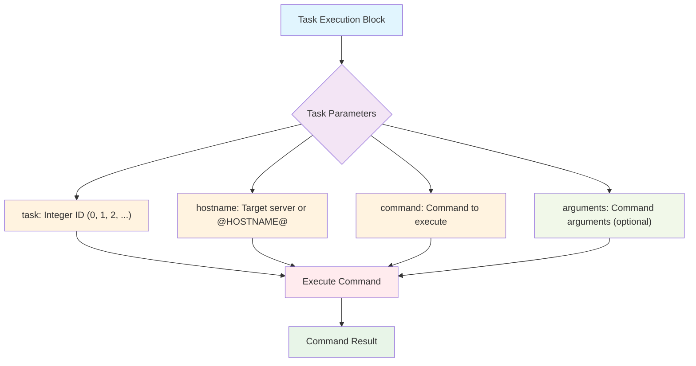
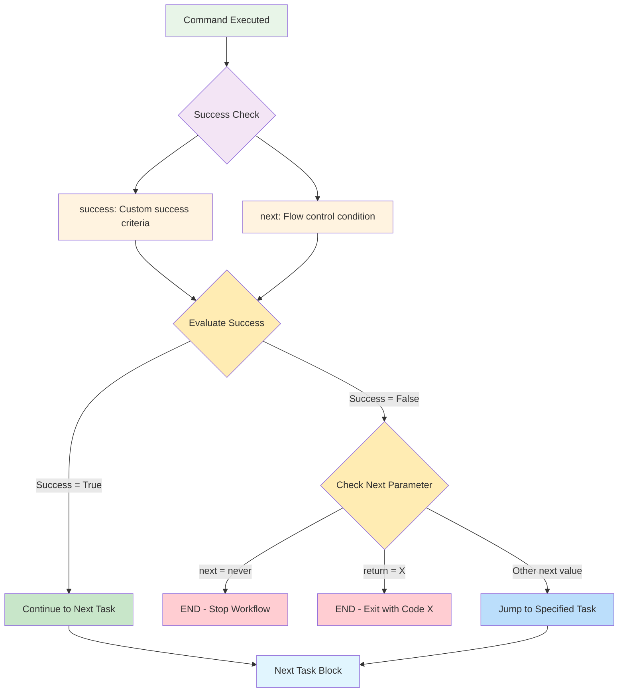
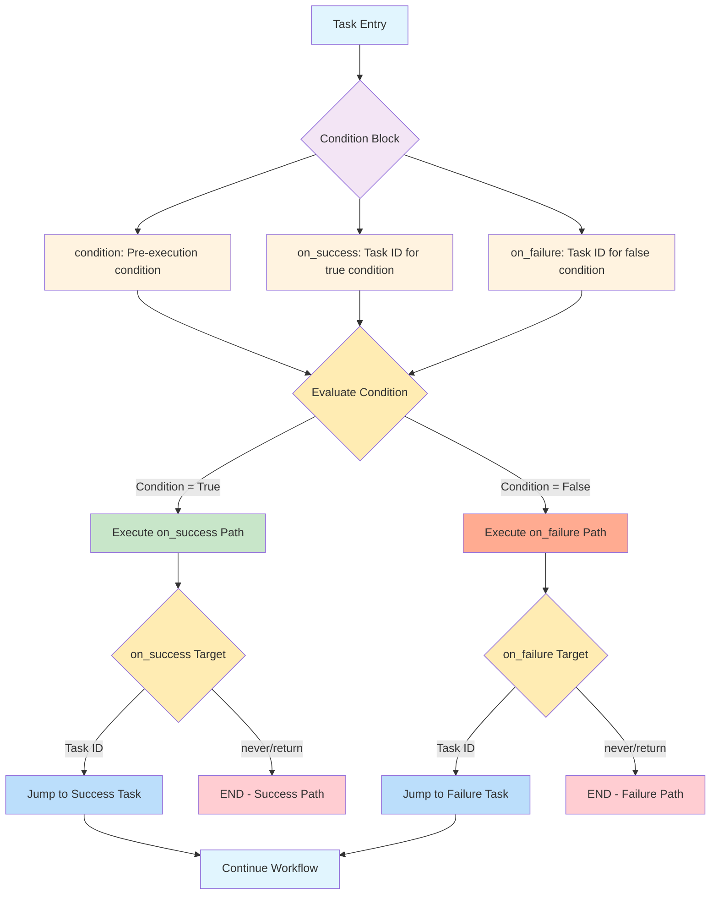

# TaskER FlowChart Documentation

This document provides visual representations of TaskER workflow blocks using Mermaid diagrams.

## Simple Execution Block

The basic building block of any TaskER workflow is the execution block, which contains the core parameters needed to execute a command on a target system.



### Parameter Details

| Parameter | Type | Required | Description |
|-----------|------|----------|-------------|
| `task` | Integer | ✅ Yes | Unique task identifier (0, 1, 2, ...) |
| `hostname` | String | ✅ Yes | Target server name or @HOSTNAME@ placeholder |
| `command` | String | ✅ Yes | Command to execute on the target system |
| `arguments` | String | ❌ Optional | Additional arguments for the command |

### Example Usage

```
task=0
hostname=server01
command=ls
arguments=-la /var/log
```

This creates a simple execution block that will run `ls -la /var/log` on server01.

## Post-Action Success Check Block

After command execution, you can define success criteria and control flow based on the result.



## Traditional Condition Block

Pre-execution condition checking with branching logic based on evaluation results.



### Parameter Details for Conditional Blocks

| Parameter | Type | Required | Description |
|-----------|------|----------|-------------|
| `success` | String | ❌ Optional | Custom success criteria for post-execution check |
| `next` | String | ❌ Optional | Flow control (never, return=X, or task ID) |
| `condition` | String | ❌ Optional | Pre-execution condition to evaluate |
| `on_success` | String | ❌ Optional | Task ID to execute when condition is true |
| `on_failure` | String | ❌ Optional | Task ID to execute when condition is false |

### Example Usage

**Post-Action Success Check:**
```
task=1
hostname=server01
command=service
arguments=nginx status
success=@1_exit_code@=0&@1_stdout@~running
next=never
```

**Traditional Condition Block:**
```
task=2
condition=@DEPLOY_ENV@=production
on_success=10
on_failure=20
```