# TaskER FlowChart Block Inventory

This document provides a visual inventory of TaskER workflow blocks with their corresponding parameters.

## 1. Execution Block

<table>
<tr>
<td width="40%">

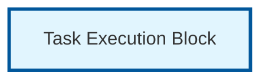

</td>
<td width="60%">

### Parameters
| Parameter | Type | Required | Description |
|-----------|------|----------|-------------|
| `task` | Integer | ✅ Yes | Unique task identifier |
| `hostname` | String | ✅ Yes | Target server or @HOSTNAME@ |
| `command` | String | ✅ Yes | Command to execute |
| `arguments` | String | ❌ Optional | Command arguments |

### Example
```
task=0
hostname=server01
command=ls
arguments=-la /var/log
```

</td>
</tr>
</table>

## 2. Success Check Block (with next)

<table>
<tr>
<td width="40%">

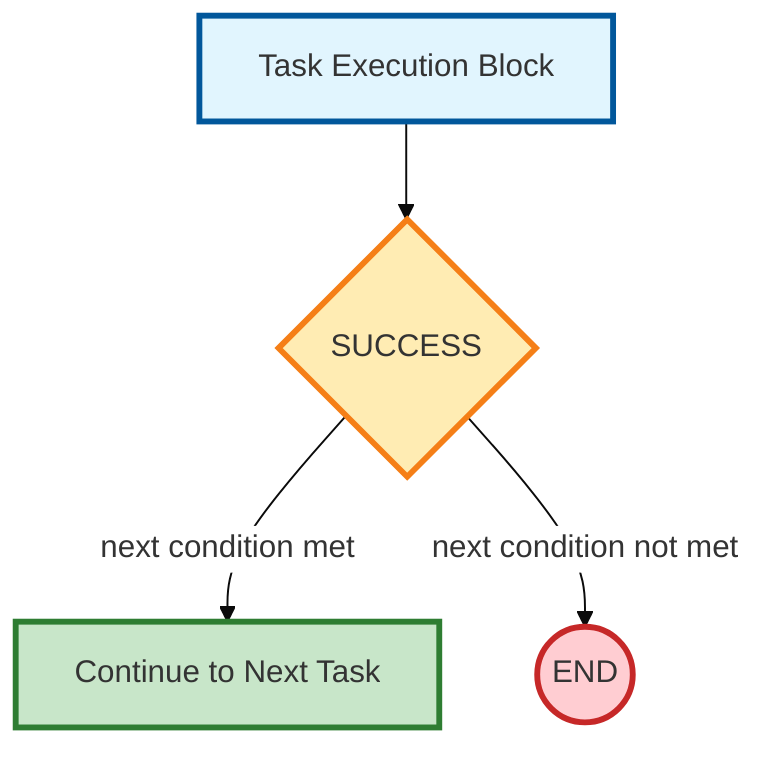

</td>
<td width="60%">

### Parameters
| Parameter | Type | Required | Description |
|-----------|------|----------|-------------|
| `success` | String | ❌ Optional | Custom success criteria |
| `next` | String | ❌ Optional | Flow control (never, return=X, task ID) |

### Example
```
# Applied to existing task:
success=@1_exit_code@=0&@1_stdout@~running
next=success
```

### Entry Point
Follows after Task Execution Block

### Behavior
- Evaluates success criteria
- If `next` condition met → Continue to next sequential task
- If `next` condition not met → End workflow or return with code

</td>
</tr>
</table>

## 3. Success Check Block (with on_success/on_failure)

<table>
<tr>
<td width="40%">

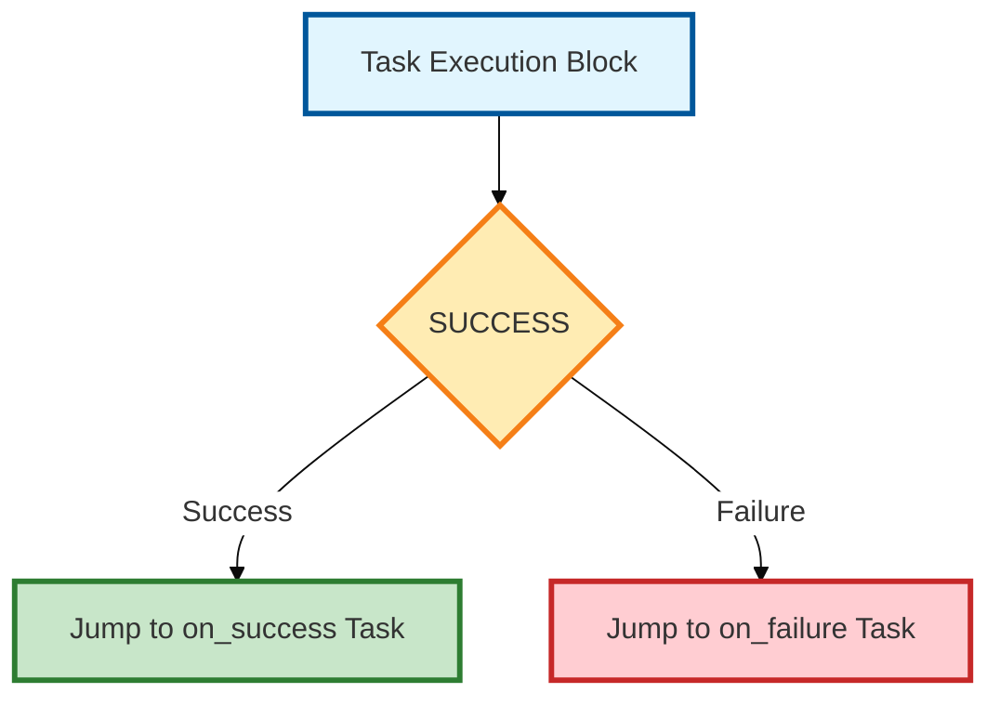

</td>
<td width="60%">

### Parameters
| Parameter | Type | Required | Description |
|-----------|------|----------|-------------|
| `success` | String | ❌ Optional | Custom success criteria |
| `on_success` | Integer | ❌ Optional | Task ID to jump to on success |
| `on_failure` | Integer | ❌ Optional | Task ID to jump to on failure |

### Example
```
# Applied to existing task:
success=@1_exit_code@=0&@1_stdout@~running
on_success=20
on_failure=99
```

### Entry Point
Follows after Task Execution Block

### Behavior
- Evaluates success criteria
- If success → Jump to `on_success` task ID
- If failure → Jump to `on_failure` task ID
- Allows non-sequential workflow jumps

</td>
</tr>
</table>

## 4. Sleep Block

<table>
<tr>
<td width="40%">

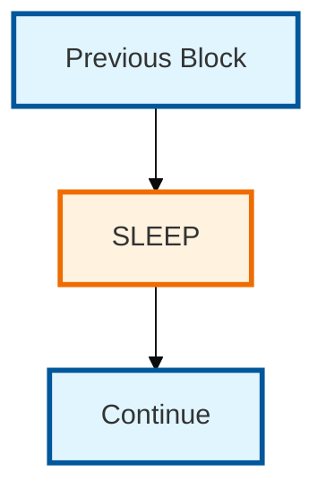

</td>
<td width="60%">

### Parameters
| Parameter | Type | Required | Description |
|-----------|------|----------|-------------|
| `sleep` | Integer | ❌ Optional | Sleep duration (0-300 seconds) |

### Example
```
# Applied to existing task:
sleep=5
```

### Entry Point
Can follow any block that executes

### Behavior
- Pauses workflow execution for specified seconds
- Useful for rate limiting or waiting for external processes
- Does not affect task success/failure status

</td>
</tr>
</table>

## 5. Conditional Block

<table>
<tr>
<td width="40%">

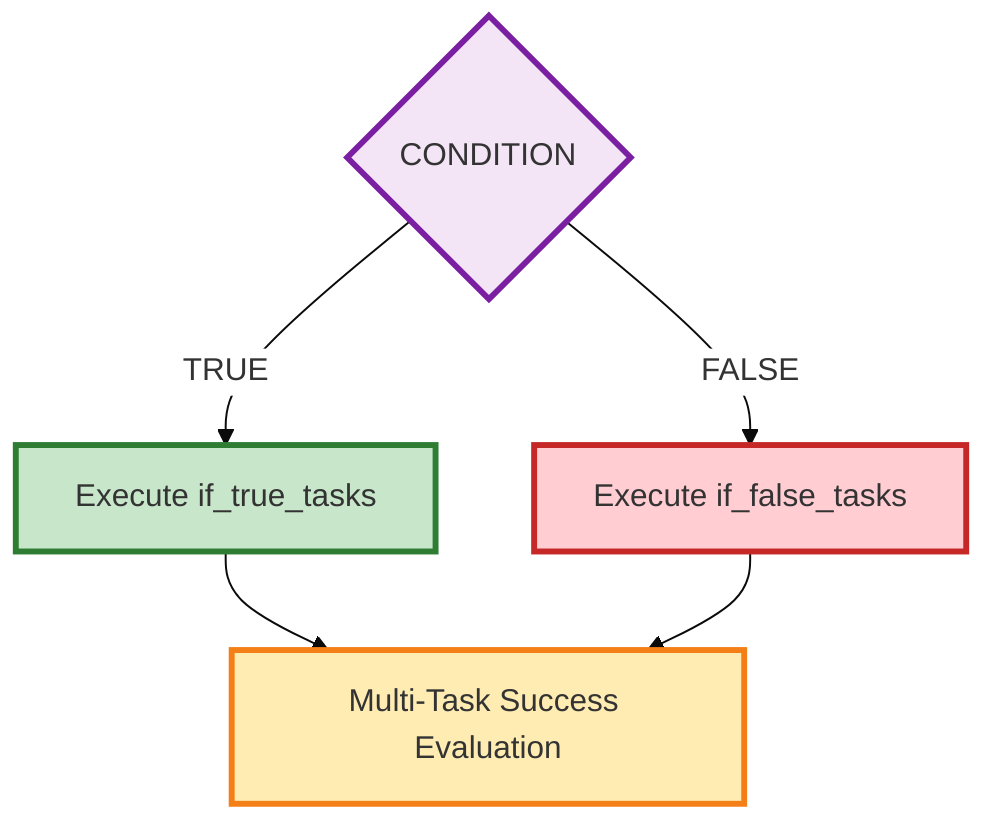

</td>
<td width="60%">

### Parameters
| Parameter | Type | Required | Description |
|-----------|------|----------|-------------|
| `task` | Integer | ✅ Yes | Unique task identifier |
| `type` | String | ✅ Yes | Must be "conditional" |
| `condition` | String | ✅ Yes | Boolean expression to evaluate |
| `if_true_tasks` | String | ✅ Yes* | Task IDs for TRUE branch |
| `if_false_tasks` | String | ✅ Yes* | Task IDs for FALSE branch |

*At least one of `if_true_tasks` or `if_false_tasks` must be specified.

### Example
```
task=2
type=conditional
condition=@0_stdout@=OPEN
if_true_tasks=10,11,12
if_false_tasks=20,21
```

### Entry Point
Can be entry point or follow any block

### Behavior
- Evaluates boolean condition expression
- If TRUE → Execute tasks in `if_true_tasks` list
- If FALSE → Execute tasks in `if_false_tasks` list
- Tasks execute sequentially in specified order (10,11,12)
- Results feed into Multi-Task Success Evaluation Block (see #10)

### Next Block
→ Multi-Task Success Evaluation Block (#10)

</td>
</tr>
</table>

## 6. Loop Block

<table>
<tr>
<td width="40%">

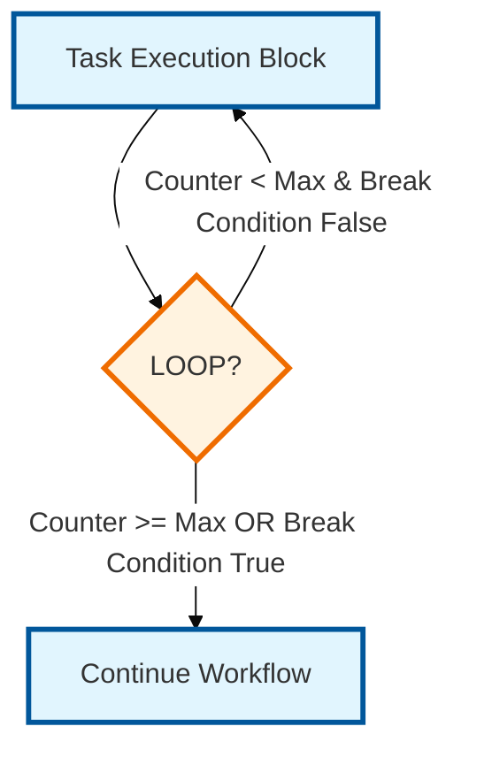

</td>
<td width="60%">

### Parameters
| Parameter | Type | Required | Description |
|-----------|------|----------|-------------|
| `loop` | Integer | ✅ Yes | Number of additional iterations (1-100) |
| `next` | String | ✅ Yes | Must be "loop" |
| `loop_break` | String | ❌ Optional | Condition to break out of loop early |

### Example
```
# Applied to existing task:
hostname=server01
command=ping
arguments=-c 1 google.com
loop=3
next=loop
loop_break=@5_stdout@~unreachable
```

### Entry Point
Applied to any Execution Block

### Behavior
- Repeats the same task for specified number of iterations
- `loop=3` means task executes 4 times total (original + 3 loops)
- `next=loop` is mandatory to enable loop functionality
- `loop_break` condition can terminate loop early if met
- Each iteration gets separate task result storage
- Useful for retry patterns or periodic checks

</td>
</tr>
</table>

## 7. Parallel Block

<table>
<tr>
<td width="40%">

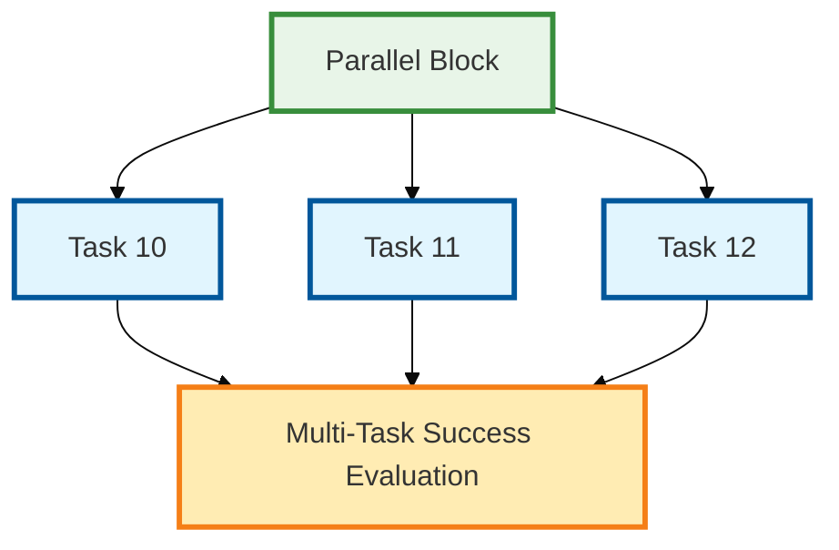

</td>
<td width="60%">

### Parameters
| Parameter | Type | Required | Description |
|-----------|------|----------|-------------|
| `task` | Integer | ✅ Yes | Unique task identifier |
| `type` | String | ✅ Yes | Must be "parallel" |
| `tasks` | String | ✅ Yes | Comma-separated task IDs to execute |
| `max_parallel` | Integer | ❌ Optional | Max concurrent tasks (1-50, default: all) |

### Example
```
task=8
type=parallel
tasks=10,11,12
max_parallel=2
```

### Entry Point
Can be entry point or follow any block

### Behavior
- Executes multiple tasks simultaneously with threading
- Results feed into Multi-Task Success Evaluation Block (see #10)
- Faster execution than sequential processing

### Next Block
→ Multi-Task Success Evaluation Block (#10)

</td>
</tr>
</table>

## 8. Parallel Block with Retry

<table>
<tr>
<td width="40%">

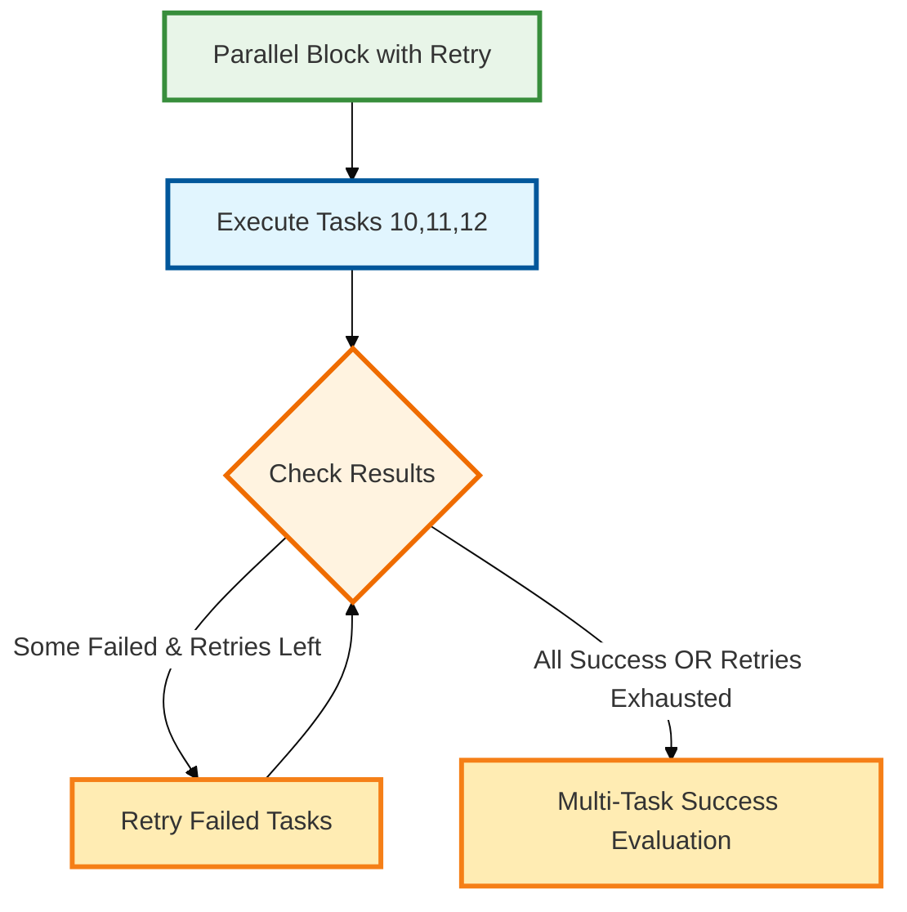

</td>
<td width="60%">

### Parameters
| Parameter | Type | Required | Description |
|-----------|------|----------|-------------|
| `task` | Integer | ✅ Yes | Unique task identifier |
| `type` | String | ✅ Yes | Must be "parallel" |
| `tasks` | String | ✅ Yes | Comma-separated task IDs to execute |
| `max_parallel` | Integer | ❌ Optional | Max concurrent tasks (1-50, default: all) |
| `retry_failed` | Boolean | ✅ Yes | Must be "true" to enable retry |
| `retry_count` | Integer | ❌ Optional | Number of retry attempts (0-10, default: 1) |
| `retry_delay` | Integer | ❌ Optional | Delay between retries (0-300 seconds, default: 1) |

### Example
```
task=8
type=parallel
tasks=10,11,12
max_parallel=2
retry_failed=true
retry_count=3
retry_delay=5
```

### Entry Point
Can be entry point or follow any block

### Behavior
- Executes multiple tasks simultaneously with threading
- Failed tasks are automatically retried up to `retry_count` times
- `retry_delay` seconds between retry attempts
- Results feed into Multi-Task Success Evaluation Block (see #10)
- More resilient than basic parallel execution

### Next Block
→ Multi-Task Success Evaluation Block (#10)

</td>
</tr>
</table>

## 9. Conditional Block with Retry

<table>
<tr>
<td width="40%">

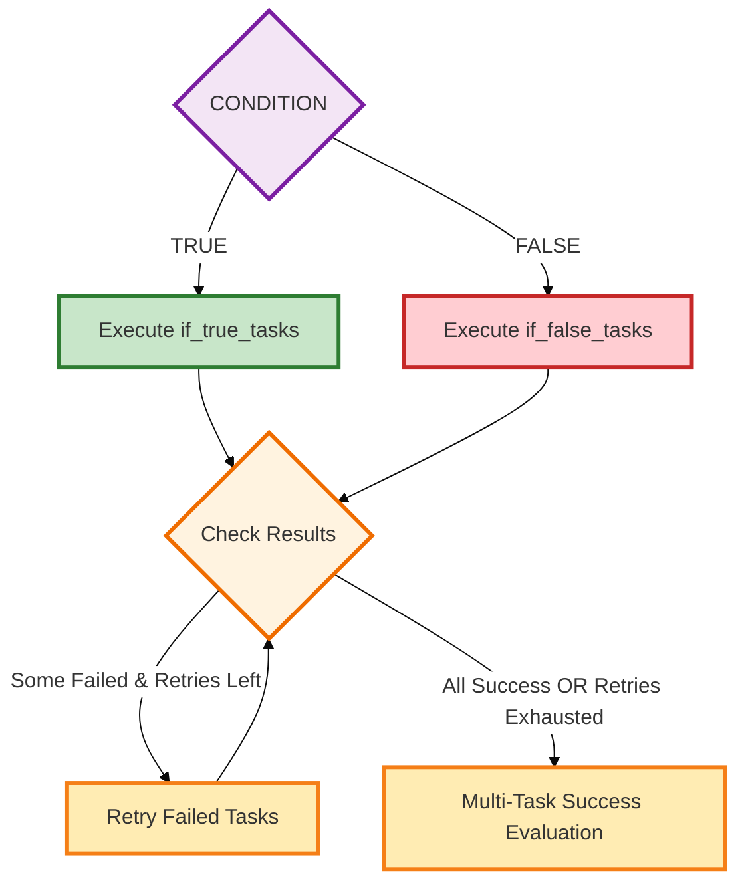

</td>
<td width="60%">

### Parameters
| Parameter | Type | Required | Description |
|-----------|------|----------|-------------|
| `task` | Integer | ✅ Yes | Unique task identifier |
| `type` | String | ✅ Yes | Must be "conditional" |
| `condition` | String | ✅ Yes | Boolean expression to evaluate |
| `if_true_tasks` | String | ✅ Yes* | Task IDs for TRUE branch |
| `if_false_tasks` | String | ✅ Yes* | Task IDs for FALSE branch |
| `retry_failed` | Boolean | ✅ Yes | Must be "true" to enable retry |
| `retry_count` | Integer | ❌ Optional | Number of retry attempts (0-10, default: 1) |
| `retry_delay` | Integer | ❌ Optional | Delay between retries (0-300 seconds, default: 1) |

*At least one of `if_true_tasks` or `if_false_tasks` must be specified.

### Example
```
task=2
type=conditional
condition=@0_stdout@=OPEN
if_true_tasks=10,11,12
if_false_tasks=20,21
retry_failed=true
retry_count=2
retry_delay=3
```

### Entry Point
Can be entry point or follow any block

### Behavior
- Evaluates boolean condition expression
- If TRUE → Execute tasks in `if_true_tasks` list
- If FALSE → Execute tasks in `if_false_tasks` list
- Failed tasks in chosen branch are automatically retried
- Tasks execute sequentially with retry logic
- Results feed into Multi-Task Success Evaluation Block (see #10)

### Next Block
→ Multi-Task Success Evaluation Block (#10)

</td>
</tr>
</table>


## 10. Multi-Task Success Evaluation Block

<table>
<tr>
<td width="40%">

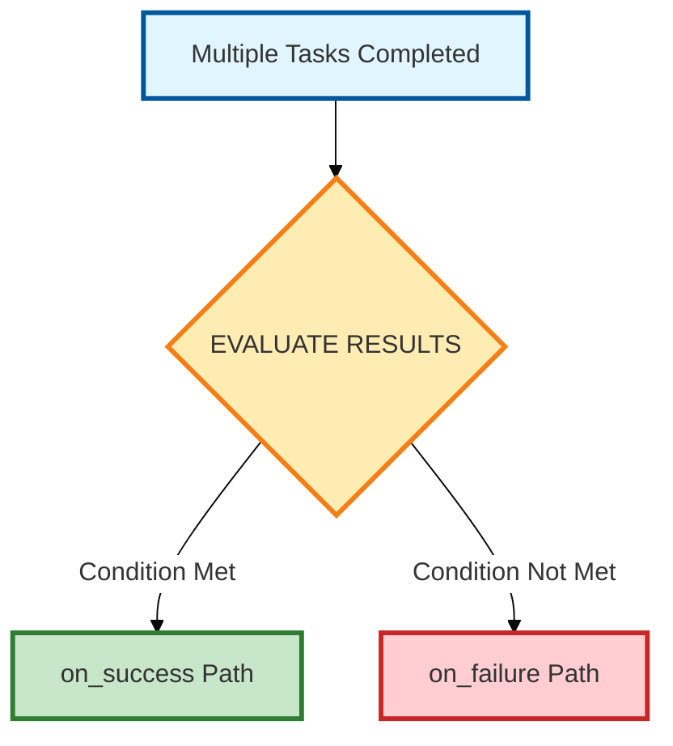

</td>
<td width="60%">

### Parameters
| Parameter | Type | Required | Description |
|-----------|------|----------|-------------|
| `next` | String | ❌ Optional | Success evaluation condition |
| `on_success` | Integer | ❌ Optional | Task ID if condition met |
| `on_failure` | Integer | ❌ Optional | Task ID if condition not met |

### Available Conditions
| Condition | Logic | Example |
|-----------|-------|---------|
| `min_success=N` | success_count ≥ N | `min_success=3` |
| `max_failed=N` | failed_count ≤ N | `max_failed=1` |
| `all_success` | success_count = total_tasks | `all_success` |
| `any_success` | success_count > 0 | `any_success` |
| `majority_success` | success_count > total_tasks/2 | `majority_success` |

### Default Behavior (no `next` specified)
- **`on_success`** → `all_success` (100% success required)
- **`on_failure`** → `max_failed=0` (any failure triggers this)

### Example
```
next=min_success=3
on_success=20
on_failure=99
```

### Entry Point
Follows after Parallel Block or Conditional Block

</td>
</tr>
</table>

## 11. End Success Block

<table>
<tr>
<td width="40%">

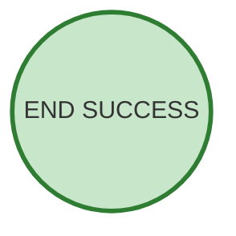

</td>
<td width="60%">

### Parameters
| Parameter | Type | Required | Description |
|-----------|------|----------|-------------|
| `task` | Integer | ✅ Yes | Unique task identifier |
| `next` | String | ❌ Optional | Must be "never" |
| `return` | Integer | ❌ Optional | Exit code 0 |

### Examples

**Stop workflow successfully:**
```
task=99
next=never
```

**Explicit success with exit code:**
```
task=100
return=0
```

### Entry Point
Terminal block - workflow ends successfully

### Behavior
- Workflow terminates with success status
- Default exit code: 0
- Overall workflow result: SUCCESS

</td>
</tr>
</table>

## 12. End Failure Block

<table>
<tr>
<td width="40%">

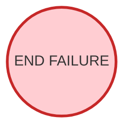

</td>
<td width="60%">

### Parameters
| Parameter | Type | Required | Description |
|-----------|------|----------|-------------|
| `task` | Integer | ✅ Yes | Unique task identifier |
| `next` | String | ❌ Optional | Must be "never" |
| `return` | Integer | ✅ Yes | Exit code 1-255 |

### Examples

**Stop workflow with failure:**
```
task=98
return=1
```

**Stop with specific error code:**
```
task=97
return=14
```

**Explicit failure with never:**
```
task=96
next=never
return=1
```

### Entry Point
Terminal block - workflow ends with failure

### Behavior
- Workflow terminates with failure status
- Exit code: 1-255 (non-zero = failure)
- Overall workflow result: FAILURE

</td>
</tr>
</table>

## 13. Global Variable Definition Block

<table>
<tr>
<td width="40%">

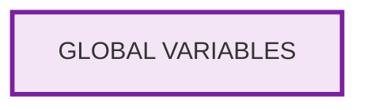

</td>
<td width="60%">

### Parameters
| Parameter | Type | Required | Description |
|-----------|------|----------|-------------|
| `VARIABLE_NAME` | String | ✅ Yes | Any uppercase variable name |
| `value` | String | ✅ Yes | Variable value or expression |

### Examples
```
ENVIRONMENT=production
DATABASE_HOST=db.company.com
RETRY_COUNT=3
TIMEOUT_SECONDS=30
```

### Entry Point
Must be at the beginning of workflow file

### Behavior
- Defines reusable variables for entire workflow
- Variables are read-only and available throughout file
- Use @VARIABLE_NAME@ syntax to reference in tasks
- Case-sensitive variable names (recommended: UPPERCASE)
- Automatic creation - any KEY=VALUE that's not a task parameter

</td>
</tr>
</table>

## 14. Output Processing Block

<table>
<tr>
<td width="40%">

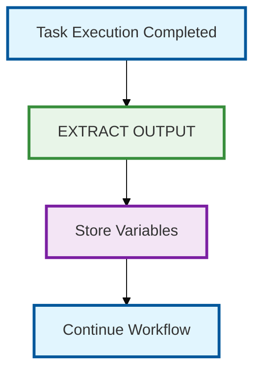

</td>
<td width="60%">

### Parameters
| Parameter | Type | Required | Description |
|-----------|------|----------|-------------|
| `stdout_split` | String | ❌ Optional | Split stdout by delimiter and select element |
| `stderr_split` | String | ❌ Optional | Split stderr by delimiter and select element |

### Example
```
# Applied to existing task:
stdout_split=comma,1
stderr_split=space,2
```

### Entry Point
Applied to any task that produces output

### Behavior
- Splits stdout/stderr by specified delimiter and selects element by index
- Format: `delimiter,index` (e.g., `comma,1` for second element after splitting by comma)
- Modified output replaces original for subsequent processing

</td>
</tr>
</table>
