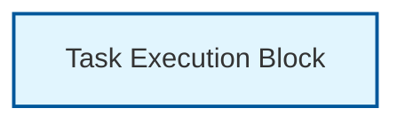
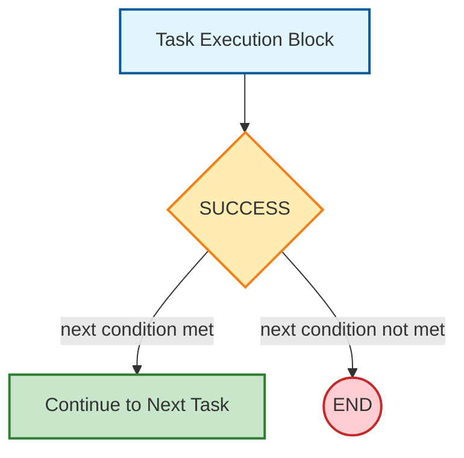
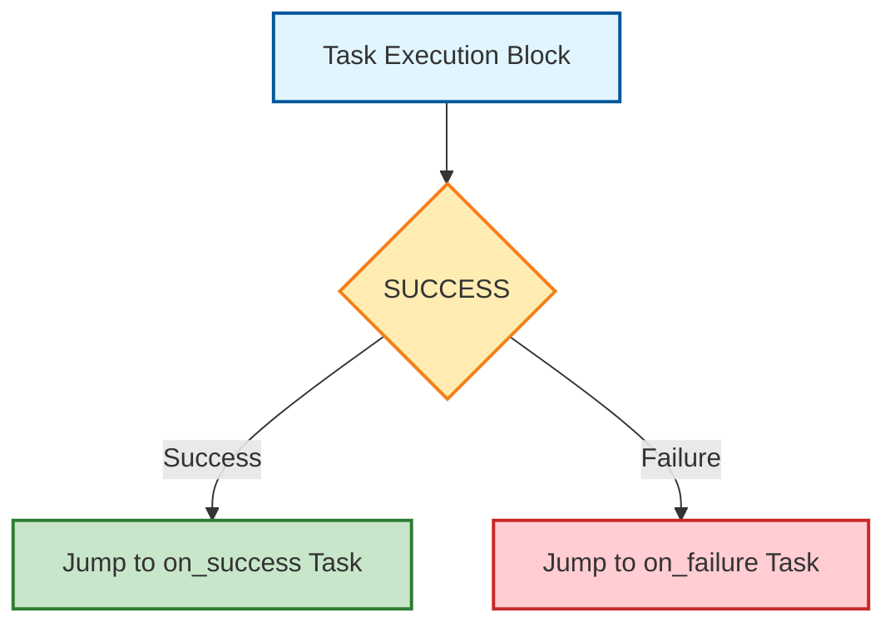
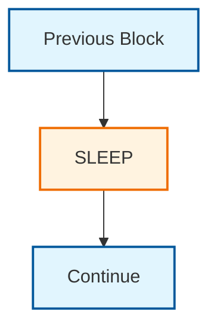
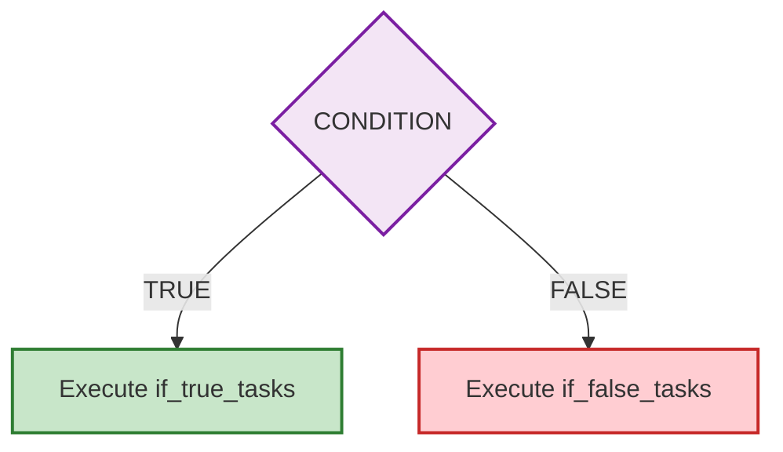
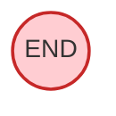

# TaskER FlowChart Block Inventory

This document provides a visual inventory of TaskER workflow blocks with their corresponding parameters.

<style>
.mermaid {
  text-align: center;
}
.mermaid svg {
  max-width: 100% !important;
  height: auto !important;
}
</style>

## 1. Execution Block

<table>
<tr>
<td width="40%">



</td>
<td width="60%">

### Parameters
| Parameter | Type | Required | Description |
|-----------|------|----------|-------------|
| `task` | Integer | ✅ Yes | Unique task identifier |
| `hostname` | String | ✅ Yes | Target server or @HOSTNAME@ |
| `command` | String | ✅ Yes | Command to execute |
| `arguments` | String | ❌ Optional | Command arguments |

### Example
```
task=0
hostname=server01
command=ls
arguments=-la /var/log
```

</td>
</tr>
</table>

## 2. Success Check Block (with next)

<table>
<tr>
<td width="40%">



</td>
<td width="60%">

### Parameters
| Parameter | Type | Required | Description |
|-----------|------|----------|-------------|
| `success` | String | ❌ Optional | Custom success criteria |
| `next` | String | ❌ Optional | Flow control (never, return=X, task ID) |

### Example
```
success=@1_exit_code@=0&@1_stdout@~running
next=@1_stdout@~completed
```

### Entry Point
Follows after Task Execution Block

### Behavior
- Evaluates success criteria
- If `next` condition met → Continue to next sequential task
- If `next` condition not met → End workflow or return with code

</td>
</tr>
</table>

## 3. Success Check Block (with on_success/on_failure)

<table>
<tr>
<td width="40%">



</td>
<td width="60%">

### Parameters
| Parameter | Type | Required | Description |
|-----------|------|----------|-------------|
| `success` | String | ❌ Optional | Custom success criteria |
| `on_success` | Integer | ❌ Optional | Task ID to jump to on success |
| `on_failure` | Integer | ❌ Optional | Task ID to jump to on failure |

### Example
```
success=@1_exit_code@=0&@1_stdout@~running
on_success=20
on_failure=99
```

### Entry Point
Follows after Task Execution Block

### Behavior
- Evaluates success criteria
- If success → Jump to `on_success` task ID
- If failure → Jump to `on_failure` task ID
- Allows non-sequential workflow jumps

</td>
</tr>
</table>

## 4. Sleep Block

<table>
<tr>
<td width="40%">



</td>
<td width="60%">

### Parameters
| Parameter | Type | Required | Description |
|-----------|------|----------|-------------|
| `sleep` | Integer | ❌ Optional | Sleep duration (0-300 seconds) |

### Example
```
sleep=5
```

### Entry Point
Can follow any block that executes

### Behavior
- Pauses workflow execution for specified seconds
- Useful for rate limiting or waiting for external processes
- Does not affect task success/failure status

</td>
</tr>
</table>

## 5. Condition Block

<table>
<tr>
<td width="40%">



</td>
<td width="60%">

### Parameters
| Parameter | Type | Required | Description |
|-----------|------|----------|-------------|
| `task` | Integer | ✅ Yes | Unique task identifier |
| `type` | String | ✅ Yes | Must be "conditional" |
| `condition` | String | ✅ Yes | Boolean expression to evaluate |
| `if_true_tasks` | String | ✅ Yes* | Task IDs for TRUE branch |
| `if_false_tasks` | String | ✅ Yes* | Task IDs for FALSE branch |

*At least one of `if_true_tasks` or `if_false_tasks` must be specified.

### Example
```
task=2
type=conditional
condition=@DEPLOY_ENV@=production
if_true_tasks=10,11,12
if_false_tasks=20,21
```

### Entry Point
Can be entry point or follow any block

### Behavior
- Evaluates boolean condition expression
- If TRUE → Execute tasks in `if_true_tasks` list
- If FALSE → Execute tasks in `if_false_tasks` list
- Tasks execute in specified order (10,11,12)

</td>
</tr>
</table>

## 6. End Block

<table>
<tr>
<td width="40%">



</td>
<td width="60%">

### Parameters
| Parameter | Type | Required | Description |
|-----------|------|----------|-------------|
| `next` | String | ❌ Optional | Must be "never" to stop workflow |
| `return` | Integer | ❌ Optional | Exit code (0-255) and workflow success |

### Examples

**Stop workflow (exit code 0):**
```
next=never
```

**Stop workflow with specific exit code:**
```
return=1
```

**Stop workflow with success code and explicit never:**
```
next=never
return=0
```

### Entry Point
Terminal block - workflow ends here

### Behavior
- `next=never` → Stop workflow execution
- `return=X` → Stop workflow with exit code X (0=success, 1-255=failure)
- `return` sets both exit code AND overall workflow success/failure
- If neither specified, workflow continues to next sequential task

</td>
</tr>
</table>