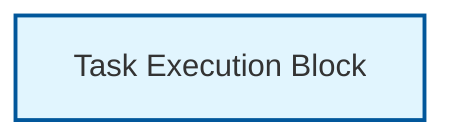
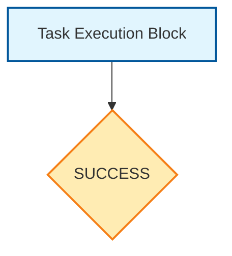
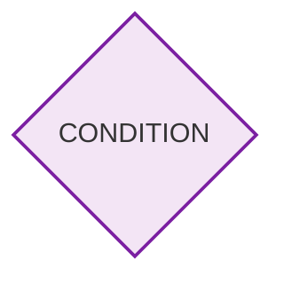
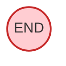

# TaskER FlowChart Block Inventory

This document provides a visual inventory of TaskER workflow blocks with their corresponding parameters.

## 1. Execution Block

<table>
<tr>
<td width="40%">



</td>
<td width="60%">

### Parameters
| Parameter | Type | Required | Description |
|-----------|------|----------|-------------|
| `task` | Integer | ✅ Yes | Unique task identifier |
| `hostname` | String | ✅ Yes | Target server or @HOSTNAME@ |
| `command` | String | ✅ Yes | Command to execute |
| `arguments` | String | ❌ Optional | Command arguments |
| `exec` | String | ❌ Optional | Execution type (pbrun, p7s, local, wwrs) |
| `timeout` | Integer | ❌ Optional | Command timeout (5-3600 seconds) |
| `sleep` | Integer | ❌ Optional | Sleep after execution (0-300 seconds) |

### Example
```
task=0
hostname=server01
command=ls
arguments=-la /var/log
exec=pbrun
timeout=30
sleep=5
```

</td>
</tr>
</table>

## 2. Success Check Block

<table>
<tr>
<td width="40%">



</td>
<td width="60%">

### Parameters
| Parameter | Type | Required | Description |
|-----------|------|----------|-------------|
| `success` | String | ❌ Optional | Custom success criteria |
| `next` | String | ❌ Optional | Flow control (never, return=X, task ID) |

### Example
```
success=@1_exit_code@=0&@1_stdout@~running
next=never
```

### Entry Point
Follows after Task Execution Block

</td>
</tr>
</table>

## 3. Condition Block

<table>
<tr>
<td width="40%">



</td>
<td width="60%">

### Parameters
| Parameter | Type | Required | Description |
|-----------|------|----------|-------------|
| `task` | Integer | ✅ Yes | Unique task identifier |
| `type` | String | ✅ Yes | Must be "conditional" |
| `condition` | String | ✅ Yes | Boolean expression to evaluate |
| `if_true_tasks` | String | ✅ Yes* | Task IDs for TRUE branch |
| `if_false_tasks` | String | ✅ Yes* | Task IDs for FALSE branch |
| `next` | String | ❌ Optional | Success evaluation condition |
| `on_success` | Integer | ❌ Optional | Task ID if next condition met |
| `on_failure` | Integer | ❌ Optional | Task ID if next condition not met |

*At least one of `if_true_tasks` or `if_false_tasks` must be specified.

### Example
```
task=2
type=conditional
condition=@DEPLOY_ENV@=production
if_true_tasks=10,11,12
if_false_tasks=20,21
next=min_success=2
on_success=30
on_failure=99
```

### Supported `next` Conditions
- `min_success=N`: At least N tasks must succeed
- `max_failed=N`: At most N tasks can fail
- `all_success`: All tasks must succeed
- `any_success`: At least one task must succeed
- `majority_success`: More than 50% must succeed

### Entry Point
Can be entry point or follow any block

</td>
</tr>
</table>

## 4. End Block

<table>
<tr>
<td width="40%">



</td>
<td width="60%">

### Parameters
| Parameter | Type | Required | Description |
|-----------|------|----------|-------------|
| `next` | String | ✅ Yes | Must be "never" |
| `return` | Integer | ❌ Optional | Exit code (0-255) |

### Example
```
next=never
```
or
```
return=0
```

### Entry Point
Terminal block - workflow ends here

</td>
</tr>
</table>