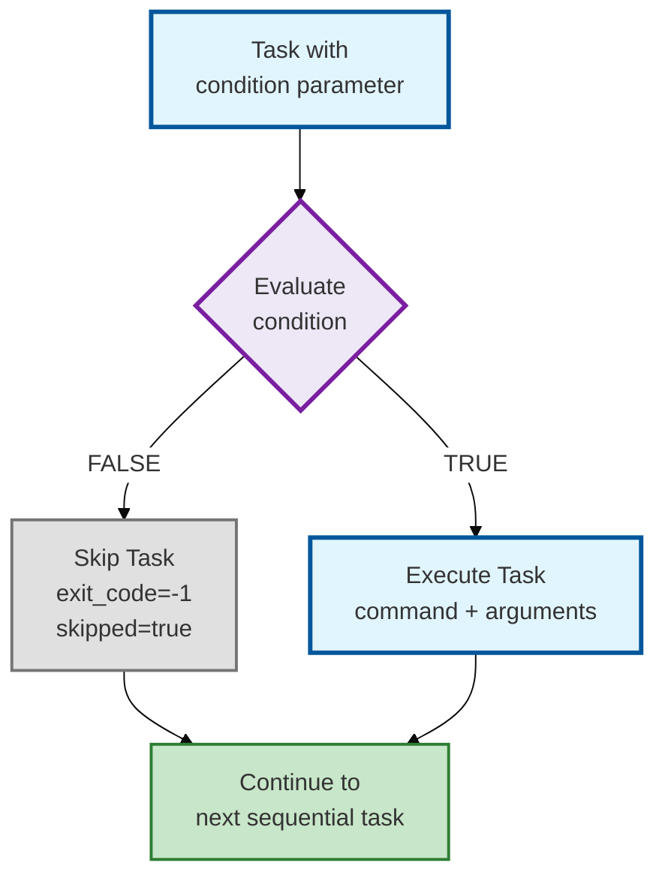
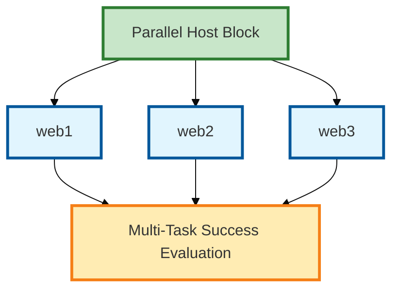
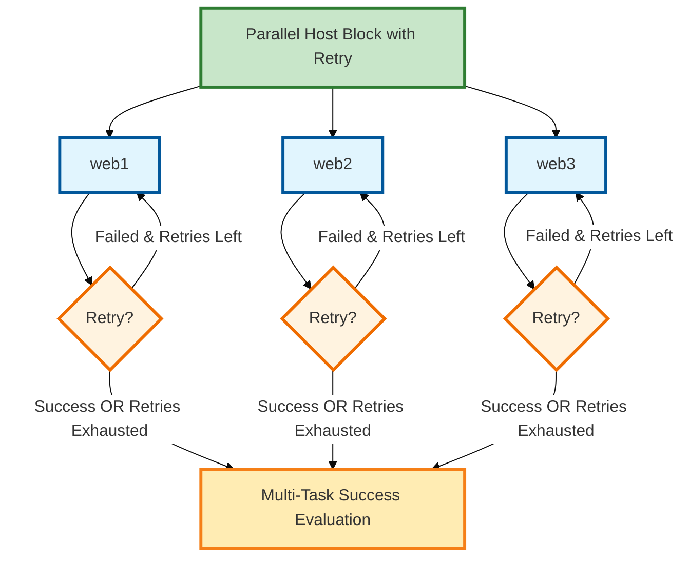

# TaskER FlowChart Block Inventory

<!-- markdownlint-disable MD024 MD051 - Duplicate headings (Parameters, Example, Entry Point, Behavior) are intentional for consistent block structure. TOC fragment links work correctly in GitHub markdown despite linter warnings. -->

This document provides a visual inventory of TaskER workflow blocks with their corresponding parameters.

## Table of Contents

1. [Execution Block](#1.-execution-block)
2. [Success Check Block](#2.-success-check-block)
3. [Sleep Block](#3.-sleep-block)
4. [Loop Block](#4.-loop-block)
5. [End Block](#5.-end-block)
6. [Decision Block](#6.-decision-block)
7. [Conditional Execution (Task Level)](#7.-conditional-execution-task-level)
8. [Conditional Block](#8.-conditional-block)
9. [Parallel Block](#9.-parallel-block)
10. [Multi-Task Success Evaluation Block](#10.-multi-task-success-evaluation-block)
11. [Configuration Definition Block](#11.-configuration-definition-block)
12. [File-Defined Arguments Block](#12.-file-defined-arguments-block)
13. [Global Variable Definition Block](#13.-global-variable-definition-block)
14. [Output Processing Block](#14.-output-processing-block)

---

## 1. Execution Block

<table>
<tr>
<td width="40%">


</td>
<td width="60%">

### Parameters

| Parameter | Type | Required | Description |
|-----------|------|----------|-------------|
| `task` | Integer | ✅ Yes | Unique task identifier |
| `hostname` | String | ✅ Yes | Target server or @HOSTNAME@ |
| `command` | String | ✅ Yes | Command to execute |
| `arguments` | String | ❌ Optional | Command arguments |

### Example

```bash
task=0
hostname=server01
command=ls
arguments=-la /var/log
```

</td>
</tr>
</table>

## 2. Success Check Block

Success Check blocks determine workflow routing based on task execution results. Two routing patterns available:

- **Using next Parameter** (2.1): Continue or stop workflow based on success criteria
- **Using on_success/on_failure** (2.2): Jump to specific task IDs based on success criteria

### 2.1 Success Check Block (with next)

<table>
<tr>
<td width="40%">


</td>
<td width="60%">

### Parameters

| Parameter | Type | Required | Description |
|-----------|------|----------|-------------|
| `success` | String | ❌ Optional | Custom success criteria |
| `next` | String | ❌ Optional | Flow control (never, return=X, task ID) |

### Example

```bash
# Applied to existing task:
success=exit_0&stdout~running
next=success
```

### Entry Point

This block follows the Task Execution Block.

### Behavior

- Evaluates success criteria
- If `next` condition met → Continue to next sequential task
- If `next` condition not met → End workflow or return with code

</td>
</tr>
</table>

### 2.2 Success Check Block (with on_success/on_failure)

<table>
<tr>
<td width="40%">


</td>
<td width="60%">

### Parameters

| Parameter | Type | Required | Description |
|-----------|------|----------|-------------|
| `success` | String | ❌ Optional | Custom success criteria |
| `on_success` | Integer | ❌ Optional | Task ID to jump to on success |
| `on_failure` | Integer | ❌ Optional | Task ID to jump to on failure |

**Note:** `on_success` and `on_failure` can be used independently or together. If only one is specified, the other follows default behavior (continue to next task or end workflow).

### Example

```bash
# Applied to existing task:
success=exit_0&stdout~running
on_success=20
on_failure=99
```

### Entry Point

This block follows the Task Execution Block.

### Behavior

- Evaluates success criteria
- If success → Jump to `on_success` task ID
- If failure → Jump to `on_failure` task ID
- Allows non-sequential workflow jumps

</td>
</tr>
</table>

## 3. Sleep Block

<table>
<tr>
<td width="40%">


</td>
<td width="60%">

### Parameters

| Parameter | Type | Required | Description |
|-----------|------|----------|-------------|
| `sleep` | Integer | ❌ Optional | Sleep duration (0-300 seconds) |

### Example

```bash
# Applied to existing task:
sleep=5
```

### Entry Point

This block can follow any block that executes.

### Behavior

- Pauses workflow execution for specified seconds
- Useful for rate limiting or waiting for external processes
- Does not affect task success/failure status

</td>
</tr>
</table>

## 4. Loop Block

<table>
<tr>
<td width="40%">


</td>
<td width="60%">

### Parameters

| Parameter | Type | Required | Description |
|-----------|------|----------|-------------|
| `loop` | Integer | ✅ Yes | Number of iterations to execute (1-1000) |
| `next` | String | ✅ Yes | Must be "loop" |
| `loop_break` | String | ❌ Optional | Condition to break out of loop early |

### Example

```bash
task=0
hostname=localhost
command=conditional_exit.sh
arguments=3
exec=local
loop=10
next=loop
loop_break=exit_0
```

### Entry Point

This parameter is applied to any Execution Block.

### Behavior

- Repeats the same task for specified number of iterations
- `loop=3` means task executes exactly 3 times (Task X.1, X.2, X.3)
- `next=loop` is mandatory to enable loop functionality
- `loop_break` condition can terminate loop early if met
- **Loop vs Retry**: Loops execute ALL iterations regardless of success/failure (unless `loop_break` is met). This differs from retry logic (Section 9), which ONLY retries tasks that fail.
- **Only the LAST iteration result is stored** - `@X_stdout@` references get final iteration output
- Task IDs are displayed with iteration numbers (e.g., Task 5.1, 5.2, 5.3)
- Useful for retry patterns or periodic checks

</td>
</tr>
</table>

## 5. End Block

End blocks provide explicit workflow termination by success or failure status.

### 5.1 End Success Block

<table>
<tr>
<td width="40%">


</td>
<td width="60%">

### Parameters

| Parameter | Type | Required | Description |
|-----------|------|----------|-------------|
| `task` | Integer | ✅ Yes | Unique task identifier |
| `next` | String | ❌ Optional | Must be "never" |
| `return` | Integer | ❌ Optional | Exit code 0 |

### Examples

**Stop workflow successfully:**

```bash
task=99
next=never
```

**Explicit success with exit code:**

```bash
task=100
return=0
```

### Entry Point

This is a terminal block that ends the workflow successfully.

### Behavior

- Workflow terminates with success (exit code 0)
- Overall workflow result: SUCCESS

</td>
</tr>
</table>

### 5.2 End Failure Block

<table>
<tr>
<td width="40%">


</td>
<td width="60%">

### Parameters

| Parameter | Type | Required | Description |
|-----------|------|----------|-------------|
| `task` | Integer | ✅ Yes | Unique task identifier |
| `next` | String | ❌ Optional | Must be "never" |
| `return` | Integer | ✅ Yes | Exit code 1-255 |

### Examples

**Stop workflow with failure:**

```bash
task=98
return=1
```

**Stop with specific error code:**

```bash
task=97
return=14
```

**Explicit failure with never:**

```bash
task=96
next=never
return=1
```

### Entry Point

This is a terminal block that ends the workflow with failure.

### Behavior

- Workflow terminates with failure status
- Exit code: 1-255 (non-zero = failure)
- Overall workflow result: FAILURE

</td>
</tr>
</table>

## 6. Decision Block

Decision blocks provide lightweight conditional routing without command execution. Two routing patterns available:

### 6.1 Decision Block with next Parameter

<table>
<tr>
<td width="40%">


</td>
<td width="60%">

### Purpose

Simple pass/fail gate using `next` parameter for routing

### Required Parameters

| Parameter | Type | Required | Description |
|-----------|------|----------|-------------|
| `task` | Integer | ✅ Yes | Unique task identifier |
| `type` | String | ✅ Yes | Must be "decision" |
| `success` | String | ✅ Yes* | Success condition to evaluate |
| `next` | String | ⚠️ Optional | Routing: always, never, success (default) |

*Either `success` OR `failure` is required.

### Example

```bash
# Early exit if both ports failed
task=2
type=decision
success=@0_exit@=0|@1_exit@=0
next=success
# If TRUE → continue (next=success evaluates TRUE)
# If FALSE → stop (next=success evaluates FALSE)
```

### Behavior

**Default behavior (`next=success` if missing):**
- Condition TRUE → Continue to next task
- Condition FALSE → **Workflow STOPS**

**Other `next` values:**
- `next=always` → Always continue regardless
- `next=never` → Always stop regardless

### Use Case

Perfect for early exit scenarios where you want to stop if a condition fails.

</td>
</tr>
</table>

### 6.2 Decision Block with on_success/on_failure

<table>
<tr>
<td width="40%">


</td>
<td width="60%">

### Purpose

Explicit routing to different task paths based on condition result

### Required Parameters

| Parameter | Type | Required | Description |
|-----------|------|----------|-------------|
| `task` | Integer | ✅ Yes | Unique task identifier |
| `type` | String | ✅ Yes | Must be "decision" |
| `success` | String | ✅ Yes* | Success condition to evaluate |
| `on_success` | Integer | ⚠️ Optional** | Task ID for TRUE path |
| `on_failure` | Integer | ⚠️ Optional** | Task ID for FALSE path |

*Either `success` OR `failure` is required.
**At least one routing parameter recommended.

### Example

```bash
# Route based on port availability
task=2
type=decision
success=@0_exit@=0|@1_exit@=0
on_success=3
on_failure=99
# If TRUE → jump to task 3 (try downloads)
# If FALSE → jump to task 99 (error handler)
```

### Behavior

**Routing Priority:**
1. Check `on_success` or `on_failure` based on condition result
2. If not defined, falls back to `next` parameter logic

### Use Case

Perfect for branching workflows where different paths handle success vs failure differently.

</td>
</tr>
</table>

### Key Differences from Conditional Block

- No command execution (no `hostname`, `command`, `arguments`)
- No task branches (`if_true_tasks`, `if_false_tasks`)
- Pure routing logic - lighter weight
- Uses familiar success/failure condition syntax

### Next Block

→ Jump to specified task ID or continue/stop based on routing

## 7. Conditional Execution (Task Level)

<table>
<tr>
<td width="40%">



</td>
<td width="60%">

### Purpose

Skip individual tasks based on runtime conditions (pre-execution check)

### Parameters

| Parameter | Type | Required | Description |
|-----------|------|----------|-------------|
| `task` | Integer | ✅ Yes | Unique task identifier |
| `condition` | String | ✅ Yes | Condition to evaluate before execution |
| `command` | String | ✅ Yes | Command to execute if condition TRUE |
| `hostname` | String | ✅ Yes | Target host |

### Example

```bash
# Task 1: Restart service (only if check succeeded)
task=1
hostname=localhost
condition=@0_exit@=0
command=echo
arguments=Restarting service
exec=local
```

### Entry Point

This block can be an entry point or follow any block.

### Behavior

- Evaluates `condition` **before** executing task
- **If condition FALSE:**
  - Task is skipped (not executed)
  - Result: `exit_code=-1`, `stderr='Task skipped due to condition'`, `skipped=true`
  - Workflow continues to next sequential task
- **If condition TRUE:**
  - Task executes normally
  - Normal task logic applies (routing, success/failure handling, etc.)

**Note:** Routing parameters (`on_success`, `on_failure`, `next`) work normally if task executes. See Section 2 for routing details.

### Next Block

- Always continues to next sequential task (skipped or executed)
- If executed and has routing: routing applies normally

</td>
</tr>
</table>

## 8. Conditional Block

Conditional blocks provide branching logic based on runtime evaluation. Two execution patterns available:

- **Basic Conditional** (8.1): Execute if_true_tasks or if_false_tasks based on condition evaluation
- **Conditional with Retry** (8.2): Adds automatic retry capability for failed tasks in chosen branch

### 8.1 Conditional Block (Basic)

<table>
<tr>
<td width="40%">


</td>
<td width="60%">

### Parameters

| Parameter | Type | Required | Description |
|-----------|------|----------|-------------|
| `task` | Integer | ✅ Yes | Unique task identifier |
| `type` | String | ✅ Yes | Must be "conditional" |
| `condition` | String | ✅ Yes | Boolean expression to evaluate |
| `if_true_tasks` | String | ✅ Yes | Task IDs for TRUE branch (non-empty) |
| `if_false_tasks` | String | ✅ Yes | Task IDs for FALSE branch (non-empty) |

**Both branches are required and must be non-empty** (validation error otherwise).

### Example

```bash
task=2
type=conditional
condition=@0_stdout@=OPEN
if_true_tasks=10,11,12
if_false_tasks=20,21
```

### Entry Point

This block can be an entry point or follow any block.

### Behavior

- Evaluates boolean condition expression
- If TRUE → Execute tasks in `if_true_tasks` list
- If FALSE → Execute tasks in `if_false_tasks` list
- Tasks execute sequentially in specified order (10,11,12)
- Results feed into Multi-Task Success Evaluation Block (see # 10.1)

**CRITICAL Routing Restrictions:**
- **Subtasks CANNOT have routing parameters** (`on_success`, `on_failure`, `next=never/loop`)
- Control MUST return to conditional block for Multi-Task Success Evaluation
- Validation will **FAIL** if subtasks contain routing parameters
- **Use Decision Blocks** instead if individual task routing is needed

**Subtask ID Range Convention (Recommended):**
- Use distinct ID ranges to clearly separate subtasks from main workflow
- Recommended: Task N subtasks in range `[N*100, (N+1)*100-1]`
- Example: Task 2 subtasks → 200-299 (calculation: 2×100=200 to 3×100-1=299)
- Example: Task 1 subtasks → 100-199, Task 5 subtasks → 500-599
- Use `--skip-subtask-range-validation` CLI flag to suppress warnings if using custom numbering schemes
- **When to deviate**: Legacy workflows, specific organizational standards, or complex multi-level branching

### Next Block

→ Multi-Task Success Evaluation Block (# 9.1)

</td>
</tr>
</table>

### 8.2 Conditional Block with Retry

<table>
<tr>
<td width="40%">


</td>
<td width="60%">

### Parameters

| Parameter | Type | Required | Description |
|-----------|------|----------|-------------|
| `task` | Integer | ✅ Yes | Unique task identifier |
| `type` | String | ✅ Yes | Must be "conditional" |
| `condition` | String | ✅ Yes | Boolean expression to evaluate |
| `if_true_tasks` | String | ✅ Yes | Task IDs for TRUE branch (non-empty) |
| `if_false_tasks` | String | ✅ Yes | Task IDs for FALSE branch (non-empty) |
| `retry_count` | Integer | ❌ Optional | Number of retry attempts (1-1000, default: 1, enables retry) |
| `retry_delay` | Integer | ❌ Optional | Delay between retries (0-300 seconds, default: 1) |

**Both branches are required and must be non-empty** (validation error otherwise).

### Example

```bash
task=2
type=conditional
condition=@0_stdout@=OPEN
if_true_tasks=10,11,12
if_false_tasks=20,21
retry_count=2
retry_delay=3
```

### Entry Point

This block can be an entry point or follow any block.

### Behavior

- Evaluates boolean condition expression
- If TRUE → Execute tasks in `if_true_tasks` list
- If FALSE → Execute tasks in `if_false_tasks` list
- **Retry vs Loop**: Failed tasks in chosen branch are automatically retried up to `retry_count` times. This differs from loop logic (Section 4), which executes ALL iterations regardless of success/failure.
- Tasks execute sequentially with retry logic
- Results feed into Multi-Task Success Evaluation Block (see # 10.1)

### Next Block

→ Multi-Task Success Evaluation Block (# 10.1)

</td>
</tr>
</table>

## 9. Parallel Block

Parallel blocks enable concurrent task execution using threading. Four execution patterns available:

- **Parallel Task Block** (9.1): Execute multiple independent tasks simultaneously
- **Parallel Task with Retry** (9.2): Adds automatic retry capability for failed tasks
- **Parallel Host Block** (9.3): Execute same command across multiple hosts
- **Parallel Host with Retry** (9.4): Combines multi-host execution with retry logic

### 9.1 Parallel Task Block

<table>
<tr>
<td width="40%">


</td>
<td width="60%">

### Parameters

| Parameter | Type | Required | Description |
|-----------|------|----------|-------------|
| `task` | Integer | ✅ Yes | Unique task identifier |
| `type` | String | ✅ Yes | Must be "parallel" |
| `tasks` | String | ✅ Yes | Comma-separated task IDs to execute |
| `max_parallel` | Integer | ❌ Optional | Max concurrent tasks (1-50, default: all) |

### Example

```bash
task=8
type=parallel
tasks=10,11,12
max_parallel=2
```

### Entry Point

This block can be an entry point or follow any block.

### Behavior

- Executes multiple tasks simultaneously with threading
- Results feed into Multi-Task Success Evaluation Block (see #10)
- Faster execution than sequential processing

**CRITICAL Routing Restrictions:**
- **Subtasks CANNOT have routing parameters** (`on_success`, `on_failure`, `next=never/loop`)
- Control MUST return to parallel block for Multi-Task Success Evaluation
- Validation will **FAIL** if subtasks contain routing parameters
- **Use Decision Blocks** instead if individual task routing is needed

**Subtask ID Range Convention (Recommended):**
- Use distinct ID ranges to clearly separate subtasks from main workflow
- Recommended: Task N subtasks in range `[N*100, (N+1)*100-1]`
- Example: Task 2 subtasks → 200-299 (calculation: 2×100=200 to 3×100-1=299)
- Example: Task 1 subtasks → 100-199, Task 5 subtasks → 500-599
- Use `--skip-subtask-range-validation` CLI flag to suppress warnings if using custom numbering schemes
- **When to deviate**: Legacy workflows, specific organizational standards, or complex multi-level branching

### Next Block

→ Multi-Task Success Evaluation Block (#10)

</td>
</tr>
</table>

### 9.2 Parallel Task Block with Retry

<table>
<tr>
<td width="40%">


</td>
<td width="60%">

### Parameters

| Parameter | Type | Required | Description |
|-----------|------|----------|-------------|
| `task` | Integer | ✅ Yes | Unique task identifier |
| `type` | String | ✅ Yes | Must be "parallel" |
| `tasks` | String | ✅ Yes | Comma-separated task IDs to execute |
| `max_parallel` | Integer | ❌ Optional | Max concurrent tasks (1-50, default: all) |
| `retry_count` | Integer | ❌ Optional | Number of retry attempts (1-1000, default: 1, enables retry) |
| `retry_delay` | Integer | ❌ Optional | Delay between retries (0-300 seconds, default: 1) |


### Example

```bash
task=8
type=parallel
tasks=10,11,12
max_parallel=2
retry_count=3
retry_delay=5
```

### Entry Point

This block can be an entry point or follow any block.

### Behavior

- Executes multiple tasks simultaneously with threading
- **Retry vs Loop**: Failed tasks are automatically retried up to `retry_count` times. This differs from loop logic (Section 4), which executes ALL iterations regardless of success/failure.
- `retry_delay` seconds between retry attempts
- Results feed into Multi-Task Success Evaluation Block (see #10)
- More resilient than basic parallel execution

### Next Block

→ Multi-Task Success Evaluation Block (#10)

</td>
</tr>
</table>

### 9.3 Parallel Host Block

<table>
<tr>
<td width="40%">



</td>
<td width="60%">

### Parameters

| Parameter | Type | Required | Description |
|-----------|------|----------|-------------|
| `task` | Integer | ✅ Yes | Unique task identifier |
| `type` | String | ✅ Yes | Must be "parallel" |
| `hostnames` | String | ✅ Yes | Comma-separated hostnames (2-1000) |
| `command` | String | ✅ Yes | Command to execute on all hosts |
| `arguments` | String | ❌ Optional | Command arguments |
| `exec` | String | ❌ Optional | Execution method (local/pbrun/p7s) |
| `max_parallel` | Integer | ❌ Optional | Max concurrent hosts (1-50, default: 8) |

### Example

```bash
task=0
type=parallel
hostnames=web1,web2,web3,web4,web5
command=curl
arguments=-sf http://localhost/health
exec=local
max_parallel=5
success=min_success=4
on_success=10
```

### Entry Point

This block can be an entry point or follow any block.

### Behavior

- **NEW in v2.1**: Simplified syntax for identical commands across multiple hosts
- **Auto-generates** one subtask per hostname (IDs: 100000+)
- No manual subtask definitions needed
- Reduces 160+ lines to just 11 lines (93% reduction)
- Executes simultaneously with threading
- Results feed into Multi-Task Success Evaluation Block

**Auto-Generated Subtask IDs:**
- Formula: `100000 + parent_task_id * 10000 + index`
- task=0: generates 100000, 100001, 100002, ...
- task=1: generates 110000, 110001, 110002, ...
- Reserved range prevents ID conflicts with user tasks

**Special Variable: `@task@`**
- Resolves to the auto-generated subtask ID during execution
- Useful for per-host identification in arguments or logging
- Example: `arguments=-sf http://localhost/health?id=@task@`
- Allows distinguishing which host generated specific output

### Next Block

→ Multi-Task Success Evaluation Block (#10)

</td>
</tr>
</table>

### 9.4 Parallel Host Block with Retry

<table>
<tr>
<td width="40%">



</td>
<td width="60%">

### Parameters

| Parameter | Type | Required | Description |
|-----------|------|----------|-------------|
| `task` | Integer | ✅ Yes | Unique task identifier |
| `type` | String | ✅ Yes | Must be "parallel" |
| `hostnames` | String | ✅ Yes | Comma-separated hostnames (2-1000) |
| `command` | String | ✅ Yes | Command to execute on all hosts |
| `arguments` | String | ❌ Optional | Command arguments |
| `exec` | String | ❌ Optional | Execution method (local/pbrun/p7s) |
| `max_parallel` | Integer | ❌ Optional | Max concurrent hosts (1-50, default: 8) |
| `retry_count` | Integer | ❌ Optional | Number of retry attempts (1-1000, default: 1) |
| `retry_delay` | Integer | ❌ Optional | Delay between retries (0-300 seconds, default: 1) |

### Example

```bash
task=0
type=parallel
hostnames=web1,web2,web3,web4,web5
command=curl
arguments=-sf http://localhost/health
exec=local
max_parallel=5
retry_count=3
retry_delay=5
success=min_success=4
on_success=10
```

### Entry Point

This block can be an entry point or follow any block.

### Behavior

- **NEW in v2.1**: Combines simplified multi-host syntax with retry logic
- Auto-generates one subtask per hostname with retry capability
- Failed hosts are automatically retried up to `retry_count` times
- `retry_delay` seconds between retry attempts
- More resilient than basic parallel host execution
- Results feed into Multi-Task Success Evaluation Block

**Special Variable: `@task@`**
- Resolves to the auto-generated subtask ID during execution
- Useful for per-host identification in arguments or logging
- Example: `arguments=-sf http://localhost/health?id=@task@`

### Next Block

→ Multi-Task Success Evaluation Block (#10)

</td>
</tr>
</table>

## 10. Multi-Task Success Evaluation Block

Multi-task success evaluation determines workflow routing after parallel or conditional blocks complete. Two routing patterns available:

- **Using next Parameter** (10.1): Continue or stop workflow based on success criteria
- **Using on_success/on_failure** (10.2): Jump to specific task IDs based on success criteria

### 10.1 Multi-Task Success Evaluation Block (next)

<table>
<tr>
<td width="40%">


</td>
<td width="60%">

### Parameters

| Parameter | Type | Required | Description |
|-----------|------|----------|-------------|
| `next` | String | ✅ Yes | Success evaluation condition |

### Available Conditions

| Condition | Logic | Example |
|-----------|-------|---------|
| `min_success=N` | success_count ≥ N | `min_success=3` |
| `max_failed=N` | failed_count ≤ N | `max_failed=1` |
| `all_success` | success_count = total_tasks | `all_success` |
| `any_success` | success_count > 0 | `any_success` |
| `majority_success` | success_count > total_tasks/2 | `majority_success` |

### Example

```bash
next=min_success=3
```

### Entry Point

This block follows a Parallel Block or Conditional Block.

### Behavior

- Evaluates success condition against task results
- If condition met → Continue to next sequential task
- If condition not met → End workflow (default behavior)

</td>
</tr>
</table>

### 10.2 Multi-Task Success Evaluation Block (on_success/on_failure)

<table>
<tr>
<td width="40%">


</td>
<td width="60%">

### Parameters

| Parameter | Type | Required | Description |
|-----------|------|----------|-------------|
| `on_success` | Integer | ❌ Optional | Task ID if condition met |
| `on_failure` | Integer | ❌ Optional | Task ID if condition not met |

**Note:** `on_success` and `on_failure` can be used independently or together. If only one is specified, the other follows default behavior (continue to next task or end workflow).

### Default Behavior (no explicit condition)

- **`on_success`** → `all_success` (100% success required)
- **`on_failure`** → Any failure triggers this path

### Example

```bash
on_success=20
on_failure=99
```

### Entry Point

This block follows a Parallel Block or Conditional Block.

### Behavior

- Evaluates default success condition (all_success) against task results
- If condition met → Jump to `on_success` task ID
- If condition not met → Jump to `on_failure` task ID
- Allows non-sequential workflow jumps

</td>
</tr>
</table>

## 11. Configuration Definition Block

<table>
<tr>
<td width="40%">


</td>
<td width="60%">

### Parameters

| Parameter | Type | Required | Description |
|-----------|------|----------|-------------|
| `timeout` | Integer | ❌ Optional | Override default timeout for this specific task (5-3600 seconds) |
| `exec` | String | ❌ Optional | Override default execution type for this specific task (pbrun, p7s, local, wwrs) |

### Examples

```bash
# Configuration parameters within a task
task=0
hostname=server1
command=deploy
timeout=60                 # Override default timeout
exec=pbrun                # Override default exec type
```

### Note on Project Parameter

**`project` is NOT a task parameter** - it only works as command-line option:
- ✅ **Command-line**: `tasker -p PROJECT_NAME tasks.txt` (creates shared summary files)
- ❌ **Task parameter**: `project=PROJECT_NAME` (NOT implemented in TASKER)

### Entry Point

This block is applied to individual tasks to override TASKER defaults.

### Behavior

- **Must be part of a task definition** (unlike global variables)
- **timeout**: Overrides default timeout for this specific task
- **exec**: Overrides default execution method for this specific task
- These are **task parameters**, not standalone configurations
- Same functionality as command-line options (-o, -t) but task-specific
- **Key Distinction**: Global variables are standalone KEY=VALUE, these are task parameters

### Task-Level Override Example

```bash
# Task with configuration overrides
task=1
hostname=server1
command=deploy
timeout=300               # Override default timeout
exec=pbrun               # Override default exec type
```

</td>
</tr>
</table>

## 12. File-Defined Arguments Block

<table>
<tr>
<td width="40%">


</td>
<td width="60%">

### Parameters

| Parameter | Type | Required | Description |
|-----------|------|----------|-------------|
| CLI argument | String | ✅ Yes | Any valid TASKER CLI argument |

### Examples

```bash
# File-defined arguments (must be first!)
--auto-recovery
--skip-host-validation
--log-level=DEBUG
```

### Entry Point

**MUST be at the very beginning of the task file** - before global variables and tasks

### Behavior

- Defines TASKER command-line arguments directly in task files
- Self-documenting workflows - requirements visible in file
- Parser stops at first line with `=` not starting with `-` or `--`
- Arguments appear BEFORE global variables and tasks
- Use exact CLI syntax: `--flag` or `--option=value`
- Boolean flags: additive (file OR cli)
- Value options: CLI overrides file defaults
- Security controls: CLI-only flags blocked (`--help`, `--version`)
- Security warnings: Sensitive flags warned (`--skip-security-validation`)

### Placement Rules

```bash
# ✅ CORRECT ORDER
# File-defined arguments (FIRST!)
--auto-recovery

# Global variables (SECOND)
ENVIRONMENT=production

# Tasks (LAST)
task=0
```

```bash
# ❌ WRONG - Arguments IGNORED
# Global variables first
ENVIRONMENT=production

# Arguments come too late - IGNORED!
--auto-recovery
```

### Supported Arguments

| Argument | Type | Notes |
|----------|------|-------|
| `--run` / `-r` | Boolean | Execute tasks |
| `--debug` / `-d` | Boolean | Debug logging |
| `--log-level=LEVEL` | Value | Set log level |
| `--start-from=N` | Value | Resume from task |
| `--auto-recovery` | Boolean | Enable recovery |
| `--skip-host-validation` | Boolean | Skip host checks |
| `--skip-task-validation` | Boolean | Skip task validation |
| `--skip-command-validation` | Boolean | Skip command checks |
| `--skip-security-validation` | Boolean | Skip security (⚠️ warns) |
| `--skip-validation` | Boolean | Skip all validation (⚠️ warns) |
| `--fire-and-forget` | Boolean | Continue on failure (⚠️ warns) |
| `--show-plan` | Boolean | Show execution plan |
| `--validate-only` | Boolean | Validate only |
| `--no-task-backup` | Boolean | Disable backups |

### CLI-Only Flags (Blocked)

| Argument | Reason |
|----------|--------|
| `--help` / `-h` | Interactive only |
| `--version` | Interactive only |

### Common Patterns

```bash
# Recovery workflow
--auto-recovery
--skip-host-validation

# Development testing
--log-level=DEBUG
--skip-host-validation
--no-task-backup

# Production deployment
--auto-recovery
--log-level=INFO
--show-plan
```

</td>
</tr>
</table>

## 13. Global Variable Definition Block

<table>
<tr>
<td width="40%">

```mermaid
%%{init: {'theme':'base', 'themeVariables': {'primaryColor':'#ffffff'}}}%%
flowchart TD
    A[GLOBAL VARIABLES]

    style A fill:#e8e8e8,stroke:#616161,stroke-width:3px
```

</td>
<td width="60%">

### Parameters

| Parameter | Type | Required | Description |
|-----------|------|----------|-------------|
| `VARIABLE_NAME` | String | ✅ Yes | Any uppercase variable name |
| `value` | String | ✅ Yes | Variable value or expression |

### Examples

```bash
# Define static values
ENVIRONMENT=production
DATABASE_HOST=db.company.com
RETRY_COUNT=3
TIMEOUT_SECONDS=30

# Reference shell environment variables
HOSTNAME=$SERVER
TARGET_USER=$USER
HOME_DIR=$HOME
```

### Entry Point

This block must be at the beginning of the workflow file.

### Behavior

- Defines reusable variables for entire workflow
- Variables are read-only and available throughout file
- Use @VARIABLE_NAME@ syntax to reference in tasks
- Case-sensitive variable names (recommended: UPPERCASE)
- Automatic creation - any KEY=VALUE that's not a task parameter
- **Shell environment variables**: Can be referenced using `$ENV_NAME` syntax (e.g., `$SERVER`, `$USER`, `$HOME`)
- TASKER automatically expands `$ENV_NAME` to shell environment variable values
- Example: `HOSTNAME=$SERVER` defines a TASKER variable from shell env var, then use `@HOSTNAME@` in tasks

</td>
</tr>
</table>

## 14. Output Processing Block

<table>
<tr>
<td width="40%">

```mermaid
%%{init: {'theme':'base', 'themeVariables': {'primaryColor':'#ffffff'}}}%%
flowchart TD
    A[Task Execution Completed] --> B[SPLIT OUTPUT]
    B --> C[REPLACE Original Output]
    C --> D[Continue Workflow]

    style A fill:#f0f0f0,stroke:#757575,stroke-width:3px
    style B fill:#f0f0f0,stroke:#757575,stroke-width:3px
    style C fill:#f0f0f0,stroke:#757575,stroke-width:3px
    style D fill:#f0f0f0,stroke:#757575,stroke-width:3px
```

</td>
<td width="60%">

### Parameters

| Parameter | Type | Required | Description | Format |
|-----------|------|----------|-------------|--------|
| `stdout_split` | String | ❌ Optional | Split stdout by delimiter and select element at index | `DELIMITER,INDEX` |
| `stderr_split` | String | ❌ Optional | Split stderr by delimiter and select element at index | `DELIMITER,INDEX` |

### Supported Delimiter Keywords

| Keyword | Splits On | Example | Input → Output |
|---------|-----------|---------|----------------|
| `space` | Space character(s) only | `stdout_split=space,1` | `"alpha beta gamma"` → `"beta"` |
| `whitespace` | Any whitespace (spaces, tabs, newlines) | `stdout_split=whitespace,1` | `"word1  word2\t\tword3"` → `"word2"` |
| `tab` | Tab character(s) | `stdout_split=tab,2` | `"A\tB\tC\tD"` → `"C"` |
| `comma` | Comma | `stdout_split=comma,0` | `"red,green,blue"` → `"red"` |
| `semicolon` | Semicolon | `stdout_split=semicolon,1` | `"foo;bar;baz"` → `"bar"` |
| `semi` | Semicolon (alias) | `stdout_split=semi,2` | `"a;b;c;d"` → `"c"` |
| `colon` | Colon | `stdout_split=colon,2` | `"user:x:1000:1000"` → `"1000"` |
| `pipe` | Pipe character | `stdout_split=pipe,1` | `"cmd1\|cmd2\|cmd3"` → `"cmd2"` |
| `newline` | Line break(s) | `stdout_split=newline,0` | `"line1\nline2\nline3"` → `"line1"` |

**Important Notes:**
- Index is zero-based (0 = first element, 1 = second element, etc.)
- If index is out of bounds, the original output is returned unchanged
- The split operation occurs AFTER command execution but BEFORE placeholder storage

### Example

```bash
# Applied to existing task:
stdout_split=comma,1    # Split by comma, get 2nd element (0-indexed)
stderr_split=space,0    # Split by spaces, get 1st element
```

### Entry Point

This block is applied to any task that produces output.

### Behavior

- Splits stdout/stderr by specified delimiter keyword and selects element by index (0-based)
- Format: `DELIMITER,INDEX` where DELIMITER is one of the supported keywords
- Modified output replaces original for subsequent processing and placeholder storage
- Split results are what gets stored in `@TASK_stdout@` and `@TASK_stderr@` placeholders
- Useful for parsing structured output like CSV data, log files, configuration files, etc.

</td>
</tr>
</table>
